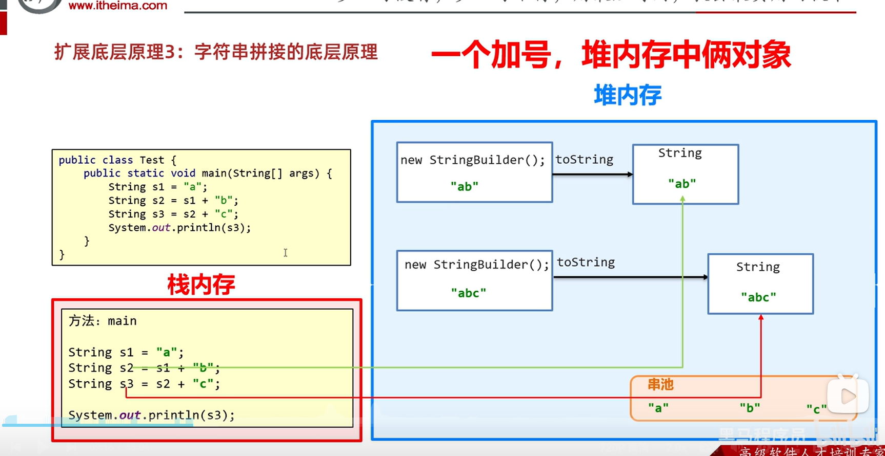
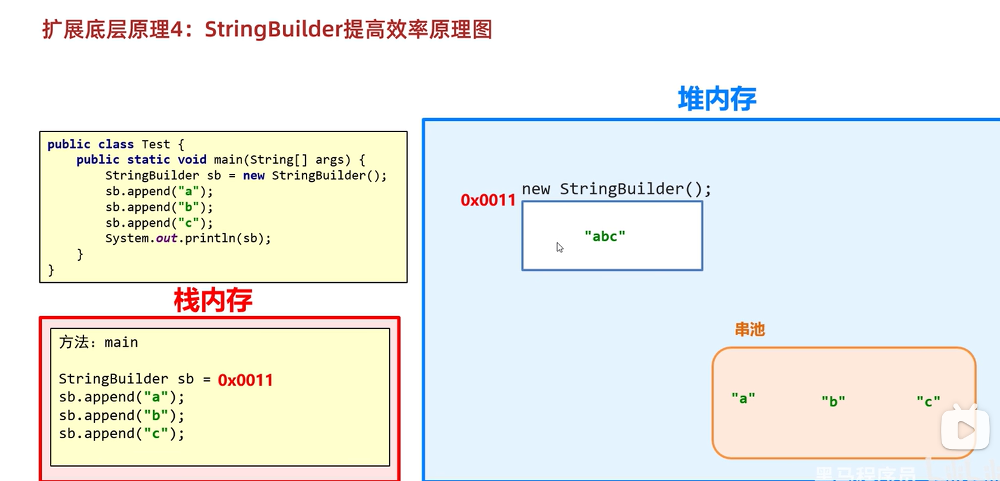
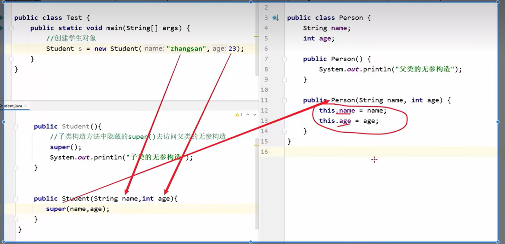
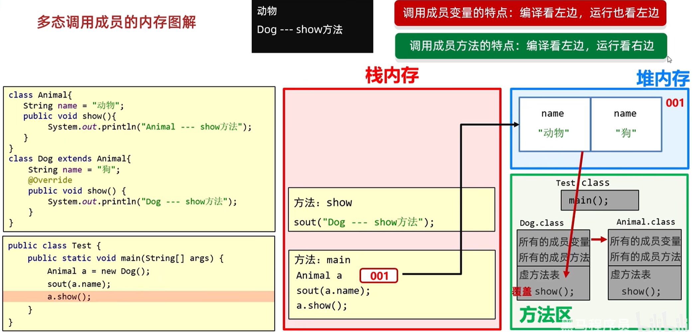
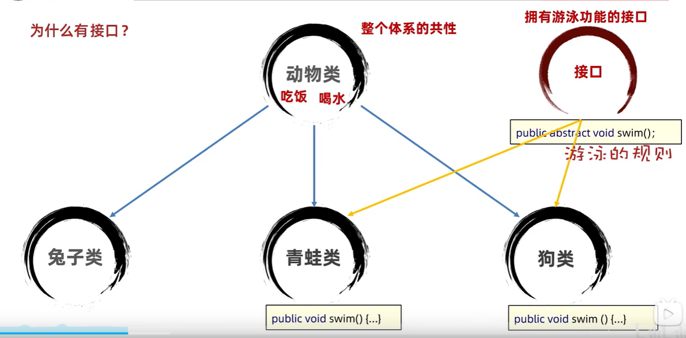
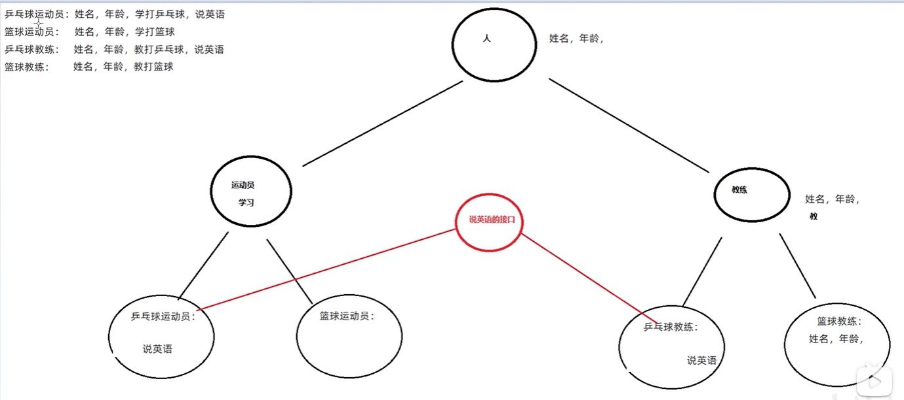
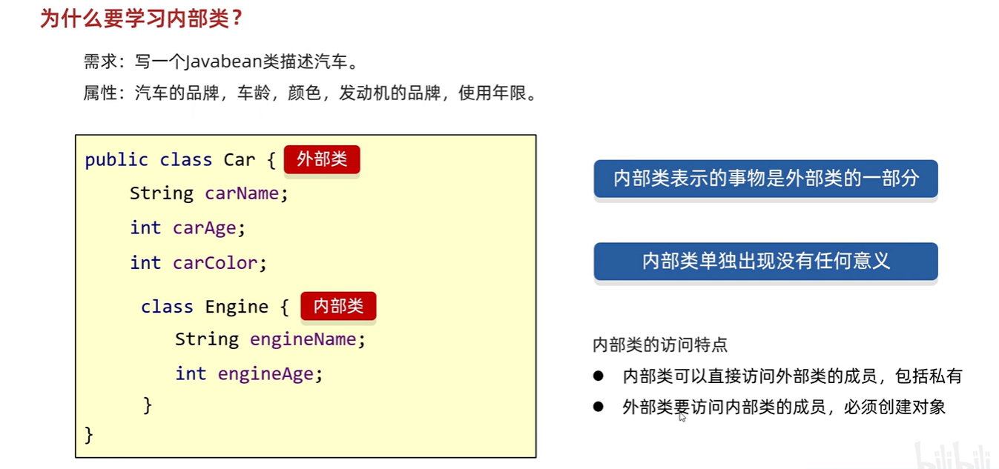
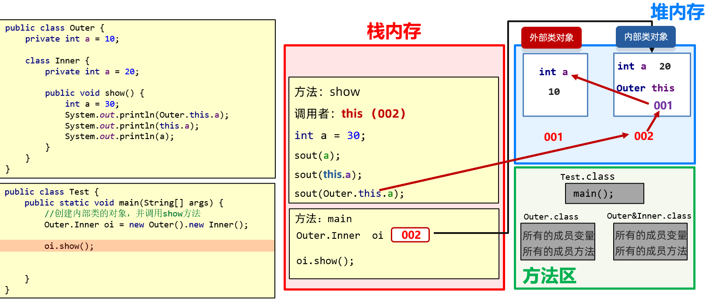
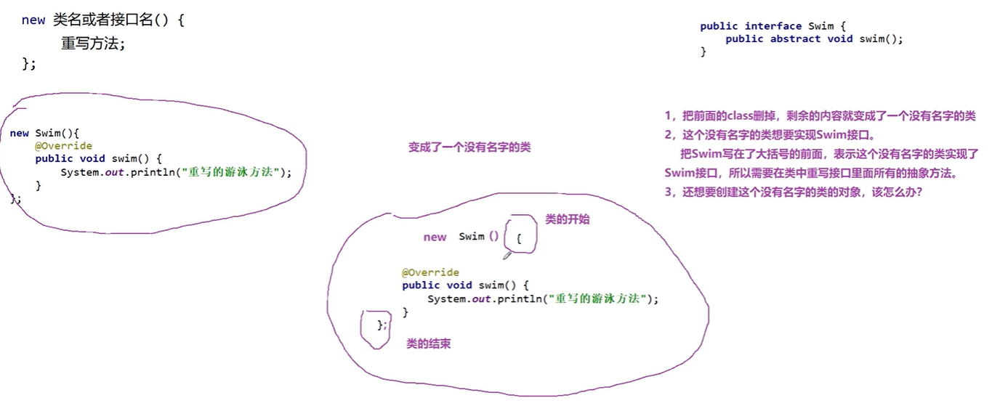
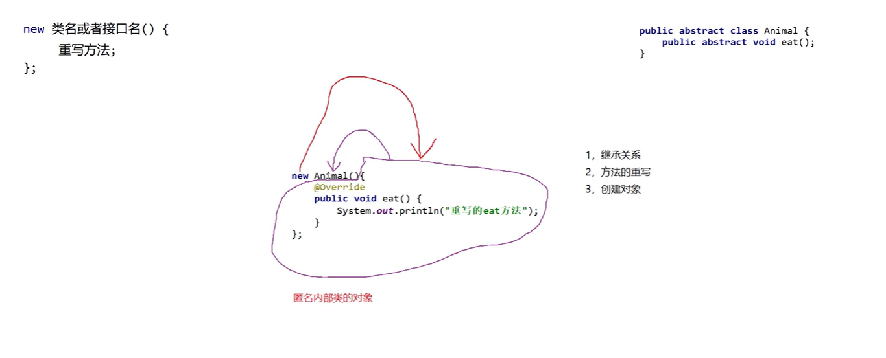

[toc]

# 面向对象

## 设计对象并使用
### 类与对象
类：是对象共同特征的描述(设计图)
对象：是真实存在的具体东西
在java中，必须先设计类，才能获得对象

### 定义类
`public class 类名{ }` 
类的组成是由属性和行为两部分组成
**成员变量**(代表属性，一般是名词)   (成员变量如果没有被赋初始值，则会自动以类型的默认值而赋值，==**而局部变量不会赋初值**==)
**成员方法**(代表行为，一般是动词)  

### 创建对象
`类名 对象名 = new 类名();`

### 使用对象
`对象名.成员变量;`  (没有private修饰才行，否则无法访问)
`对象名.成员方法();`  (同理)

### 定义类的补充事项
用来描述一类事物的类，专业叫做：**javabean类** 。
在javabean类中，是**不写main方法**。
在以前，编写mian方法的类，叫做**测试类**。
我们**可以在测试类中创建javabean类的对象并进行赋值调用**。
一个java文件中可以定义多个class类，且**只能一个类是public修饰**，而且**public修饰的类名必须成为代码文件名**。**实际开发中建议一个文件定义一个class类**。
成员变量的完整定义格式是：`修饰符 数据类型 变量名称 = 初始化值;`  一般**无需指定初始化值，存在默认值**。

## 封装
面向对象三大特征之一（**封装，继承，多态**）
**对象代表什么，就得封装对应的数据，并提供数据对应的行为**
将类的某些信息隐藏在类内部，不允许外部程序直接访问，而是通过该类提供的方法来实现对隐藏信息的操作和访问
用**private**修饰成员变量，提供对应的 **getXxx()/setXxx()** 方法

### native 关键字

`native` 修饰方法 --- **本地方法**

1、一个`native`方法就是一个Java调用非Java代码的接口。一个native方法是指该方法的实现由非Java语言实现，比如用C或C++实现。
2、在定义一个native方法时，并不提供实现体（比较像定义一个Java Interface），因为其实现体是由非Java语言在外面实现的。

native关键字说明其修饰的方法是一个原生态方法，方法对应的实现不是在当前文件，而是在用其他语言（如C和C++）实现的文件中。Java语言本身不能对操作系统底层进行访问和操作，但是可以通过JNI接口调用其他语言来实现对底层的访问。

### private 关键字

`private`是一个**修饰符**，可以**用来修饰成员（成员变量，成员方法）**，表示私有
被`private`修饰的成员，**只能在本类进行访问**，针对`private`修饰的成员变量，如果需要被其他类使用，提供相应的操作
提供 `set变量名(参数)` 方法，用于设置成员变量的值，方法用 `public` 修饰
提供 `get变量名()` 方法，用于获取成员变量的值，方法用 `public` 修饰

### this 关键字
`this`修饰的变量用于指代成员变量
`this`作用：**区分局部变量和成员变量的重名问题**
`this` 本质：**代表方法调用者的地址值**
方法的形参如果与成员变量同名，不带this修饰的变量指的是形参，而不是成员变量
方法的形参没有与成员变量同名，不带this修饰的变量指的是成员变量
**就近原则**：同样的变量名，谁离我近，就用谁
`System.out.println(age);`    // 就近原则
`System.out.println(this.age);`   // 成员变量

### 构造方法
在创建对象的时候给成员变量进行初始化
格式：`修饰符 类名(参数){}`     

注意：
方法名与类名一致 大小写也要一样
**没有void/返回值类型**   

没有具体的返回值(不能由return带回结果数据)
执行时机： 
创建对象时**由虚拟机 JVM 调用**，不能手动调用构造方法
每创建一次对象，就会调用一次构造方法
两种构造方法： 
**空参构造**：初始化对象时，成员变量的数据采用默认数据
**带参构造**：初始化对象时，同时可以为对象进行赋值
构造方法注意事项：
如果**没有定义构造方法，系统会自动给出一个默认的无参构造方法**；**如果定义了构造方法，系统就不会提供默认的构造方法**
带参构造方法和无参构造方法，两者方法名相同，但参数不同，这叫做**构造方法的重载** （可以重载但**不能重写**）
无论是否使用，都手写无参构造方法和带全部参数的构造方法

### 标准的JavaBean类
```java
package com.scu.demo1;  
  
public class _12_JavaBean_User {  
    private String username;  // private 关键字 修饰符  
    private String password;  
    private String email;  
    private String gender;  
    private int age;  
  
    // 空参构造  
    // 构造方法 没有 static 和 void/返回值类型  
    public _12_JavaBean_User(){}  
    // 带全部参数的构造  
    public _12_JavaBean_User(String username,String password,String email,String gender,int age){  
        this.username = username;  // this 关键字  
        this.password = password;  
        this.email = email;  
        this.gender = gender;  
        this.age = age;  
    }  
  
    // get和set方法  
    // 成员方法  没有 static    public String getUsername() {  
        return username;  
    }  
  
    public void setUsername(String username) {  
        this.username = username;  
    }  
  
    public String getPassword() {  
        return password;  
    }  
  
    public void setPassword(String password) {  
        this.password = password;  
    }  
  
    public String getEmail() {  
        return email;  
    }  
  
    public void setEmail(String email) {  
        this.email = email;  
    }  
  
    public String getGender() {  
        return gender;  
    }  
  
    public void setGender(String gender) {  
        this.gender = gender;  
    }  
  
    public int getAge() {  
        return age;  
    }  
  
    public void setAge(int age) {  
        this.age = age;  
    }  
  
    // 快捷键：  
    // Alt + Insert 快捷生成构造方法和get/set方法  
  
    // 插件 PTG 1秒生成标准Javabean   右键点击  
}
```
### 对象的内存图
[对象的内存图](https://www.bilibili.com/video/BV17F411T7Ao?p=87&vd_source=6ef187124c74c452a2016ded88292617)
[this的内存原理](https://www.bilibili.com/video/BV17F411T7Ao?p=89&vd_source=6ef187124c74c452a2016ded88292617) 

## 面向对象练习
### 文字版格斗游戏
测试类
```java
package com.itheima.test2;  
  
public class GameTest {  
    public static void main(String[] args) {  
        //1.创建第一个角色  
        Role r1 = new Role("乔峰",100,'男');  
        //2.创建第二个角色  
        Role r2 = new Role("鸠摩智",100,'男');  
  
        //展示一下角色的信息  
        r1.showRoleInfo();  
        r2.showRoleInfo();  
  
        //3.开始格斗 回合制游戏  
        while(true){  
            //r1开始攻击r2  
            r1.attack(r2);  
            //判断r2的剩余血量  
            if(r2.getBlood() == 0){  
                System.out.println(r1.getName() + " K.O了" + r2.getName());  
                break;            }  
  
            //r2开始攻击r1  
            r2.attack(r1);  
            if(r1.getBlood() == 0){  
                System.out.println(r2.getName() + " K.O了" + r1.getName());  
                break;            }  
        }  
    }  
}
```
JavaBean类
```java
package com.itheima.test2;  
  
import java.util.Random;  
  
public class Role {  
    private String name;  
    private int blood;  
    private char gender;  
    private String face;//长相是随机的  
  
    String[] boyfaces = {"风流俊雅", "气宇轩昂", "相貌英俊", "五官端正", "相貌平平", "一塌糊涂", "面目狰狞"};  
    String[] girlfaces = {"美奂绝伦", "沉鱼落雁", "婷婷玉立", "身材娇好", "相貌平平", "相貌简陋", "惨不忍睹"};  
  
    //attack 攻击描述：  
    String[] attacks_desc = {  
            "%s使出了一招【背心钉】，转到对方的身后，一掌向%s背心的灵台穴拍去。",  
            "%s使出了一招【游空探爪】，飞起身形自半空中变掌为抓锁向%s。",  
            "%s大喝一声，身形下伏，一招【劈雷坠地】，捶向%s双腿。",  
            "%s运气于掌，一瞬间掌心变得血红，一式【掌心雷】，推向%s。",  
            "%s阴手翻起阳手跟进，一招【没遮拦】，结结实实的捶向%s。",  
            "%s上步抢身，招中套招，一招【劈挂连环】，连环攻向%s。"  
    };  
  
    //injured 受伤描述：  
    String[] injureds_desc = {  
            "结果%s退了半步，毫发无损",  
            "结果给%s造成一处瘀伤",  
            "结果一击命中，%s痛得弯下腰",  
            "结果%s痛苦地闷哼了一声，显然受了点内伤",  
            "结果%s摇摇晃晃，一跤摔倒在地",  
            "结果%s脸色一下变得惨白，连退了好几步",  
            "结果『轰』的一声，%s口中鲜血狂喷而出",  
            "结果%s一声惨叫，像滩软泥般塌了下去"  
    };  
  
    public Role() {  
    }  
  
    public Role(String name, int blood, char gender) {  
        this.name = name;  
        this.blood = blood;  
        this.gender = gender;  
        //随机长相  
        setFace(gender);  
    }  
  
  
    public char getGender() {  
        return gender;  
    }  
  
    public void setGender(char gender) {  
        this.gender = gender;  
    }  
  
    public String getFace() {  
        return face;  
    }  
  
    public void setFace(char gender) {  
        Random r = new Random();  
        //长相是随机的  
        if (gender == '男') {  
            //从boyfaces里面随机长相  
            int index = r.nextInt(boyfaces.length);  
            this.face = boyfaces[index];  
        } else if (gender == '女') {  
            //从girlfaces里面随机长相  
            int index = r.nextInt(girlfaces.length);  
            this.face = girlfaces[index];  
        } else {  
            this.face = "面目狰狞";  
        }  
  
  
    }  
  
  
    public String getName() {  
        return name;  
    }  
  
    public void setName(String name) {  
        this.name = name;  
    }  
  
    public int getBlood() {  
        return blood;  
    }  
  
    public void setBlood(int blood) {  
        this.blood = blood;  
    }  
  
  
    //定义一个方法用于攻击别人  
    //思考：谁攻击谁？  
    //Role r1 = new Role（）；  
    //Role r2 = new Role（）；  
    //r1.攻击(r2);  
    //方法的调用者去攻击参数  
    public void attack(Role role) {  
        Random r = new Random();  
        int index = r.nextInt(attacks_desc.length);  
        String KungFu = attacks_desc[index];  
  
        //输出一个攻击的效果  
        System.out.printf(KungFu, this.getName(), role.getName());  
        System.out.println();  
  
        //计算造成的伤害 1 ~ 20        
        int hurt = r.nextInt(20) + 1;  
  
        //剩余血量  
        int remainBoold = role.getBlood() - hurt;  
        //对剩余血量做一个验证，如果为负数了，就修改为0  
        remainBoold = remainBoold < 0 ? 0 : remainBoold;  
        //修改一下挨揍的人的血量  
        role.setBlood(remainBoold);  
  
        //受伤的描述  
        //血量> 90 0索引的描述  
        //80 ~  90  1索引的描述  
        //70 ~  80  2索引的描述  
        //60 ~  70  3索引的描述  
        //40 ~  60  4索引的描述  
        //20 ~  40  5索引的描述  
        //10 ~  20  6索引的描述  
        //小于10的   7索引的描述  
        if (remainBoold > 90) {  
            System.out.printf(injureds_desc[0], role.getName());  
        }else if(remainBoold > 80 && remainBoold <= 90){  
            System.out.printf(injureds_desc[1], role.getName());  
        }else if(remainBoold > 70 && remainBoold <= 80){  
            System.out.printf(injureds_desc[2], role.getName());  
        }else if(remainBoold > 60 && remainBoold <= 70){  
            System.out.printf(injureds_desc[3], role.getName());  
        }else if(remainBoold > 40 && remainBoold <= 60){  
            System.out.printf(injureds_desc[4], role.getName());  
        }else if(remainBoold > 20 && remainBoold <= 40){  
            System.out.printf(injureds_desc[5], role.getName());  
        }else if(remainBoold > 10 && remainBoold <= 20){  
            System.out.printf(injureds_desc[6], role.getName());  
        }else{  
            System.out.printf(injureds_desc[7], role.getName());  
        }  
        System.out.println();  
  
  
    }  
  
  
    public void showRoleInfo() {  
        System.out.println("姓名为：" + getName());  
        System.out.println("血量为：" + getBlood());  
        System.out.println("性别为：" + getGender());  
        System.out.println("长相为：" + getFace());  
    }  
  
}
```
### 对象数组
用对象数组存储对象数据
JavaBean类

```java
package com.scu.demo1;  
  
public class _13_Student {  
    private int id;  
    private String name;  
    private int age;  
  
    public _13_Student() {  
    }  
  
    public _13_Student(int id, String name, int age) {  
        this.id = id;  
        this.name = name;  
        this.age = age;  
    }  
  
    public int getId() {  
        return id;  
    }  
  
    public void setId(int id) {  
        this.id = id;  
    }  
  
    public String getName() {  
        return name;  
    }  
  
    public void setName(String name) {  
        this.name = name;  
    }  
  
    public int getAge() {  
        return age;  
    }  
  
    public void setAge(int age) {  
        this.age = age;  
    }  
}
```
测试类：
```java
package com.scu.demo1;  
/*定义一个长度为3的数组，数组存储1~3名学生对象作为初始数据，学生对象的学号，姓名各不相同。  
学生的属性：学号，姓名，年龄。  
要求1：再次添加一个学生对象，并在添加的时候进行学号的唯一性判断。  
要求2：添加完毕之后，遍历所有学生信息。  
要求3：通过id删除学生信息  
如果存在，则删除，如果不存在，则提示删除失败。  
要求4：删除完毕之后，遍历所有学生信息。  
要求5：查询数组id为“heima002”的学生，如果存在，则将他的年龄+1岁*/  
public class _14_StudentTest {  
    public static void main(String[] args) {  
          
        //1.创建一个学生类型的数组用来存储学生对象  
        _13_Student[] arr = new _13_Student[3];  
        //2.创建学生对象并添加到数组当中  
        _13_Student stu1 = new _13_Student(1, "zhangsan", 23);  
        _13_Student stu2 = new _13_Student(2, "lisi", 24);  
        //3.把学生对象添加到数组当中  
        arr[0] = stu1;  
        arr[1] = stu2;  
  
        //要求1：再次添加一个学生对象，并在添加的时候进行学号的唯一性判断。  
        _13_Student stu4 = new _13_Student(4, "zhaoliu", 26);  
  
        //唯一性判断  
        //已存在 --- 不用添加  
        //不存在 --- 就可以把学生对象添加进数组  
        boolean flag = contains(arr, stu4.getId());  
        if(flag){  
            //已存在 --- 不用添加  
            System.out.println("当前id重复，请修改id后再进行添加");  
        }else{  
            //不存在 --- 就可以把学生对象添加进数组  
            //把stu4添加到数组当中  
            //1.数组已经存满 --- 只能创建一个新的数组，新数组的长度 = 老数组 + 1            //2.数组没有存满 --- 直接添加  
            int count = getCount(arr);  
            if(count == arr.length){  
                //已经存满  
                //创建一个新的数组，长度 = 老数组的长度 + 1                //然后把老数组的元素，拷贝到新数组当中  
                _13_Student[] newArr = creatNewArr(arr);  
                //把stu4添加进去  
                newArr[count] = stu4;  
                //要求2：添加完毕之后，遍历所有学生信息。  
                printArr(newArr);  
            }else{  
                //没有存满  
                //[stu1,stu2,null]  
                //getCount获取到的是2，表示数组当中已经有了2个元素  
                //还有一层意思：如果下一次要添加数据，就是添加到2索引的位置  
                arr[count] = stu4;  
                //要求2：添加完毕之后，遍历所有学生信息。  
                printArr(arr);  
  
            }  
        }  
  
        //要求3：通过id删除学生信息  
        //如果存在，则删除，如果不存在，则提示删除失败。  
        int index = getIndex(arr, 4);  
        if (index >= 0){  
            //如果存在，则删除  
            arr[index] = null;  
            //要求4：删除完毕之后，遍历所有学生信息。  
            printArr(arr);  
        }else{  
            //如果不存在，则提示删除失败  
            System.out.println("当前id不存在，删除失败");  
        }  
  
        // 要求5：查询数组id为“heima002”的学生，如果存在，则将他的年龄+1岁  
        int index1 = getIndex(arr, 2);  
        if(index1 >= 0){  
            //存在， 则将他的年龄+1岁  
            _13_Student stu = arr[index1];  
            //把原来的年龄拿出来  
            int newAge = stu.getAge() + 1;  
            //把+1之后的年龄塞回去  
            stu.setAge(newAge);  
            //遍历数组  
            printArr(arr);  
        }else{  
            //不存在，则直接提示  
            System.out.println("当前id不存在，修改失败");  
        }  
  
    }  
  
    public static int getIndex(_13_Student[] arr , int id){  
        for (int i = 0; i < arr.length; i++) {  
            //依次得到每一个学生对象  
            _13_Student stu = arr[i];  
            //对stu进行一个非空判断  
            if(stu != null){  
                int sid = stu.getId();  
                if(sid == id){  
                    return i;  
                }  
            }  
        }  
        //当循环结束之后，还没有找到就表示不存在  
        return -1;  
    }  
  
    public static void printArr(_13_Student[] arr){  
        for (int i = 0; i < arr.length; i++) {  
            _13_Student stu = arr[i];  
            if(stu != null){  
                System.out.println(stu.getId() + ", " + stu.getName() + ", " + stu.getAge());  
            }  
        }  
    }  
  
    //创建一个新的数组，长度 = 老数组的长度 + 1    //然后把老数组的元素，拷贝到新数组当中  
    public static _13_Student[] creatNewArr(_13_Student[] arr){  
        _13_Student[] newArr = new _13_Student[arr.length + 1];  
        //循环遍历得到老数组中的每一个元素  
        for (int i = 0; i < arr.length; i++) {  
            //把老数组中的元素添加到新数组当中  
            newArr[i] = arr[i];  
        }  
        //把新数组返回  
        return newArr;  
    }  
  
    //定义一个方法判断数组中已经存了几个元素  
    public static int getCount(_13_Student[] arr){  
        //定义一个计数器用来统计  
        int count = 0;  
        for (int i = 0; i < arr.length; i++) {  
            if(arr[i] != null){  
                count++;  
            }  
        }  
        //当循环结束之后，我就知道了数组中一共有几个元素  
        return count;  
    }  
  
  
    //1.我要干嘛？  唯一性判断  
    //2.我干这件事情，需要什么才能完成？ 数组 id    //3.调用处是否需要继续使用方法的结果？ 必须返回  
    public static boolean contains(_13_Student[] arr, int id) {  
        for (int i = 0; i < arr.length; i++) {  
            //依次获取到数组里面的每一个学生对象  
            _13_Student stu = arr[i];  
            if(stu != null){  // 只有学生对象存在时，才判断 否则stu.getId()会报错  
                //获取数组中学生对象的id  
                int sid = stu.getId();  
                //比较  
                if(sid == id){  
                    return true;  
                }  
            }  
        }  
        //当循环结束之后，还没有找到一样的，那么就表示数组中要查找的id是不存在的。  
        return false;  
    }  
}
```

# API
`API (Application Programming Interface)` ：应用程序编程接口
java中的API：
指的就是 JDK 中提供的**各种功能的 Java类**，这些类将底层的实现封装了起来，我们不需要关心这些类是如何实现的，只需要学习这些类如何使用即可，我们可以通过帮助文档来学习这些API如何使用。
比如：Scanner   Random
更多信息可见**[Java参考文档]** 

# 字符串
## String
`java.lang.String`    String 类代表字符串，Java 程序中的所有字符串文字（例如“abc”）都被实现为此类的实例。不用导包
注意：
1.**字符串不可变，它们的值在创建后不能被更改**  所谓的赋值修改只是创建了新的字符串
2.虽然 String 的值是不可变的，但是它们可以被共享（**复用**）
3.字符串效果上相当于**字符数组**( char[] )，但是**底层原理**是**字节数组**( byte[] )
4.**字符串(和字符数组)可以直接打印**，而(int、double等)数组不可以，会打印地址值
**打印方法中：字符串(和字符数组)不需要调用toString()方法，可以直接打印；int类型是以object类型传入，最终调用toString()，所以打印的是toString()的返回值(即地址值)** 

### String 不可变的原因  ✅

1.保存字符串的数组被 **`final` 修饰且为私有**的，并且`String` 类没有提供/暴露修改这个字符串的方法。

2.`String` 类被 `final` 修饰导致其不能被继承，进而避免了子类破坏 `String` 不可变。

### 创建String对象的两种方式
1.直接赋值： `String name = "尼古拉斯"`
2.`new` String类的构造方法：

|方法名| 说明                                      |
  | --------------------------- | ----------------------------------------- |
|public String()| 创建一个空白字符串对象，不含有任何内容    |
|public String(char[] chs)|根据字符数组的内容，来创建字符串对象 |
|public String(byte[] bys) |根据字节数组的内容，来创建字符串对象|
|public String(String original) | 根据传入的字符串，创建字符串对象 |

```java
package com.scu.demo1;  
  
public class _15_StringDemo1 {  
    public static void main(String[] args) {  
        //1.使用直接赋值的方式获取一个字符串对象  
        String s1 = "abc";  
        System.out.println(s1);//abc  
  
  
        //2.使用new的方式来获取一个字符串对象  
        //空参构造：可以获取一个空白的字符串对象  
        String s2 = new String();  
        System.out.println("@" + s2 + "!");//""  
  
        //传递一个字符串，根据传递的字符串内容再创建一个新的字符串对象  
        String s3 = new String("abc");  
        System.out.println(s3);  
  
        //传递一个字符数组，根据字符数组的内容再创建一个新的字符串对象  
        //需求：我要修改字符串的内容。  abc  Qbc        //abc -->  {'a','b','c'}  -->  {'Q','b','c'} --> "Qbc"        char[] chs = {'a', 'b', 'c', 'd'};  
        String s4 = new String(chs);  
        System.out.println(s4);//abcd  
  
        //传递一个字节数组，根据字节数组的内容再创建一个新的字符串对象  
        //应用场景：以后在网络当中传输的数据其实都是字节信息  
        //我们一般要把字节信息进行转换，转成字符串，此时就要用到这个构造了。  
        byte[] bytes = {97, 98, 99, 100};  
        String s5 = new String(bytes);  
        System.out.println(s5);//abcd  
  
    }  
}
```
### 创建字符串对象两种方式的区别 ✅

通过 `new` 创建的字符串对象，每一次 new 都会申请一个内存空间，虽然内容相同，但是地址值不同 即**不复用**
以“ ”方式给出的字符串，只要字符序列相同(顺序和大小写)，无论在程序代码中出现几次，JVM 都**只会建立一个 String 对象**，并在**字符串池**中维护 即**复用**。
视频讲解：[字符串内存分析](https://www.bilibili.com/video/BV17F411T7Ao/?p=98&spm_id_from=pageDriver&vd_source=6ef187124c74c452a2016ded88292617)   

### 字符串操作
各种方法可以查看java参考文档
#### 字符串比较
== 号的作用 ：
比较基本数据类型：比较的是具体的值
比较引用数据类型：比较的是对象地址值

```java
String s1 = new String("abc");  // 记录堆里面的地址值
String s2 = "abc";  // 记录串池里面的地址值
System.out.println(s1==s2)  // false
```
如何比较字符串中内容
两个方法：
`public boolean equals(String s)`    先判断参数是否为字符串，如果是字符串，再比较是否相同，区分大小写，相同则返回true,不同返回false；如果参数不是字符串，直接返回false
`public boolean equalsIgnoreCase(String s)`   比较两个字符串内容是否相同、不区分大小写

#### 字符串遍历
`str.charAt(i)`         根据索引获取字符串里面的字符
`str.length()`           获取字符长度   与数组相比多了小括号
`str.length().fori`    快捷生成字符串遍历循环

```java
for (int i = 0; i < str.length(); i++) {
            //i 依次表示字符串的每一个索引
            //索引的范围：0 ~  长度-1

            //根据索引获取字符串里面的每一个字符
            //ctrl + alt + V 自动生成左边的接受变量
            char c = str.charAt(i);
            System.out.println(c);
        }
```
 统计字符次数案例：
```java
        //键盘录入一个字符串，统计大写，小写，数字出现的次数


        //1.键盘录入一个字符串
        Scanner sc = new Scanner(System.in);
        System.out.println("请输入一个字符串");
        String str = sc.next();


        //2.统计 --- 计数器count
        //此时我要统计的有3样东西，所以要定义3个计数器分别进行统计
        int bigCount = 0;
        int smallCount = 0;
        int numberCount = 0;
        //得到这个字符串里面每一个字符
        for (int i = 0; i < str.length(); i++) {
            //i 表示字符串中的索引
            //c 表示字符串中的每一个字符
            char c = str.charAt(i);

            //对c进行判断
            if (c >= 'a' && c <= 'z') {
                smallCount++;
            }else if(c >= 'A' && c <= 'Z'){
                bigCount++;
            }else if(c >= '0' && c <= '9'){
                numberCount++;
            }
        }

        //3.当循环结束之后，三个变量记录的就是对应的个数
        System.out.println("大写字符有:" + bigCount + "个");
        System.out.println("小写字符有:" + smallCount + "个");
        System.out.println("数字字符有:" + numberCount + "个");
```
#### 字符串拼接
`+` 号直接相加（不推荐，最好使用后面的StringBuilder）

“`+`”和“`+=`”是专门为 String 类重载过的运算符，也是 Java 中仅有的两个重载过的运算符。

字符串对象通过“+”的字符串拼接方式，实际上是通过 `StringBuilder` 调用 `append()` 方法实现的，拼接完成之后调用 `toString()` 得到一个 `String` 对象 。不过，在循环内使用“+”进行字符串的拼接的话，存在比较明显的缺陷：**编译器不会创建单个 `StringBuilder` 以复用，会导致创建过多的 `StringBuilder` 对象**。

在 JDK9 当中，字符串相加 “+” 改为了用动态方法 `makeConcatWithConstants()` 来实现，而不是大量的 `StringBuilder` 了。

#### 字符串反转
```Java
public static String reverser(String str){  
    String result = "";  
    for (int i = str.length() - 1; i >= 0; i--) {  
        //i 依次表示字符串中的每一个索引 （倒着的）  
        char c = str.charAt(i);  
        result = result + c;  
    }  
    return result;  
}
```
#### 字符串截取
`String str2 = str1.substring(0,3)`   截取str1中索引从0~2的字符   **包左不包右**
`String str2 = str1.substring(1)`   截取str1中索引从1开始到结束的字符

#### 字符串查找子串

`str.indexOf('a')` 

`str.indexOf("hello")`  

- **public int indexOf(int ch):** 返回指定字符在字符串中第一次出现处的索引，如果此字符串中没有这样的字符，则返回 -1。
- **public int indexOf(int ch, int fromIndex):** 返回从 fromIndex 位置开始查找指定字符在字符串中第一次出现处的索引，如果此字符串中没有这样的字符，则返回 -1。
- **int indexOf(String str):** 返回指定字符在字符串中第一次出现处的索引，如果此字符串中没有这样的字符，则返回 -1。
- **int indexOf(String str, int fromIndex):** 返回从 fromIndex 位置开始查找指定字符在字符串中第一次出现处的索引，如果此字符串中没有这样的字符，则返回 -1。

#### 字符串替换

`String str2 = str1.replace(target,replacement)`    target---被替换的子字符串  replacement---替换的字符串

#### 字符串转换字符数组
`char[] arr = str.toCharArray()`    返回字符数组    "abcd"---->[a, b, c, d]

## StringBuilder
一般在字符串拼接  字符串反转时使用  帮助我们方便操作字符串的工具

1. `StringBuilder sb = new StringBuilder()`  
2. `StringBuilder sb = new StringBuilder("abc")` 

可以看成是一个**容器**，创建之后里面的**内容是可变**的
因为是容器 内容可变  对它操作时不会产生新的字符串  可以提高效率
`sb.append(1)`    `sb.append(2.3)`    `sb.append(true)`  添加元素  没有返回值
`sb.reverse()`   反转  没有返回值
`sb.length()`     获取长度  返回int类型
`System.out.println(sb)`  可直打印  打印对象不是地址值而是属性值
`sb.toString()`  从**容器转为String** 
`sb.equals(s)` 方法，**没有重写**，继承了`Object` 类中的`equals()` ，默认使用 `==` 号比较对象的地址值

`sb.charAt(i)`          `sb.setCharAt(i,ch)`       `deleteCharAt(i)`        `sb.capacity()`  返回当前容量

```java
//1.创建对象
        StringBuilder sb = new StringBuilder("abc");

        //2.添加元素
        sb.append(1);
        sb.append(2.3);
        sb.append(true);

        //反转
        sb.reverse();

        //获取长度
        int len = sb.length();
        System.out.println(len);

        //打印
        //普及：
        //因为StringBuilder是Java已经写好的类
        //java在底层对他做了一些特殊处理。
        //打印对象不是地址值而是属性值。
        System.out.println(sb);

		//再把StringBuilder变回字符串
		String str = sb.toString();
		System.out.println(str);
```
## StringBuilder和StringBuffer  ✅

`StringBuilder` 与 `StringBuffer` 都继承自 `AbstractStringBuilder` 类，在 `AbstractStringBuilder` 中也是使用字符数组保存字符串，不过没有使用 `final` 和 `private` 关键字修饰，最关键的是这个 `AbstractStringBuilder` 类还提供了很多修改字符串的方法比如 `append` 方法。

`String` 中的**对象是不可变的，也就可以理解为常量，线程安全**。`AbstractStringBuilder` 是 `StringBuilder` 与 `StringBuffer` 的公共父类，定义了一些字符串的基本操作，如 `expandCapacity`、`append`、`insert`、`indexOf` 等公共方法。`StringBuffer` 对方法加了同步锁或者对调用的方法加了同步锁，所以是**线程安全**的。`StringBuilder` 并没有对方法进行加同步锁，所以是==**非线程安全**==的。

**每次对 `String` 类型进行改变的时候，都会生成一个新的 `String` 对象，然后将指针指向新的 `String` 对象**。`StringBuffer` 每次都会对 `StringBuffer` 对象本身进行操作，而不是生成新的对象并改变对象引用。相同情况下使用 `StringBuilder` 相比使用 `StringBuffer` 仅能获得 10%~15% 左右的性能提升，但却要冒多线程不安全的风险。

使用总结：

1.操作少量的数据: 适用 `String`

2.单线程操作字符串缓冲区下操作大量数据: 适用 `StringBuilder`

3.多线程操作字符串缓冲区下操作大量数据: 适用 `StringBuffer`

## StringJoiner

StringJoiner跟StringBuilder一样，也可以看成是一个**容器**，创建之后里面的**内容是可变**的。
作用：提高字符串的操作效率，而且代码编写特别简洁，但是目前市场上很少有人用。
JDK8出现的
`StringJoiner sj = new StringJoiner(间隔符号)`    必须指定，没有空参构造
`StringJoiner sj = new StringJoiner(间隔符号,开始符号，结束符号)`
`sj.add()`   添加元素  没有返回值
`sj.length()`  获取长度  返回int类型  **长度包括间隔、开始、结束符号**
`sj.toString()`  从容器转为String

## 字符串相关类的底层原理

视频讲解：[字符串相关类的底层原理](https://www.bilibili.com/video/BV17F411T7Ao/?p=107&spm_id_from=pageDriver&vd_source=6ef187124c74c452a2016ded88292617)  
### 字符串存储的内存原理
直接赋值  没有则在**串池**新建，有则会复用字符串常量池中的已有字符串
`new`  出来的不会复用，而是在**堆空间**开辟一个新的空间
参考前面  [[Java 02 面向对象#创建字符串对象两种方式的区别]]  

### == 号比较
基本数据类型比较数据真实值
引用数据类型比较地址值

### 字符串拼接的底层原理
直接用符号 + 进行字符串拼接(不要这样做，浪费内存)：
如果**没有变量参与**，都是字符串直接相加，编译时会触发字符串优化，编译之后解释拼接的结果，会**复用串池中的字符串**。
如果**有变量参与**，每一行拼接的代码，都会**在内存中创建新的字符串**，浪费内存。(JDK8以前，会创建StringBuilder对象，把拼接的字符串利用append方法存入StringBuilder对象中，然后toString方法new一个新的String对象；JDK8以后，会对拼接的结果长度进行预测，创建同长度字符数组，然后产生一个新String对象)。
 

### StringBuilder提高效率原理图
所有拼接的内容都会往StringBuilder中放，不会创建很多无用的空间，节约内存。

StringBuilder对象   默认容量  16 
如果存入更多，会自动扩容  16 * 2 + 2 = 34  如果还超过34  则扩容到实际存入容量为止
最大容量 int最大范围

# 集合
提供一种**存储空间可变**的存储模型，存储的数据容量可以发生改变
JAVA提供了很多集合的类，比如 `ArrayList`
**当调用一个方法需要返回多个数据时，我们可以把要返回的数据存入一个集合容器，然后返回这个集合容器对象**

## 集合与数组的区别
集合----**长度可变，自动扩容**，添加数据的时候不需要考虑索引，默认将数据添加到末尾
数组----长度不可变
集合----**存储引用数据类型**，基本数据类型需要转换成**包装类** 
数组----定义int类型数组就存储int数据，定义引用类型数组就可以存储引用数据类型

## ArrayList
### ArrayList 创建对象
`java.util.ArrayList<E>`   导包
**泛型<>  限定集合中存储数据的类型**  

JDK7以前：`ArrayList<E> list = new ArrayList<E>();`  E--->表示数据类型
JDK7以后：`ArrayList<E> list = new ArrayList<>();` 
`ArrayList list = new ArrayList();`  没有<> 此时，默认数据类型是object类型
**集合中保存的是对象的地址值，但打印对象不是地址值，而是集合中存储数据内容** 在展示的时候会拿[]把所有的数据进行包裹

```java
//1.创建集合的对象  
//泛型：限定集合中存储数据的类型 
//JDK7以前：
//ArrayList<String> list = new ArrayList<String>();  
//JDK7以后:  
ArrayList<String> list = new ArrayList<>();
//此时我们创建的是ArrayList的对象，而ArrayList是java已经写好的一个类  
//这个类在底层做了一些处理  
//打印对象不是地址值，而是集合中存储数据内容  
//在展示的时候会拿[]把所有的数据进行包裹  
System.out.println(list); // []
```
### ArrayList 成员方法
全都有返回值

|方法名|说明                             |
| ------------------------------------- | -------------------------------------- |
|public boolean add(要添加的元素)|将指定的元素追加到此集合的末尾  返回boolean  不能链式 |
|public boolean remove(删除的元素)|删除指定元素,返回值表示是否删除成功    返回boolean|
|public E remove(int index) |删除指定索引处的元素，返回被删除的元素|
|public E set(int index,E element)|修改指定索引处的元素，修改为element，返回被修改的元素 |
|public E get(int index) |返回指定索引处的元素|
|public int size() |返回集合中的元素的个数 |

`list.add("abc")`    返回boolean  表示添加是否成功

`list.remove("abc")`    返回boolean   表示删除是否成功

`list.remove(1)`   返回被删除元素

`list.set(1,"ccc")`   返回被修改元素

`list.get(1)`    返回索引处元素

`list.size()`     返回长度

```java
// 遍历
for (int i = 0; i < list.size(); i++) {  
    //i 索引  
    //list.get(i) 元素  
    String str = list.get(i);  
    System.out.println(str);  
}
```

### 基本数据类型对应包装类
|基本数据类型|包装类                        |
|:-:|:-:|
|byte|Byte|
|short|Short|
|char|Character|
|int|Integer |
|long |Long|
|float|Float|
|double|Double |
|boolean|Boolean|

`ArrayList<Integer> list = new ArrayList<>()`    集合存储基本数据类型 **必须定义为包装类**

`list.add(1)`    JDK5之后，int可以自动转换为Integer

# 面向对象进阶

## 三种类
### JavaBean类
用来描述一类事物的类。比如 Student，Teacher，Dog，Cat等
### 测试类
用来检查其他类是否书写正确，带有main方法的类，是程序的入口
### 工具类
不是用来描述一类事物的，而是帮我们做一些事情的类
1.类名 ---> 见名知意
2.**私有化(无参)构造方法** ---> 不让外界创建对象，因为没有实际意义
3.**方法定义为静态** 

```Java
// 工具类---示例
public class ArrayUtil {  
    //私有化构造方法  
    //目的：为了不让外界创建他的对象  
    private ArrayUtil() {  
    }  
      
    //成员方法需要定义为静态的，方便调用  
    public static String printArr(int[] arr) {  
        StringBuilder sb = new StringBuilder();  
        sb.append("[");  
        for (int i = 0; i < arr.length; i++) {  
            //i 索引 arr[i] 元素  
            if (i == arr.length - 1) {  
                sb.append(arr[i]);  
            } else {  
                sb.append(arr[i]).append(", ");  
            }  
        }  
        sb.append("]");  
        return sb.toString();  
    }  
      
    public static double getAverage(double[] arr) {  
        double sum = 0;  
        for (int i = 0; i < arr.length; i++) {  
            sum = sum + arr[i];  
        }  
        return sum / arr.length;  
    }  
}
```

```Java
// 测试类---测试工具类示例
public class TestDemo {  
    public static void main(String[] args) {  
        //测试工具类中的两个方法是否正确  
        int[] arr1 = {1, 2, 3, 4, 5};  
        String str = ArrayUtil.printArr(arr1);  
        System.out.println(str);  
  
        double[] arr2 = {1.5, 3.7, 4.9, 5.8, 6.6};  
        double avg = ArrayUtil.getAverage(arr2);  
        System.out.println(avg);  
    }  
}
```

## static 关键字  ✅
`static` 是静态的意思，是java中的一个修饰符，可以**修饰成员变量或者成员方法**。==**不能修饰类**，除了 main()==
特点：
1.被 `static` 修饰的成员是**属于类**的是放在**静态区**中( 称为 类变量/静态变量 和 类方法/静态方法 )，没有 `static` 修饰的成员变量和方法则是属于对象的( 称为 实例变量 和 实例方法 )。所以 `static` 修饰的成员被该类的**所有对象共享**。
2.**随着类的加载而加载，优先于对象存在**。(类加载时还没有创建对象)
调用方式：直接 **类名调用** 即可( 类名.静态变量/类名.静态方法 )，也可以对象名调用。
内存图：因为类只有一个，所以 `static` 修饰的成员方法或成员变量**在内存区域中也只存在一份**。所有的对象都可以共享。
注意：
*静态方法只能访问静态变量和静态方法*，而实例方法(即非静态方法)可以访问静态或实例变量/方法。实例变量/方法是属于某一特定对象的，静态方法调用不需要对象，如果使用静态方法调用实例变量/方法，它找不到实例变量/方法。
*静态方法中是没有 `this` 关键字的*。`this` 的本质是方法调用者(对象)的地址值，而静态方法是属于类的，直接类名调用时，没有对象。
Student 类：

```java
// static 修饰成员变量---示例
public class Student {  
    //属性：姓名 年龄 性别  
    //新增：老师的姓名  
    private String name;  
    private int age;  
    private String gender;  
    public static String teacherName;  // static 修饰  
  
    public Student() {  
    }  
  
    public Student(String name, int age, String gender) {  
        this.name = name;  
        this.age = age;  
        this.gender = gender;  
    }  
  
    public String getName() {  
        return name;  
    }  
  
    public void setName(String name) {  
        this.name = name;  
    }  
  
    public int getAge() {  
        return age;  
    }  
  
    public void setAge(int age) {  
        this.age = age;  
    }  
  
    public String getGender() {  
        return gender;  
    }  
  
    public void setGender(String gender) {  
        this.gender = gender;  
    }  
  
    //行为  
    public void study() {  
        System.out.println(name + "正在学习");  
    }  
  
    public void show() {  
        System.out.println(name + ", " + age + ", " + gender + ", " + teacherName);  
    }  
}
```
测试类：
```Java
public class StudentTest {  
    public static void main(String[] args) {  
        // 静态变量用类名调用，不用创建对象，随着类的加载而加载，优先于对象存在  
        Student.teacherName = "阿玮老师";  
        //1.创建第一个学生对象  
        Student s1 = new Student();  
        s1.setName("张三");  
        s1.setAge(23);  
        s1.setGender("男");  
        //s1.teacherName = "阿玮老师";  //每一个Student对象都可以访问修改静态变量，静态变量只有一份  
        s1.study();  
        s1.show();  
  
        //2.创建第二个学生对象  
        Student s2 = new Student();  
        s2.setName("李四");  
        s2.setAge(24);  
        s2.setGender("女");  
        //s2.teacherName = "阿玮老师";  
        s2.study();  
        s2.show();  
    }  
}
```
## 继承 extends  ✅
子类继承父类对象所有的**属性**和**方法**（包括私有属性和私有方法，<u>除了构造方法</u>），但是父类中的私有属性和方法子类是无法访问，**只是拥有**。子类可以直接访问父类中的**非私有**的属性和行为。
通过 `extends` 关键字，可以声明一个子类继承另外一个父类，定义格式如下：
`public class 子类名 extends 父类名 {} ` 
特点：
Java只支持**单继承**(直接父类)，不支持多继承，但支持**多层继承**(间接父类)
每一个类都直接或者间接的继承于 Object ，定义一个类时没有继承，JVM会默认继承 Object 

### 子类继承父类的内容

子类继承父类对象所有的**属性**和**方法**（包括私有属性和私有方法，除了构造方法），但是父类中的私有属性和方法子类是无法访问，**只是拥有**。子类可以直接访问父类中的**非私有**的属性和行为。

*构造方法*：不管父类的构造方法是私有的还是非私有的，**都不能继承**。
*成员变量*：不管父类的成员变量是私有的还是非私有的，**都可以继承**(父类私有变量在内存中看是继承了的)。**但是父类的私有成员变量虽然继承了，却不可用，没法进行访问赋值修改等操作**。
*成员方法*：只有父类中的**虚方法才能被重写**。==**虚方法表**==：从继承体系的最顶层 Object 开始，将**非private、非static、非final修饰的虚方法(**Object有5个)放入虚方法表，在继承体系中一层一层添加虚方法。
具体讲解见：[子类继承内存图](https://www.bilibili.com/video/BV17F411T7Ao?p=126&spm_id_from=pageDriver&vd_source=6ef187124c74c452a2016ded88292617) 

### 继承中成员变量的访问
继承中，成员变量访问的特点：**就近原则**。先在局部位置找，本类成员位置找，父类成员位置找，逐级往上。
如果出现重名成员变量：this、super 关键字区分子类和父类。

### 继承中成员方法的访问
就近原则    重名时：this、super关键字。
**方法的重写**(与[[Java 01 基础#方法的重载]]不同，在子类和父类间，而不是同一个类中)：当父类的方法不能满足子类现在的需求时，需要进行方法的重写。
`@Override` 重写注解(给程序员和JVM看)：
1.@Override是放在重写后的方法上，检验子类重写时语法是否正确。
2.加上注解后如果有红色波浪线，表示语法错误。
3.建议重写方法都加@Override注解。

```java
@Override
public void eat(){
		System.out.println("吃饭")
}
```
如果发生重写，就会覆盖虚方法表中被重写的虚方法。
注意：
1.重写方法的名称、形参列表必须与父类中的一致。
2.子类重写父类方法时，访问权限子类必须大于等于父类。
3.子类重写父类方法时，返回值类型子类必须小于等于父类。
4.建议：**重写的方法尽量和父类保持一致**。
5.**只有被添加到虚方法表的虚方法才能被重写**。

### 继承中构造方法的访问
**父类的构造方法不会被子类继承。但子类可以通过super()调用**。
子类中所有的构造方法默认**先访问父类中的无参构造**(先完成父类数据空间的初始化)，再执行自己。如何调用的：子类构造方法的第一行语句默认都是 **super()** ，不写也存在，且一定在第一行。
继承中的构造方法访问：


### this、super 关键字
`this` ---> 可以理解为一个局部变量，本质上是调用者的地址值。
`super`---> 代表父类存储空间。
`super(...)` ---> 调用父类的构造方法，根据参数匹配确认。
`this(...)` ---> 调用本类的其他构造方法，根据参数匹配确认。
访问本类其他构造方法.png)

## 多态  ✅
### 认识多态
同类型的对象，表现出不同的形态。
多态的表现形式：`父类类型 对象名称 = 子类对象`  （即父类的引用可以指向子类的实例对象）
多态的前提：1. 有**继承或实现**关系；2. ==**父类引用指向子类对象**==  `Fu f = new Zi()` ；3. 有**方法重写**(意义体现：不重写，无意义)；

### 多态中调用成员的特点
`Fu f = new Zi()` 
==**无论 f 调用的是成员变量还是成员方法，f 是 Fu 类型的，javac 编译时都会先检查 Fu 类有没有这个成员变量和成员方法，没有就直接报错**== 。
调用*成员变量*时：
`f.name` 是 f 在调用，而 f 是 Fu 类型的，javac编译代码的时候，会看左边的 Fu 类中有没有这个变量，如果有，编译成功，如果没有编译失败。编译成功后，java运行代码，会默认从 Fu 这个类中去找 name 这个成员变量，**所以 f.name 是 Fu 类的name ，而不是 Zi 类中的name**。
调用*成员方法*时：
`f.show()` 是 f 在调用，而 f 是 Fu 类型的，javac编译代码的时候，会看左边的 Fu 类中有没有这个方法，如果有，编译成功，如果没有编译失败。编译成功后，java运行代码，如果 Zi 类对这个方法进行了**重写**，那么在**虚方法表**中是会把 Fu 类的重名方法覆盖掉，所以 f.show() 调用的是 Zi 类的 show() 方法。

综上：==**多态不能调用“只在子类存在但在父类不存在”的方法**==；

```Java
// 多态中调用成员变量和成员方法---示例
public class JiCheng {  
    public static void main(String[] args) {  
        //创建对象（多态方式）  
        //Fu f = new Zi();  
        Animal a = new Dog();  
        //调用成员变量：编译看左边，运行也看左边  
        //编译看左边：javac编译代码的时候，会看左边的父类中有没有这个变量，如果有，编译成功，如果没有编译失败。  
        //运行也看左边：java运行代码的时候，实际获取的就是左边父类中成员变量的值  
        System.out.println(a.name);//动物  
  
        //调用成员方法：编译看左边，运行看右边  
        //编译看左边：javac编译代码的时候，会看左边的父类中有没有这个方法，如果有，编译成功，如果没有编译失败。  
        //运行看右边：java运行代码的时候，实际上运行的是子类中的方法。  
        a.show();///Dog --- show方法  
  
        //理解：  
        //Animal a = new Dog();  
        //现在用a去调用变量和方法的呀？是的  
        //而a是Animal类型的，所以默认都会从Animal这个类中去找  
  
        //成员变量：在子类的对象中，会把父类的成员变量也继承下的。父：name  子：name  
        //成员方法：如果子类对方法进行了重写，那么在虚方法表中是会把父类的方法进行覆盖的。  
    }  
}  
class Animal{  
    String name = "动物";  
    public void show(){  
        System.out.println("Animal --- show方法");  
    }  
}  
  
class Dog extends Animal{  
    String name = "狗";  
    @Override  
    public void show() {  
        System.out.println("Dog --- show方法");  
    }  
  
}  
  
class Cat extends Animal{  
    String name = "猫";  
    @Override  
    public void show() {  
        System.out.println("Cat --- show方法");  
    }  
}
```
### 多态调用成员的内存图解

视频讲解：[多态调用成员的内存图解](https://www.bilibili.com/video/BV17F411T7Ao?p=130&spm_id_from=pageDriver&vd_source=6ef187124c74c452a2016ded88292617) 

### 多态的优势和弊端
`Fu f = new Zi()` 
*优势*：1. 在多态形态下，右边对象可以实现解耦合，便于扩展和维护。2. 定义方法时，**使用父类型作为参数，可以接受所有子类对象**，体现多态的扩展性和便利。
*弊端*：**不能调用子类的特有方法**。  原因：在javac编译时，会先检查 Fu 类中有没有这个方法，没有直接报错。
*解决弊端方案*：**将 Fu 类引用转换为 Zi 类的类型**。转换时**只能转换成真实对象类型**。为了确保转换类型不会搞错，用 `instanceof` 关键字进行判断。

```java
public static void main(String[] args) {  
    //创建对象  
    Animal a = new Dog();  
    //编译看左边，运行看右边  
    a.eat();  
  
    //多态的弊端  
    //不能调用子类的特有功能  
    //报错的原因？  
    //当调用成员方法的时候，编译看左边，运行看右边  
    //那么在编译的时候会先检查左边的父类中有没有这个方法，如果没有直接报错。  
    //a.lookHome();  
  
    //解决方案：  
    //变回子类类型就可以了  
    //细节：转换的时候不能瞎转，如果转成其他类的类型，就会报错  
    //Cat c = (Cat) a;  
    //c.catchMouse();  

		// instanceof 关键字判断
    if(a instanceof Dog){  
        Dog d = (Dog) a;  
        d.lookHome();  
    }else if(a instanceof Cat){  
        Cat c = (Cat) a;  
        c.catchMouse();  
    }else{  
        System.out.println("没有这个类型，无法转换");  
    }  

    //新特性  
    //先判断a是否为Dog类型，如果是，则强转成Dog类型，转换之后变量名为d  
    //如果不是，则不强转，结果直接是false  
    if(a instanceof Dog d){  
        d.lookHome();  
    }else if(a instanceof Cat c){  
        c.catchMouse();  
    }else{  
        System.out.println("没有这个类型，无法转换");  
    }  
}

class Animal{  
    public void eat(){  
        System.out.println("动物在吃东西");  
    }  
}  
  
class Dog extends Animal{  
    @Override  
    public void eat() {  
        System.out.println("狗吃骨头");  
    }  
    public void lookHome(){  
        System.out.println("狗看家");  
    }  
}  
  
class Cat extends Animal{  
    @Override  
    public void eat() {  
        System.out.println("猫吃小鱼干");  
    }  
    public void catchMouse(){  
        System.out.println("猫抓老鼠");  
    }  
}
```
### 多态综合练习

```java
// 测试类
/* 根据需求完成代码:  
            1.定义狗类  
    属性：    年龄，颜色    行为:  
    eat(String something)(something表示吃的东西)  
    看家lookHome方法(无参数)  
  
   2.定义猫类  
    属性：    年龄，颜色    行为:  
    eat(String something)方法(something表示吃的东西)  
    逮老鼠catchMouse方法(无参数)  
  
   3.定义Person类//饲养员  
    属性：    姓名，年龄    行为：  
    keepPet(Dog dog,String something)方法  
    功能：喂养宠物狗，something表示喂养的东西  
    行为：  
    keepPet(Cat cat,String something)方法  
    功能：喂养宠物猫，something表示喂养的东西  
    生成空参有参构造，set和get方法  
   4.定义测试类(完成以下打印效果):  
    keepPet(Dog dog,String somethind)方法打印内容如下：  
            年龄为30岁的老王养了一只黑颜色的2岁的狗   //对饲养员的描述  
         2岁的黑颜色的狗两只前腿死死的抱住骨头猛吃  //当狗在吃东西的时候的描述  
    keepPet(Cat cat,String somethind)方法打印内容如下：  
            年龄为25岁的老李养了一只灰颜色的3岁的猫  
         3岁的灰颜色的猫眯着眼睛侧着头吃鱼  
   5.思考：  
            1.Dog和Cat都是Animal的子类，以上案例中针对不同的动物，定义了不同的keepPet方法，过于繁琐，能否简化，并体会简化后的好处？  
            2.Dog和Cat虽然都是Animal的子类，但是都有其特有方法，能否想办法在keepPet中调用特有方法？*/  
  
public class Test {  
    public static void main(String[] args) {  
        //创建对象并调用方法  
       /* Person p1 = new Person("老王",30);  
        Dog d = new Dog(2,"黑");  
        p1.keepPet(d,"骨头");  
  
        Person p2 = new Person("老李",25);  
        Cat c = new Cat(3,"灰");  
        p2.keepPet(c,"鱼");*/  
  
        //创建饲养员的对象  
        Person p = new Person("老王",30);  
        Dog d = new Dog(2,"黑");  
        Cat c = new Cat(3,"灰");  
        p.keepPet(d,"骨头");  
        p.keepPet(c,"鱼");  
    }  
}
```

```java
// 定义 Animal 父类
public class Animal {  
  
    /*属性：  
    年龄，颜色    行为:  
    eat(String something)(something表示吃的东西)*/  
  
  
    private int age;  
    private String color;  
  
  
    public Animal() {  
    }  
  
    public Animal(int age, String color) {  
        this.age = age;  
        this.color = color;  
    }  
  
    public int getAge() {  
        return age;  
    }  
  
    public void setAge(int age) {  
        this.age = age;  
    }  
  
    public String getColor() {  
        return color;  
    }  
  
    public void setColor(String color) {  
        this.color = color;  
    }  
  
    public void eat(String something){  
        System.out.println("动物在吃" + something);  
    }  
}
```

```Java
// 定义 Dog 子类
public class Dog extends Animal {  
    /* 1.定义狗类  
    行为:  
    eat(String something)(something表示吃的东西)  
    看家lookHome方法(无参数)*/  
  
  
    //空参构造  
    //带全部参数的构造  
    public Dog() {  
    }  
  
    public Dog(int age, String color) {  
        super(age, color);  
    }  
  
    //行为  
    //eat(String something)(something表示吃的东西)  
    //看家lookHome方法(无参数)  
    @Override  
    public void eat(String something) {  
        System.out.println(getAge() + "岁的" + getColor() + "颜色的狗两只前腿死死的抱住" + something + "猛吃");  
    }  
  
    public void lookHome(){  
        System.out.println("狗在看家");  
    }  
}
```

```Java
// 定义 猫 子类
public class Cat extends Animal {  
  
    public Cat() {  
    }  
  
    public Cat(int age, String color) {  
        super(age, color);  
    }  
  
  
    /*eat(String something)方法(something表示吃的东西)  
    逮老鼠catchMouse方法(无参数)*/  
  
    @Override  
    public void eat(String something) {  
        System.out.println(getAge() + "岁的" + getColor() + "颜色的猫眯着眼睛侧着头吃" + something);  
    }  
  
    public void catchMouse(){  
        System.out.println("猫抓老鼠");  
    }  
}
```

```java 
// 定义 Person 饲养员
public class Person {  
   /* 属性：  
    姓名，年龄    行为：  
    keepPet(Dog dog,String something)方法  
    功能：喂养宠物狗，something表示喂养的东西  
    行为：  
    keepPet(Cat cat,String something)方法  
    功能：喂养宠物猫，something表示喂养的东西  
    生成空参有参构造，set和get方法  
   4.定义测试类(完成以下打印效果):  
    keepPet(Dog dog,String somethind)方法打印内容如下：  
    年龄为30岁的老王养了一只黑颜色的2岁的狗   //对饲养员的描述  
         2岁的黑颜色的狗两只前腿死死的抱住骨头猛吃  //当狗在吃东西的时候的描述  
    keepPet(Cat cat,String somethind)方法打印内容如下：  
    年龄为25岁的老李养了一只灰颜色的3岁的猫  
         3岁的灰颜色的猫眯着眼睛侧着头吃鱼*/  
  
    private String name;  
    private int age;  
  
    public Person() {  
    }  
  
    public Person(String name, int age) {  
        this.name = name;  
        this.age = age;  
    }  
  
    public String getName() {  
        return name;  
    }  
  
    public void setName(String name) {  
        this.name = name;  
    }  
  
    public int getAge() {  
        return age;  
    }  
  
    public void setAge(int age) {  
        this.age = age;  
    }  
  
    //饲养狗  
   /* public void keepPet(Dog dog, String something) {  
        System.out.println("年龄为" + age + "岁的" + name + "养了一只" + dog.getColor() + "颜色的" + dog.getAge() + "岁的狗");  
        dog.eat(something);    }  
    //饲养猫  
    public void keepPet(Cat cat, String something) {        
			System.out.println("年龄为" + age + "岁的" + name + "养了一只" + cat.getColor() + "颜色的" + cat.getAge() + "岁的猫");  
        cat.eat(something);    }*/  
  
    //想要一个方法，能接收所有的动物，包括猫，包括狗  
    //方法的形参：可以写这些类的父类 Animal    
    public void keepPet(Animal a, String something) {  
        if(a instanceof Dog d){  
            System.out.println("年龄为" + age + "岁的" + name + "养了一只" + a.getColor() + "颜色的" + a.getAge() + "岁的狗");  
            d.eat(something);  
        }else if(a instanceof Cat c){  
            System.out.println("年龄为" + age + "岁的" + name + "养了一只" + c.getColor() + "颜色的" + c.getAge() + "岁的猫");  
            c.eat(something);  
        }else{  
            System.out.println("没有这种动物");  
        }  
    }  
}
```

## 包
包就是文件夹。用来管理各种不同功能的java类，方便后期维护。
包名的规则：公司域名反写+包的作用，需要全部英文小写，见名知意。com.itheima.domain
**全类名**(全限定名)：包名+类名  com.itheima.domain.Student
*导包*：`import com.itheima.domain.Student;`  这样就不用写全类名。

1. 使用同一个包中的类时，不需要导包。
2. 使用`java.lang`包中的类时，不需要导包。
3. 其他情况都需要导包。
4. 如果同时使用两个包中的同类名，需要用全类名。

## final 关键字
`final` 关键字修饰
方法 ---> 表面该方法是最终方法，**不能被重写**。
类 ---> 表明该类是最终类，**不能被继承**。
变量 ---> 表明为 **常量** ，只能被赋值一次。

### 常量
常量的命名规范：
1.单个单词---全部大写
2.多个单词---全部大写，单词之间用下划线隔开
细节：
`final` 修饰的变量是**基本**类型：那么变量存储的**数据值**不能发生改变。
`final` 修饰的变量是**引用**类型：那么变量存储的**地址值**不能发生改变，**对象内部的可以改变**。

## 权限修饰符
权限修饰符：是用来控制一个成员能够被访问的范围的。
private < 缺省/默认 < protected < public

|权限修饰符|同一个类中(自己) |同一个包中其他类(家人)|不同包下的子类(亲戚朋友)|不同包下的无关类(陌生人)|
|:-:|:-:|:-:|:-:|:-:|
|private|√ |  |  |  |
|缺省/默认|√|√|  |  |
|protected|√|√|√|  |
|public|√|√|√|√|

## 代码块
用 `{ }` 括起来的代码
局部代码块：写在方法中，用来限定其中变量的作用域，实现变量的用完即弃，节约内存。(已淘汰)
构造代码块：写在构造方法前，创建对象时，优先于构造方法执行。(不够灵活)
**静态代码块**：`static { } `
特点：需要通过 `static` 关键字修饰，**随着类的加载而加载**，并且自动触发、**只执行一次**(不管创建几次对象，只在第一次使用该类时执行一次)。
使用场景：在类加载的时候，做一些数据初始化的时候使用。

## abstract 抽象类和抽象方法
在前面的介绍中，**抽取共性，组成父类，当其中某一方法无法确定方法体，就把该方法定义为抽象的** 
**定义为抽象方法后，可以强制让子类按照某种格式重写该抽象方法**
**抽象方法所在的类，必须是抽象类**

### 抽象类和抽象方法的定义
`abstract` 修饰 类和方法 变为 抽象类和抽象方法。
定义格式：
`public abstract class 类名{ };`  定义抽象类
`public abstract void 方法名(参数列表);`  定义抽象方法  

### 注意事项
1.*抽象类不能实例化* 
2.抽象类中不一定有抽象方法，**有抽象方法的一定是抽象类** 
3.可以有构造方法：当创建子类对象时，给属性赋值的
4.抽象类的子类：要么重写抽象类中的所有抽象方法；要么是抽象类

### 意义
**强制子类必须按照父类中抽象方法的格式进行重写**，可以统一规范，避免有些人不重写，有些人重写的格式各不相同，导致调用方法混乱。

### 练习

```java
// 测试类
public class Test {  
    public static void main(String[] args) {  
        //创建对象  
        Frog f = new Frog("小绿",1);  
        System.out.println(f.getName() + ", " + f.getAge());  
        f.drink();  
        f.eat();  
    }  
}
```

```java
// Animal --- 抽象父类
public abstract class Animal {  
    private String name;  
    private int age;  
  
    public Animal() {  
    }  
    public Animal(String name, int age) {  
        this.name = name;  
        this.age = age;  
    }  
      
    public String getName() {  
        return name;  
    }  
    public void setName(String name) {  
        this.name = name;  
    }  
    public int getAge() {  
        return age;  
    }  
    public void setAge(int age) {  
        this.age = age;  
    }  
    public void drink(){  
        System.out.println("动物在喝水");  
    }  
    
    // 不确定方法体，定义为抽象方法，因此类也必须为抽象类
    public abstract void eat();  
}
```

```java
// Dog extends Animal --- 子类
public class Dog extends Animal{  
  
    public Dog() {  
    }  
  
    public Dog(String name, int age) {  
        super(name, age);  
    }  

		// 子类重写抽象方法 必须按照父类抽象方法的格式
    @Override  
    public void eat() {  
        System.out.println("狗吃骨头");  
    }  
}
```

```java
// Frog extends Animal --- 子类
public class Frog extends Animal{  
  
    public Frog() {  
    }  
  
    public Frog(String name, int age) {  
        super(name, age);  
    }  
    
    // 子类重写抽象方法 必须按照父类抽象方法的格式
    @Override  
    public void eat() {  
        System.out.println("青蛙在吃虫子");  
    }  
}
```

```java
// Sheep extends Animal --- 子类
public class Sheep extends Animal{  
  
    public Sheep() {  
    }  
  
    public Sheep(String name, int age) {  
        super(name, age);  
    }  

		// 子类重写抽象方法 必须按照父类抽象方法的格式
    @Override  
    public void eat() {  
        System.out.println("山羊在吃草");  
    }  
}
```
## 接口  interface  ✅
### 为什么要有接口
游泳功能不能写在父类，不是所有子类的共性。
写在青蛙类和狗类也不好，没有规范，每个人写的不一样。
所以提出来，写成 拥有游泳功能的接口。
**接口就是一种*规则*，对行为的抽象。** 注意与抽象类不同。


### 接口的定义和使用  关键字-implements
接口用关键字 **`interface`** 定义
`public interface 接口名{}` 

1. 接口**不能实例化**
2. 接口和类之间是**实现关系**，通过 **`implements`** 关键字表示 
`public class 类名 implements 接口名{}` 
3.接口的子类(**实现类**)
要么重写接口中的所有抽象方法
要么是抽象类
*注意*：
1. 接口和类的实现关系，可以**单实现**，也可以**多实现**。
`public class 类名 implements 接口名1,接口名2{}` 
2. **实现类还可以在继承一个类的同时实现多个接口**。
`public calss 类名 extends 父类 implements 接口名1,接口名2{}` 
### 接口中成员的特点
*成员变量*：==只能是**常量**==，默认修饰符 `public static final`  接口是一种规则，不允许改变
*构造方法*：没有
*成员方法*：==只能是**抽象方法**==，默认修饰符 `public abstract` 
JDK7以前：接口中只能定义抽象方法。
JDK8的新特性：接口中可以定义有方法体的方法。
JDK9的新特性：接口中可以定义私有方法。

### 接口和类之间的关系
*类和类的关系*
继承关系，**只能单继承**，不饿能多继承，但是可以多层继承。
*类和接口的关系*
实现关系，可以**单实现**，也可以**多实现**，还可以在**继承一个类的同时实现多个接口**
*接口和接口的关系*
**继承关系，可以单继承，也可以多继承**。
如果实现类实现了最下层的接口，那么就需要重写所有接口的抽象方法

### 接口和抽象类的共同点和区别

**共同点**：

- 都不能被实例化。
- 都可以包含抽象方法。
- 都可以有*默认方法*（Java 8 可以用 *`default` 关键字*在接口中定义默认方法）。

**区别**：

- 接口主要用于对类的行为进行约束，你实现了某个接口就具有了对应的行为。抽象类主要用于代码复用，强调的是所属关系。
- 一个类只能继承一个类，但是可以实现多个接口。
- 接口中的成员变量只能是 `public static final` 类型的，不能被修改且必须有初始值，而抽象类的成员变量默认 default，可在子类中被重新定义，也可被重新赋值。

### 接口和抽象类的综合案例
思维逻辑：


```java
// 顶层父类 --- Person
//因为现在我不想让外界去直接创建人的对象  
//因为直接创建顶层父类人的对象此时是没有意义的  
//所以我就把他写为抽象的。  
public abstract class Person {  
    private String name;  
    private int age;  
  
    public Person() {  
    }  
  
    public Person(String name, int age) {  
        this.name = name;  
        this.age = age;  
    }  
  
    public String getName() {  
        return name;  
    }  
  
    public void setName(String name) {  
        this.name = name;  
    }  
  
    public int getAge() {  
        return age;  
    }  
  
    public void setAge(int age) {  
        this.age = age;  
    }  
}
```

```java
// 父类 --- 教练 --- 抽象方法 教 teach
public abstract class Coach extends Person{  
  
    public Coach() {  
    }  
  
    public Coach(String name, int age) {  
        super(name, age);  
    }  
  
    public abstract void teach();  
}
```

```Java
// 父类 --- 运动员 --- 抽象方法 学 study
public abstract class Sporter extends Person{  
  
    public Sporter() {  
    }  
  
    public Sporter(String name, int age) {  
        super(name, age);  
    }  
  
    public abstract void study();  
}
```

```Java
// 接口 --- interface English --- 抽象方法 speakEnglish
public interface English {  
    public abstract void speakEnglish();  
}
```

```java
// 子类 --- 篮球运动教练 --- 重写抽象方法 教 teach
public class BasketballCoach extends Coach{  
  
    public BasketballCoach() {  
    }  
  
    public BasketballCoach(String name, int age) {  
        super(name, age);  
    }  
  
    @Override  
    public void teach() {  
        System.out.println("篮球教练正在教如何打篮球");  
    }  
}
```

```Java
// 子类 --- 乒乓球教练 --- 重写抽象方法 教 teach --- 实现接口English并重写speakEnglish 
public class PingPangCoach extends Coach implements English{  
  
    public PingPangCoach() {  
    }  
  
    public PingPangCoach(String name, int age) {  
        super(name, age);  
    }  
  
    @Override  
    public void teach() {  
        System.out.println("乒乓球教练正在教如何打乒乓球");  
    }  
  
    @Override  
    public void speakEnglish() {  
        System.out.println("乒乓球教练在学习说英语");  
    }  
}
```

```Java
// 子类 --- 篮球运动员 --- 重写抽象方法 学 study
public class BasketballSporter extends Sporter{  
  
    public BasketballSporter() {  
    }  
  
    public BasketballSporter(String name, int age) {  
        super(name, age);  
    }  
  
    @Override  
    public void study() {  
        System.out.println("篮球运动员在学习如何打篮球");  
    }  
}
```

```Java
// 子类 --- 乒乓球运动员 --- 重写抽象方法 学 study --- 实现接口English并重写speakEnglish
public class PingPangSporter extends Sporter implements English{  
  
    public PingPangSporter() {  
    }  
  
    public PingPangSporter(String name, int age) {  
        super(name, age);  
    }  
  
    @Override  
    public void speakEnglish() {  
        System.out.println("乒乓球运动员在说英语");  
    }  
  
    @Override  
    public void study() {  
        System.out.println("乒乓球运动员在学习如何打乒乓球");  
    }  
}
```

```java
// 测试类
public class Test {  
    public static void main(String[] args) {  
        //创建运动员或教练的对象  
        PingPangSporter pps = new PingPangSporter("刘诗雯",23);  
        System.out.println(pps.getName() + ", " + pps.getAge());  
        pps.study();  
        pps.speakEnglish();  
    }  
}
```

### 扩展知识
#### JDK8开始接口中新增的方法
JDK7以前：接口中只能定义抽象方法。
JDK8的新特性：接口中可以定义有方法体的方法。
JDK9的新特性：接口中可以定义私有方法。
JDK7以前，如果接口加了新的方法，那么其下实现类就会出问题，必须要重写新增的抽象方法才不报错。要避免这个问题，就出现了JDK8,9的新特性，可以定义有方法体的方法，这样其下实现类就**不用立即重写新增的方法，需要用到时再重写即可**。

##### 默认方法 default
JDK8以后，允许再接口中定义*默认方法*，需要用关键字 **`default`** 修饰。作用：解决接口升级的问题。
接口中默认方法的定义格式：`public default 返回值类型 方法名(参数列表){}` 
接口中默认方法的注意事项：

1. **默认方法不是抽象方法，所以不强制被重写。但是如果被重写，重写时去掉 `default`  关键字**。
2. 默认方法定义时，`public` 可以省略， **`default` 不能省略**。
3. 如果实现了多个接口，多个接口中存在相同名字的默认方法，子类就必须对该方法进行重写。
##### 静态方法 static
JDK8以后，允许在接口中定义*静态方法*，需要用关键字 **`static`** 修饰。
接口中静态方法的定义格式：`public static 返回值类型 方法名(参数列表){}` 
接口中静态方法的注意事项：

1. 静态方法只能通过**接口名调用**，不能通过实现类名或者对象名调用。
2. 静态方法定义时，`public` 可以省略， **`static` 不能省略**。
3. 静态方法**不能被重写**。只有虚方法表中的虚方法才可以被重写，静态方法不在虚方法表中
#### JDK9新增的方法
##### 私有方法 private
JDK9以后，允许在接口中定义*私有方法*，需要用权限修饰符 **`private`** 修饰。
分为两种：**普通的私有方法**、**静态的私有方法**
接口中的私有方法定义格式：

1. `private 返回值类型 方法名(参数列表){}`  普通的私有方法，给默认方法服务的
2. `private static 返回值类型 方法名(参数列表){}`  静态的私有方法，给静态方法服务的
#### 接口的应用
1. 接口代表规则，是行为的抽象。想要让哪个类拥有一种行为，就让这个类实现对应的接口
2. 当一个方法的参数是接口时，可以传递接口所有实现类的对象，这种方式称之为***接口多态***。
#### 适配器设计模式
设计模式就是各种套路
适配器设计模式：解决接口和接口实现类之间的矛盾问题。
编写中间类 XXXAdapter ，实现对应接口，对接口中的抽象方法进行空实现，让真正的实现类继承中间类，并重写需要用的方法。为了避免其他类创建**适配器类**的对象，中间的适配器类用 `abstract` 修饰。

## 内部类
类的五大成员：属性、方法、构造方法、代码块、内部类
内部类：在一个类的里面，再定义一个类

内部类可以直接访问外部类的成员，包括私有
外部类要访问内部类的成员，必须创建对象

### 内部类的分类
1. **成员内部类**，类定义在了成员位置 (类中方法外称为成员位置，无static修饰的内部类)
2. **静态内部类**，类定义在了成员位置 (类中方法外称为成员位置，有static修饰的内部类)
3. **局部内部类**，类定义在方法内
4. *匿名内部类*，没有名字的内部类，可以在方法中，也可以在类中方法外。
### 成员内部类
写在成员位置的，属于外部类的成员。
成员内部类可以被一些修饰符修饰，如： private  默认 protected public static等
在成员内部类里面，**JDK16之前不能定义静态变量，JDK16开始才可以定义静态变量**。

#### 获取成员内部类对象的两种方式
方式一：外部直接创建成员内部类的对象
`外部类名.内部类名 对象名 = 外部类对象.内部类对象;`
`Outer.Inner oi = new Outer().new Inner();`
方式二：在外部类中定义一个方法，对外提供内部类的对象 (一般在 private 修饰内部类时使用)

#### 内部类面试题
外部类成员变量和内部类成员变量重名时，在内部类如何访问：`Outer.this.变量名`
```java
public class Test {
    public static void main(String[] args) {
        Outer.inner oi = new Outer().new inner();
        oi.method();
    }
}

class Outer {	// 外部类
    private int a = 30;

    // 在成员位置定义一个类
    class inner {
        private int a = 20;

        public void method() {
            int a = 10;
            System.out.println(???);	// 10   答案：a
            System.out.println(???);	// 20	答案：this.a
            System.out.println(???);	// 30	答案：Outer.this.a
        }
    }
}
```
#### 内部类内存图


### 静态内部类
*静态内部类的特点*：
1.静态内部类是一种特殊的成员内部类。
2.**有static修饰，属于外部类本身的**。
3.静态内部类**只能访问外部类的静态成员，不可以直接访问外部类的非静态成员，如果要访问需要创建外部类的对象**。
4.静态内部类与其他类的用法完全一样。只是访问的时候需要加上 `外部类.内部类`。
5.静态内部类中**没有 `Outer.this`**。
*静态内部类的创建*：
静态内部类对象的创建格式：
`外部类名.内部类名 对象名 = new 外部类名.内部类名();`
`Outer.Inner oi = new Outer.Inner();`
*如何调用静态内部类中的方法*：
**调用非静态方法**的格式：先创建对象，**用对象调用**
**调用静态方法**的格式：`外部类名.内部类名.方法名()` 
*案例*：

```java
// 外部类：Outer01
class Outer01{
    private static  String sc_name = "黑马程序";
    // 内部类: Inner01
    public static class Inner01{
        // 这里面的东西与类是完全一样的。
        private String name;
        public Inner01(String name) {
            this.name = name;
        }
        public void showName(){
            System.out.println(this.name);
            // 拓展:静态内部类可以直接访问外部类的静态成员。
            System.out.println(sc_name);
        }
        public static void show(){
		        System.out.println("静态内部类中静态方法调用！")
        }
    }
}

public class InnerClassDemo01 {
    public static void main(String[] args) {
        // 创建静态内部类对象。
        // 外部类.内部类  变量 = new  外部类.内部类构造器;
        Outer01.Inner01 in  = new Outer01.Inner01("张三");
        in.showName();
        Outer01.Inner01.show()
    }
}
```
### 局部内部类
1. 将内部类**定义在方法里面**就叫做局部内部类，类似于方法里面的局部变量。(所以不能用 public private 修饰)
2. 外界无法直接使用，需要**在方法内部创建对象并使用**。
3. 该类可以**直接访问外部类的成员，也可以访问方法内的局部变量**。
### 匿名内部类  ✅
没有名字的内部类，**可以在方法中(匿名局部内部类)，也可以在类中方法外(匿名成员内部类)**。
开发中，最常用到的内部类就是匿名内部类了。
匿名内部类必须**继承一个父类**或者**实现一个父接口**。注意后面的分号。

```java
new 父类名或者接口名(){
    // 方法重写
    @Override 
    public void method() {
        // 执行语句
    }
};
``````
如下所示：
创建匿名内部类实现接口

创建匿名内部类继承父类

由以上创建示例可知，匿名内部类包含了：

1. ***继承或者实现关系***
2. **方法重写**
3. **创建对象**
所以从语法上来讲，以上创建的其实是**匿名内部类对象**。
实际上，如果我们希望**定义一个只要使用一次的类**，就可考虑使用匿名内部类。匿名内部类的本质作用，是为了**简化代码**。
使用方法：
```java
    public static void main(String[] args) {
        // 使用匿名内部类
		new Swim() {
			@Override
			public void swimming() {
				System.out.println("自由泳...");
			}
		}.swimming();  // 创建的匿名内部类对象，可以直接调用方法

        // 接口 变量 = new 实现类();  // 多态,走子类的重写方法
        Swim s2 = new Swim() {  // 创建的匿名内部类对象,可以直接创建为对象
            @Override
            public void swimming() {
                System.out.println("蛙泳...");
            }
        };

        s2.swimming();
        s2.swimming();
    }
```
## 事件
事件就是可以被组件识别的操作 ---  [视频讲解---事件](https://www.bilibili.com/video/BV17F411T7Ao?p=148&vd_source=6ef187124c74c452a2016ded88292617) 
*事件源*：按钮、图片、窗体...
*事件*：某些操作，如鼠标单击、鼠标划入...
*绑定监听*：当事件源上发生了某个事件，则执行某段代码

-  `KeyListener` --- 键盘监听
-  `MouseListener` --- 鼠标监听
-  `ActionListener` --- 动作监听(只能识别 鼠标单击和键盘空格)
以上监听都是**接口**
### 绑定监听有三种方法(以动作监听为例)
推荐使用2、3方法
1. 实现一个动作监听的实现类，然后调用
```Java
package com.scu.test;  
import java.awt.event.ActionEvent;  
import java.awt.event.ActionListener;  
// 实现ActionListener的实现类
public class MyActionListener implements ActionListener {  
    @Override  
    public void actionPerformed(ActionEvent e) {  
        System.out.println("按钮被点击了");  
    }  
}```
```java
//创建一个按钮对象 
JButton jtb = new JButton("点我啊");  
//给按钮设置位置和宽高  
jtb.setBounds(0,0,100,50);  
//给按钮添加事件  
// jtb:组件对象
// addActionListener:表示我要给组件添加那个事件监听(此处是动作监听)
// 参数：表示事件触发后要执行的代码
jtb.addActionListener(new MyActionListener());    // MyActionListener是ActionListener的实现类，在其中重写要执行的的代码
```
以上`new MyActionListener()`类只是用一次，可以用匿名内部类的方法简化，不用定义一个实现类
2. 使用**内部匿名类**
```java
jtb.addActionListener(new ActionListener(){
	@Override
	public void actionPerformed(ActionEvent e){
		System.out.println("点我啊")
	}
});  
```
3. 直接用**本类实现事件监听接口**，在本类中重写方法
```java
package com.scu.test;  
import javax.swing.*;  
import java.awt.event.ActionEvent;  
import java.awt.event.ActionListener;  
import java.util.Random;  
// 本类实现事件监听接口
public class MyJFrame extends JFrame implements ActionListener {  
    //创建一个按钮对象1  
    JButton jtb1 = new JButton("点我啊");  
    //创建一个按钮对象2 
    JButton jtb2 = new JButton("再点我啊");  
    public MyJFrame(){  
        //设置界面的宽高  
        this.setSize(603, 680);  
        //设置界面的标题  
        this.setTitle("拼图单机版 v1.0");  
        //设置界面置顶  
        this.setAlwaysOnTop(true);  
        //设置界面居中  
        this.setLocationRelativeTo(null);  
        //设置关闭模式  
        this.setDefaultCloseOperation(WindowConstants.EXIT_ON_CLOSE);  
        //取消默认的居中放置，只有取消了才会按照XY轴的形式添加组件  
        this.setLayout(null);  
  
        //给按钮1设置位置和宽高  
        jtb1.setBounds(0,0,100,50);  
        //给按钮1添加事件  
        jtb1.addActionListener(this);  
  
        //给按钮2设置位置和宽高  
        jtb2.setBounds(100,0,100,50);  
        jtb2.addActionListener(this);  
  
        //那按钮1、2添加到整个界面当中  
        this.getContentPane().add(jtb1);  
        this.getContentPane().add(jtb2);  
  
        //让整个界面显示出来  
        this.setVisible(true);  
    }  
    // 重写方法 
    @Override  
    public void actionPerformed(ActionEvent e) {  
        //对当前的按钮进行判断  
        //获取当前被操作的那个按钮对象  
        Object source = e.getSource();  
        if(source == jtb1){  
            jtb1.setSize(200,200);  // 触发后改变按钮大小
        }else if(source == jtb2){  
            Random r = new Random();  
            jtb2.setLocation(r.nextInt(500),r.nextInt(500));  // 触发后改变按钮位置
        }  
    }  
}
```
### 动作监听  ActionListener
只能识别---鼠标单击、键盘空格
### 鼠标监听 MouseListener

### 键盘监听 KeyListener


## 阶段项目---拼图游戏
[阶段项目---拼图游戏](https://www.bilibili.com/video/BV17F411T7Ao?p=144&vd_source=6ef187124c74c452a2016ded88292617) 