[toc]

# Math

用于数学计算的工具类，里面的方法都是静态的。
# System
提供了一些与系统相关方法的工具类
- `public static long currentTimeMillis()` --- 返回当前系统的时间毫秒值形式
	计算机中的时间原点---1970年1月1日 00:00:00(中国 08:00:00)
- `public static void exit(int status)` --- **终止当前运行的Java虚拟机**
	status 状态码：0---表示当前虚拟机正常停止；非0---表示异常停止
- `public static void arraycopy(数据源数组，起始索引，目的地数组，起始索引，拷贝元素个数)` --- **数组拷贝**
	1. 如果数据源数组和数据源数组都是**基本**数据类型，那么两者类型必须一致
	2. 如果数据源数组和数据源数组都是**引用**数据类型，那么子类类型可以赋值给父类类型
# Runtime
表示当前虚拟机的运行环境，其中**方法不是`static`的，所以要用对象调用**
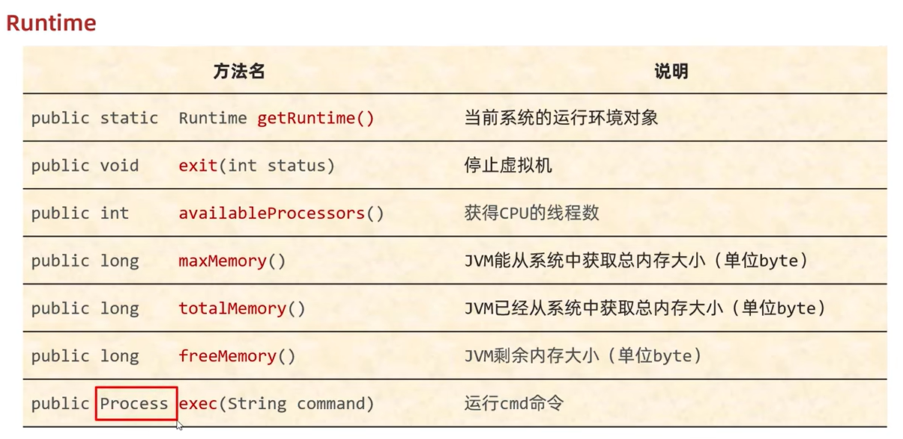

# Object
`Object` 是Java中的顶级父类，所有类都直接或间接的继承于`Object`类
`Object` 类中的方法可以被所有子类访问

- `public Object()` --- 空参构造
- `public String toString()` --- **返回对象的字符串表示形式**
	- `System.out.println(obj)` --- **核心逻辑**：当我们要打印一个对象时，底层会调用对象的 `toString()` 方法，把对象变成字符串，然后再打印再控制台，打印完毕换行处理。如果想看到对象内部的属性值，可以**重写**父类`Object` 类中的`toString()` 方法。
- `public boolean equals(Object obj)` --- **比较两个对象是否相等**
	- `Object` 类中的`equals()` 默认使用 `==` 号比较**对象的地址值**。如果想对比对象的属性值，那么**重写**`equals()` 方法。
	- `String`调用`equals()`和`StringBuilder`调用`equals()`的区别：
		- `String` 中**重写**了`equals()` 方法：先判断参数是否为字符串，如果是字符串，再比较内部的属性；如果参数不是字符串，直接返回false
		- `StringBuilder`**没有重写**`equals()` 方法，继承了`Object` 类中的`equals()` ，默认使用 `==` 号比较对象的地址值
- `protected Object clone()` --- **对象克隆(浅克隆方式)** ：把A对象的属性值完全拷贝给B对象  
	它的权限是`protected`，所以我们不能直接调用，需要**重写**这个方法
	使用举例：`User u2 = (User) u1.clone();` 
	细节：方法会在底层帮我们创建一个对象，并把原对象中的数据拷贝过去
	书写细节：
	 	1. 重写`Object`中的`clone()`方法
	 	2. 让JavaBean类实现`Cloneable`接口
	 	3. 创建原对象并调用clone就可以了

11种方法：

```Java
/**
 * native 方法，用于返回当前运行时对象的 Class 对象，使用了 final 关键字修饰，故不允许子类重写。
 */
public final native Class<?> getClass()
/**
 * native 方法，用于返回对象的哈希码，主要使用在哈希表中，比如 JDK 中的HashMap。
 */
public native int hashCode()
/**
 * 用于比较 2 个对象的内存地址是否相等，String 类对该方法进行了重写以用于比较字符串的值是否相等。
 */
public boolean equals(Object obj)
/**
 * native 方法，用于创建并返回当前对象的一份拷贝。
 */
protected native Object clone() throws CloneNotSupportedException
/**
 * 返回类的名字实例的哈希码的 16 进制的字符串。建议 Object 所有的子类都重写这个方法。
 */
public String toString()
/**
 * native 方法，并且不能重写。唤醒一个在此对象监视器上等待的线程(监视器相当于就是锁的概念)。如果有多个线程在等待只会任意唤醒一个。
 */
public final native void notify()
/**
 * native 方法，并且不能重写。跟 notify 一样，唯一的区别就是会唤醒在此对象监视器上等待的所有线程，而不是一个线程。
 */
public final native void notifyAll()
/**
 * native方法，并且不能重写。暂停线程的执行。注意：sleep 方法没有释放锁，而 wait 方法释放了锁 ，timeout 是等待时间。
 */
public final native void wait(long timeout) throws InterruptedException
/**
 * 多了 nanos 参数，这个参数表示额外时间（以纳秒为单位，范围是 0-999999）。 所以超时的时间还需要加上 nanos 纳秒。。
 */
public final void wait(long timeout, int nanos) throws InterruptedException
/**
 * 跟之前的2个wait方法一样，只不过该方法一直等待，没有超时时间这个概念
 */
public final void wait() throws InterruptedException
/**
 * 实例被垃圾回收器回收的时候触发的操作
 */
protected void finalize() throws Throwable { }
```

# 两种克隆方式

**浅拷贝**：浅拷贝会在堆上创建一个新的对象（区别于引用拷贝的一点），不过，如果原对象内部的属性是引用类型的话，浅拷贝会直接复制内部对象的引用地址，也就是说拷贝对象和原对象共用同一个内部对象。

**深拷贝**：深拷贝会完全复制整个对象，包括这个对象所包含的内部对象。

## 浅克隆
不管对象内部的属性是基本数据类型还是引用数据类型，都完全拷贝过来(**引用数据类型拷贝的是地址值**)
		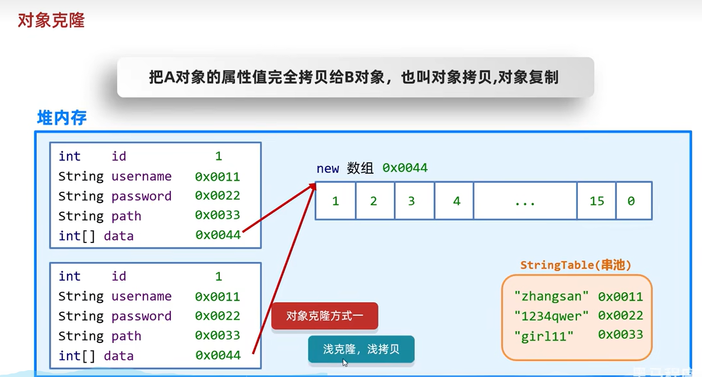

## 深克隆
基本数据类型拷贝过来；**字符串复用**；**引用数据类型会重新创建新的**
		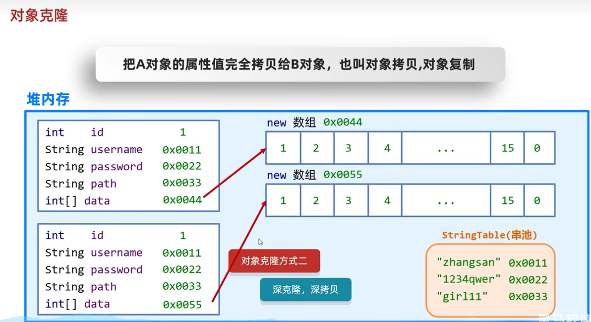

## 三种拷贝对比 ✅


# Objects

- `public static boolean equals(Object a,Object b)` --- **先做非空判断，比较两个对象**
	使用举例：`boolean result = Objects.equals(s1, s2);` 
	1. 方法的底层会判断s1是否为null，如果为null，直接返回false  
	2. 如果s1不为null，那么就利用s1再次调用equals方法  
	3. 此时s1是student类型，所以最终还是会调用student中的equals方法，如果没有重写，比较地址值，如果重写了，就比较属性值
- `public static boolean isNull(Object obj)` --- **判断对象是否为null，为null返回true，反之false**
- `public static boolean nonNull(Object obj)` --- **判断对象是否为null，跟isNull的结果相反**
# BigInteger
`BigInteger`表示一个**大整数**

## 创建对象
- `public BigInteger(int num, Random rnd)` --- **获取随机大整数**，范围:[0~ 2的num次方-1]
```java
Random r = new Random();  
BigInteger bd1 = new BigInteger(4,r); //获取一个随机的大整数
```
- `public BigInteger(String val)` --- **获取指定的大整数**
细节：字符串中**必须是整数**，否则会报错
```java
BigInteger bd2 = new BigInteger("100");  
```
- `public BigInteger(String val, int radix)` --- **获取指定进制的大整数**
细节:  
1. 字符串中的数字必须是整数  
2. 字符串中的数字必须要跟进制吻合；比如二进制中，那么只能写0和1，写其他的就报错
```java
BigInteger bd4 = new BigInteger("100", 10);  //100
BigInteger bd5 = new BigInteger("100", 2);  //4
```
- `public static BigInteger valueOf(long val)` --- **静态方法获取BigInteger的对象，内部有优化**
细节:  
1. 相对第二种方法，能表示范围比较小，**只能在long的取值范围之内**，如果超出long的范围就不行了
2. 在内部对常用的数字: -16 ~ 16 进行了**优化**；  提前把-16~16 先创建好BigInteger的对象，如果多次获取不会重新创建新的
```java
BigInteger bd5 = BigInteger.valueOf(16);  
BigInteger bd6 = BigInteger.valueOf(16);  
System.out.println(bd5 == bd6);//true
```
- **对象一旦创建内部的数据不能发生改变**
```java
BigInteger bd9 = BigInteger.valueOf(1);  
BigInteger bd10 = BigInteger.valueOf(2);  
//此时，不会修改参与计算的BigInteger对象中的借，而是产生了一个新的BigInteger对象记录  
BigInteger result = bd9.add(bd10);  
System.out.println(result);//3
```
- 小结
1. 如果`BigInteger`表示的数字**没有超出long**的范围，可以用**静态方法获取**
2. 如果`BigInteger`表示的数字**超出long**的范围，可以**用构造方法获取**(推荐第二个)
3. 对象一旦创建，`BigInteger`内部记录的值**不能发生改变**
4. 只要进行计算都会产生一个新的`BigInteger`对象
## 常见成员方法
**必须使用方法实现**：加、减、乘、除、是否相同、次幂、求最大值/最小值、转换类型

- `public BigInteger add(BigInteger val)` --- 加法
```java
BigInteger bd3 = bd1.add(bd2);  
```
- `public BigInteger subtract(BigInteger val)` --- 减法
```java
BigInteger bd3 = bd1.subtract(bd2);
```
- `public BigInteger multiply(BigInteger val)` --- 乘法
```Java
BigInteger bd3 = bd1.multiply(bd2)
```
- `public BigInteger divide(BigInteger val)` --- 除法，获取商
```Java
BigInteger bd3 = bd1.divide(bd2)  // 获取商
```
- `public BigInteger[] divideAndRemainder(BigInteger val)` --- 除法，获取商和余数
```Java
BigInteger[] arr = bd1.divideAndRemainder(bd2);  
System.out.println(arr[0]);  // 商
System.out.println(arr[1]);  // 余数
```
- `public boolean equals(Object x)` ---  比较是否相同
```java
boolean result = bd1.equals(bd2);  // true/false
```
- `public BigInteger pow(int exponent)` --- 次幂
```Java
BigInteger bd4 = bd1.pow(2);
```
- `public BigInteger max/min(BigInteger val)` --- 返回较大值/较小值  **不会创建新对象**
```Java
BigInteger bd5 = bd1.max(bd2); 
BigInteger bd5 = bd1.min(bd2);
```
- `public int intValue(BigInteger val)` --- 转为int类型整数，超出范围数据有误  还有`doubleValue()` 、`longValue()` 
```Java
BigInteger bd6 = BigInteger.valueOf(200);  
double v1 = bd6.intValue();  
double v2 = bd6.doubleValue();  
System.out.println(v1);  // 200
System.out.println(v2);  // 200.0
```
## BigInteger底层存储原理

`BigInteger` 内部使用 `int[]` 数组来存储任意大小的整形数据。 范围非常大，远超long类型。

相对于常规整数类型的运算来说，`BigInteger` 运算的效率会相对较低

1. 将大整数转换为**二进制的补码**
2. 将补码从右往左每**32位**分为一组
3. 把每一组各自转换为**10进制**
4. 按顺序放到一个数组当中
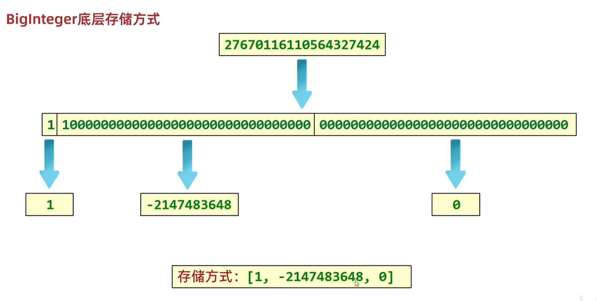
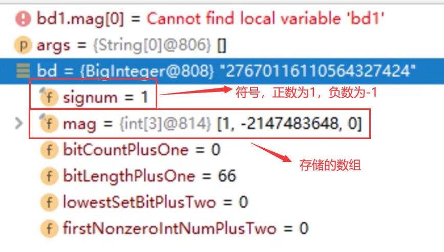
**BigInteger最大上限**：
存储的数组的最大长度是int的最大值：2147483647
数组中每一位能表示数字：-2147483648~2147483647
所以`BigInteger`能表示的最大值为：42亿的21亿次方
# BigDecima  ✅
用于小数的精确计算，用来表示很长的小数

可以实现对浮点数的运算，不会造成精度丢失。

## 创建对象
- `public BigDecimal(double val)` --- 通过传递double类型的小数来创建对象 
`BigDecimal bd1 = new BigDecimal(0.01);`
这种方式有可能是**不精确**的，所以不建议使用
- `public BigDecimal(string val)` --- 通过传递**字符串**表示的小数来创建对象
`BigDecimal bd3 = new BigDecimal("0.01");` 
- `public static BigDecimal valueOf(double val)` --- 通过**静态方法**获取对象
`BigDecimal bd6 = BigDecimal.valueOf(10.0);` 
小结：
1. 如果要表示的数字不大，**没有超出double**的取值范围，建议使用**静态**方法  (valueOf)
2. 如果要表示的数字比较大，**超出了double**的取值范围，建议使用**构造方法**  (第二种字符串创建)
3. 如果我们传递的是0~10之间的**整数(int)**，包含0，包含10，那么方法会返回已经创建好的对象，不会重新new 
## 常见成员方法
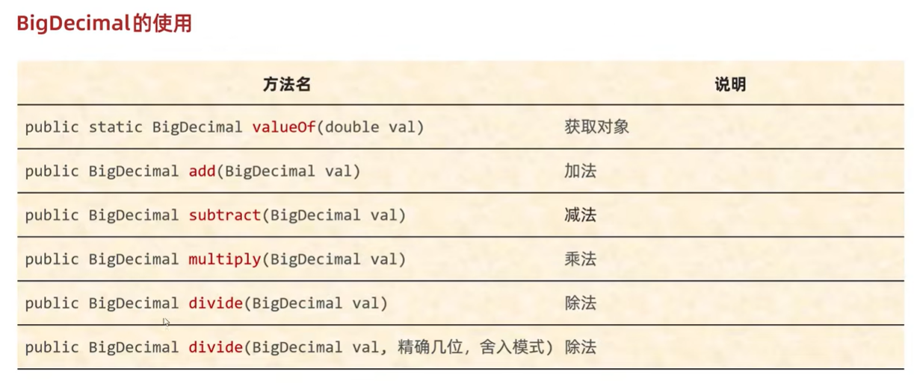
- `BigDecimal bd3 = bd1.add(bd2);` --- 加法

- `BigDecimal bd4 = bd1.subtract(bd2);` --- 减法

- `BigDecimal bd5 = bd1.multiply(bd2);` --- 乘法

- `BigDecimal bd6 = bd1.divide(bd2, 2, RoundingMode.HALF_UP);` --- 除法 RoundingMode.HALF_UP---四舍五入

- `a.compareTo(b)` : 返回 -1 表示 `a` 小于 `b`，0 表示 `a` 等于 `b` ， 1 表示 `a` 大于 `b`。--- 比较大小

  ```Java
  BigDecimal a = new BigDecimal("1.0");
  BigDecimal b = new BigDecimal("0.9");
  System.out.println(a.compareTo(b));// 1
  ```

- `setScale` ：通过 `setScale`方法设置保留几位小数以及保留规则。

  ```Java
  BigDecimal m = new BigDecimal("1.255433");
  BigDecimal n = m.setScale(3,RoundingMode.HALF_DOWN);
  System.out.println(n); // 1.255
  ```

**BigDecima的等值比较建议使用`compareTo()`方法， 这是因为 `equals()` 方法不仅仅会比较值的大小（value）还会比较精度（scale），而 `compareTo()` 方法比较的时候会忽略精度**。

```Java
BigDecimal a = new BigDecimal("1");
BigDecimal b = new BigDecimal("1.0");
System.out.println(a.equals(b)); //false
```

## 四舍五入方式

UP --- 远离零方向舍入的舍入模式
DOWN --- 向零方向舍入的舍入模式
CEILING --- 向正无限大方向舍入的舍入模式
FLOOR --- 向负无限大方向舍入的舍入模式
HALF_UP --- 向最接近数字方向舍入的舍入模式，如果与两个相邻数字的距离相等，则向上舍入
HALF_DOWN --- 向最接近数字方向舍入的舍入模式，如果与两个相邻数字的距离相等，则向下舍入
HALF_EVEN --- 向最接近数字方向舍入的舍入模式，如果与两个相邻数字的距离相等，则向相邻的偶数舍入

## BigDecimal底层存储原理

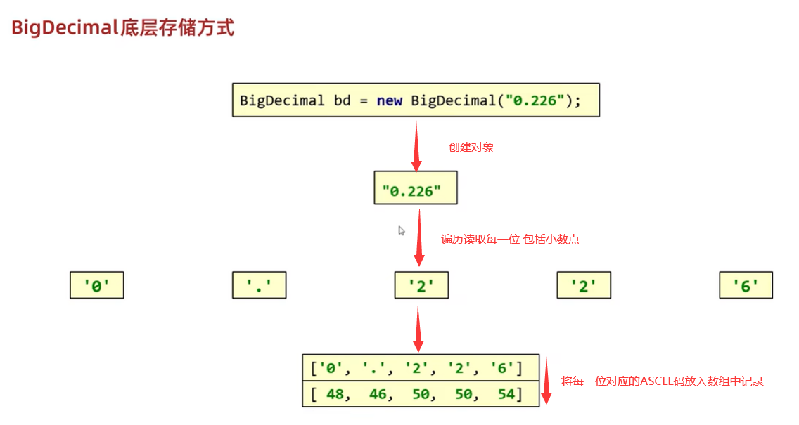
# 正则表达式
1. **校验字符串是否满足规则**
2. 在一段文本中查找满足要求的内容
## 正则表达式基本规则
**正则表达式的规则**：
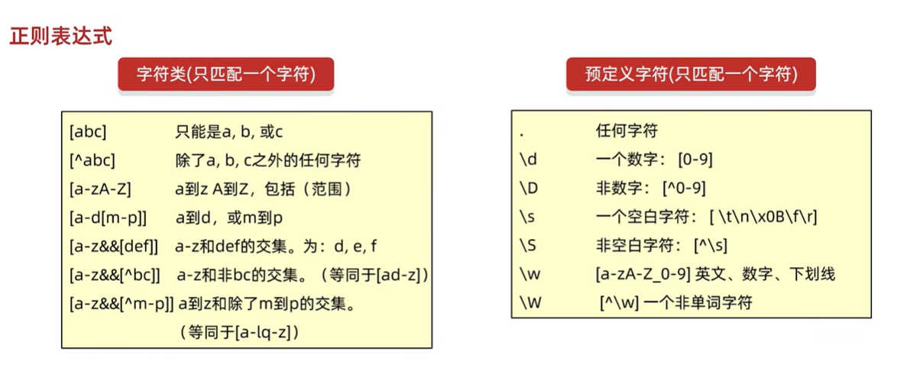
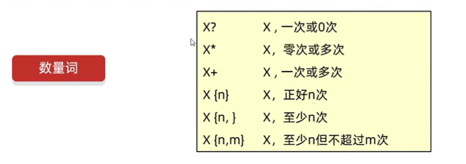
注意：

1. 只匹配一个字符
2. 如果要求两个范围的交集，那么需要写`&&`符号；如果写成了一个`&`，那么此时`&`就只是一个简单的`&`符号而已，与a、b、c一样
3. 预定义字符中除了`.`其他的要写成`\\d` 这种，因为：`\\表示一个\`
`\`  **转义字符**  改变后面那个字符原本的含义，把它变成一个普通的字符，不再有特殊含义
除此之外，还有很多其他正则表达式规则
作用一：校验字符串是否满足规则
示例：
```java
"a".matches("[abc]")  // true

String regex1 = "[^abc][^abc]"
"zz".matches(regex1)  // true

"0".matches("[a-zA-Z0-9]")  // true
"e".matches("[a-d[m-p]]")  //false
"0".matches("[a-z&&[def]]") //false
"a".matches("[a-z&&[^bc]]")   // true
"0".matches("[a-z&&[^m-p]]")  //false
"你".matches("..")  //false
"3".matches("\\d")  // true
"2".matches("\\w")  // true
"你".matches("\\W")  // true
"2442fsfsf".matches("\\w{6,}")  //true
"244f".matches("\\w{6,}")  //false
"23dF".matches("[a-zA-Z0-9]{4}")  //true
"23_F".matches("[\\w&&[^_]]{4}")  //false

//(?i)
// 在匹配时忽略bc的大小写
String regex2 = "a(?i)bc" 
// 在匹配时忽略b的大小写
String regex3 = "a((?i)b)c" 
"ABC".matches(regex2)  //false
```
**正则表达式小结**：


## 爬虫
作用二：在一段文本中查找满足要求的内容
可以在**本地爬虫和网络爬虫**中使用**正则表达式**获取出满足要求的内容
`Pattern`：表示正则表达式 
`Matcher`：文本匹配器，作用按照正则表达式的规则去读取字符串，从头开始读取，在大串中去找符合匹配规则的子串

```java
/*  
    需求:把下面文本中的座机电话，邮箱，手机号，热线都爬取出来。  
    来黑马程序员学习Java，  
    手机号:18512516758，18512508907或者联系邮箱:boniu@itcast.cn，  
    座机电话:01036517895，010-98951256邮箱:bozai@itcast.cn，  
    热线电话:400-618-9090 ，400-618-4000，4006184000，4006189090  
    
    手机号的正则表达式:1[3-9]\d{9}  
    邮箱的正则表达式:\w+@[\w&&[^_]]{2,6}(\.[a-zA-Z]{2,3}){1,2}座机电话的正则表达式:θ\d{2,3}-?[1-9]\d{4,9}  
    热线电话的正则表达式:400-?[1-9]\\d{2}-?[1-9]\\d{3}  
*/  
String s = "来黑马程序员学习Java，" +  
        "电话:18512516758，18512508907" + "或者联系邮箱:boniu@itcast.cn，" +  
        "座机电话:01036517895，010-98951256" + "邮箱:bozai@itcast.cn，" +  
        "热线电话:400-618-9090 ，400-618-4000，4006184000，4006189090";  
System.out.println("400-618-9090");  
String regex = "(1[3-9]\\d{9})|(\\w+@[\\w&&[^_]]{2,6}(\\.[a-zA-Z]{2,3}){1,2})" +  
        "|(0\\d{2,3}-?[1-9]\\d{4,9})" +  
        "(400-?[1-9]\\d{2}-?[1-9]\\d{3})";  
//1.获取正则表达式的对象  
Pattern p = Pattern.compile(regex);  
//2.获取文本匹配器的对象 
//m:文本匹配器的对象  
//str:大串  
//p:正则表达式对象规则  
//利用m去读取s，会按照p的规则找里面的小串  
Matcher m = p.matcher(s);  
//3.利用循环获取每一个数据 
//m.find()---拿着文本匹配器从头开始读取，寻找是否有满足规则的子串;如果没有，方法返回false;如果有，返回true。在底层记录子串的起始索引和结束索引+1
//m.group()---方法底层会根据find方法记录的索引进行字符串的截取,substring(起始索引，结束索引);包头不包尾 如：(0,4)但是不包含4索引，会把截取的小串进行返回。 
//第二次在调用find的时候，会继续读取后面的内容，读取到第二个满足要求的子串，方法会继续返回true，并把第二个子串的起始索引和结束索引+1，进行记录  
//第二次调用group方法的时候，会根据find方法记录的索引再次截取子串  
while(m.find()){  
    String str = m.group();  
    System.out.println(str);
}
```
根据爬取的策略可以分为**带条件爬取**、**贪婪爬取**等。
## 正则表达式在字符串方法中的使用

```Java
//public string replaceAll(string regex,string newstr) 按照正则表达式的规则进行替换  
//public string[] split(string regex): 按照正则表达式的规则切割字符串  
/*  
    有一段字符串:小诗诗dqwefqwfqwfwq12312小丹丹dqwefqwfqwfwq12312小惠惠  
    要求1:把字符串中三个姓名之间的字母替换为vs  
    要求2:把字符串中的三个姓名切割出来*/  
String s = "小诗诗dqwefqwfqwfwq12312小丹丹dqwefqwfqwfwq12312小惠惠";  
//细节:  
//方法在底层跟之前一样也会创建文本解析器的对象  
//然后从头开始去读取字符串中的内容，只要有满足的，那么就用第一个参数去替换。  
String result1 = s.replaceAll("[\\w&&[^_]]+", "vs");  
System.out.println(result1);  
String[] arr = s.split("[\\w&&[^_]]+");  
for (int i = 0; i < arr.length; i++) {  
    System.out.println(arr[i]);  
}
```
## 捕获分组和非捕获分组
本节所述分组即正则表达式符号中的`()` 
每组是有组号的，也就是序号

1. **从1开始**，连续不间断
2. **以左括号为基准**，最左边为第一组，其次第二组，以此类推
**捕获分组**：后续还要继续使用本组的数据，正则内部使用：`\\组号` ； 正则外部使用：`$组号` 
```java
//需求1:判断一个字符串的开始字符和结束字符是否一致?只考虑一个字符  
//举例: a123a b456b 17891 &abc& a123b(false)  
// \\组号:表示把第X组的内容再出来用一次  
String regex1 = "(.).+\\1";  
System.out.println("a123a".matches(regex1));  
System.out.println("b456b".matches(regex1));  
System.out.println("17891".matches(regex1));  
System.out.println("&abc&".matches(regex1));  
System.out.println("a123b".matches(regex1));  
System.out.println("--------------------------");  

//需求2:判断一个字符串的开始部分和结束部分是否一致?可以有多个字符  
//举例: abc123abc b456b 123789123 &!@abc&!@ abc123abd(false)  
String regex2 = "(.+).+\\1";  
System.out.println("abc123abc".matches(regex2));  
System.out.println("b456b".matches(regex2));  
System.out.println("123789123".matches(regex2));  
System.out.println("&!@abc&!@".matches(regex2));  
System.out.println("abc123abd".matches(regex2));  
System.out.println("---------------------");  
  
//需求3:判断一个字符串的开始部分和结束部分是否一致?开始部分内部每个字符也需要一致  
//举例: aaa123aaa bbb456bbb 111789111 &&abc&&  
//(.):把首字母看做一组  
// \\2:把首字母拿出来再次使用  
// *:作用于\\2,表示后面重复的内容出现日次或多次  
String regex3 = "((.)\\2*).+\\1";  
System.out.println("aaa123aaa".matches(regex3));  
System.out.println("bbb456bbb".matches(regex3));  
System.out.println("111789111".matches(regex3));  
System.out.println("&&abc&&".matches(regex3));  
System.out.println("aaa123aab".matches(regex3));
```
```java
/*需求:  
    将字符串:我要学学编编编编程程程程程程替换为:我要学编程  
*/  
String str = "我要学学编编编编程程程程程程";  
//需求:把重复的内容 替换为 单个的  
//学学                学  
//编编编编            编  
//程程程程程程        程  
//  (.)表示把重复内容的第一个字符看做一组  
//  \\1表示第一字符再次出现  
//  + 至少一次  
//  $1 表示把正则表达式中第一组的内容，再拿出来用  
String result = str.replaceAll("(.)\\1+", "$1");  
System.out.println(result);
```
**非捕获分组**：分组后不再使用本组数据，仅仅把数据括起来，不占组号。
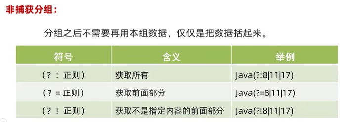

# JDK7时间相关类
## Date
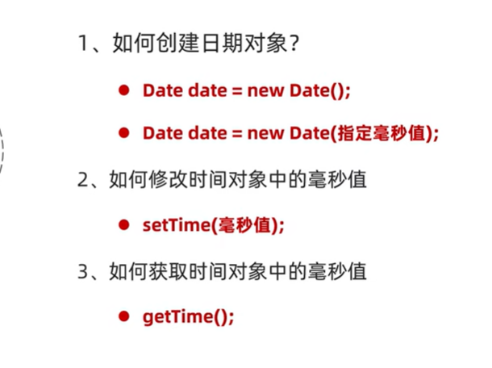
输入的毫秒值要用Long类型

## SimpleDtaeFormat
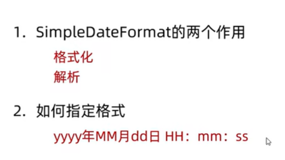
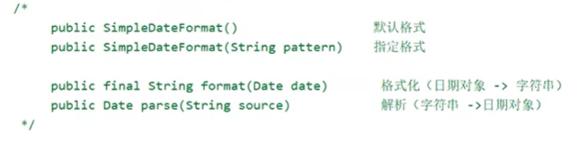

## Calendar
细节：Calendar是一个抽象类，不能直接new，而是通过一个静态方法获取子类对象


```java
public class A06_CalendarDemo1 {  
    public static void main(String[] args) {  
        /*  
            public static Calendar getInstance()               获取当前时间的日历对象  
            public final Date getTime()                         获取日期对象  
            public final setTime(Date date)                     给日历设置日期对象  
            public long getTimeInMillis()                       拿到时间毫秒值  
            public void setTimeInMillis(long millis)            给日历设置时间毫秒值  
            public int get(int field)                           获取日期中的某个字段信息  
            public void set(int field,int value)                修改日历的某个字段信息  
            public void add(int field,int amount)               为某个字段增加/减少指定的值  
        */  
        //1.获取日历对象  
        //细节1:Calendar是一个抽象类,不能直接new,而是通过一个静态方法获取到子类对象  
        //底层原理:  
        //会根据系统的不同时区来获取不同的日历对象,默认表示当前时间。  
        //把会把时间中的纪元,年,月,日,时,分,秒,星期,等等的都放到一个数组当中  
        //日 :纪元  
        // 1 :年  
        // 2 :月  
        // 3 : 一年中的第几周  
        // 4:一个月中的第几周  
        // 5: 一个月中的第几天(日期)  
        // ....  
        //细节2:  
        //月份:范围0~11 如果获取出来的是0.那么实际上是1月。  
        //星期:在老外的眼里,星期日是一周中的第一天  
        //      1(星期日) 2(星期一) 3(星期二) 4(星期三) 5(星期四) 6(星期五) 7(星期六)  
        Calendar c = Calendar.getInstance();  
  
        //2.修改一下日历代表的时间  
        Date d = new Date(0L);  
        c.setTime(d);  
        System.out.println(c);  
  
        //puslic int get(int field) 取日期中的某个字段信息  
        //public void set(int field,int value) 修改日历的某个字段信息  
        //public void add(int fieldint amount) 为某个字段增加/减少指定的值  
  
        c.set(Calendar.YEAR, 2023);  
        c.set(Calendar.MONTH, 8);  
        c.set(Calendar.DAY_OF_MONTH, 10);  
  
        //调用方法在这个基础上减少一个月  
        c.add(Calendar.MONTH, -1);  
  
        //java在Calendar类中,把索引对应的数字都定义成常量   
		int year = c.get(Calendar.YEAR);  
        int month = c.get(Calendar.MONTH) + 1;  
        int date = c.get(Calendar.DAY_OF_MONTH);  
        int week = c.get(Calendar.DAY_OF_WEEK);  
        System.out.println(year + "," + month + "," + date + "," + getWeek(week));  
    }  
    //查表法://表:容器  
    //让数据跟索引产生对应的关系  
    //传入对应的数字: 1 ~7//返回对应的星期  
    public static String getWeek(int index) {  
        //定义一个数组,让汉字星期几 跟1~7产生对应关系  
        String[] arr = {"", "星期日", "星期一", "星期二", "星期三", "星期四", "星期五", "星期六"};  
        //根据索引返回对应的星期  
        return arr[index];  
    }  
}
```

# JDK8时间相关类
`import java.time` 
JDK8的时间对象是**不会改变**的，进行修改只会产生新的时间。


## Date类
### ZoneId
```Java
/*  
static Set<string> getAvailableZoneIds()            获取Java中支持的所有时区  
static ZoneId systemDefault()                       获取系统默认时区  
static Zoneld of(string zoneld)                     获取一个指定时区  
*/  
//1.获取所有的时区名称  
Set<String> zoneIds = ZoneId.getAvailableZoneIds();  
System.out.println(zoneIds.size());//600  
System.out.println(zoneIds);// Asia/Shanghai  
//2.获取当前系统的默认时区  
ZoneId zoneId = ZoneId.systemDefault();  
System.out.println(zoneId);//Asia/Shanghai  
//3.获取指定的时区  
ZoneId zoneId1 = ZoneId.of("Asia/Pontianak");  
System.out.println(zoneId1);//Asia/Pontianak
```
### Instant
```java
/*  
    static Instant now()                         获取当前时间的Instant对象(标准时间)  
    static Instant ofXxxx(long epochMilli)       根据(秒/毫秒/纳秒)获取Instant对象  
    ZonedDateTime atZone(ZoneIdzone)             指定时区  
    boolean isxxx(Instant otherInstant)          判断系列的方法  
    Instant minusXxx(long millisToSubtract)      减少时间系列的方法  
    Instant plusXxx(long millisToSubtract)       增加时间系列的方法  
*/  
//1.获取当前时间的Instant对象(标准时间)  
Instant now = Instant.now();  
System.out.println(now);  
//2.根据(秒/毫秒/纳秒)获取Instant对象  
Instant instant1 = Instant.ofEpochMilli(0L);  
System.out.println(instant1);//1970-01-01T00:00:00z  
  
Instant instant2 = Instant.ofEpochSecond(1L);  
System.out.println(instant2);//1970-01-01T00:00:01Z  
  
Instant instant3 = Instant.ofEpochSecond(1L, 1000000000L);  
System.out.println(instant3);//1970-01-01T00:00:027  
  
//3. 指定时区  
ZonedDateTime time = Instant.now().atZone(ZoneId.of("Asia/Shanghai"));  
System.out.println(time);  
  
//4.isXxx 判断  
Instant instant4=Instant.ofEpochMilli(0L);  
Instant instant5 =Instant.ofEpochMilli(1000L);  
  
//5.用于时间的判断  
//isBefore:判断调用者代表的时间是否在参数表示时间的前面  
boolean result1=instant4.isBefore(instant5);  
System.out.println(result1);//true  
  
//isAfter:判断调用者代表的时间是否在参数表示时间的后面  
boolean result2 = instant4.isAfter(instant5);  
System.out.println(result2);//false  
  
//6.Instant minusXxx(long millisToSubtract) 减少时间系列的方法  
Instant instant6 =Instant.ofEpochMilli(3000L);  
System.out.println(instant6);//1970-01-01T00:00:03Z  
  
Instant instant7 =instant6.minusSeconds(1);  
System.out.println(instant7);//1970-01-01T00:00:02Z
```
### ZonedDateTime
```java
/*  
    static ZonedDateTime now()                获取当前时间的ZonedDateTime对象  
    static ZonedDateTime ofXxxx(。。。)        获取指定时间的ZonedDateTime对象  
    ZonedDateTime withXxx(时间)                修改时间系列的方法  
    ZonedDateTime minusXxx(时间)               减少时间系列的方法  
    ZonedDateTime plusXxx(时间)                增加时间系列的方法  
 *///1.获取当前时间对象(带时区)  
ZonedDateTime now = ZonedDateTime.now();  
System.out.println(now);  
  
//2.获取指定的时间对象(带时区)1/年月日时分秒纳秒方式指定  
ZonedDateTime time1 = ZonedDateTime.of(2023, 10, 1,  
        11, 12, 12, 0, ZoneId.of("Asia/Shanghai"));  
System.out.println(time1);  
  
//通过Instant + 时区的方式指定获取时间对象  
Instant instant = Instant.ofEpochMilli(0L);  
ZoneId zoneId = ZoneId.of("Asia/Shanghai");  
ZonedDateTime time2 = ZonedDateTime.ofInstant(instant, zoneId);  
System.out.println(time2);  
  
//3.withXxx 修改时间系列的方法  
ZonedDateTime time3 = time2.withYear(2000);  
System.out.println(time3);  
  
//4. 减少时间  
ZonedDateTime time4 = time3.minusYears(1);  
System.out.println(time4);  
  
//5.增加时间  
ZonedDateTime time5 = time4.plusYears(1);  
System.out.println(time5);
```
## 日期格式化类
### DateTimeFormatter
```Java
/*  
    static DateTimeFormatter ofPattern(格式)        获取格式对象  
    String format(时间对象)                          按照指定方式格式化  
*/  
//获取时间对象  
ZonedDateTime time = Instant.now().atZone(ZoneId.of("Asia/Shanghai"));  
  
// 解析/格式化器  
DateTimeFormatter dtf1=DateTimeFormatter.ofPattern("yyyy-MM-dd HH:mm;ss EE a");  
// 格式化  
System.out.println(dtf1.format(time));
```
## 日历类
### LocalDate
年、月、日
```java
public static void main(String[] args) {  
    //1.获取当前时间的日历对象(包含 年月日)  
    LocalDate nowDate = LocalDate.now();  
    //System.out.println("今天的日期:" + nowDate);  
    //2.获取指定的时间的日历对象  
    LocalDate ldDate = LocalDate.of(2023, 1, 1);  
    System.out.println("指定日期:" + ldDate);  
    System.out.println("=============================");  
  
    //3.get系列方法获取日历中的每一个属性值//获取年  
    int year = ldDate.getYear();  
    System.out.println("year: " + year);  
    //获取月//方式一:  
    Month m = ldDate.getMonth();  
    System.out.println(m);  
    System.out.println(m.getValue());  
    //方式二:  
    int month = ldDate.getMonthValue();  
    System.out.println("month: " + month);  
    //获取日  
    int day = ldDate.getDayOfMonth();  
    System.out.println("day:" + day);  
    //获取一年的第几天  
    int dayofYear = ldDate.getDayOfYear();  
    System.out.println("dayOfYear:" + dayofYear);  
    //获取星期  
    DayOfWeek dayOfWeek = ldDate.getDayOfWeek();  
    System.out.println(dayOfWeek);  
    System.out.println(dayOfWeek.getValue());  
  
    //is开头的方法表示判断  
    System.out.println(ldDate.isBefore(ldDate));  
    System.out.println(ldDate.isAfter(ldDate));  
  
    //with开头的方法表示修改，只能修改年月日  
    LocalDate withLocalDate = ldDate.withYear(2000);  
    System.out.println(withLocalDate);  
  
    //minus开头的方法表示减少，只能减少年月日  
    LocalDate minusLocalDate = ldDate.minusYears(1);  
    System.out.println(minusLocalDate);  
  
    //plus开头的方法表示增加，只能增加年月日  
    LocalDate plusLocalDate = ldDate.plusDays(1);  
    System.out.println(plusLocalDate);  
    //-------------  
    // 判断今天是否是你的生日  
    LocalDate birDate = LocalDate.of(2000, 1, 1);  
    LocalDate nowDate1 = LocalDate.now();  
    MonthDay birMd = MonthDay.of(birDate.getMonthValue(), birDate.getDayOfMonth());  
    MonthDay nowMd = MonthDay.from(nowDate1);  
    System.out.println("今天是你的生日吗? " + birMd.equals(nowMd));//今天是你的生日吗?  
  
}
```
### LocalTime
时、分、秒
```java
public static void main(String[] args) {  
    // 获取本地时间的日历对象。(包含 时分秒)  
    LocalTime nowTime = LocalTime.now();  
    System.out.println("今天的时间:" + nowTime);  
  
    int hour = nowTime.getHour();//时  
    System.out.println("hour: " + hour);  
  
    int minute = nowTime.getMinute();//分  
    System.out.println("minute: " + minute);  
  
    int second = nowTime.getSecond();//秒  
    System.out.println("second:" + second);  
  
    int nano = nowTime.getNano();//纳秒  
    System.out.println("nano:" + nano);  
    System.out.println("------------------------------------");  
    System.out.println(LocalTime.of(8, 20));//时分  
    System.out.println(LocalTime.of(8, 20, 30));//时分秒  
    System.out.println(LocalTime.of(8, 20, 30, 150));//时分秒纳秒  
    LocalTime mTime = LocalTime.of(8, 20, 30, 150);  
  
    //is系列的方法  
    System.out.println(nowTime.isBefore(mTime));  
    System.out.println(nowTime.isAfter(mTime));  
  
    //with系列的方法，只能修改时、分、秒  
    System.out.println(nowTime.withHour(10));  
  
    //plus系列的方法，只能修改时、分、秒  
    System.out.println(nowTime.plusHours(10));  
}
```
### LocalDateTime
年、月、日、时、分、秒
```java
public static void main(String[] args) {  
    // 当前时间的的日历对象(包含年月日时分秒)  
    LocalDateTime nowDateTime = LocalDateTime.now();  
  
    System.out.println("今天是:" + nowDateTime);//今天是：  
    System.out.println(nowDateTime.getYear());//年  
    System.out.println(nowDateTime.getMonthValue());//月  
    System.out.println(nowDateTime.getDayOfMonth());//日  
    System.out.println(nowDateTime.getHour());//时  
    System.out.println(nowDateTime.getMinute());//分  
    System.out.println(nowDateTime.getSecond());//秒  
    System.out.println(nowDateTime.getNano());//纳秒  
    // 日:当年的第几天  
    System.out.println("dayofYear:" + nowDateTime.getDayOfYear());  
    //星期  
    System.out.println(nowDateTime.getDayOfWeek());  
    System.out.println(nowDateTime.getDayOfWeek().getValue());  
    //月份  
    System.out.println(nowDateTime.getMonth());  
    System.out.println(nowDateTime.getMonth().getValue());  
  
    LocalDate ld = nowDateTime.toLocalDate();  
    System.out.println(ld);  
  
    LocalTime lt = nowDateTime.toLocalTime();  
    System.out.println(lt.getHour());  
    System.out.println(lt.getMinute());  
     System.out.println(lt.getSecond());  
}
```

## 工具类
### Period
用于计算两个 **时期** 间隔(年、月、日)
```Java
public static void main(String[] args) {  
    // 当前本地 年月日  
    LocalDate today = LocalDate.now();  
    System.out.println(today);  
  
    // 生日的 年月日  
    LocalDate birthDate = LocalDate.of(2000, 1, 1);  
    System.out.println(birthDate);  
  
    Period period = Period.between(birthDate, today);//第二个参数减第一个参数  
  
    System.out.println("相差的时间间隔对象:" + period);  
    System.out.println(period.getYears());  
    System.out.println(period.getMonths());  
    System.out.println(period.getDays());  
  
    System.out.println(period.toTotalMonths());  
}
```

### Duration
用于计算两个 **时间** 间隔(时、分、秒、纳秒)
```Java
public static void main(String[] args) {  
    // 本地日期时间对象。  
    LocalDateTime today = LocalDateTime.now();  
    System.out.println(today);  
  
    // 出生的日期时间对象  
    LocalDateTime birthDate = LocalDateTime.of(2000, 1, 1, 0, 0, 0);  
    System.out.println(birthDate);  
  
    Duration duration = Duration.between(birthDate, today);//第二个参数减第一个参数  
    System.out.println("相差的时间间隔对象:" + duration);  
  
    System.out.println("============================================");  
    System.out.println(duration.toDays());//两个时间差的天数  
    System.out.println(duration.toHours());//两个时间差的小时数  
    System.out.println(duration.toMinutes());//两个时间差的分钟数  
    System.out.println(duration.toMillis());//两个时间差的毫秒数  
    System.out.println(duration.toNanos());//两个时间差的纳秒数  
}
```

### ChronoUnit
用于计算两个 **时期** 间隔(最全)
```Java
public static void main(String[] args) {  
    // 当前时间  
    LocalDateTime today = LocalDateTime.now();  
    System.out.println(today);  
    // 生日时间  
    LocalDateTime birthDate = LocalDateTime.of(2000, 1, 1,  
            0, 0, 0);  
    System.out.println(birthDate);  
  
    System.out.println("相差的年数:" + ChronoUnit.YEARS.between(birthDate, today));  
    System.out.println("相差的月数:" + ChronoUnit.MONTHS.between(birthDate, today));  
    System.out.println("相差的周数:" + ChronoUnit.WEEKS.between(birthDate, today));  
    System.out.println("相差的天数:" + ChronoUnit.DAYS.between(birthDate, today));  
    System.out.println("相差的时数:" + ChronoUnit.HOURS.between(birthDate, today));  
    System.out.println("相差的分数:" + ChronoUnit.MINUTES.between(birthDate, today));  
    System.out.println("相差的秒数:" + ChronoUnit.SECONDS.between(birthDate, today));  
    System.out.println("相差的毫秒数:" + ChronoUnit.MILLIS.between(birthDate, today));  
    System.out.println("相差的微秒数:" + ChronoUnit.MICROS.between(birthDate, today));  
    System.out.println("相差的纳秒数:" + ChronoUnit.NANOS.between(birthDate, today));  
    System.out.println("相差的半天数:" + ChronoUnit.HALF_DAYS.between(birthDate, today));  
    System.out.println("相差的十年数:" + ChronoUnit.DECADES.between(birthDate, today));  
    System.out.println("相差的世纪(百年)数:" + ChronoUnit.CENTURIES.between(birthDate, today));  
    System.out.println("相差的千年数:" + ChronoUnit.MILLENNIA.between(birthDate, today));  
    System.out.println("相差的纪元数:" + ChronoUnit.ERAS.between(birthDate, today));  
}
```

# 包装类
包装类：基本数据类型对应的引用数据类型  
[[Java 02 面向对象#基本数据类型对应包装类]]

|基本数据类型|包装类                        |
|:-:|:-:|
|byte|Byte|
|short|Short|
|char|Character|
|int|Integer |
|long |Long|
|float|Float|
|double|Double |
|boolean|Boolean|
## 如何理解包装类
用一个对象，把基本数据类型包起来
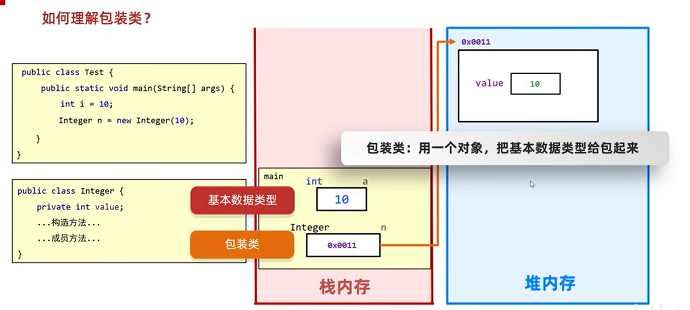
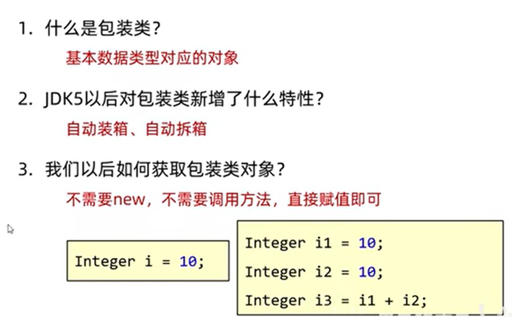

## 包装类的缓存机制

Java 基本数据类型的包装类型的大部分都用到了缓存机制来提升性能。

`Byte`,`Short`,`Integer`,`Long` 这 4 种包装类默认创建了数值 **[-128，127]** 的相应类型的缓存数据，`Character` 创建了数值在 **[0,127]** 范围的缓存数据，`Boolean` 直接返回 `True` or `False`。

如果超出对应范围仍然会去创建新的对象，缓存的范围区间的大小只是在性能和资源之间的权衡。

两种浮点数类型的包装类 `Float`,`Double` 并没有实现缓存机制。

```Java
Integer i1 = 40;
Integer i2 = new Integer(40);
System.out.println(i1==i2);
```

`Integer i1=40` 这一行代码会发生装箱，也就是说这行代码等价于 `Integer i1=Integer.valueOf(40)` 。因此，`i1` 直接使用的是缓存中的对象。而`Integer i2 = new Integer(40)` 会直接创建新的对象。

因此，答案是 `false` 。你答对了吗？

记住：**所有整型包装类对象之间值的比较，全部使用 equals 方法比较**。

## JDK5以前获取包装类对象

注：
1. **两种方式获取对象的区别** （掌握）（见下述代码）
2. **自动装箱**：把基本数据类型会自动的变成其对应的包装类  
3. **自动拆箱**：把包装类自动的变成其对象的基本数据类型
在JDK5以后，int和Integer可以看做是同一个东西，因为在内部可以自动转化。
```Java
    /*  
        public Integer(int value)                              根据传递的整数创建一个Integer对象  
        public Integer(String s)                               根据传递的字符串创建一个Integer对象  
        public static Integer valueOf(int i)                   根据传递的整数创建一个Integer对象  
        public static Integer valueof(String s)                根据传递的字符串创建一个Integer对象  
        public static Integer valueof(String s, int radix)     根据传递的字符串和进制创建一个Integer对象  
    */  
    //1.利用构造方法获取Integer的对象(JDK5以前的方式)  
    /*Integer i1 = new Integer(1);    
      Integer i2 = new Integer("1");    
      System.out.println(i1);    
      System.out.println(i2);*/  
    //2.利用静态方法获取Integer的对象(JDK5以前的方式)  
    Integer i3 = Integer.valueOf(123);  
    Integer i4 = Integer.valueOf("123");  
    Integer i5 = Integer.valueOf("123", 8);  
  
    System.out.println(i3);  
    System.out.println(i4);  
    System.out.println(i5);  
  
    //3.这两种方式获取对象的区别(掌握)  
    //底层原理：  
    //因为在实际开发中，-128~127之间的数据，用的比较多。  
    //如果每次使用都是new对象，那么太浪费内存了  
    //所以，提前把这个范围之内的每一个数据都创建好对象  
    //如果要用到了不会创建新的，而是返回已经创建好的对象。  
    Integer i6 = Integer.valueOf(127);  
    Integer i7 = Integer.valueOf(127);  
    System.out.println(i6 == i7);//true  
  
    Integer i8 = Integer.valueOf(128);  
    Integer i9 = Integer.valueOf(128);  
    System.out.println(i8 == i9);//false  
  
    //因为看到了new关键字，在Java中，每一次new都是创建了一个新的对象  
    //所以下面的两个对象都是new出来，地址值不一样。  
    /*Integer i10 = new Integer(127);  
    Integer i11 = new Integer(127);    System.out.println(i10 == i11);  
    Integer i12 = new Integer(128);    Integer i13 = new Integer(128);    System.out.println(i12 == i13);*/}
```

## Integer的常见成员方法
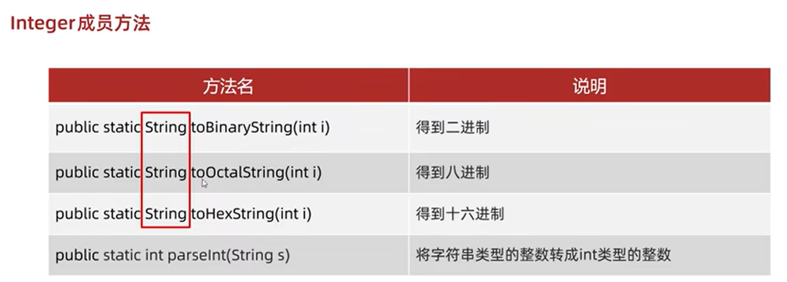
注：

1. 8种包装类当中，除了Character都有对应的parseXxx的方法，进行**类型转换**  
```Java
public static void main(String[] args) {  
    /*  
        public static string tobinarystring(int i)       得到二进制  
        public static string tooctalstring(int i)        得到八进制  
        public static string toHexstring(int i)          得到十六进制  
        public static int parseInt(string s)             将字符串类型的整数转成int类型的整数  
    */  
    //1.把整数转成二进制，十六进制  
    String str1 = Integer.toBinaryString(100);  
    System.out.println(str1);//1100100  
  
    //2.把整数转成八进制  
    String str2 = Integer.toOctalString(100);  
    System.out.println(str2);//144  
  
    //3.把整数转成十六进制  
    String str3 = Integer.toHexString(100);  
    System.out.println(str3);//64  
  
    //4.将字符串类型的整数转成int类型的整数  
    //强类型语言:每种数据在java中都有各自的数据类型  
    //在计算的时候，如果不是同一种数据类型，是无法直接计算的。  
    int i = Integer.parseInt("123");  
    System.out.println(i);  
    System.out.println(i + 1);//124  
    //细节1:  
    //在类型转换的时候，括号中的参数只能是数字不能是其他，否则代码会报错  
    //细节2:  
    //8种包装类当中，除了Character都有对应的parseXxx的方法，进行类型转换  
    String str = "true";  
    boolean b = Boolean.parseBoolean(str);  
    System.out.println(b);  
}
```

