[toc]

# 重要知识点

[ArrayList](# ArraryList 🌟 ) 

[LinkedList ](# LinkedList ) 

[HashMap](# HashMap🌟) 

[ConcurrentHashMap (重要)](# ConcurrentHashMap (重要)🌟) 

[LinkedHashMap ](# LinkedHashMap )  

[CopyOnWriteArrayList](# CopyOnWriteArrayList🌟) 

[ArrayBlockingQueue(笔记不全)](# ArrayBlockingQueue(笔记不全)) 

[PriorityQueue 优先队列 (笔记不全)](# `PriorityQueue` 优先队列 (笔记不全)🌟) 

[DelayQueue  延迟队列（笔记不全）](# `DelayQueue`  延迟队列（笔记不全）) 

# 数据结构

## 栈
先进后出，后进先出
## 队列
先进先出，后进后出
## 数组

查询数据通过地址值和索引定位，查询任意数据耗时相同。（元素在内存中是**连续存储**）
**查询快，增删慢** 

## 链表
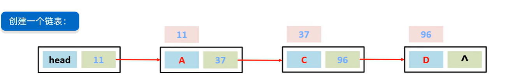
链表中的**结点**是**独立**的对象，在内存中是**不连续**的，每个结点包含**数据值**和**下一个结点的地址**。
**查询慢**，无论查询哪个数据都要从头开始找
**增删相对快**，只需要改变增删位置处前后两个结点的地址值即可 
**单向链表和双向链表** 
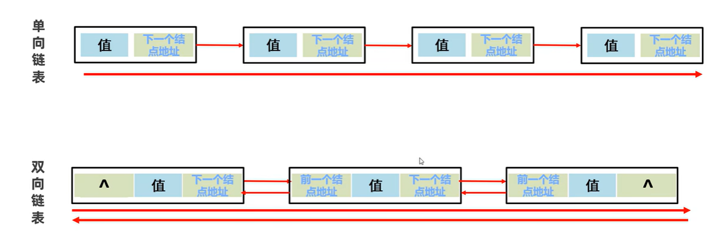

还有一种**循环链表**：顾名思义，就是链表首尾相连。循环链表可以用来解决约瑟夫环问题。

## 树

[二叉树、二叉查找树、平衡二叉树](https://www.bilibili.com/video/BV17F411T7Ao/?p=194&spm_id_from=pageDriver&vd_source=6ef187124c74c452a2016ded88292617) 
树
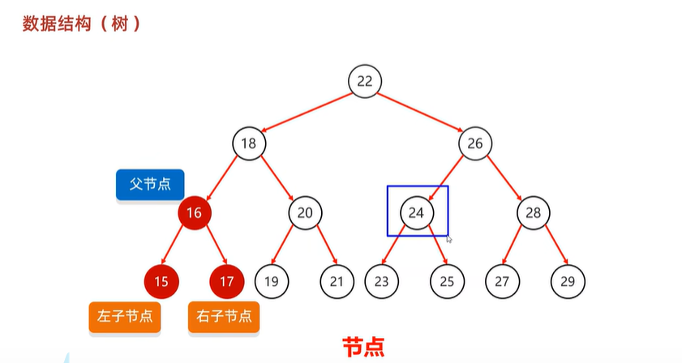
树的节点
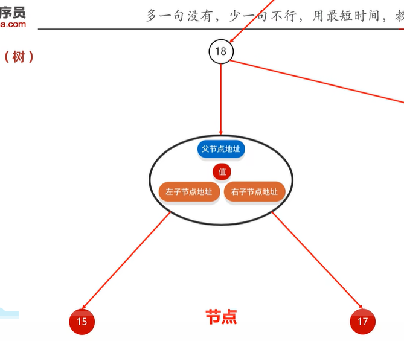
**度**：每个节点的子节点的数量
**二叉树**：任意节点的度<=2
**树高**：树的总层数
**根节点**：最顶层的节点
**左子节点**：左下方的节点
**右子节点**：右下方的节点
**左子树**：左边的子节点及其子节点
**右子树**：右边的子节点及其子节点
普通二叉树的数据存储没有要求，查找时效率差，所以推出二叉查找树

### 二叉查找树
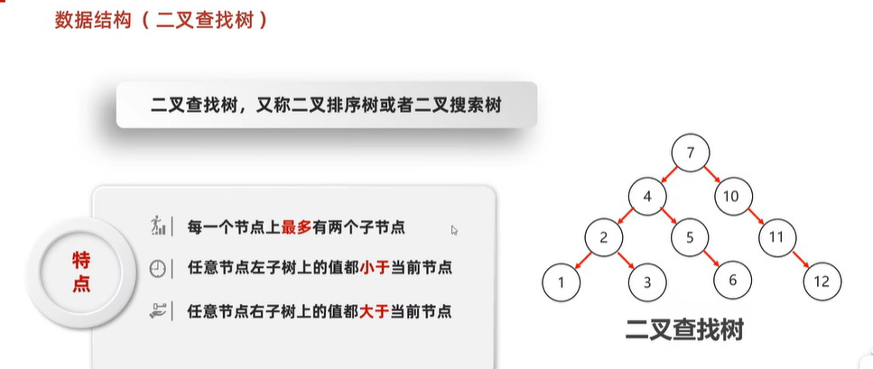
添加节点的规则：**小的存左边、大的存右边、一样的不存** 
查找规则：跟添加节点一样  查找效率更高
弊端：可能导致左右子树高度差太大

### 二叉树的遍历方式
1. 前序遍历：当前节点，左子节点，右子节点
2. **中序遍历**：左子节点，当前节点，右子节点  （二叉查找树遍历出来从小到大）
3. 后序遍历：左子节点，右子节点，当前节点
4. 层序遍历：一层一层的去遍历
### 平衡二叉树
解决二叉查找树的弊端
规则：**任意**节点左右子树高度差**不超过1** 
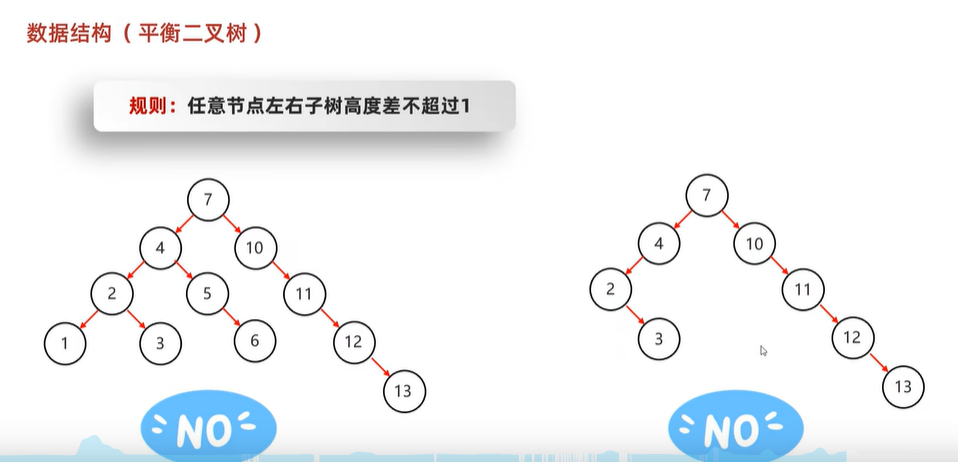
上图两个树都不是平衡二叉树，不满足任意节点

#### 平衡二叉树旋转机制
[平衡二叉树旋转机制](https://www.bilibili.com/video/BV17F411T7Ao/?p=195&spm_id_from=pageDriver&vd_source=6ef187124c74c452a2016ded88292617) 
左旋、右旋
**只有在添加的节点破坏平衡二叉树的平衡时才触发机制** 
**左旋机制**：
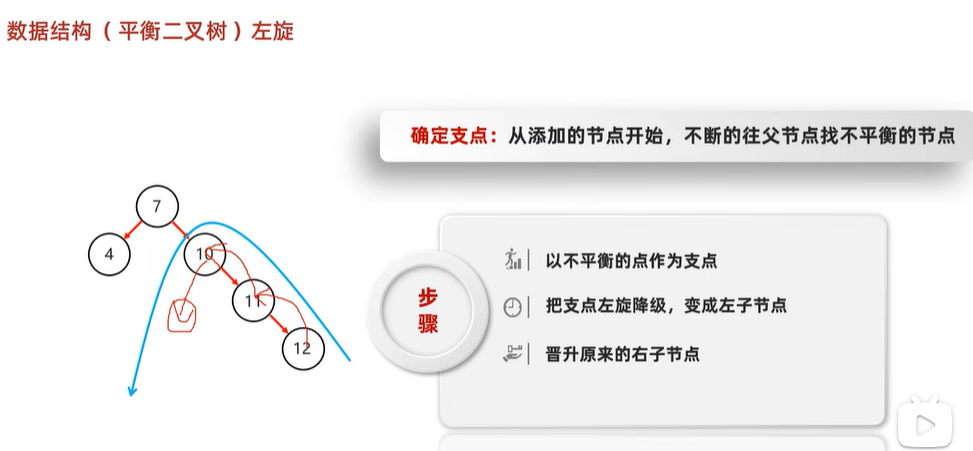
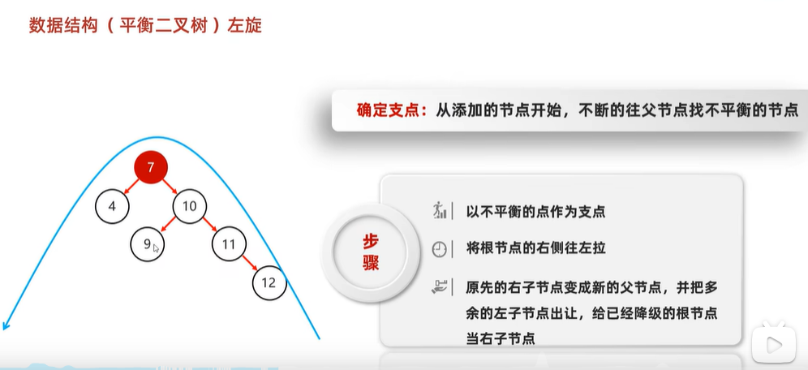
**右旋机制**：(与左旋相反)
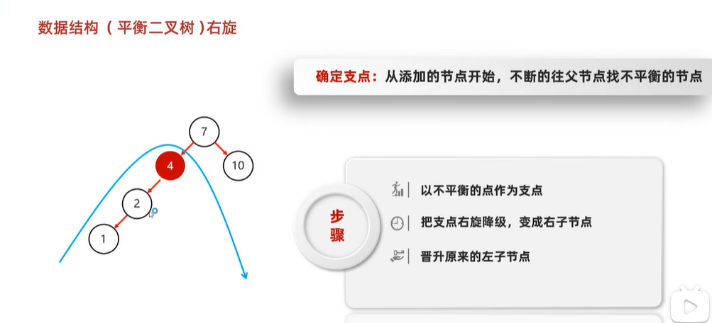
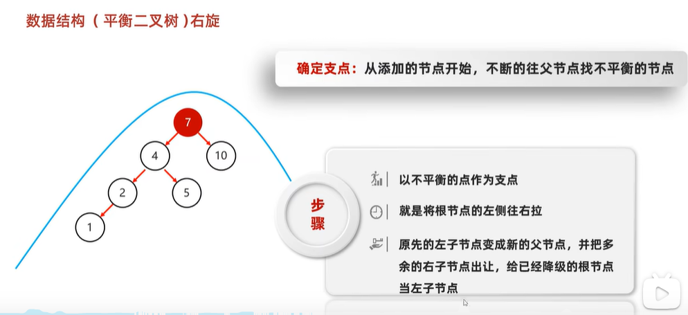

#### 平衡二叉树需要旋转的四种情况
1. 左左(根节点的左子树的左节点添加节点时)：一次右旋
2. 左右(根节点的左子树的右节点添加节点时)：先局部左旋，再整体右旋
3. 右右(根节点的右子树的右节点添加节点时)：一次左旋
4. 右左(根节点的右子树的左节点添加节点时)：先局部右旋，再整体左旋
### 红黑树
[红黑树、红黑规则、添加节点方案详解](https://www.bilibili.com/video/BV17F411T7Ao?p=196&vd_source=6ef187124c74c452a2016ded88292617) 
平衡二叉树添加节点时要经常旋转，效率较低，所以推出红黑树
是一个**特殊的二叉查找树**，但不是高度平衡的，满足特有的红黑规则
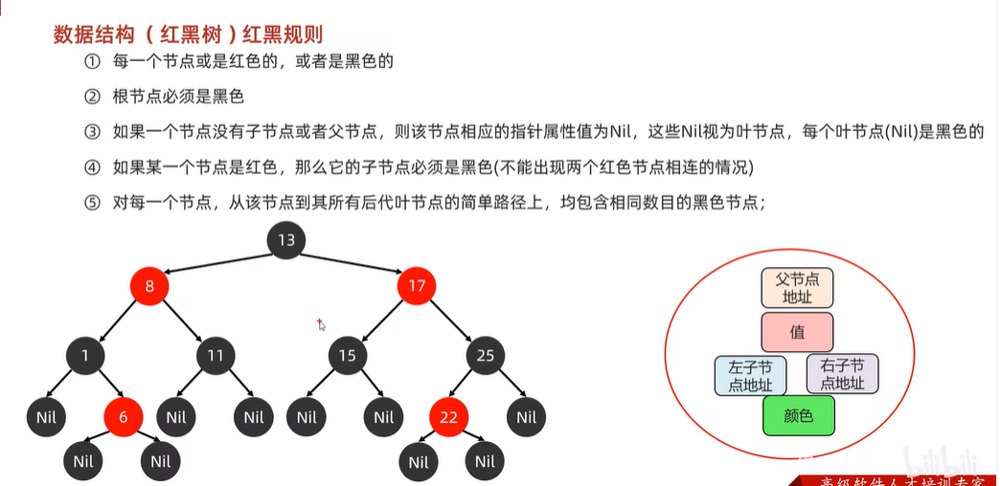

#### 红黑规则
数据结构（红黑树)红黑规则：
1. 每一个节点或是红色的，或者是黑色的
2. **根节点必须是黑色**
3. 如果一个节点没有子节点或者父节点，则该节点相应的指针属性值为 **Nil** ，这些 Nil 视为**叶节点**，每个叶节点(Nil)是黑色的
4. 如果某一个节点是红色，那么它的子节点必须是黑色(**不能出现两个红色节点相连**的情况)
5. **对每一个节点，从该节点到其所有后代叶节点的简单路径上，均包含相同数目的黑色节点** 
#### 红黑树添加节点的规则
红黑树在添加节点的时候，默认节点是**红色**的
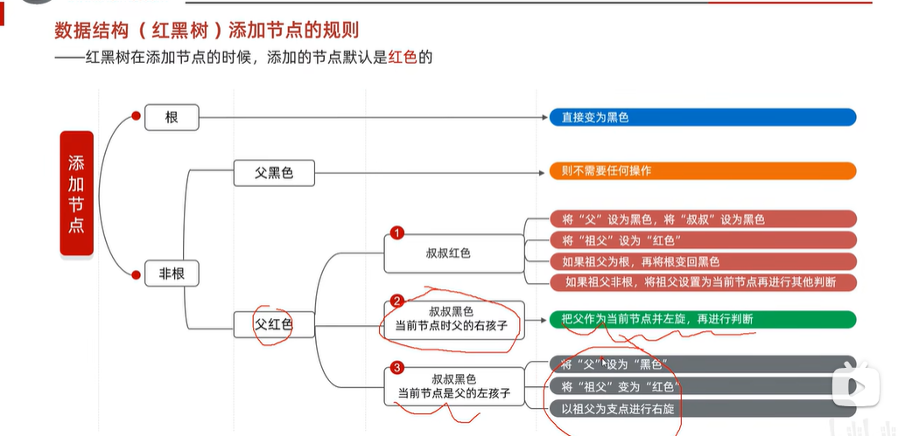

# 集合体系结构

 

## 说说 List, Set, Queue, Map 四者的区别？

- `List`(对付顺序的好帮手): 存储的元素是有序的、可重复的。
- `Set`(注重独一无二的性质): 存储的元素不可重复的。
- `Queue`(实现排队功能的叫号机): 按特定的排队规则来确定先后顺序，存储的元素是有序的、可重复的。
- `Map`(用 key 来搜索的专家): 使用键值对（key-value）存储，类似于数学上的函数 y=f(x)，"x" 代表 key，"y" 代表 value，key 是无序的、不可重复的，value 是无序的、可重复的，每个键最多映射到一个值。

## 单列集合体系结构


List集合：

一般是不会使用到 `LinkedList` 的，需要用到 `LinkedList` 的场景几乎都可以使用 `ArrayList` 来代替，并且，性能通常会更好！

- `ArrayList`底层：`Object[]` 动态数组、

- `Vector`：`Object[]` 数组。

- `LinkedList`底层：双向链表(JDK1.6 之前为循环链表，JDK1.7 取消了循环)  ； `LinkedList`增删不一定快

Set集合：

- `HashSet`底层(无序，唯一)：哈希表   重写**hashCode()+equals()**确保不重复、**基于 `HashMap` 实现**的，底层采用 `HashMap` 来保存元素。
- `TreeSet`底层(有序，唯一)：红黑树(自平衡的排序二叉树)   **可排序**：**Comparable接口 或 Comparator比较器对象** 指定排序规则、
- `LinkedHashSet`底层：哈希表+双链表  **存取有序**、 `LinkedHashSet` 是 `HashSet` 的子类，并且其内部是通过 `LinkedHashMap` 来实现的。

Queue队列：

- `PriorityQueue`:  `Object[]` 数组来实现**小顶堆**。
- `DelayQueue`:  `PriorityQueue`。
- `ArrayDeque`:  可扩容动态双向数组。

*List系列集合*：添加的元素是  **有序、可重复、有索引** 
*Set系列集合*：添加的元素是  **无序、不重复、无索引** 
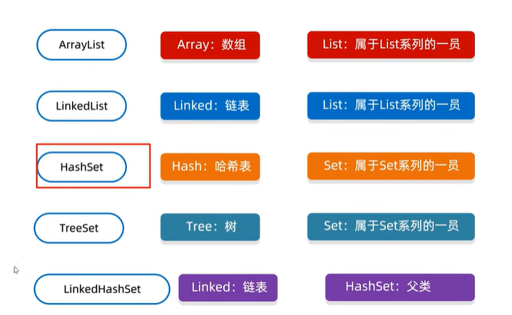
`Vector` 已经不用了
第一列名字、第二列底层数据结构、第三列属于的类型

## 双列集合体系结构


Map集合(**键不可重复：put()方法会覆盖**)：

- `HashMap`底层：哈希表    重写**hashCode()+equals()**确保不重复

- `TreeMap`底层：红黑树    **可排序**(对键进行排序)：**Comparable接口 或 Comparator比较器对象** 指定排序规则

- `LinkedHashMap`底层：哈希表+双链表    **存取有序**、`LinkedHashMap` 继承自 `HashMap`，所以它的底层仍然是基于拉链式散列结构即由数组和链表或红黑树组成，在上面结构的基础上，增加了一条双向链表。

- `Hashtable`：数组+链表组成的，数组是 `Hashtable` 的主体，链表则是主要为了解决哈希冲突而存在的。


# 单列集合-Collection: List + Set (+ Queue)

## Collection
### Collection 的基本方法

`coll.add("aaa")`
`coll.clear()`
`coll.remove("aaa")`
`coll.contains("aaa")` --- 底层是依赖equals方法来判断对象是否是一致的。如果存的是自定义对象，那么要重写equals方法。
`coll.isEmpty()`
`coll.size()`

### Collection 的 toArray()方法 ✅

**使用 集合转数组 的方法，必须使用集合的 `toArray(T[] array)`，传入的是类型完全一致、长度为 0 的空数组。**

`toArray(T[] array)` 方法的参数是一个泛型数组，如果 `toArray` 方法中没有传递任何参数的话返回的是 `Object`类 型数组。

```Java
String [] s= new String[]{
    "dog", "lazy", "a", "over", "jumps", "fox", "brown", "quick", "A"
};
List<String> list = Arrays.asList(s);
Collections.reverse(list);
//没有指定类型的话会报错
s=list.toArray(new String[0]);
```

由于 JVM 优化，`new String[0]`作为`Collection.toArray()`方法的参数现在使用更好，`new String[0]`就是起一个模板的作用，指定了返回数组的类型，0 是为了节省空间，因为它只是为了说明返回的类型。

### Coolection的三种遍历方式  ✅
Collection 是共性接口，元素没有索引，所以不能简单的用for循环遍历。
三种遍历方式：迭代器遍历、增强for遍历、Lambda表达式遍历

#### 迭代器遍历-iterator
迭代器不依赖索引，迭代器在java中的类是 `iterator` ，迭代器是集合专用的遍历方式。
```Java
Iterator<String> it = coll.iterator();  // 获取迭代器对象
While(it.hasNext()){   // 利用循环不断去获取集合中的每一个元素 hasNext()判断当前位置是否有元素，返回true和false
	String str = it.next();   // next()方法：获取元素并移动指针
	System.out.println(str);
}
```
细节注意点:
1. 遍历到最后一位后，继续next()，会报错NoSuchElementException

2. 迭代器遍历完毕，**指针不会复位**

3. **循环中只能用一次next方法**

4. **迭代器遍历时，不能用集合的方法进行增加或者删除，可用迭代器提供的删除方法 `it.remove()`** 

   > 为什么不能使用集合的方法进行增删？
   >
   > 因为：Iterator 是工作在**一个独立的线程中，并且拥有一个 mutex 锁**。 Iterator 被创建之后会建立一个指向原来对象的<u>单链索引表</u>，当原来的对象数量发生变化时，这个索引表的内容不会同步改变，所以当索引指针往后移动的时候就找不到要迭代的对象，所以按照 fail-fast 原则 Iterator 会马上抛出`java.util.ConcurrentModificationException`异常。
   >
   > 所以 `Iterator` 在工作的时候是**不允许被迭代的对象被改变**的。但你可以使用 `Iterator` 本身的方法`remove()`来删除对象，`Iterator.remove()` 方法会在删除当前迭代对象的同时维护索引的一致性。
#### 增强for遍历
增强for遍历的底层就是**迭代器**
所有的**单列集合和数组**才能用增强for进行遍历 (即 双列集合不能用增强for进行遍历)

**不要在 foreach 循环里进行元素的 `remove/add` 操作。remove 元素请使用 `Iterator` 方式，如果并发操作，需要对 `Iterator` 对象加锁。** 

格式：
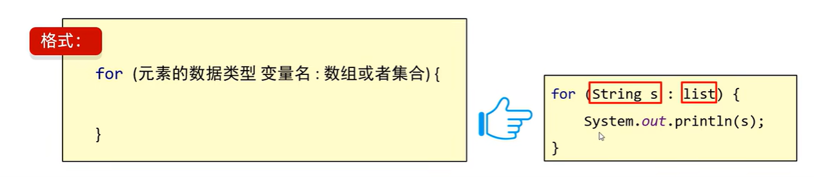
s其实就是一个第三方变量，在循环的过程中依次表示集合中的每一个数据。
**修改s变量，不会改变集合中原本的数据**。s只是第三方变量。

#### Lambda表达式遍历

```Java
// 匿名内部类的形式
coll.forEach(new Consumer<String>(){
    @Override
    public void accept(String s){
    	System.out.println(s);
	}
});
// Lambda表达式形式
coll.forEach((String s) -> {
	System.out.println(s);
});
// Lambda简化形式
coll.forEach(s -> System.out.println(s));
```

## List
*List系列集合*：添加的元素是  **有序、可重复、有索引** 

### List 带索引基本方法

比 `Collection` **多了 `Set()`  `get()` 方法**。因为有 索引 。

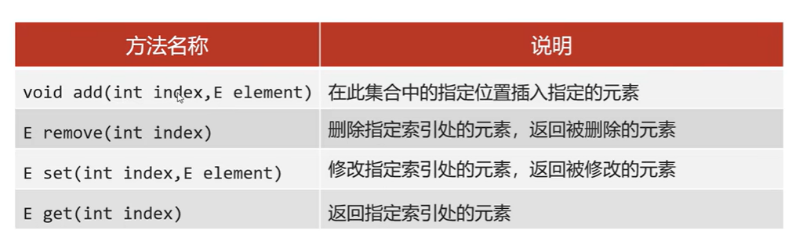
Collection的基本方法List都继承了
List集合因为有索引，所以多了很多索引操作的方法
`list.add(1,"zzz")`  --- 在指定位置插入指定元素，原来索引处的元素会依次往后移
`list.remove(0)` --- 删除指定位置元素，返回被删除的元素
**注意**：  优先调用，实参跟形参类型一致的那个方法。

```Java
//List系列集合中的两个删除的方法  
//1.直接删除元素  
//2.通过索引进行删除  
  
//1.创建集合并添加元素  
List<Integer> list = new ArrayList<>();  
list.add(1);  
list.add(2);  
list.add(3);  
//2.删除元素  
//请问：此时删除的是1这个元素，还是1索引上的元素？  
//为什么？  
//因为在调用方法的时候，如果方法出现了重载现象  
//优先调用，实参跟形参类型一致的那个方法。  元素1是Integer 索引1是int
list.remove(1);  // 删除的1索引上的元素

//手动装箱，手动把基本数据类型的1，变成Integer类型  
Integer i = Integer.valueOf(1);  
list.remove(i);  // 此时删除的是元素1
System.out.println(list);
```
`list.set(0,"qqq")` --- 修改指定位置元素，返回被修改的元素
`list.get(0)` --- 返回指定索引处元素

### List 五种遍历方式
迭代器遍历、列表迭代器遍历、增强for循环遍历、Lambda表达式遍历、普通for循环遍历(因为List有索引)
```Java
 /*  
     List系列集合的五种遍历方式：  
         1.迭代器  
         2.列表迭代器  
         3.增强for  
         4.Lambda表达式  
         5.普通for循环  
  */  
  
 //创建集合并添加元素  
 List<String> list = new ArrayList<>();  
 list.add("aaa");  
 list.add("bbb");  
 list.add("ccc");  
  
 //1.迭代器  
 Iterator<String> it = list.iterator();  
 while(it.hasNext()){     
	 String str = it.next();     
	 System.out.println(str); 
 }
 
 //2.增强for  
 //下面的变量s，其实就是一个第三方的变量而已。  
 //在循环的过程中，依次表示集合中的每一个元素  
for (String s : list) {  
     System.out.println(s);
} 
     
 //3.Lambda表达式  
 //forEach方法的底层其实就是一个循环遍历，依次得到集合中的每一个元素  
 //并把每一个元素传递给下面的accept方法  
 //accept方法的形参s，依次表示集合中的每一个元素  
 list.forEach(s->System.out.println(s) );  
  
 //4.普通for循环  
 //size方法跟get方法还有循环结合的方式，利用索引获取到集合中的每一个元素  
for (int i = 0; i < list.size(); i++) {  
     //i:依次表示集合中的每一个索引  
     String s = list.get(i);     
     System.out.println(s); 
}

 // 5.列表迭代器  
 //获取一个列表迭代器的对象，里面的指针默认也是指向0索引的  
 //额外添加了一个方法：在遍历的过程中，可以添加元素  
 ListIterator<String> it = list.listIterator();  
 while(it.hasNext()){  
     String str = it.next();  
     if("bbb".equals(str)){  
         //qqq  
         it.add("qqq");  // 迭代器的添加方法  不能用集合的添加方法
     }  
 }  
 System.out.println(list);
```
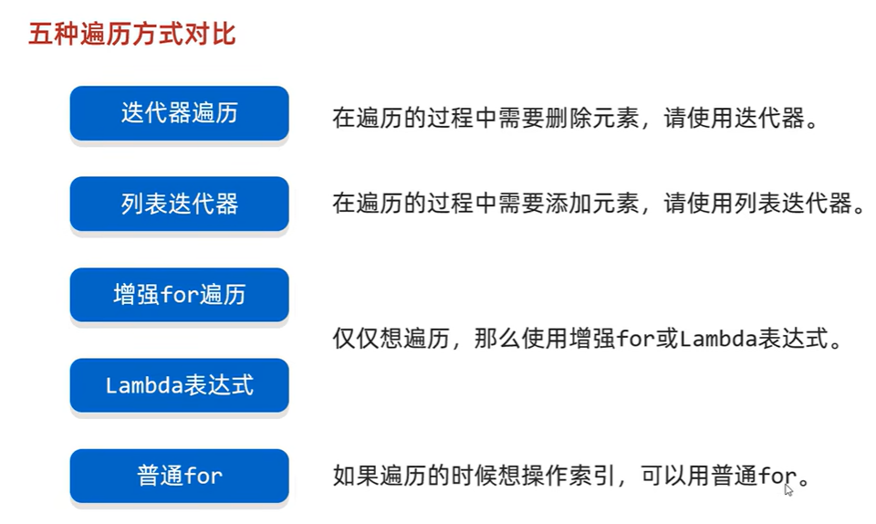

### ArraryList ✅

#### ArrayList 集合简介

ArraryList 实现 List集合接口，继承了List的各方法。 底层原理是数组队列，相当于 **动态数组** 。与 Java 中的数组相比，它的容量能动态增长。在添加大量元素前，应用程序可以使用**`ensureCapacity`操作**来增加 `ArrayList` 实例的容量。这可以减少递增式再分配的数量。

`ArrayList` 继承于 `AbstractList` ，实现了 `List`, `RandomAccess`, `Cloneable`, `java.io.Serializable` 这些接口。

```java

public class ArrayList<E> extends AbstractList<E>
        implements List<E>, RandomAccess, Cloneable, java.io.Serializable{
  }
```

- `List` : 表明它是一个**列表**，支持添加、删除、查找等操作，并且可以通过下标进行访问
- `RandomAccess` ：这是一个标志接口，表明实现这个接口的 `List` 集合是支持 **快速随机访问** 的。在 `ArrayList` 中，我们即可以通过元素的序号快速获取元素对象，这就是快速随机访问。
- `Cloneable` ：表明它具有**拷贝**能力，可以进行深拷贝或浅拷贝操作。
- `Serializable` : 表明它可以进行**序列化操作**，也就是可以将对象转换为字节流进行持久化存储或网络传输，非常方便。

 

#### ArrayList 可以添加 null (不推荐)

`ArrayList` 中**可以存储任何类型的对象**，**包括 `null` 值**。不过，**不建议**向`ArrayList` 中添加 `null` 值， `null` 值无意义，会让代码难以维护比如忘记做判空处理就会导致空指针异常。

示例代码：

```java
ArrayList<String> listOfStrings = new ArrayList<>();
listOfStrings.add(null);
listOfStrings.add("java");
System.out.println(listOfStrings);
```

输出：

```plain
[null, java]
```

#### ArrayList 与 LinkedList 区别  ✅

- **是否保证线程安全：** `ArrayList` 和 `LinkedList` 都是不同步的，也就是不保证线程安全；

- **底层数据结构：** `ArrayList` 底层使用的是 **`Object` 数组**；`LinkedList` 底层使用的是 **双向链表** 数据结构（JDK1.6 之前为循环链表，JDK1.7 取消了循环。注意双向链表和双向循环链表的区别，下面有介绍到！）

- **插入和删除是否受元素位置的影响：**
  - `ArrayList` 采用数组存储，所以插入和删除元素的时间复杂度受元素位置的影响。 比如：执行`add(E e)`方法的时候， `ArrayList` 会默认在将指定的元素追加到此列表的末尾，这种情况时间复杂度就是 O(1)。但是如果要在指定位置 i 插入和删除元素的话（`add(int index, E element)`），时间复杂度就为 O(n)。因为在进行上述操作的时候集合中第 i 和第 i 个元素之后的(n-i)个元素都要执行向后位/向前移一位的操作。
  - `LinkedList` 采用链表存储，所以在头尾插入或者删除元素不受元素位置的影响（`add(E e)`、`addFirst(E e)`、`addLast(E e)`、`removeFirst()`、 `removeLast()`），时间复杂度为 O(1)，如果是要在指定位置 `i` 插入和删除元素的话（`add(int index, E element)`，`remove(Object o)`,`remove(int index)`）， 时间复杂度为 O(n) ，因为需要先移动到指定位置再插入和删除。

- **是否支持快速随机访问：** `LinkedList` 不支持高效的随机元素访问，而 `ArrayList`（实现了 `RandomAccess` 接口） 支持。快速随机访问就是通过元素的序号快速获取元素对象(对应于`get(int index)`方法)。

- **内存空间占用：** `ArrayList` 的空间浪费主要体现在 list 列表的结尾会预留一定的容量空间，而 `LinkedList` 的空间花费则体现在它的每一个元素都需要消耗比 ArrayList 更多的空间（因为要存放直接后继和直接前驱以及数据）。

#### ArrayList 底层源码解读  ✅

[黑马视频：ArraryList集合底层原理](https://www.bilibili.com/video/BV17F411T7Ao/?p=190&spm_id_from=pageDriver&vd_source=6ef187124c74c452a2016ded88292617)           [JavaGuide：ArrayList 详解](https://javaguide.cn/java/collection/arraylist-source-code.html)  

这里以 JDK1.8 为例，分析一下 `ArrayList` 的底层源码。 

```Java
public class ArrayList<E> extends AbstractList<E>
        implements List<E>, RandomAccess, Cloneable, java.io.Serializable {
    private static final long serialVersionUID = 8683452581122892189L;

    /**
     * 默认初始容量大小
     */
    private static final int DEFAULT_CAPACITY = 10;

    /**
     * 空数组（用于空实例）。
     */
    private static final Object[] EMPTY_ELEMENTDATA = {};

    //用于默认大小空实例的共享空数组实例。
    //我们把它从EMPTY_ELEMENTDATA数组中区分出来，以知道在添加第一个元素时容量需要增加多少。
    private static final Object[] DEFAULTCAPACITY_EMPTY_ELEMENTDATA = {};

    /**
     * 保存ArrayList数据的数组
     */
    transient Object[] elementData; // non-private to simplify nested class access

    /**
     * ArrayList 所包含的元素个数
     */
    private int size;

    /**
     * 带初始容量参数的构造函数（用户可以在创建ArrayList对象时自己指定集合的初始大小）
     */
    public ArrayList(int initialCapacity) {
        if (initialCapacity > 0) {
            //如果传入的参数大于0，创建initialCapacity大小的数组
            this.elementData = new Object[initialCapacity];
        } else if (initialCapacity == 0) {
            //如果传入的参数等于0，创建空数组
            this.elementData = EMPTY_ELEMENTDATA;
        } else {
            //其他情况，抛出异常
            throw new IllegalArgumentException("Illegal Capacity: " +
                    initialCapacity);
        }
    }

    /**
     * 默认无参构造函数
     * DEFAULTCAPACITY_EMPTY_ELEMENTDATA 为0.初始化为10，也就是说初始其实是空数组 当添加第一个元素的时候数组容量才变成10
     */
    public ArrayList() {
        this.elementData = DEFAULTCAPACITY_EMPTY_ELEMENTDATA;
    }

    /**
     * 构造一个包含指定集合的元素的列表，按照它们由集合的迭代器返回的顺序。
     */
    public ArrayList(Collection<? extends E> c) {
        //将指定集合转换为数组
        elementData = c.toArray();
        //如果elementData数组的长度不为0
        if ((size = elementData.length) != 0) {
            // 如果elementData不是Object类型数据（c.toArray可能返回的不是Object类型的数组所以加上下面的语句用于判断）
            if (elementData.getClass() != Object[].class)
                //将原来不是Object类型的elementData数组的内容，赋值给新的Object类型的elementData数组
                elementData = Arrays.copyOf(elementData, size, Object[].class);
        } else {
            // 其他情况，用空数组代替
            this.elementData = EMPTY_ELEMENTDATA;
        }
    }

    /**
     * 修改这个ArrayList实例的容量是列表的当前大小。 应用程序可以使用此操作来最小化ArrayList实例的存储。
     */
    public void trimToSize() {
        modCount++;
        if (size < elementData.length) {
            elementData = (size == 0)
                    ? EMPTY_ELEMENTDATA
                    : Arrays.copyOf(elementData, size);
        }
    }
//下面是ArrayList的扩容机制
//ArrayList的扩容机制提高了性能，如果每次只扩充一个，
//那么频繁的插入会导致频繁的拷贝，降低性能，而ArrayList的扩容机制避免了这种情况。

    /**
     * 如有必要，增加此ArrayList实例的容量，以确保它至少能容纳元素的数量
     *
     * @param minCapacity 所需的最小容量
     */
    public void ensureCapacity(int minCapacity) {
        //如果是true，minExpand的值为0，如果是false,minExpand的值为10
        int minExpand = (elementData != DEFAULTCAPACITY_EMPTY_ELEMENTDATA)
                // any size if not default element table
                ? 0
                // larger than default for default empty table. It's already
                // supposed to be at default size.
                : DEFAULT_CAPACITY;
        //如果最小容量大于已有的最大容量
        if (minCapacity > minExpand) {
            ensureExplicitCapacity(minCapacity);
        }
    }

    // 根据给定的最小容量和当前数组元素来计算所需容量。
    private static int calculateCapacity(Object[] elementData, int minCapacity) {
        // 如果当前数组元素为空数组（初始情况），返回默认容量和最小容量中的较大值作为所需容量
        if (elementData == DEFAULTCAPACITY_EMPTY_ELEMENTDATA) {
            return Math.max(DEFAULT_CAPACITY, minCapacity);
        }
        // 否则直接返回最小容量
        return minCapacity;
    }

    // 确保内部容量达到指定的最小容量。
    private void ensureCapacityInternal(int minCapacity) {
        ensureExplicitCapacity(calculateCapacity(elementData, minCapacity));
    }

    //判断是否需要扩容
    private void ensureExplicitCapacity(int minCapacity) {
        modCount++;
        // overflow-conscious code
        if (minCapacity - elementData.length > 0)
            //调用grow方法进行扩容，调用此方法代表已经开始扩容了
            grow(minCapacity);
    }

    /**
     * 要分配的最大数组大小
     */
    private static final int MAX_ARRAY_SIZE = Integer.MAX_VALUE - 8;

    /**
     * ArrayList扩容的核心方法。
     */
    private void grow(int minCapacity) {
        // oldCapacity为旧容量，newCapacity为新容量
        int oldCapacity = elementData.length;
        //将oldCapacity 右移一位，其效果相当于oldCapacity /2，
        //我们知道位运算的速度远远快于整除运算，整句运算式的结果就是将新容量更新为旧容量的 1.5倍，
        int newCapacity = oldCapacity + (oldCapacity >> 1);
        //然后检查新容量是否大于最小需要容量，若还是小于最小需要容量，那么就把最小需要容量当作数组的新容量，
        if (newCapacity - minCapacity < 0)
            newCapacity = minCapacity;
        //再检查新容量是否超出了ArrayList所定义的最大容量，
        //若超出了，则调用hugeCapacity()来比较minCapacity和 MAX_ARRAY_SIZE，
        //如果minCapacity大于MAX_ARRAY_SIZE，则新容量则为Integer.MAX_VALUE，否则，新容量大小则为 MAX_ARRAY_SIZE。
        if (newCapacity - MAX_ARRAY_SIZE > 0)
            newCapacity = hugeCapacity(minCapacity);
        // minCapacity is usually close to size, so this is a win:
        elementData = Arrays.copyOf(elementData, newCapacity);
    }

    //比较 minCapacity 和 MAX_ARRAY_SIZE
    private static int hugeCapacity(int minCapacity) {
        if (minCapacity < 0) // overflow
            throw new OutOfMemoryError();
        return (minCapacity > MAX_ARRAY_SIZE) ?
                Integer.MAX_VALUE :
                MAX_ARRAY_SIZE;
    }

    /**
     * 返回此列表中的元素数。
     */
    public int size() {
        return size;
    }

    /**
     * 如果此列表不包含元素，则返回 true 。
     */
    public boolean isEmpty() {
        //注意=和==的区别
        return size == 0;
    }

    /**
     * 如果此列表包含指定的元素，则返回true 。
     */
    public boolean contains(Object o) {
        //indexOf()方法：返回此列表中指定元素的首次出现的索引，如果此列表不包含此元素，则为-1
        return indexOf(o) >= 0;
    }

    /**
     * 返回此列表中指定元素的首次出现的索引，如果此列表不包含此元素，则为-1
     */
    public int indexOf(Object o) {
        if (o == null) {
            for (int i = 0; i < size; i++)
                if (elementData[i] == null)
                    return i;
        } else {
            for (int i = 0; i < size; i++)
                //equals()方法比较
                if (o.equals(elementData[i]))
                    return i;
        }
        return -1;
    }

    /**
     * 返回此列表中指定元素的最后一次出现的索引，如果此列表不包含元素，则返回-1。.
     */
    public int lastIndexOf(Object o) {
        if (o == null) {
            for (int i = size - 1; i >= 0; i--)
                if (elementData[i] == null)
                    return i;
        } else {
            for (int i = size - 1; i >= 0; i--)
                if (o.equals(elementData[i]))
                    return i;
        }
        return -1;
    }

    /**
     * 返回此ArrayList实例的 浅拷贝。 （元素本身不被复制。）
     */
    public Object clone() {
        try {
            ArrayList<?> v = (ArrayList<?>) super.clone();
            //Arrays.copyOf功能是实现数组的复制，返回复制后的数组。参数是被复制的数组和复制的长度
            v.elementData = Arrays.copyOf(elementData, size);
            v.modCount = 0;
            return v;
        } catch (CloneNotSupportedException e) {
            // 这不应该发生，因为我们是可以克隆的
            throw new InternalError(e);
        }
    }

    /**
     * 以正确的顺序（从第一个到最后一个元素）返回一个包含此列表中所有元素的数组。
     * 返回的数组将是“安全的”，因为该列表不保留对它的引用。 （换句话说，这个方法必须分配一个新的数组）。
     * 因此，调用者可以自由地修改返回的数组。 此方法充当基于阵列和基于集合的API之间的桥梁。
     */
    public Object[] toArray() {
        return Arrays.copyOf(elementData, size);
    }

    /**
     * 以正确的顺序返回一个包含此列表中所有元素的数组（从第一个到最后一个元素）;
     * 返回的数组的运行时类型是指定数组的运行时类型。 如果列表适合指定的数组，则返回其中。
     * 否则，将为指定数组的运行时类型和此列表的大小分配一个新数组。
     * 如果列表适用于指定的数组，其余空间（即数组的列表数量多于此元素），则紧跟在集合结束后的数组中的元素设置为null 。
     * （这仅在调用者知道列表不包含任何空元素的情况下才能确定列表的长度。）
     */
    @SuppressWarnings("unchecked")
    public <T> T[] toArray(T[] a) {
        if (a.length < size)
            // 新建一个运行时类型的数组，但是ArrayList数组的内容
            return (T[]) Arrays.copyOf(elementData, size, a.getClass());
        //调用System提供的arraycopy()方法实现数组之间的复制
        System.arraycopy(elementData, 0, a, 0, size);
        if (a.length > size)
            a[size] = null;
        return a;
    }

    // Positional Access Operations

    @SuppressWarnings("unchecked")
    E elementData(int index) {
        return (E) elementData[index];
    }

    /**
     * 返回此列表中指定位置的元素。
     */
    public E get(int index) {
        rangeCheck(index);

        return elementData(index);
    }

    /**
     * 用指定的元素替换此列表中指定位置的元素。
     */
    public E set(int index, E element) {
        //对index进行界限检查
        rangeCheck(index);

        E oldValue = elementData(index);
        elementData[index] = element;
        //返回原来在这个位置的元素
        return oldValue;
    }

    /**
     * 将指定的元素追加到此列表的末尾。
     */
    public boolean add(E e) {
        ensureCapacityInternal(size + 1);  // Increments modCount!!
        //这里看到ArrayList添加元素的实质就相当于为数组赋值
        elementData[size++] = e;
        return true;
    }

    /**
     * 在此列表中的指定位置插入指定的元素。
     * 先调用 rangeCheckForAdd 对index进行界限检查；然后调用 ensureCapacityInternal 方法保证capacity足够大；
     * 再将从index开始之后的所有成员后移一个位置；将element插入index位置；最后size加1。
     */
    public void add(int index, E element) {
        rangeCheckForAdd(index);

        ensureCapacityInternal(size + 1);  // Increments modCount!!
        //arraycopy()这个实现数组之间复制的方法一定要看一下，下面就用到了arraycopy()方法实现数组自己复制自己
        System.arraycopy(elementData, index, elementData, index + 1,
                size - index);
        elementData[index] = element;
        size++;
    }

    /**
     * 删除该列表中指定位置的元素。 将任何后续元素移动到左侧（从其索引中减去一个元素）。
     */
    public E remove(int index) {
        rangeCheck(index);

        modCount++;
        E oldValue = elementData(index);

        int numMoved = size - index - 1;
        if (numMoved > 0)
            System.arraycopy(elementData, index + 1, elementData, index,
                    numMoved);
        elementData[--size] = null; // clear to let GC do its work
        //从列表中删除的元素
        return oldValue;
    }

    /**
     * 从列表中删除指定元素的第一个出现（如果存在）。 如果列表不包含该元素，则它不会更改。
     * 返回true，如果此列表包含指定的元素
     */
    public boolean remove(Object o) {
        if (o == null) {
            for (int index = 0; index < size; index++)
                if (elementData[index] == null) {
                    fastRemove(index);
                    return true;
                }
        } else {
            for (int index = 0; index < size; index++)
                if (o.equals(elementData[index])) {
                    fastRemove(index);
                    return true;
                }
        }
        return false;
    }

    /*
     * Private remove method that skips bounds checking and does not
     * return the value removed.
     */
    private void fastRemove(int index) {
        modCount++;
        int numMoved = size - index - 1;
        if (numMoved > 0)
            System.arraycopy(elementData, index + 1, elementData, index,
                    numMoved);
        elementData[--size] = null; // clear to let GC do its work
    }

    /**
     * 从列表中删除所有元素。
     */
    public void clear() {
        modCount++;

        // 把数组中所有的元素的值设为null
        for (int i = 0; i < size; i++)
            elementData[i] = null;

        size = 0;
    }

    /**
     * 按指定集合的Iterator返回的顺序将指定集合中的所有元素追加到此列表的末尾。
     */
    public boolean addAll(Collection<? extends E> c) {
        Object[] a = c.toArray();
        int numNew = a.length;
        ensureCapacityInternal(size + numNew);  // Increments modCount
        System.arraycopy(a, 0, elementData, size, numNew);
        size += numNew;
        return numNew != 0;
    }

    /**
     * 将指定集合中的所有元素插入到此列表中，从指定的位置开始。
     */
    public boolean addAll(int index, Collection<? extends E> c) {
        rangeCheckForAdd(index);

        Object[] a = c.toArray();
        int numNew = a.length;
        ensureCapacityInternal(size + numNew);  // Increments modCount

        int numMoved = size - index;
        if (numMoved > 0)
            System.arraycopy(elementData, index, elementData, index + numNew,
                    numMoved);

        System.arraycopy(a, 0, elementData, index, numNew);
        size += numNew;
        return numNew != 0;
    }

    /**
     * 从此列表中删除所有索引为fromIndex （含）和toIndex之间的元素。
     * 将任何后续元素移动到左侧（减少其索引）。
     */
    protected void removeRange(int fromIndex, int toIndex) {
        modCount++;
        int numMoved = size - toIndex;
        System.arraycopy(elementData, toIndex, elementData, fromIndex,
                numMoved);

        // clear to let GC do its work
        int newSize = size - (toIndex - fromIndex);
        for (int i = newSize; i < size; i++) {
            elementData[i] = null;
        }
        size = newSize;
    }

    /**
     * 检查给定的索引是否在范围内。
     */
    private void rangeCheck(int index) {
        if (index >= size)
            throw new IndexOutOfBoundsException(outOfBoundsMsg(index));
    }

    /**
     * add和addAll使用的rangeCheck的一个版本
     */
    private void rangeCheckForAdd(int index) {
        if (index > size || index < 0)
            throw new IndexOutOfBoundsException(outOfBoundsMsg(index));
    }

    /**
     * 返回IndexOutOfBoundsException细节信息
     */
    private String outOfBoundsMsg(int index) {
        return "Index: " + index + ", Size: " + size;
    }

    /**
     * 从此列表中删除指定集合中包含的所有元素。
     */
    public boolean removeAll(Collection<?> c) {
        Objects.requireNonNull(c);
        //如果此列表被修改则返回true
        return batchRemove(c, false);
    }

    /**
     * 仅保留此列表中包含在指定集合中的元素。
     * 换句话说，从此列表中删除其中不包含在指定集合中的所有元素。
     */
    public boolean retainAll(Collection<?> c) {
        Objects.requireNonNull(c);
        return batchRemove(c, true);
    }


    /**
     * 从列表中的指定位置开始，返回列表中的元素（按正确顺序）的列表迭代器。
     * 指定的索引表示初始调用将返回的第一个元素为next 。 初始调用previous将返回指定索引减1的元素。
     * 返回的列表迭代器是fail-fast 。
     */
    public ListIterator<E> listIterator(int index) {
        if (index < 0 || index > size)
            throw new IndexOutOfBoundsException("Index: " + index);
        return new ListItr(index);
    }

    /**
     * 返回列表中的列表迭代器（按适当的顺序）。
     * 返回的列表迭代器是fail-fast 。
     */
    public ListIterator<E> listIterator() {
        return new ListItr(0);
    }

    /**
     * 以正确的顺序返回该列表中的元素的迭代器。
     * 返回的迭代器是fail-fast 。
     */
    public Iterator<E> iterator() {
        return new Itr();
    }
```

#### ArrayList 扩容机制  ✅

##### ArrayList 扩容机制总述

​		以 **无参** 构造方法创建 `ArrayList` 时，实际上初始化赋值的是一个 **空** 数组。当真正对数组进行添加元素操作时，才真正分配容量。即向数组中**添加第一个**元素时，数组容量扩为 ==**10**==。 

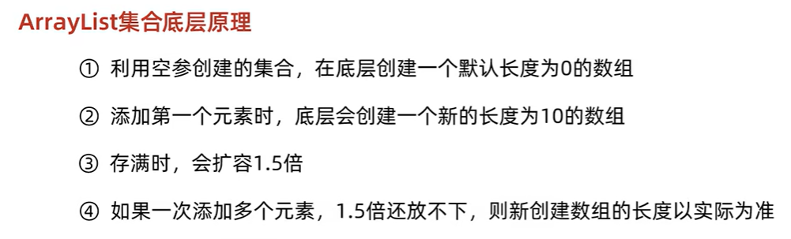

⑤ 检查新容量`newCapacity（扩充1.5倍后的新容量）`是否超出了`ArrayList`所定义的最大容量(`private static final int MAX_ARRAY_SIZE = Integer.MAX_VALUE - 8`)，若超出了，则调用`hugeCapacity()`来比较`minCapacity（数组最小所需容量）`和 `MAX_ARRAY_SIZE`，如果`minCapacity`大于`MAX_ARRAY_SIZE`，则新容量则为`Integer.MAX_VALUE`，否则，新容量大小则为 `MAX_ARRAY_SIZE`。

扩容：**`int newCapacity = oldCapacity + (oldCapacity >> 1)`**    ==**扩容 1.5倍左右**==

ArrayList的扩容底层用到了 **`Arrays.copyOf`实现数组扩容**：新建一个新容量的数组，复制原数组，返回该新数组；频繁扩容非常消耗性能。

##### 先从 ArrayList 的构造函数说起

ArrayList 有三种方式来初始化，构造方法源码如下（JDK8）：

```java
/**
 * 默认初始容量大小
 */
private static final int DEFAULT_CAPACITY = 10;

private static final Object[] DEFAULTCAPACITY_EMPTY_ELEMENTDATA = {};

/**
 * 默认构造函数，使用初始容量10构造一个空列表(无参数构造)
 */
public ArrayList() {
    this.elementData = DEFAULTCAPACITY_EMPTY_ELEMENTDATA;
}

/**
 * 带初始容量参数的构造函数。（用户自己指定容量）
 */
public ArrayList(int initialCapacity) {
    if (initialCapacity > 0) {//初始容量大于0
        //创建initialCapacity大小的数组
        this.elementData = new Object[initialCapacity];
    } else if (initialCapacity == 0) {//初始容量等于0
        //创建空数组
        this.elementData = EMPTY_ELEMENTDATA;
    } else {//初始容量小于0，抛出异常
        throw new IllegalArgumentException("Illegal Capacity: " + initialCapacity);
    }
}

/**
 *构造包含指定collection元素的列表，这些元素利用该集合的迭代器按顺序返回
 *如果指定的集合为null，throws NullPointerException。
 */
public ArrayList(Collection<? extends E> c) {
    elementData = c.toArray();
    if ((size = elementData.length) != 0) {
        // c.toArray might (incorrectly) not return Object[] (see 6260652)
        if (elementData.getClass() != Object[].class)
            elementData = Arrays.copyOf(elementData, size, Object[].class);
    } else {
        // replace with empty array.
        this.elementData = EMPTY_ELEMENTDATA;
    }
}
```

细心的同学一定会发现：**以无参数构造方法创建 `ArrayList` 时，实际上初始化赋值的是一个空数组。当真正对数组进行添加元素操作时，才真正分配容量。即向数组中添加第一个元素时，数组容量扩为 10。** 下面在我们分析 `ArrayList` 扩容时会讲到这一点内容！

> 补充：JDK6 new 无参构造的 `ArrayList` 对象时，直接创建了长度是 10 的 `Object[]` 数组 `elementData` 。

##### 一步一步分析 ArrayList 扩容机制

1. `add()`方法：

```java
/**
* 将指定的元素追加到此列表的末尾。
*/
public boolean add(E e) {
    // 加元素之前，先调用ensureCapacityInternal方法
    ensureCapacityInternal(size + 1);  // Increments modCount!!
    // 这里看到ArrayList添加元素的实质就相当于为数组赋值
    elementData[size++] = e;
    return true;
}
```

**注意**：JDK11 移除了 `ensureCapacityInternal()` 和 `ensureExplicitCapacity()` 方法

`ensureCapacityInternal` 方法的源码如下：

```java
// 根据给定的最小容量和当前数组元素来计算所需容量。
private static int calculateCapacity(Object[] elementData, int minCapacity) {
    // 如果当前数组元素为空数组（初始情况），返回默认容量和最小容量中的较大值作为所需容量
    if (elementData == DEFAULTCAPACITY_EMPTY_ELEMENTDATA) {
        return Math.max(DEFAULT_CAPACITY, minCapacity);
    }
    // 否则直接返回最小容量
    return minCapacity;
}

// 确保内部容量达到指定的最小容量。
private void ensureCapacityInternal(int minCapacity) {
    ensureExplicitCapacity(calculateCapacity(elementData, minCapacity));
}
```

`ensureCapacityInternal` 方法非常简单，内部直接调用了 `ensureExplicitCapacity` 方法：

```java
//判断是否需要扩容
private void ensureExplicitCapacity(int minCapacity) {
    modCount++;
    //判断当前数组容量是否足以存储minCapacity个元素
    if (minCapacity - elementData.length > 0)
        //调用grow方法进行扩容
        grow(minCapacity);
}
```

我们来仔细分析一下：

- 当我们要 `add` 进第 1 个元素到 `ArrayList` 时，`elementData.length` 为 0 （因为还是一个空的 list），因为执行了 `ensureCapacityInternal()` 方法 ，所以 `minCapacity` 此时为 10。此时，`minCapacity - elementData.length > 0`成立，所以会进入 `grow(minCapacity)` 方法。
- 当 `add` 第 2 个元素时，`minCapacity` 为 2，此时 `elementData.length`(容量)在添加第一个元素后扩容成 `10` 了。此时，`minCapacity - elementData.length > 0` 不成立，所以不会进入 （执行）`grow(minCapacity)` 方法。
- 添加第 3、4···到第 10 个元素时，依然不会执行 grow 方法，数组容量都为 10。

直到添加第 11 个元素，`minCapacity`(为 11)比 `elementData.length`（为 10）要大。进入 `grow` 方法进行扩容。

2. `grow` 方法：**扩容** 

```java 
/**
 * 要分配的最大数组大小
 */
private static final int MAX_ARRAY_SIZE = Integer.MAX_VALUE - 8;

/**
 * ArrayList扩容的核心方法。
 */
private void grow(int minCapacity) {
    // oldCapacity为旧容量，newCapacity为新容量
    int oldCapacity = elementData.length;
    // 将oldCapacity 右移一位，其效果相当于oldCapacity /2，
    // 我们知道位运算的速度远远快于整除运算，整句运算式的结果就是将新容量更新为旧容量的1.5倍，
    int newCapacity = oldCapacity + (oldCapacity >> 1);

    // 然后检查新容量是否大于最小需要容量，若还是小于最小需要容量，那么就把最小需要容量当作数组的新容量，
    if (newCapacity - minCapacity < 0)
        newCapacity = minCapacity;

    // 如果新容量大于 MAX_ARRAY_SIZE,进入(执行) `hugeCapacity()` 方法来比较 minCapacity 和 MAX_ARRAY_SIZE，
    // 如果minCapacity大于最大容量，则新容量则为`Integer.MAX_VALUE`，否则，新容量大小则为 MAX_ARRAY_SIZE 即为 `Integer.MAX_VALUE - 8`。
    if (newCapacity - MAX_ARRAY_SIZE > 0)
        newCapacity = hugeCapacity(minCapacity);

    // minCapacity is usually close to size, so this is a win:
    elementData = Arrays.copyOf(elementData, newCapacity);
}
```

**`int newCapacity = oldCapacity + (oldCapacity >> 1)`, 所以 ArrayList 每次扩容之后容量都会变为原来的 1.5 倍左右（oldCapacity 为偶数就是 1.5 倍，否则是 1.5 倍左右）！** 奇偶不同，比如：10+10/2 = 15, 33+33/2=49。如果是奇数的话会丢掉小数.

> ">>"（移位运算符）：>>1 右移一位相当于除 2，右移 n 位相当于除以 2 的 n 次方。这里 oldCapacity 明显右移了 1 位所以相当于 oldCapacity /2。对于大数据的 2 进制运算,位移运算符比那些普通运算符的运算要快很多,因为程序仅仅移动一下而已,不去计算,这样提高了效率,节省了资源

**我们再来通过例子探究一下`grow()` 方法：**

- 当 `add` 第 1 个元素时，`oldCapacity` 为 0，经比较后第一个 if 判断成立，`newCapacity = minCapacity`(为 10)。但是第二个 if 判断不会成立，即 `newCapacity` 不比 `MAX_ARRAY_SIZE` 大，则不会进入 `hugeCapacity` 方法。数组容量为 10，`add` 方法中 return true, size 增为 1。
- 当 `add` 第 11 个元素进入 `grow` 方法时，`newCapacity` 为 15，比 `minCapacity`（为 11）大，第一个 if 判断不成立。新容量没有大于数组最大 size，不会进入 `hugeCapacity` 方法。数组容量扩为 15，add 方法中 return true,size 增为 11。
- 以此类推······

3. `hugeCapacity()` 方法：

​		从上面 `grow()` 方法源码我们知道：如果新容量`newCapacity` 大于 `MAX_ARRAY_SIZE`,进入(执行) `hugeCapacity()` 方法来比较 `minCapacity` 和 `MAX_ARRAY_SIZE`，如果 `minCapacity` 大于最大容量，则新容量则为`Integer.MAX_VALUE`，否则，新容量大小则为 `MAX_ARRAY_SIZE` 即为 `Integer.MAX_VALUE - 8`。

```java
private static int hugeCapacity(int minCapacity) {
    if (minCapacity < 0) // overflow
        throw new OutOfMemoryError();
    // 对minCapacity和MAX_ARRAY_SIZE进行比较
    // 若minCapacity大，将Integer.MAX_VALUE作为新数组的大小
    // 若MAX_ARRAY_SIZE大，将MAX_ARRAY_SIZE作为新数组的大小
    // MAX_ARRAY_SIZE = Integer.MAX_VALUE - 8;
    return (minCapacity > MAX_ARRAY_SIZE) ?
        Integer.MAX_VALUE :
        MAX_ARRAY_SIZE;
}
```

#### `System.arraycopy()` 和 `Arrays.copyOf()`方法

阅读源码的话，我们就会发现 `ArrayList` 中大量调用了这两个方法。比如：我们上面讲的扩容操作以及`add(int index, E element)`、`toArray()` 等方法中都用到了该方法！ 

`System.arraycopy()` 方法

源码：

```java
    // 我们发现 arraycopy 是一个 `native` 方法,接下来我们解释一下各个参数的具体意义
    /**
    *   复制数组
    * @param src 源数组
    * @param srcPos 源数组中的起始位置
    * @param dest 目标数组
    * @param destPos 目标数组中的起始位置
    * @param length 要复制的数组元素的数量
    */
    public static native void arraycopy(Object src,  int  srcPos,
                                        Object dest, int destPos,
                                        int length);
```

场景：

```java
    /**
     * 在此列表中的指定位置插入指定的元素。
     *先调用 rangeCheckForAdd 对index进行界限检查；然后调用 ensureCapacityInternal 方法保证capacity足够大；
     *再将从index开始之后的所有成员后移一个位置；将element插入index位置；最后size加1。
     */
    public void add(int index, E element) {
        rangeCheckForAdd(index);

        ensureCapacityInternal(size + 1);  // Increments modCount!!
        //arraycopy()方法实现数组自己复制自己
        //elementData:源数组;index:源数组中的起始位置;elementData：目标数组；index + 1：目标数组中的起始位置； size - index：要复制的数组元素的数量；
        System.arraycopy(elementData, index, elementData, index + 1, size - index);
        elementData[index] = element;
        size++;
    }
```

我们写一个简单的方法测试以下：

```java
public class ArraycopyTest {

  public static void main(String[] args) {
    // TODO Auto-generated method stub
    int[] a = new int[10];
    a[0] = 0;
    a[1] = 1;
    a[2] = 2;
    a[3] = 3;
    System.arraycopy(a, 2, a, 3, 3);
    a[2]=99;
    for (int i = 0; i < a.length; i++) {
      System.out.print(a[i] + " ");
    }
  }

}
```

结果：

```plain
0 1 99 2 3 0 0 0 0 0
```

`Arrays.copyOf()`方法

源码：

```java
    public static int[] copyOf(int[] original, int newLength) {
      // 申请一个新的数组
        int[] copy = new int[newLength];
  // 调用System.arraycopy,将源数组中的数据进行拷贝,并返回新的数组
        System.arraycopy(original, 0, copy, 0,
                         Math.min(original.length, newLength));
        return copy;
    }
```

场景：

```java
   /**
     以正确的顺序返回一个包含此列表中所有元素的数组（从第一个到最后一个元素）; 返回的数组的运行时类型是指定数组的运行时类型。
     */
    public Object[] toArray() {
    //elementData：要复制的数组；size：要复制的长度
        return Arrays.copyOf(elementData, size);
    }
```

个人觉得使用 `Arrays.copyOf()`方法主要是为了给原有数组扩容，测试代码如下：

```java
public class ArrayscopyOfTest {

  public static void main(String[] args) {
    int[] a = new int[3];
    a[0] = 0;
    a[1] = 1;
    a[2] = 2;
    int[] b = Arrays.copyOf(a, 10);
    System.out.println("b.length"+b.length);
  }
}
```

结果：

```plain
10
```

**两者联系和区别**

**联系：**

看两者源代码可以发现 `copyOf()`内部实际调用了 `System.arraycopy()` 方法

**区别：**

`arraycopy()` 需要目标数组，将原数组拷贝到你自己定义的数组里或者原数组，而且可以选择拷贝的起点和长度以及放入新数组中的位置

 `copyOf()` 是系统自动在内部新建一个数组，并返回该数组。

#### `ensureCapacity`方法

`ArrayList` 源码中有一个 `ensureCapacity` 方法不知道大家注意到没有，这个方法 `ArrayList` 内部没有被调用过，所以很显然是提供给用户调用的，那么这个方法有什么作用呢？

```java 
    /**
    如有必要，增加此 ArrayList 实例的容量，以确保它至少可以容纳由minimum capacity参数指定的元素数。
     *
     * @param   minCapacity   所需的最小容量
     */
    public void ensureCapacity(int minCapacity) {
        int minExpand = (elementData != DEFAULTCAPACITY_EMPTY_ELEMENTDATA)
            // any size if not default element table
            ? 0
            // larger than default for default empty table. It's already
            // supposed to be at default size.
            : DEFAULT_CAPACITY;

        if (minCapacity > minExpand) {
            ensureExplicitCapacity(minCapacity);
        }
    }
```

<u>理论上来说，最好在向 `ArrayList` 添加大量元素之前用 `ensureCapacity` 方法，以减少增量重新分配的次数（即减少扩容的次数，扩容会消耗性能）</u> 

我们通过下面的代码实际测试以下这个方法的效果：

```java
public class EnsureCapacityTest {
  public static void main(String[] args) {
    ArrayList<Object> list = new ArrayList<Object>();
    final int N = 10000000;
    long startTime = System.currentTimeMillis();
    for (int i = 0; i < N; i++) {
      list.add(i);
    }
    long endTime = System.currentTimeMillis();
    System.out.println("使用ensureCapacity方法前："+(endTime - startTime));

  }
}
```

运行结果：

```plain
使用ensureCapacity方法前：2158
```

```java
public class EnsureCapacityTest {
    public static void main(String[] args) {
        ArrayList<Object> list = new ArrayList<Object>();
        final int N = 10000000;
        long startTime1 = System.currentTimeMillis();
        list.ensureCapacity(N);
        for (int i = 0; i < N; i++) {
            list.add(i);
        }
        long endTime1 = System.currentTimeMillis();
        System.out.println("使用ensureCapacity方法后："+(endTime1 - startTime1));
    }
}
```

运行结果：

```plain
使用ensureCapacity方法后：1773
```

通过运行结果，我们可以看出向 `ArrayList` 添加大量元素之前使用`ensureCapacity` 方法可以提升性能。不过，这个性能差距几乎可以忽略不计。而且，实际项目根本也不可能往 `ArrayList` 里面添加这么多元素。

#### ArrayList和Array的区别

`ArrayList` 内部基于**动态数组**实现，比 `Array`（静态数组） 使用起来更加灵活：

- `ArrayList`会根据实际存储的元素动态地**扩容或缩容**，而 `Array` 被创建之后就**不能改变它的长度**了。
- `ArrayList` 允许你**使用泛型**来确保类型安全，`Array` 则不可以。
- `ArrayList` 中**只能存储对象**。对于基本类型数据，需要使用其对应的**包装类**（如 Integer、Double 等）。`Array` 可以直接存储基本类型数据，也可以存储对象。
- `ArrayList` 支持插入、删除、遍历等常见操作，并且提供了丰富的 API 操作方法，比如 `add()`、`remove()`等。`Array` 只是一个固定长度的数组，只能按照下标访问其中的元素，不具备动态添加、删除元素的能力。
- `ArrayList`创建时不需要指定大小，而**`Array`创建时必须指定大小**。

下面是二者使用的简单对比：

`Array`：

```java
 // 初始化一个 String 类型的数组
 String[] stringArr = new String[]{"hello", "world", "!"};
 // 修改数组元素的值
 stringArr[0] = "goodbye";
 System.out.println(Arrays.toString(stringArr));// [goodbye, world, !]
 // 删除数组中的元素，需要手动移动后面的元素
 for (int i = 0; i < stringArr.length - 1; i++) {
     stringArr[i] = stringArr[i + 1];
 }
 stringArr[stringArr.length - 1] = null;
 System.out.println(Arrays.toString(stringArr));// [world, !, null]
```

`ArrayList` ：

```java
// 初始化一个 String 类型的 ArrayList
 ArrayList<String> stringList = new ArrayList<>(Arrays.asList("hello", "world", "!"));
// 添加元素到 ArrayList 中
 stringList.add("goodbye");
 System.out.println(stringList);// [hello, world, !, goodbye]
 // 修改 ArrayList 中的元素
 stringList.set(0, "hi");
 System.out.println(stringList);// [hi, world, !, goodbye]
 // 删除 ArrayList 中的元素
 stringList.remove(0);
 System.out.println(stringList); // [world, !, goodbye]
```

### CopyOnWriteArrayList  ✅

[JavaGuide: CopyOnWriteArrayList 源码分析](https://javaguide.cn/java/collection/copyonwritearraylist-source-code.html) 

#### CopyOnWriteArrayList 简介

在 `Java.util.concurrent`（ **JUC** ）包中

对于大部分业务场景来说，读取操作往往是远大于写入操作的。由于读取操作不会对原有数据进行修改，因此，对于每次读取都进行加锁其实是一种资源浪费。相比之下，我们应该允许多个线程同时访问 `List` 的内部数据，毕竟对于读取操作来说是安全的。这种思路与 `ReentrantReadWriteLock` 读写锁的设计思想非常类似，即读读不互斥、读写互斥、写写互斥（只有读读不互斥）。`CopyOnWriteArrayList` 更进一步地实现了这一思想。为了将读操作性能发挥到极致，`CopyOnWriteArrayList` 中的读取操作是完全无需加锁的。更加厉害的是，写入操作也不会阻塞读取操作，**只有写写才会互斥**。这样一来，读操作的性能就可以大幅度提升。

`CopyOnWriteArrayList` 线程安全的核心在于其采用了 ==**写时复制（Copy-On-Write）**== 的策略，从 `CopyOnWriteArrayList` 的名字就能看出了

> **写时复制（Copy-On-Write）** 的策略: 其核心思想是，如果有多个调用者（callers）同时请求相同资源（如内存或磁盘上的数据存储），他们会共同获取相同的指针指向相同的资源，直到某个调用者试图修改资源的内容时，系统才会真正复制一份<u>专用副本</u>（private copy）给该调用者，而其他调用者所见到的最初的资源仍然保持不变。这过程对其他的调用者都是透明的。此作法主要的优点是如果调用者没有修改该资源，就不会有副本（private copy）被创建，因此多个调用者只是读取操作时可以共享同一份资源。

当需要修改（ `add`，`set`、`remove` 等操作） `CopyOnWriteArrayList` 的内容时，不会直接修改原数组，而是会先<u>创建底层数组的副本( 通过`Arrays.copyOf` 复制底层数组)</u>，对副本数组进行修改，修改完之后再将修改后的数组赋值回去，这样就可以保证写操作不会影响读操作了。

非常适合读多写少的并发场景

不过，写时复制机制并不是银弹，其依然存在一些缺点，下面列举几点：

1. 内存占用：每次写操作都需要复制一份原始数据，会占用额外的内存空间，在数据量比较大的情况下，可能会导致内存资源不足。

2. 写操作开销：每一次写操作都需要复制一份原始数据，然后再进行修改和替换，所以写操作的开销相对较大，在写入比较频繁的场景下，性能可能会受到影响。

3. 数据一致性问题：修改操作不会立即反映到最终结果中，还需要等待复制完成，这可能会导致一定的数据一致性问题。

#### CopyOnWriteArrayList  源码分析

这里以 JDK1.8 为例，分析一下 `CopyOnWriteArrayList` 的底层核心源码。

`CopyOnWriteArrayList` 的类定义如下：

```java
public class CopyOnWriteArrayList<E>
extends Object
implements List<E>, RandomAccess, Cloneable, Serializable
{
  //...
}
```

`CopyOnWriteArrayList` 实现了以下接口：

- `List` : 表明它是一个列表，支持添加、删除、查找等操作，并且可以通过下标进行访问。
- `RandomAccess` ：这是一个标志接口，表明实现这个接口的 `List` 集合是支持 **快速随机访问** 的。
- `Cloneable` ：表明它具有拷贝能力，可以进行深拷贝或浅拷贝操作。
- `Serializable` : 表明它可以进行序列化操作，也就是可以将对象转换为字节流进行持久化存储或网络传输，非常方便。

 

##### 初始化

`CopyOnWriteArrayList` 中有一个无参构造函数和两个有参构造函数。

```java 
// 创建一个空的 CopyOnWriteArrayList
public CopyOnWriteArrayList() {
    setArray(new Object[0]);
}

// 按照集合的迭代器返回的顺序创建一个包含指定集合元素的 CopyOnWriteArrayList
public CopyOnWriteArrayList(Collection<? extends E> c) {
    Object[] elements;
    if (c.getClass() == CopyOnWriteArrayList.class)
        elements = ((CopyOnWriteArrayList<?>)c).getArray();
    else {
        elements = c.toArray();
        // c.toArray might (incorrectly) not return Object[] (see 6260652)
        if (elements.getClass() != Object[].class)
            elements = Arrays.copyOf(elements, elements.length, Object[].class);
    }
    setArray(elements);
}

// 创建一个包含指定数组的副本的列表
public CopyOnWriteArrayList(E[] toCopyIn) {
    setArray(Arrays.copyOf(toCopyIn, toCopyIn.length, Object[].class));
}
```

##### 插入元素(写)

`CopyOnWriteArrayList` 的 `add()`方法有三个版本：

- `add(E e)`：在 `CopyOnWriteArrayList` 的**尾部插入**元素。
- `add(int index, E element)`：在 `CopyOnWriteArrayList` 的**指定位置插入**元素。
- `addIfAbsent(E e)`：如果**指定元素不存在，那么添加该元素**。如果成功添加元素则返回 true。

这里以`add(E e)`为例进行介绍：

```java 
// 插入元素到 CopyOnWriteArrayList 的尾部
public boolean add(E e) {
    final ReentrantLock lock = this.lock;
    // 加锁
    lock.lock();
    try {
        // 获取原来的数组
        Object[] elements = getArray();
        // 原来数组的长度
        int len = elements.length;
        // 创建一个长度+1的新数组，并将原来数组的元素复制给新数组
        Object[] newElements = Arrays.copyOf(elements, len + 1);
        // 元素放在新数组末尾
        newElements[len] = e;
        // array指向新数组
        setArray(newElements);
        return true;
    } finally {
        // 解锁
        lock.unlock();
    }
}
```

从上面的源码可以看出：

- `add`方法内部用到了 **`ReentrantLock` 加锁**，保证了同步，**避免了多线程写的时候会复制出多个副本出来**。锁被`final`修饰保证了锁的内存地址肯定不会被修改，并且，释放锁的逻辑放在 `finally` 中，可以保证锁能被释放。
- `CopyOnWriteArrayList` 通过**复制底层数组**的方式实现写操作，即先创建一个新的数组来容纳新添加的元素，然后在新数组中进行写操作，最后将新数组赋值给底层数组的引用，替换掉旧的数组。这也就证明了我们前面说的：`CopyOnWriteArrayList` 线程安全的核心在于其采用了 **写时复制（Copy-On-Write）** 的策略。
- 每次写操作都需要通过 `Arrays.copyOf` 复制底层数组，时间复杂度是 O(n) 的，且会占用额外的内存空间。因此，`CopyOnWriteArrayList` 适用于读多写少的场景，在写操作不频繁且内存资源充足的情况下，可以提升系统的性能表现。
- `CopyOnWriteArrayList` 中并**没有**类似于 `ArrayList` 的 `grow()` 方法**扩容**的操作。

##### 读取元素(读)

读取操作是基于内部数组 `array` 并没有发生实际的修改，因此在读取操作时不需要进行同步控制和锁操作，可以保证数据的安全性。这种机制下，多个线程可以同时读取列表中的元素。

```java
// 底层数组，只能通过getArray和setArray方法访问
private transient volatile Object[] array;

public E get(int index) {
    return get(getArray(), index);
}

final Object[] getArray() {
    return array;
}

private E get(Object[] a, int index) {
    return (E) a[index];
}
```

不过，`get`方法是**弱一致性**的，在某些情况下可能读到旧的元素值。

`get(int index)`方法是分两步进行的：

1. 通过`getArray()`获取当前数组的引用；
2. 直接从数组中获取下标为 index 的元素。

这个过程并没有加锁，所以在并发环境下可能出现如下情况：

1. 线程 1 调用`get(int index)`方法获取值，内部通过`getArray()`方法获取到了 array 属性值；
2. 线程 2 调用`CopyOnWriteArrayList`的`add`、`set`、`remove` 等修改方法时，内部通过`setArray`方法修改了`array`属性的值；
3. 线程 1 还是从旧的 `array` 数组中取值。

##### size()  获取元素个数

`CopyOnWriteArrayList`中的`array`数组每次复制都刚好能够容纳下所有元素，并不像`ArrayList`那样会预留一定的空间。因此，`CopyOnWriteArrayList`中并没有`size`属性，`CopyOnWriteArrayList`的**底层数组的长度就是元素个数**，因此`size()`方法只要返回数组长度就可以了。

```java
public int size() {
    return getArray().length;
}
```

##### 删除元素

`CopyOnWriteArrayList`删除元素相关的方法一共有 4 个：

1. `remove(int index)`：移除此列表中指定位置上的元素。将任何后续元素向左移动（从它们的索引中减去 1）。
2. `boolean remove(Object o)`：删除此列表中首次出现的指定元素，如果不存在该元素则返回 false。
3. `boolean removeAll(Collection<?> c)`：从此列表中删除指定集合中包含的所有元素。
4. `void clear()`：移除此列表中的所有元素。

这里以`remove(int index)`为例进行介绍：

```Java
public E remove(int index) {
    // 获取可重入锁
    final ReentrantLock lock = this.lock;
    // 加锁
    lock.lock();
    try {
         //获取当前array数组
        Object[] elements = getArray();
        // 获取当前array长度
        int len = elements.length;
        //获取指定索引的元素(旧值)
        E oldValue = get(elements, index);
        int numMoved = len - index - 1;
        // 判断删除的是否是最后一个元素
        if (numMoved == 0)
             // 如果删除的是最后一个元素，直接复制该元素前的所有元素到新的数组
            setArray(Arrays.copyOf(elements, len - 1));
        else {
            // `分段复制`，将index前的元素和index+1后的元素复制到新数组
            // 新数组长度为旧数组长度-1
            Object[] newElements = new Object[len - 1];
            System.arraycopy(elements, 0, newElements, 0, index);
            System.arraycopy(elements, index + 1, newElements, index,
                             numMoved);
            //将新数组赋值给array引用
            setArray(newElements);
        }
        return oldValue;
    } finally {
         // 解锁
        lock.unlock();
    }
}
```

##### 判断元素是否存在

`CopyOnWriteArrayList`提供了两个用于判断指定元素是否在列表中的方法：

- `contains(Object o)`：判断是否包含指定元素。
- `containsAll(Collection<?> c)`：判断是否保证指定集合的全部元素。

```Java
// 判断是否包含指定元素
public boolean contains(Object o) {
    //获取当前array数组
    Object[] elements = getArray();
    //调用 indexOf 尝试查找指定元素，如果返回值大于等于0，则返回true，否则返回false
    return indexOf(o, elements, 0, elements.length) >= 0;
}

// 判断是否保证指定集合的全部元素
public boolean containsAll(Collection<?> c) {
    //获取当前array数组
    Object[] elements = getArray();
    //获取数组长度
    int len = elements.length;
    //遍历指定集合
    for (Object e : c) {
        //循环调用indexOf方法判断，只要有一个没有包含就直接返回false
        if (indexOf(e, elements, 0, len) < 0)
            return false;
    }
    //最后表示全部包含或者制定集合为空集合，那么返回true
    return true;
}
```

#### CopyOnWriteArrayList 常用方法测试

代码：

```java
// 创建一个 CopyOnWriteArrayList 对象
CopyOnWriteArrayList<String> list = new CopyOnWriteArrayList<>();

// 向列表中添加元素
list.add("Java");
list.add("Python");
list.add("C++");
System.out.println("初始列表：" + list);

// 使用 get 方法获取指定位置的元素
System.out.println("列表第二个元素为：" + list.get(1));

// 使用 remove 方法删除指定元素
boolean result = list.remove("C++");
System.out.println("删除结果：" + result);
System.out.println("列表删除元素后为：" + list);

// 使用 set 方法更新指定位置的元素
list.set(1, "Golang");
System.out.println("列表更新后为：" + list);

// 使用 add 方法在指定位置插入元素
list.add(0, "PHP");
System.out.println("列表插入元素后为：" + list);

// 使用 size 方法获取列表大小
System.out.println("列表大小为：" + list.size());

// 使用 removeAll 方法删除指定集合中所有出现的元素
result = list.removeAll(List.of("Java", "Golang"));
System.out.println("批量删除结果：" + result);
System.out.println("列表批量删除元素后为：" + list);

// 使用 clear 方法清空列表中所有元素
list.clear();
System.out.println("列表清空后为：" + list);
```

输出：

```plain
列表更新后为：[Java, Golang]
列表插入元素后为：[PHP, Java, Golang]
列表大小为：3
批量删除结果：true
列表批量删除元素后为：[PHP]
列表清空后为：[]
```

### LinkedList ✅

#### LinkedList 简介 

底层数据结构是**双链表**  

**`LinkedList ` 继承了 List 和 Deque**。除了 **单列集合** 外还可以当作 **双端队列**。

另外，不要下意识地认为 `LinkedList` 作为链表就最适合元素增删的场景。我在上面也说了，`LinkedList` 仅仅在头尾插入或者删除元素的时候时间复杂度近似 O(1)，**其他情况增删元素的平均时间复杂度都是 O(n)**(因为需要先遍历循环到需要增删元素的位置) 

 `LinkedList` 相比于 `List` 特有方法，继承自 `Deque` 。

| **特有方法**  |               说明               |
| :-----------: | :------------------------------: |
| addFirst(E e) |     插入元素到列表开头(队首)     |
| addLast(E e)  |     插入元素到列表末尾(队尾)     |
| removeFirst() |  删除并返回列表第一个(队首)元素  |
| removeLast()  | 删除并返回列表最后一个(队尾)元素 |
|  getFirst()   |   查询返回列表第一个(队首)元素   |
|   getLast()   |  查询返回列表最后一个(队尾)元素  |

源码分析：
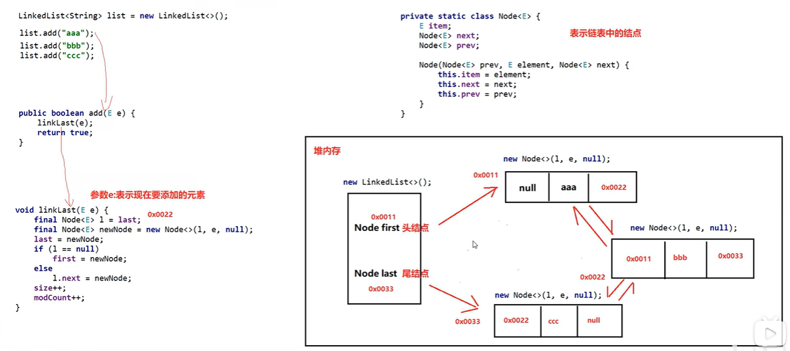

#### LinkedList 为什么不能实现 RandomAccess 接口？

​		`RandomAccess` 是一个**标记接口**，用来表明实现该接口的**类支持随机访问（即可以通过索引快速访问元素）**。由于 `LinkedList` 底层数据结构是**链表**，**内存地址不连续**，**只能通过指针来定位，不支持随机快速访问**，所以不能实现 `RandomAccess` 接口（**虽然像`get(int index)`这种方法提供了索引，但底层其实是遍历链表查找到相应位置的，而不是像数组一样直接通过索引快速访问的**）。而 ArrayList 支持随机快速访问。(实现了`RandomAccess`接口)。

#### LinkedList 底层原理(源码分析)

[JavaGuide: LinkedList 底层源码分析](https://javaguide.cn/java/collection/linkedlist-source-code.html#linkedlist-%E6%BA%90%E7%A0%81%E5%88%86%E6%9E%90) 

这里以 JDK1.8 为例，分析一下 `LinkedList` 的底层核心源码。

`LinkedList` 的类定义如下：

```Java
public class LinkedList<E>
    extends AbstractSequentialList<E>
    implements List<E>, Deque<E>, Cloneable, java.io.Serializable
{
  //...
}
```

- `List` : 表明它是一个列表，支持添加、删除、查找等操作，并且可以通过下标进行访问。
- `Deque` ：**继承自 `Queue` 接口，具有双端队列的特性**，支持从两端插入和删除元素，方便实现栈和队列等数据结构。需要注意，`Deque` 的发音为 "deck" [dɛk]，这个大部分人都会读错。

- `Cloneable` ：表明它具有拷贝能力，可以进行深拷贝或浅拷贝操作。

- `Serializable` : 表明它可以进行序列化操作，也就是可以将对象转换为字节流进行持久化存储或网络传输，非常方便。

 

`LinkedList` 中的元素是通过 `Node` 定义的：可以看出是双链表

```Java
private static class Node<E> {
    E item;// 节点值
    Node<E> next; // 指向的下一个节点（后继节点）
    Node<E> prev; // 指向的前一个节点（前驱结点）

    // 初始化参数顺序分别是：前驱结点、本身节点值、后继节点
    Node(Node<E> prev, E element, Node<E> next) {
        this.item = element;
        this.next = next;
        this.prev = prev;
    }
}
```

##### 初始化

`LinkedList` 中有一个无参构造函数和一个有参构造函数。

```java
// 创建一个空的链表对象
public LinkedList() {
}

// 接收一个集合类型作为参数，会创建一个与传入集合相同元素的链表对象
public LinkedList(Collection<? extends E> c) {
    this();
    addAll(c);
}
```

##### 插入元素

`LinkedList` 除了实现了 `List` 接口相关方法，还实现了 `Deque` 接口的很多方法，所以我们有很多种方式插入元素。

我们这里以 `List` 接口中相关的插入方法为例进行源码讲解，对应的是`add()` 方法。

`add()` 方法有两个版本：

1. `add(E e)`：用于在 `LinkedList` 的**尾部**插入元素，即将新元素作为链表的最后一个元素，时间复杂度为 O(1)。

2. `add(int index, E element)`:用于在**指定位置**插入元素。这种插入方式需要先移动到指定位置，再修改指定节点的指针完成插入/删除，因此需要移动平均 n/2 个元素，时间复杂度为 O(n)。

```Java
// 在链表尾部插入元素
public boolean add(E e) {
    linkLast(e);
    return true;
}

// 在链表指定位置插入元素
public void add(int index, E element) {
    // 下标越界检查
    checkPositionIndex(index);

    // 判断 index 是不是链表尾部位置
    if (index == size)
        // 如果是就直接调用 linkLast 方法将元素节点插入链表尾部即可
        linkLast(element);
    else
        // 如果不是则调用 linkBefore 方法将其插入指定元素之前
        linkBefore(element, node(index));
}

// 将元素节点插入到链表尾部
void linkLast(E e) {
    // 将最后一个元素赋值（引用传递）给节点 l
    final Node<E> l = last;
    // 创建节点，并指定节点前驱为链表尾节点 last，后继引用为空
    final Node<E> newNode = new Node<>(l, e, null);
    // 将 last 引用指向新节点
    last = newNode;
    // 判断尾节点是否为空
    // 如果 l 是null 意味着这是第一次添加元素
    if (l == null)
        // 如果是第一次添加，将first赋值为新节点，此时链表只有一个元素
        first = newNode;
    else
        // 如果不是第一次添加，将新节点赋值给l（添加前的最后一个元素）的next
        l.next = newNode;
    size++;
    modCount++;
}

// 在指定元素之前插入元素
void linkBefore(E e, Node<E> succ) {
    // assert succ != null;断言 succ不为 null
    // 定义一个节点元素保存 succ 的 prev 引用，也就是它的前一节点信息
    final Node<E> pred = succ.prev;
    // 初始化节点，并指明前驱和后继节点
    final Node<E> newNode = new Node<>(pred, e, succ);
    // 将 succ 节点前驱引用 prev 指向新节点
    succ.prev = newNode;
    // 判断尾节点是否为空，为空表示当前链表还没有节点
    if (pred == null)
        first = newNode;
    else
        // succ 节点前驱的后继引用指向新节点
        pred.next = newNode;
    size++;
    modCount++;
}
```

##### 获取元素

`LinkedList`获取元素相关的方法一共有 3 个：

1. `getFirst()`：获取链表的**第一个**元素。

2. `getLast()`：获取链表的**最后一个**元素。

3. `get(int index)`：获取链表**指定位置**的元素。

```java 
// 获取链表的第一个元素
public E getFirst() {
    final Node<E> f = first;
    if (f == null)
        throw new NoSuchElementException();
    return f.item;
}

// 获取链表的最后一个元素
public E getLast() {
    final Node<E> l = last;
    if (l == null)
        throw new NoSuchElementException();
    return l.item;
}

// 获取链表指定位置的元素
public E get(int index) {
  // 下标越界检查，如果越界就抛异常
  checkElementIndex(index);
  // 返回链表中对应下标的元素
  return node(index).item;
}
```

核心在于 **`node(int index)`** 这个方法  返回的是要查找索引index位置的节点

```Java
// 返回指定下标的非空节点
Node<E> node(int index) {
    // 断言下标未越界
    // assert isElementIndex(index);
    // 如果index小于size的二分之一  从前开始查找（向后查找）  反之向前查找
    if (index < (size >> 1)) {
        Node<E> x = first;
        // 遍历，循环向后查找，直至 i == index
        for (int i = 0; i < index; i++)
            x = x.next;
        return x;
    } else {
        Node<E> x = last;
        for (int i = size - 1; i > index; i--)
            x = x.prev;
        return x;
    }
}
```

`get(int index)` 或 `remove(int index)` 等方法内部都调用了该方法来获取对应的节点。从这个方法的源码可以看出，**该方法通过比较索引值与链表 size 的一半大小来确定从链表头还是尾开始遍历**。如果索引值小于 size 的一半，就从链表头开始遍历，反之从链表尾开始遍历。这样可以在较短的时间内找到目标节点，充分利用了双向链表的特性来提高效率。

##### 删除元素

`LinkedList`删除元素相关的方法一共有 5 个：

1. `removeFirst()`：删除并返回链表的**第一个**元素。

2. `removeLast()`：删除并返回链表的**最后一个**元素。

3. `remove(E e)`：删除链表中**首次出现的指定元素**，如果不存在该元素则返回 false。

4. `remove(int index)`：删除**指定索引处**的元素，并返回该元素的值。

5. `void clear()`：移除此链表中的所有元素。

```Java
// 删除并返回链表的第一个元素
public E removeFirst() {
    final Node<E> f = first;
    if (f == null)
        throw new NoSuchElementException();
    return unlinkFirst(f);
}

// 删除并返回链表的最后一个元素
public E removeLast() {
    final Node<E> l = last;
    if (l == null)
        throw new NoSuchElementException();
    return unlinkLast(l);
}

// 删除链表中首次出现的指定元素，如果不存在该元素则返回 false
public boolean remove(Object o) {
    // 如果指定元素为 null，遍历链表找到第一个为 null 的元素进行删除
    if (o == null) {
        for (Node<E> x = first; x != null; x = x.next) {
            if (x.item == null) {
                unlink(x);
                return true;
            }
        }
    } else {
        // 如果不为 null ,遍历链表找到要删除的节点
        for (Node<E> x = first; x != null; x = x.next) {
            if (o.equals(x.item)) {
                unlink(x);
                return true;
            }
        }
    }
    return false;
}

// 删除链表指定位置的元素
public E remove(int index) {
    // 下标越界检查，如果越界就抛异常
    checkElementIndex(index);
    return unlink(node(index));
}
```

核心在于 **`unlink(Node<E> x)`** 这个方法。

```java 
E unlink(Node<E> x) {
    // 断言 x 不为 null
    // assert x != null;
    // 获取当前节点（也就是待删除节点）的元素
    final E element = x.item;
    // 获取当前节点的下一个节点
    final Node<E> next = x.next;
    // 获取当前节点的前一个节点
    final Node<E> prev = x.prev;

    // 如果前一个节点为空，则说明当前节点是头节点
    if (prev == null) {
        // 直接让链表头指向当前节点的下一个节点
        first = next;
    } else { // 如果前一个节点不为空
        // 将前一个节点的 next 指针指向当前节点的下一个节点
        prev.next = next;
        // 将当前节点的 prev 指针置为 null，，方便 GC 回收
        x.prev = null;
    }

    // 如果下一个节点为空，则说明当前节点是尾节点
    if (next == null) {
        // 直接让链表尾指向当前节点的前一个节点
        last = prev;
    } else { // 如果下一个节点不为空
        // 将下一个节点的 prev 指针指向当前节点的前一个节点
        next.prev = prev;
        // 将当前节点的 next 指针置为 null，方便 GC 回收
        x.next = null;
    }

    // 将当前节点元素置为 null，方便 GC 回收
    x.item = null;
    size--;
    modCount++;
    return element;
}
```

`unlink()`逻辑如下:

首先获取待删除节点 x 的前驱和后继节点；

判断待删除节点是否为头节点或尾节点： 

- 如果 x 是头节点，则将 first 指向 x 的后继节点 next
- 如果 x 是尾节点，则将 last 指向 x 的前驱节点 prev
- 如果 x 不是头节点也不是尾节点，执行下一步操作

将待删除节点 x 的前驱的后继指向待删除节点的后继 next，断开 x 和 x.prev 之间的链接；

将待删除节点 x 的后继的前驱指向待删除节点的前驱 prev，断开 x 和 x.next 之间的链接；

将待删除节点 x 的元素置空，修改链表长度。

可以参考下图理解（图源：[LinkedList 源码分析(JDK 1.8)](https://www.tianxiaobo.com/2018/01/31/LinkedList-源码分析-JDK-1-8/)）：

 

##### 遍历链表

推荐使用`for-each` 循环来遍历 `LinkedList` 中的元素， `for-each` 循环最终会转换成**迭代器形式**。增强for循环中 **增删元素要用迭代器的增删方法**

```Java
LinkedList<String> list = new LinkedList<>();
list.add("apple");
list.add("banana");
list.add("pear");

for (String fruit : list) {
    System.out.println(fruit);
}
```

`LinkedList` 的遍历的核心就是它的迭代器的实现。Collection 接口的 **`removeIf` 方法底层就是基于迭代器**。

```java 
// 双向迭代器
private class ListItr implements ListIterator<E> {
    // 表示上一次调用 next() 或 previous() 方法时经过的节点；
    private Node<E> lastReturned;
    // 表示下一个要遍历的节点；
    private Node<E> next;
    // 表示下一个要遍历的节点的下标，也就是当前节点的后继节点的下标；
    private int nextIndex;
    // 表示当前遍历期望的修改计数值，用于和 LinkedList 的 modCount 比较，判断链表是否被其他线程修改过。
    private int expectedModCount = modCount;
    …………
}
```

下面我们对迭代器 `ListItr` 中的核心方法进行详细介绍。

我们先来看下从头到尾方向的迭代：

```java
// 判断还有没有下一个节点
public boolean hasNext() {
    // 判断下一个节点的下标是否小于链表的大小，如果是则表示还有下一个元素可以遍历
    return nextIndex < size;
}
// 获取下一个节点
public E next() {
    // 检查在迭代过程中链表是否被修改过
    checkForComodification();
    // 判断是否还有下一个节点可以遍历，如果没有则抛出 NoSuchElementException 异常
    if (!hasNext())
        throw new NoSuchElementException();
    // 将 lastReturned 指向当前节点
    lastReturned = next;
    // 将 next 指向下一个节点
    next = next.next;
    nextIndex++;
    return lastReturned.item;
}
```

再来看一下从尾到头方向的迭代：

```java
// 判断是否还有前一个节点
public boolean hasPrevious() {
    return nextIndex > 0;
}

// 获取前一个节点
public E previous() {
    // 检查是否在迭代过程中链表被修改
    checkForComodification();
    // 如果没有前一个节点，则抛出异常
    if (!hasPrevious())
        throw new NoSuchElementException();
    // 将 lastReturned 和 next 指针指向上一个节点
    lastReturned = next = (next == null) ? last : next.prev;
    nextIndex--;
    return lastReturned.item;
}
```

如果需要删除或插入元素，也可以使用迭代器进行操作。

```java
LinkedList<String> list = new LinkedList<>();
list.add("apple");
list.add(null);
list.add("banana");

//  Collection 接口的 removeIf 方法底层依然是基于迭代器
list.removeIf(Objects::isNull);

for (String fruit : list) {
    System.out.println(fruit);
}
```

迭代器对应的移除元素的方法如下：

```java
// 从列表中删除上次被返回的元素
public void remove() {
    // 检查是否在迭代过程中链表被修改
    checkForComodification();
    // 如果上次返回的节点为空，则抛出异常
    if (lastReturned == null)
        throw new IllegalStateException();

    // 获取当前节点的下一个节点
    Node<E> lastNext = lastReturned.next;
    // 从链表中删除上次返回的节点
    unlink(lastReturned);
    // 修改指针
    if (next == lastReturned)
        next = lastNext;
    else
        nextIndex--;
    // 将上次返回的节点引用置为 null，方便 GC 回收
    lastReturned = null;
    expectedModCount++;
}
```

#### LinkedList 常用方法

```Java
// 创建 LinkedList 对象
LinkedList<String> list = new LinkedList<>();

// 添加元素到链表末尾
list.add("apple");
list.add("banana");
list.add("pear");
System.out.println("链表内容：" + list);

// 在指定位置插入元素
list.add(1, "orange");
System.out.println("链表内容：" + list);

// 获取指定位置的元素
String fruit = list.get(2);
System.out.println("索引为 2 的元素：" + fruit);  // 索引为 2 的元素：banana

// 修改指定位置的元素
list.set(3, "grape");
System.out.println("链表内容：" + list); // 链表内容：[apple, orange, banana, grape]

// 删除指定位置的元素
list.remove(0);
System.out.println("链表内容：" + list); // 链表内容：[orange, banana, grape]

// 删除第一个出现的指定元素
list.remove("banana");
System.out.println("链表内容：" + list); // 链表内容：[orange, grape]

// 获取链表的长度
int size = list.size();
System.out.println("链表长度：" + size); // 链表长度：2

// 清空链表
list.clear();
System.out.println("清空后的链表：" + list); // 清空后的链表：[]
```

输出：

```plain
索引为 2 的元素：banana
链表内容：[apple, orange, banana, grape]
链表内容：[orange, banana, grape]
链表内容：[orange, grape]
链表长度：2
清空后的链表：[]
```


## 迭代器底层原理

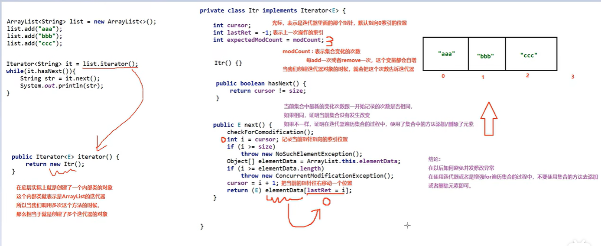
结论:
在以后如何避免并发修改异常，在**使用迭代器或者是增强for遍历集合的过程中，不要使用集合的方法去添加或者删除元素即可**。 

## Set
[Set、HashSet、LinkedHashSet详解](https://www.bilibili.com/video/BV17F411T7Ao?p=197&spm_id_from=pageDriver&vd_source=6ef187124c74c452a2016ded88292617) 
***Set系列集合***：添加的元素是  **无序、不重复、无索引** 
Set接口中的方法上基本上与Collection的API一致。  **相比于 `List` 没有 `get()`  `Set()` 方法**。 因为 没有 索引 也没有 键 。
set集合的实现类：
***HashSet***  ：无序、不重复、无索引
***LinkedHashSet***   ：**有序**、不重复、无索引
***TreeSet***  ：**可排序**、不重复、无索引

```Java
public class A01_SetDemo1 {  
    public static void main(String[] args) {  
       /*  
           利用Set系列的集合，添加字符串，并使用多种方式遍历。  
            迭代器            
            增强for  
            Lambda表达式  
        */                
        //1.创建一个Set集合的对象  
        Set<String> s = new HashSet<>();  
        
        //2,添加元素  
        //如果当前元素是第一次添加，那么可以添加成功，返回true  
        //如果当前元素是第二次添加，那么添加失败，返回false  因为元素不可重复
        s.add("张三");  
        s.add("张三");  
        s.add("李四");  
        s.add("王五");  
  
        //3.打印集合  
        //无序  
        //System.out.println(s);//[李四, 张三, 王五]  
  
        //迭代器遍历  
       /* Iterator<String> it = s.iterator();  
        while (it.hasNext()){            
	        String str = it.next();            
	        System.out.println(str);        
	        }*/  

        //增强for  
       /* for (String str : s) {           
	        System.out.println(str);       
	        }*/  
        
        // Lambda表达式  
        s.forEach( str->System.out.println(str));  
    }  
}
```

### HashSet 
#### 底层原理  (具体可看视频)
**无序、不重复、无索引** 

基于 `HashMap` 实现的，底层采用 `HashMap` 来保存元素。

1. HashSet集合底层数据结构采取**哈希表**存储数据（哈希表是一种对于增删改查数据性能都较好的结构）
    **哈希表的组成**：
    JDK8之前：数组+链表
    JDK8开始：**数组+链表+红黑树** 

2. HashSet添加元素的过程 --- 可看视频
    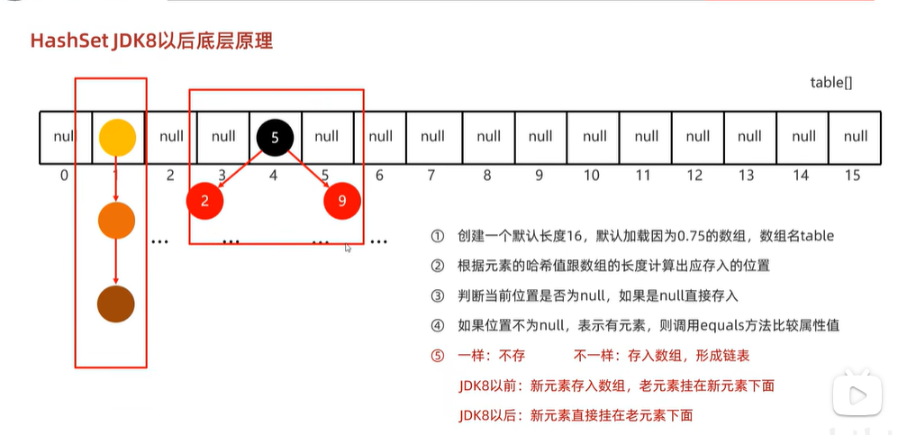

3. HashSet存和取的顺序不同(即无序) --- 元素存的时候根据哈希值确定存的位置，取的时候遍历顺序取

4. HashSet为什么没有索引？(即无索引)--- 存的时候有些元素哈希值一样，新元素会挂靠在老元素下形成链表或红黑树，如果有索引都是一个索引了，所以索性不要索引

5. HashSet利用什么机制保证去重(即不重复) --- hashCode方法和equals方法  同时一样的就不会存入，**所以如果存入的是自定义对象，一定要重写hashCode方法和equals方法** 

   hashCode方法提高了查找效率，降低了查找成本
#### 哈希值
哈希表的关键：哈希值
根据 **hashcode()方法** 算出来的 **int类型的整数** 
该方法定义在Object类中，**所有对象都可以调用**，默认使用**地址值**进行计算 
一般情况下，会**重写**hashCode方法，利用**对象内部的属性值计算哈希值** 

如何重写`hashCode()` 方法：[CSDN：在Java中重写hashCode()方法](https://blog.csdn.net/weixin_44015626/article/details/107120469)  、 [知乎：Java 重写 hashCode 方法总结](https://zhuanlan.zhihu.com/p/85423244)  

例如：

```java
    @Override
    public int hashCode() {
        final int prime = 31;  // 首先为了尽量让产生hashcode保持唯一,所以一定使用一个素数来做系数（这里的31）
        					   // 但为什么是31而不是别的素数呢？
        				       // 因为31属于一个特殊的质数,任何数 乘以 31 就等于 这个数 * 2 的5次方 - 这个数本身;
        					   // n * 31 等价于(n << 5) - n
        int result = 1;
        result = prime * result + ((idCard == null) ? 0 : idCard.hashCode());  // 利用属性值计算 hashcode
        result = prime * result + ((name == null) ? 0 : name.hashCode());
        return result;
    }
```

#### 对象的哈希值特点
如果没有重写hashCode方法，不同对象计算出的哈希值是不同的(因为不同对象的地址值不一样)
如果已经重写hashcode方法，不同的对象只要属性值相同，计算出的哈希值就是一样的
在小部分情况下，不同的属性值或者不同的地址值计算出来的哈希值也有可能一样。（**哈希碰撞**)

总结下来：

1.如果两个对象的`hashCode` 值相等，那这两个对象不一定相等（哈希碰撞）。

2.如果两个对象的`hashCode` 值相等并且`equals()`方法也返回 `true`，我们才认为这两个对象相等。

3.如果两个对象的`hashCode` 值不相等，我们就可以直接认为这两个对象不相等。

**重写 equals() 时必须重写 hashCode() 方法**    `equals` 方法判断两个对象是相等的，那这两个对象的 `hashCode` 值也要相等。

#### HashSet 如何检查重复？(唯一性)

> 当你把对象加入`HashSet`时，`HashSet` 会先计算对象的`hashcode`值来判断对象加入的位置，同时也会与其他加入的对象的 `hashcode` 值作比较，如果没有相符的 `hashcode`，`HashSet` 会假设对象没有重复出现。但是如果发现有相同 `hashcode` 值的对象，这时会调用`equals()`方法来检查 `hashcode` 相等的对象是否真的相同。如果两者相同，`HashSet` 就不会让加入操作成功。

在 JDK1.8 中，`HashSet`的`add()`方法只是简单的调用了`HashMap`的`put()`方法，并且判断了一下返回值以确保是否有重复元素。直接看一下`HashSet`中的源码：

```java
// Returns: true if this set did not already contain the specified element
// 返回值：当 set 中没有包含 add 的元素时返回真
public boolean add(E e) {
        return map.put(e, PRESENT)==null;
}
```

而在`HashMap`的`putVal()`方法中也能看到如下说明：

```java
// Returns : previous value, or null if none
// 返回值：如果插入位置没有元素返回null，否则返回上一个元素
final V putVal(int hash, K key, V value, boolean onlyIfAbsent,
                   boolean evict) {
...
}
```

也就是说，在 JDK1.8 中，实际上无论`HashSet`中是否已经存在了某元素，`HashSet`都会直接插入，只是会在`add()`方法的返回值处告诉我们插入前是否存在相同元素。

### LinkedHashSet

LinkedHashSet 是 HashSet 的**子类** ，其内部是通过 `LinkedHashMap` 来实现的。
**有序、不重复、无索引**
原理：底层数据结构是依然哈希表，只是**每个元素**又额外的多了一个**双链表**的机制**记录存储的顺序**。所以相比父类HashSet变成有序。
在遍历时根据双链表来遍历，这样存取的顺序就是一样的

### TreeSet 
[TreeSet](https://www.bilibili.com/video/BV17F411T7Ao?p=198&spm_id_from=pageDriver&vd_source=6ef187124c74c452a2016ded88292617) 

#### TreeSet的特点
**可排序、不重复、无索引**
可排序：按照元素的默认规则（有小到大）排序。
TreeSet集合底层是基于**红黑树的数据结构**实现排序的，增删改查性能都较好。

#### TreeSet集合默认规则
1. 对于数值类型：Integer , Double，默认按照从小到大的顺序进行排序。
2. 对于字符、字符串类型：按照字符在ASCII码表中的数字升序进行排序。
#### TreeSet底层原理
**存储自定义对象时**，要指定自定义对象的排序规则。它会根据这个排序规则比较添加对象的大小，然后按照红黑树的规则进行存储。

#### TreeSet的两种排序方式
默认排序/自然排序、比较器排序

1.**默认排序**/自然排序：Javabean类实现`Comparable`接口，指定比较规则

2.**比较器排序**：创建集合时，自定义`Comparator`比较器对象，指定比较规则
一般默认使用默认排序，当默认排序不满足要求时，使用比较器排序

##### Comparable和Comparator区别

`Comparable` 接口和 `Comparator` 接口都是 Java 中用于**排序**的**接口**，它们在实现类对象之间比较大小、排序等方面发挥了重要作用：

`Comparable` 接口实际上是出自`java.lang`包 它有一个 `compareTo(Object obj)`方法用来排序    Integer已经实现，按照**从小打大的顺序**排列

`Comparator`接口实际上是出自 `java.util` 包它有一个`compare(Object obj1, Object obj2)`方法用来排序    o1-o2 从小到大  o2-o1从大到小

​		一般我们需要对一个集合使用自定义排序时，我们就要重写`compareTo()`方法或`compare()`方法，当我们需要对某一个集合实现两种排序方式，比如一个 `song` 对象中的歌名和歌手名分别采用一种排序方法的话，我们可以重写`compareTo()`方法和使用自制的`Comparator`方法或者以两个 `Comparator` 来实现歌名排序和歌星名排序，第二种代表我们只能使用两个参数版的 `Collections.sort()`。

```Java
System.out.println("-------------sort默认规则--------------------------");
//默认规则，需要重写Comparable接口compareTo方法。默认：Integer已经实现，按照从小打大的顺序排列
//如果是自定义对象，需要自己指定规则
ArrayList<Integer> list1 = new ArrayList<>();
Collections.addAll(list1, 10, 1, 2, 4, 8, 5, 9, 6, 7, 3);
Collections.sort(list1);
System.out.println(list1); // 1,2,3,4,5,6,7,8,9,10

System.out.println("-------------sort自己指定规则--------------------------");
Collections.sort(list1, new Comparator<Integer>() {
    @Override
    public int compare(Integer o1, Integer o2) {
        return o2 - o1;  // o1-o2 从小到大  o2-o1从大到小
    }
});
System.out.println(list1);  // 10,9,8,7,6,5,4,3,2,1

Collections.sort(list1, (o1, o2) -> o2 - o1);  // lambda表达式
System.out.println(list1);
```

### 比较 HashSet、LinkedHashSet 和 TreeSet 三者的异同

- `HashSet`、`LinkedHashSet` 和 `TreeSet` 都是 `Set` 接口的实现类，都能保证元素唯一，并且都不是线程安全的。

- `HashSet`、`LinkedHashSet` 和 `TreeSet` 的主要区别在于底层数据结构不同。`HashSet` 的底层数据结构是哈希表（基于 `HashMap` 实现）。`LinkedHashSet` 的底层数据结构是链表和哈希表，元素的插入和取出顺序满足 FIFO。`TreeSet` 底层数据结构是红黑树，元素是有序的，排序的方式有自然排序和定制排序。

- 底层数据结构不同又导致这三者的应用场景不同。`HashSet` 用于不需要保证元素插入和取出顺序的场景，`LinkedHashSet` 用于保证元素的插入和取出顺序满足 FIFO 的场景，`TreeSet` 用于支持对元素自定义排序规则的场景。

## 单列集合(List+Set)使用总结

1. 如果想要集合中的元素可重复 --- 用**ArrayList**集合，基于数组的。（用的最多)
2. 如果想要集合中的元素可重复，而且当前的增删操作明显多于查询 --- 用**LinkedList**集合，基于链表的。
3. 如果想对集合中的元素去重 --- 用**HashSet**集合，基于哈希表的。(用的最多)
4. 如果想对集合中的元素去重,而且保证存取顺序 --- 用**LinkedHashSet**集合，基于哈希表和双链表，效率低于HashSet。
5. 如果想对集合中的元素进行排序 --- 用**Treeset**集合，基于红黑树。后续也可以用List集合实现排序。

## Queue  队列 (笔记不全)🌟

[JavaGuide：Queue](https://javaguide.cn/java/collection/java-collection-questions-01.html#queue-1)  

###  ` Queue` 和 `Deque` 

两个都是 **接口** 。

`Queue` 是**单端队列**，只能从一端插入元素，另一端删除元素，实现上一般遵循 **先进先出（FIFO）** 规则。

`Queue` 继承了 `Collection` 接口，进行了扩展。根据 **因为容量问题而导致操作失败后处理方式的不同** 可以分为两类方法: 一种在操作失败后会抛出异常，另一种则会返回特殊值。

|  Queue 接口  | 抛出异常  | 返回特殊值 (返回相应值) |
| :----------: | :-------: | :---------------------: |
|   插入队尾   | add(E e)  |       offer(E e)        |
|   删除队首   | remove()  |         poll()          |
| 查询队首元素 | element() |         peek()          |

`Deque` 是**双端队列**，在队列的**两端**均可以插入或删除元素。

`Deque` **继承**扩展了 `Queue` 接口, 增加了在队首和队尾进行插入和删除的方法，同样根据失败后处理方式的不同分为两类。除了上述的方法外，还有：

|  Deque 接口  |   抛出异常    | 返回特殊值 (返回相应值) |
| :----------: | :-----------: | :---------------------: |
|   插入队首   | addFirst(E e) |     offerFirst(E e)     |
|   插入队尾   | addLast(E e)  |     offerLast(E e)      |
|   删除队首   | removeFirst() |       pollFirst()       |
|   删除队尾   | removeLast()  |       pollLast()        |
| 查询队首元素 |  getFirst()   |       peekFirst()       |
| 查询队尾元素 |   getLast()   |       peekLast()        |

事实上，`Deque` 还提供了 `push()` `pop()` 等其他方法，可以用于 **模拟栈**。

### `ArrayDeque` 与 `LinkedList` 区别

`ArrayDeque` 与 `LinkedList` 都继承了 `Deque` 。

`ArrayDeque` 和 `LinkedList` 都实现了 `Deque` 接口，两者都具有队列的功能，但两者有什么区别呢？

- `ArrayDeque` 是基于可变长的数组和双指针来实现，而 `LinkedList` 则通过链表来实现。
- `ArrayDeque` 不支持存储 `NULL` 数据，但 `LinkedList` 支持。
- `ArrayDeque` 是在 JDK1.6 才被引入的，而`LinkedList` 早在 JDK1.2 时就已经存在。
- `ArrayDeque` 插入时可能存在扩容过程, 不过均摊后的插入操作依然为 O(1)。虽然 `LinkedList` 不需要扩容，但是每次插入数据时均需要申请新的堆空间，均摊性能相比更慢。

从性能的角度上，选用 `ArrayDeque` 来实现队列要比 `LinkedList` 更好。此外，`ArrayDeque` 也可以用于实现栈。

### `PriorityQueue` 优先队列 (笔记不全)🌟

[JavaGuide：说一说 PriorityQueue](https://javaguide.cn/java/collection/java-collection-questions-01.html#说一说-priorityqueue) 

`PriorityQueue` 是在 JDK1.5 中被引入的，其与 `Queue` 的区别在于元素出队顺序是与**优先级相关**的，即总是优先级最高的元素先出队。

这里列举其相关的一些要点：

- `PriorityQueue` 利用了**二叉堆**的数据结构来实现的，底层使用**可变长的数组**来存储数据
- `PriorityQueue` 通过堆元素的上浮和下沉，实现了在 O(logn) 的时间复杂度内插入元素和删除堆顶元素。
- `PriorityQueue` 是非线程安全的，且不支持存储 `NULL` 和 `non-comparable` 的对象。
- `PriorityQueue` 默认是**小顶堆**，但可以接收一个 **`Comparator`** 作为构造参数，从而来自定义元素优先级的先后。

`PriorityQueue` 在面试中可能**更多的会出现在手撕算法**的时候，典型例题包括堆排序、求第 K 大的数、带权图的遍历等，所以需要会**熟练使用**才行。

### `BlockingQueue` 阻塞队列

[JavaGuide：什么是 BlockingQueue？](https://javaguide.cn/java/collection/java-collection-questions-01.html#什么是-blockingqueue)     可参考 [Java 常见并发容器总结](./Java 08 多线程(并发编程)&JUC&JMM.md ) 

#### `BlockingQueue` 阻塞队列介绍

`java.util.concurrent`    JUC包中

`BlockingQueue` （阻塞队列）是一个**接口**，继承自 `Queue`。`BlockingQueue`阻塞的原因是其支持当队列没有元素时一直阻塞，直到有元素；还支持如果队列已满，一直等到队列可以放入新元素时再放入。

```Java
public interface BlockingQueue<E> extends Queue<E> {
  // ...
}
```

`BlockingQueue` 常用于生产者-消费者模型中，生产者线程会向队列中添加数据，而消费者线程会从队列中取出数据进行处理。

 

#### `BlockingQueue` 的实现类

 

Java 中常用的阻塞队列实现类有以下几种：（内置线程池中有使用这些 阻塞队列）

1. `ArrayBlockingQueue`：使用**数组**实现的**有界阻塞**队列。在创建时**需要指定容量大小**，并支持**公平和非公平**两种方式的锁访问机制。
2. `LinkedBlockingQueue`：使用**单向链表**实现的**可选有界阻塞**队列。在创建时**可以指定容量大小**，如果不指定则默认为`Integer.MAX_VALUE`。和`ArrayBlockingQueue`不同的是， 它仅支持**非公平**的锁访问机制。
3. `PriorityBlockingQueue`：支持**优先级排序**的**无界阻塞**队列。元素必须实现`Comparable`接口或者在构造函数中传入`Comparator`对象，并且不能插入 null 元素。
4. `SynchronousQueue`：**同步**队列，是一种**不存储元素**的**阻塞**队列。每个插入操作都必须等待对应的删除操作，反之删除操作也必须等待插入操作。因此，`SynchronousQueue`通常用于线程之间的直接传递数据。
5. `DelayQueue`：**延迟**队列，其中的元素只有到了其指定的延迟时间，才能够从队列中出队。
6. ……

日常开发中，这些队列使用的其实都不多，了解即可。

#### `ArrayBlockingQueue` 和 `LinkedBlockingQueue` 的区别

`ArrayBlockingQueue` 和 `LinkedBlockingQueue` 是 Java 并发包中常用的两种阻塞队列实现，它们都是**线程安全**的。不过，不过它们之间也存在下面这些区别：

- 底层实现：`ArrayBlockingQueue` 基于数组实现，而 `LinkedBlockingQueue` 基于链表实现。
- 是否有界：`ArrayBlockingQueue` 是**有界**队列，必须在创建时指定容量大小。`LinkedBlockingQueue` 创建时可以不指定容量大小，默认是`Integer.MAX_VALUE`，也就是**无界**的。但也可以指定队列大小，从而成为有界的。
- **锁是否分离**： `ArrayBlockingQueue`中的锁是没有分离的，即生产和消费用的是同一个锁；`LinkedBlockingQueue`中的锁是分离的，即生产用的是`putLock`，消费是`takeLock`，这样可以防止生产者和消费者线程之间的锁争夺。
- 内存占用：`ArrayBlockingQueue` 需要提前分配数组内存，而 `LinkedBlockingQueue` 则是动态分配链表节点内存。这意味着，`ArrayBlockingQueue` 在创建时就会占用一定的内存空间，且往往申请的内存比实际所用的内存更大，而`LinkedBlockingQueue` 则是根据元素的增加而逐渐占用内存空间。

#### ArrayBlockingQueue(笔记不全)

[JavaGuide：ArrayBlockingQueue 源码分析](https://javaguide.cn/java/collection/arrayblockingqueue-source-code.html) 

##### 简介

`ArrayBlockingQueue` 是 `BlockingQueue` 接口的**有界队列**实现类，常用于多线程之间的数据共享，底层采用**数组**实现。

容量有限，一旦创建，容量不能改变。

为了保证**线程安全**，并发控制采用**可重入锁 `ReentrantLock`** ，不管是插入操作还是读取操作，都需要获取到锁才能进行操作。并且，它还支持**公平和非公平**两种方式的锁访问机制，**默认是非公平锁**。非公平锁，即各个生产者或者消费者线程收到通知后，对于锁的争抢是随机的。  `ArrayBlockingQueue`中的**锁是没有分离**的，即生产和消费用的是同一个锁。

支持**阻塞和非阻塞**两种获取和新增元素的方式（一般只会使用前者）。

核心的成员变量  **`notEmpty`(非空) 和 `notFull` （非满）**：实现生产者和消费者有序工作的关键所在，控制生产者和消费者的存和取。

##### 存取方法

阻塞存取： `put`、`take` 

非阻塞存取(不会等待并阻塞线程)：`offer `   成功返回true失败返回false 、 `poll`   失败返回null

指定的超时时间内阻塞式存取：`offer(E e, long timeout, TimeUnit unit)` 、 `poll(long timeout, TimeUnit unit)` ；用于在指定的超时时间内阻塞式地添加和获取元素。

一次性将阻塞队列的结果存到列表中再进行批量操作：`drainTo` 

`add`：调用继承 `Queue` 接口的来的 `offer` 方法，如果 `offer` 成功则返回 true。如果 `offer` 失败，即代表当前元素入队失败直接抛异常。

`remove()`：调用继承 `Queue` 接口的来的 `poll` 方法。如果 `poll` 失败，即代表当前元素出队失败直接抛异常。

`peek()`：获取但不移除队列头部的元素，如果队列为空，则该方法会直接返回 null，不会等待并阻塞线程。内部调用了 `itemAt` 方法。

##### `ArrayBlockingQueue` 实现原理

- `ArrayBlockingQueue` 内部维护一个**定长的数组**用于存储元素。
- 通过使用 **`ReentrantLock` 锁**对象对读写操作进行同步，即通过锁机制来实现线程安全。
- 通过 **`Condition`** 实现线程间的等待和唤醒操作。

这里再详细介绍一下线程间的等待和唤醒具体的实现（不需要记具体的方法，面试中回答要点即可）：

- 当队列已满时，生产者线程会调用 `notFull.await()` 方法让生产者进行等待，等待队列非满时插入（非满条件）。
- 当队列为空时，消费者线程会调用 `notEmpty.await()`方法让消费者进行等待，等待队列非空时消费（非空条件）。
- 当有新的元素被添加时，生产者线程会调用 `notEmpty.signal()`方法唤醒正在等待消费的消费者线程。
- 当队列中有元素被取出时，消费者线程会调用 `notFull.signal()`方法唤醒正在等待插入元素的生产者线程。

##### Condition 接口的补充介绍

> `Condition`是 JDK1.5 之后才有的，它具有很好的灵活性，比如可以实现多路通知功能也就是在一个`Lock`对象中可以创建多个`Condition`实例（即对象监视器），**线程对象可以注册在指定的`Condition`中，从而可以有选择性的进行线程通知，在调度线程上更加灵活。 在使用`notify()/notifyAll()`方法进行通知时，被通知的线程是由 JVM 选择的，用`ReentrantLock`类结合`Condition`实例可以实现“选择性通知”** ，这个功能非常重要，而且是 `Condition` 接口默认提供的。而`synchronized`关键字就相当于整个 `Lock` 对象中只有一个`Condition`实例，所有的线程都注册在它一个身上。如果执行`notifyAll()`方法的话就会通知所有处于等待状态的线程，这样会造成很大的效率问题。而`Condition`实例的`signalAll()`方法，只会唤醒注册在该`Condition`实例中的所有等待线程。

##### ArrayBlockingQueue 获取和新增元素的方法对比

为了帮助理解 `ArrayBlockingQueue` ，我们再来对比一下上面提到的这些获取和新增元素的方法。

新增元素：

| 方法                                      | 队列满时处理方式                                         | 方法返回值 |
| ----------------------------------------- | -------------------------------------------------------- | ---------- |
| `put(E e)`                                | 线程阻塞，直到中断或被唤醒                               | void       |
| `offer(E e)`                              | 直接返回 false                                           | boolean    |
| `offer(E e, long timeout, TimeUnit unit)` | 指定超时时间内阻塞，超过规定时间还未添加成功则返回 false | boolean    |
| `add(E e)`                                | 直接抛出 `IllegalStateException` 异常                    | boolean    |

获取/移除元素：

| 方法                                | 队列空时处理方式                                    | 方法返回值 |
| :---------------------------------- | :-------------------------------------------------- | ---------- |
| `take()`                            | 线程阻塞，直到中断或被唤醒                          | E          |
| `poll()`                            | 返回 null                                           | E          |
| `poll(long timeout, TimeUnit unit)` | 指定超时时间内阻塞，超过规定时间还是空的则返回 null | E          |
| `peek()`                            | 返回 null                                           | E          |
| `remove()`                          | 直接抛出 `NoSuchElementException` 异常              | boolean    |

 

##### ArrayBlockingQueue 相关面试题

###### ArrayBlockingQueue 是什么？它的特点是什么？

`ArrayBlockingQueue` 是 `BlockingQueue` 接口的有界队列实现类，常用于多线程之间的数据共享，底层采用数组实现，从其名字就能看出来了。

`ArrayBlockingQueue` 的容量有限，一旦创建，容量不能改变。

为了保证线程安全，`ArrayBlockingQueue` 的并发控制采用**可重入锁 `ReentrantLock`** ，不管是插入操作还是读取操作，都需要获取到锁才能进行操作。并且，它还支持公平和非公平两种方式的锁访问机制，默认是非公平锁。

`ArrayBlockingQueue` 虽名为阻塞队列，但也支持非阻塞获取和新增元素（例如 `poll()` 和 `offer(E e)` 方法），只是队列满时添加元素会抛出异常，队列为空时获取的元素为 null，一般不会使用。

###### ArrayBlockingQueue 和 LinkedBlockingQueue的区别

- 底层实现：`ArrayBlockingQueue` 基于数组实现，而 `LinkedBlockingQueue` 基于链表实现。

- 是否有界：`ArrayBlockingQueue` 是有界队列，必须在创建时指定容量大小。`LinkedBlockingQueue` 创建时可以不指定容量大小，默认是`Integer.MAX_VALUE`，也就是无界的。但也可以指定队列大小，从而成为有界的。

- 锁是否分离： `ArrayBlockingQueue`中的**锁是没有分离的**，即生产和消费用的是同一个锁；`LinkedBlockingQueue`中的**锁是分离的**，即生产用的是`putLock`，消费是`takeLock`，这样可以防止生产者和消费者线程之间的锁争夺。

- 内存占用：`ArrayBlockingQueue` 需要提前分配数组内存，而 `LinkedBlockingQueue` 则是动态分配链表节点内存。这意味着，`ArrayBlockingQueue` 在创建时就会占用一定的内存空间，且往往申请的内存比实际所用的内存更大，而`LinkedBlockingQueue` 则是根据元素的增加而逐渐占用内存空间。

###### ArrayBlockingQueue 和 ConcurrentLinkedQueue 的区别

- 底层实现：`ArrayBlockingQueue` 基于数组实现，而 `ConcurrentLinkedQueue` 基于链表实现。

- 是否有界：`ArrayBlockingQueue` 是有界队列，必须在创建时指定容量大小，而 `ConcurrentLinkedQueue` 是无界队列，可以动态地增加容量。

- 是否阻塞：`ArrayBlockingQueue` 支持阻塞和非阻塞两种获取和新增元素的方式（一般只会使用前者）， `ConcurrentLinkedQueue` 是无界的，仅支持非阻塞式获取和新增元素

###### ArrayBlockingQueue 的实现原理是什么？

参考 上面的[实现原理](# `ArrayBlockingQueue` 实现原理) 。 

### `DelayQueue`  延迟队列（笔记不全）

[JavaGuide：DelayQueue 源码分析](https://javaguide.cn/java/collection/delayqueue-source-code.html) 

#### 简介

`DelayQueue` 是 JUC 包(`java.util.concurrent)`为我们提供的延迟队列，用于实现延时任务比如订单下单 15 分钟未支付直接取消。

它是 `BlockingQueue` 的一种，**底层是一个基于 `PriorityQueue`** 实现的一个**无界队列**，是线程安全的。

`DelayQueue` 的实现是**线程安全**的，它通过 **`ReentrantLock`** 实现了互斥访问和 **`Condition`** 实现了线程间的等待和唤醒操作，可以保证多线程环境下的安全性和可靠性。

`DelayQueue` 中存放的元素**必须实现 `Delayed` 接口**，并且**必须重写 `getDelay()`方法**（计算是否到期）。只有当元素过期时（`getDelay()`方法返回值小于等于 0），才能从队列中取出。

`Delayed` 接口定义了元素的剩余延迟时间(`getDelay`)和元素之间的比较规则(该接口继承了 `Comparable` 接口)。若希望元素能够存放到 `DelayQueue` 中，就必须实现 `Delayed` 接口的 `getDelay()` 方法和 `compareTo()` 方法，否则 `DelayQueue` 无法得知当前任务剩余时长和任务优先级的比较。

`DelayQueue` 继承了 `AbstractQueue` 类，实现了 `BlockingQueue` 接口。

#### 核心成员变量

- `lock`：基于 **`ReentrantLock` 独占锁**，保证线程安全。

- `q`：延迟队列要求元素按照到期时间进行升序排列，所以元素添加时势必需要进行**优先级排序**,所以 `DelayQueue` 底层元素的存取都是通过这个优先队列 **`PriorityQueue` 的成员变量 `q` 来管理**的。

- `leader`：延迟队列的任务只有到期之后才会执行,对于没有到期的任务只有等待,为了确保优先级最高的任务到期后可以即刻被执行,设计者就用 `leader` 来管理延迟任务，**只有 `leader` 所指向的线程才具备定时等待任务到期执行的权限**，而其他那些优先级低的任务只能无限期等待，直到 `leader` 线程执行完手头的延迟任务后唤醒它。

- `available` ：上文讲述 `leader` 线程时提到的等待唤醒操作的交互就是通过 `available` 实现的，假如线程 1 尝试在空的 `DelayQueue` 获取任务时，`available` 就会将其放入等待队列中。直到有一个线程添加一个延迟任务后通过 `available` 的 `signal` 方法将其唤醒。

#### 存取方法

`DelayQueue` 添加元素的方法无论是 `add`、`put` 还是 `offer`,本质上就是调用一下 `offer` ,所以了解延迟队列的添加逻辑我们只需阅读 offer 方法即可。

**`offer`** 方法的整体逻辑为:

1. 尝试获取 `lock` 。
2. 如果上锁成功,则调 `q` 的 `offer` 方法将元素存放到优先队列中。
3. 调用 `peek` 方法看看当前队首元素是否就是本次入队的元素,如果是则说明当前这个元素是即将到期的任务(即优先级最高的元素)，于是将 `leader` 设置为空,通知因为队列为空时调用 `take` 等方法导致阻塞的线程来争抢元素。
4. 上述步骤执行完成，释放 `lock`。
5. 返回 true。

**`take`** 方法(**阻塞**式获取元素)：

1、首先， 3 个线程会尝试获取可重入锁 `lock`,假设我们现在有 3 个线程分别是 t1、t2、t3,随后 t1 得到了锁，而 t2、t3 没有抢到锁，故将这两个线程存入等待队列中。

2、紧接着 t1 开始进行元素获取的逻辑。

3、线程 t1 首先会查看 `DelayQueue` 队列首元素是否为空。

4、如果元素为空，则说明当前队列没有任何元素，故 t1 就会被阻塞存到 `conditionWaiter` 这个队列中。注意，调用 `await` 之后 t1 就会释放 `lcok` 锁，假如 `DelayQueue` 持续为空，那么 t2、t3 也会像 t1 一样执行相同的逻辑并进入 `conditionWaiter` 队列中。

5、如果元素不为空，则判断当前任务是否到期，如果元素到期，则直接返回出去。如果元素未到期，则判断当前 `leader` 线程(`DelayQueue` 中唯一一个可以等待并获取元素的线程引用)是否为空，若不为空，则说明当前 `leader` 正在等待执行一个优先级比当前元素还高的元素到期，故当前线程 t1 只能调用 `await` 进入无限期等待，等到 `leader` 取得元素后唤醒。反之，若 `leader` 线程为空，则将当前线程设置为 leader 并进入有限期等待,到期后取出元素并返回。

 **`poll`** 方法(**非阻塞**式获取元素)：

1. 尝试获取可重入锁。
2. 查看队列第一个元素,判断元素是否为空。
3. 若元素为空，或者元素未到期，则直接返回空。
4. 若元素不为空且到期了，直接调用 `poll` 返回出去。
5. 释放可重入锁 `lock` 。

**`peek`** 方法(查看元素)：

1. 上锁。
2. 调用优先队列 q 的 peek 方法查看索引 0 位置的元素。
3. 释放锁。
4. 将元素返回出去。

#### `DelayQueue`实现原理

`DelayQueue` 底层是使用优先队列 `PriorityQueue` 来存储元素，而 `PriorityQueue` 采用二叉小顶堆的思想确保值小的元素排在最前面，这就使得 `DelayQueue` 对于延迟任务优先级的管理就变得十分方便了。同时 `DelayQueue` 为了保证线程安全还用到了可重入锁 `ReentrantLock`,确保单位时间内只有一个线程可以操作延迟队列。最后，为了实现多线程之间等待和唤醒的交互效率，`DelayQueue` 还用到了 `Condition`，通过 `Condition` 的 `await` 和 `signal` 方法完成多线程之间的等待唤醒。

#### 使用场景

`DelayQueue` 通常用于实现定时任务调度和缓存过期删除等场景。在定时任务调度中，需要将需要执行的任务封装成延迟任务对象，并将其添加到 `DelayQueue` 中，`DelayQueue` 会自动按照剩余延迟时间进行升序排序(默认情况)，以保证任务能够按照时间先后顺序执行。对于缓存过期这个场景而言，在数据被缓存到内存之后，我们可以将缓存的 key 封装成一个延迟的删除任务，并将其添加到 `DelayQueue` 中，当数据过期时，拿到这个任务的 key，将这个 key 从内存中移除。

#### DelayQueue 常见面试题

##### DelayQueue 的实现原理是什么？

参考 上面 [实现原理](# `DelayQueue`实现原理) 。 

##### DelayQueue 的实现是否线程安全？

`DelayQueue` 的实现是线程安全的，它通过 `ReentrantLock` 实现了互斥访问和 `Condition` 实现了线程间的等待和唤醒操作，可以保证多线程环境下的安全性和可靠性。

##### DelayQueue 的使用场景有哪些？

`DelayQueue` 通常用于实现定时任务调度和缓存过期删除等场景。在定时任务调度中，需要将需要执行的任务封装成延迟任务对象，并将其添加到 `DelayQueue` 中，`DelayQueue` 会自动按照剩余延迟时间进行升序排序(默认情况)，以保证任务能够按照时间先后顺序执行。对于缓存过期这个场景而言，在数据被缓存到内存之后，我们可以将缓存的 key 封装成一个延迟的删除任务，并将其添加到 `DelayQueue` 中，当数据过期时，拿到这个任务的 key，将这个 key 从内存中移除。

##### DelayQueue 中 Delayed 接口的作用是什么？

`Delayed` 接口定义了元素的剩余延迟时间(`getDelay`)和元素之间的比较规则(该接口继承了 `Comparable` 接口)。若希望元素能够存放到 `DelayQueue` 中，就必须实现 `Delayed` 接口的 `getDelay()` 方法和 `compareTo()` 方法，否则 `DelayQueue` 无法得知当前任务剩余时长和任务优先级的比较。

##### DelayQueue 和 Timer/TimerTask 的区别是什么？

`DelayQueue` 和 `Timer/TimerTask` 都可以用于实现定时任务调度，但是它们的实现方式不同。`DelayQueue` 是基于优先级队列和堆排序算法实现的，可以实现多个任务按照时间先后顺序执行；而 `Timer/TimerTask` 是基于单线程实现的，只能按照任务的执行顺序依次执行，如果某个任务执行时间过长，会影响其他任务的执行。另外，`DelayQueue` 还支持动态添加和移除任务，而 `Timer/TimerTask` 只能在创建时指定任务。

# 泛型

[泛型类、泛型方法、泛型接口](https://www.bilibili.com/video/BV17F411T7Ao/?p=192&spm_id_from=333.880.my_history.page.click&vd_source=6ef187124c74c452a2016ded88292617) 

- 泛型中不能写基本数据类型，只能是**包装类** 
- 如果不写泛型，**默认是Object**
- 指定泛型的具体类型后，传递数据时，可以传入该类类型或者其子类类型
## 没有泛型时，集合如何存储数据？
结论：
如果我们没有给集合指定类型，默认认为所有的数据类型都是Object类型，此时可以往集合添加任意的数据类型。带来一个坏处：我们在获取数据时，无法使用他的特有行为。
此时，推出泛型，可以在添加数据的时候就把**类型进行统一**。而且我们在获取数据的时候，也省的强转了。
扩展知识：
Java中的泛型是伪泛型。

## 泛型类、泛型方法、泛型接口
类后面--->泛型类、方法上面--->泛型方法、接口后面--->泛型接口
不确定什么泛型类型时，可以写 `<E>` 
泛型类<>在类名后面
泛型方法<>在方法的修饰符后面，返回值类型前面 : `public static <T> List<T> asList(T... a) { return new ArrayList<>(a);}` 
泛型接口<>在接口名后面

## 泛型的通配符
[泛型的通配符](https://www.bilibili.com/video/BV17F411T7Ao/?p=193&spm_id_from=pageDriver&vd_source=6ef187124c74c452a2016ded88292617) 
**泛型不具备继承性，但是数据具备继承性** 
`?` 也表示不确定的类型 
泛型的通配符可以**限定类型的范围** 
`? extends E`     表示可以传递E或者E所有的子类类型 
`? super E`   表示可以传递E或者E所有的父类类型
应用场景：

1. 如果我们在定义类、方法、接口的时候，如果类型不确定，就可以定义泛型类、泛型方法、泛型接口。  
2. 如果类型不确定，但是能知道以后只能传递某个继承体系中的，就可以使用泛型的通配符
# 双列集合-Map（重要）🌟
[双列集合](https://www.bilibili.com/video/BV1yW4y1Y7Ms?p=2&vd_source=6ef187124c74c452a2016ded88292617) 

## 双列集合特点
1. 双列集合一次需要存一对数据，分别为**键**和**值**
2. **键不能重复，值可以重复** 
3. 键和值是**一一对应**的，每一个键只能找到自己对应的值
4. 键＋值这个整体我们称之为“**键值对**”或者“键值对对象”，在Java中叫做“Entry对象"。
## 双列集合体系结构
  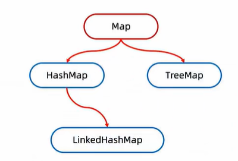
## Map 双列集合的祖宗接口
[Map集合](https://www.bilibili.com/video/BV1yW4y1Y7Ms?p=3&vd_source=6ef187124c74c452a2016ded88292617) 

### Map的基本方法
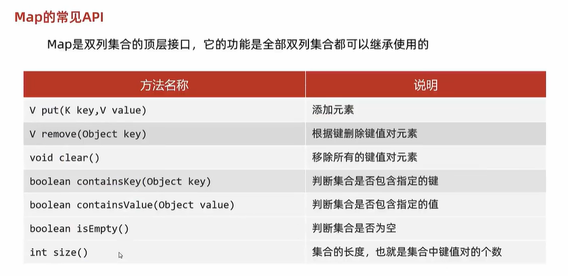
`m.put("冰红茶"，“5元”)` 
`m.put("冰红茶"，“3元”)` 
在添加数据的时候，如果健不存在，那么直接把犍值对对象添加到map集合当中,方法返回null。
在添加数据的时候，如果键是存在的，那么会把原有的键值对对象**覆盖**，会把被覆盖的值进行返回。
`m.remove("冰红茶")`
根据键，删除键值对元素，返回值。
`m.clear()`
清空集合
`m.containsKey("冰红茶")` 
判断是否包含键，返回boolean
`m.containsValue("冰红茶")` 
判断是否包含值，返回boolean
`m.isEmpty()`
判断集合是否为空，返回boolean
`m.size()`
获取集合长度，即包含的键值对元素数量

### Map的遍历方式
[Map的遍历方式](https://www.bilibili.com/video/BV1yW4y1Y7Ms?p=4&vd_source=6ef187124c74c452a2016ded88292617) 
三种：键找值、键值对、Lambda表达式

#### 键找值
将Map集合中的键存到一个单列集合中，然后通过这个单列集合来找值。
```java
//1.创建Map集合的对象  
Map<String,String> map = new HashMap<>();  
  
//2.添加元素  
map.put("尹志平","小龙女");  
map.put("郭靖","穆念慈");  
map.put("欧阳克","黄蓉");  
  
//3.通过键找值  
//3.1获取所有的键，把这些键放到一个单列集合当中  
Set<String> keys = map.keySet();  
//3.2遍历单列集合，得到每一个键  
for (String key : keys) {   // 增强For循环遍历
    //System.out.println(key);  
    //3.3 利用map集合中的键获取对应的值  get    
    String value = map.get(key);  
    System.out.println(key + " = " + value);  
}
```
#### 键值对
获取所有键值对，然后根据getKey()、getValue()方法获取键和值。

 如果既要遍历key又要value，那么建议这种方式，因为如果先获取keySet然后再执行map.get(key)，map内部会执行两次遍历。 一次是在获取keySet的时候，一次是在遍历所有key的时候。        

当我调用put(key,value)方法的时候，首先会把key和value封装到`Entry`这个静态内部类对象中，把Entry对象再添加到数组中，所以我们想获取 map中的所有键值对，我们只要获取数组中的所有Entry对象，接下来调用Entry对象中的getKey()和getValue()方法就能获取键值对了。

```Java
 //1.创建Map集合的对象  
 Map<String, String> map = new HashMap<>();  
  
 //2.添加元素  
 //键：人物的外号  
 //值：人物的名字  
 map.put("标枪选手", "马超");  
 map.put("人物挂件", "明世隐");  
 map.put("御龙骑士", "尹志平");  
  
 //3.Map集合的第二种遍历方式  
 //通过键值对对象进行遍历  
 //3.1 通过一个方法获取所有的键值对对象，返回一个Set集合  
 Set<Map.Entry<String, String>> entries = map.entrySet(); 
 //3.2 遍历entries这个集合，去得到里面的每一个键值对对象  
 for (Map.Entry<String, String> entry : entries) {  //entry  --->  "御龙骑士","尹志平"  
     //3.3 利用entry调用get方法获取键和值  
     String key = entry.getKey();     
     String value = entry.getValue();     
     System.out.println(key + "=" + value); 
     }
 //3.Map集合的第二种遍历方式  
 //通过键值对对象进行遍历  
 //3.1 通过一个方法获取所有的键值对对象，返回一个Set集合  
 //3.2 遍历entries这个集合，去得到里面的每一个键值对对象  
 for (Map.Entry<String, String> entry :  map.entrySet()) { //entry  --->  "御龙骑士","尹志平"  
     //3.3 利用entry调用get方法获取键和值  
     String key = entry.getKey();  
     String value = entry.getValue();  
     System.out.println(key + "=" + value);  
 }
```
#### Lambda表达式
```Java
//1.创建Map集合的对象  
Map<String,String> map = new HashMap<>();  
  
//2.添加元素  
//键：人物的名字  
//值：名人名言  
map.put("鲁迅","这句话是我说的");  
map.put("曹操","不可能绝对不可能");  
map.put("刘备","接着奏乐接着舞");  
map.put("柯镇恶","看我眼色行事");  
  
//3.利用lambda表达式进行遍历  
//底层：  
//forEach其实就是利用第二种方式进行遍历，依次得到每一个键和值  
//再调用accept方法  
map.forEach(new BiConsumer<String, String>() {  
    @Override  
    public void accept(String key, String value) {  
        System.out.println(key + "=" + value);  
    }  
});  
System.out.println("-----------------------------------");  
map.forEach((String key, String value)->{  
        System.out.println(key + "=" + value);  
    }  
);  
System.out.println("-----------------------------------");  
map.forEach((key, value)-> System.out.println(key + "=" + value));
```
## HashMap🌟

`java.util.HashMap;`     

[黑马视频：HashMap的基本使用](https://www.bilibili.com/video/BV1yW4y1Y7Ms?p=7&spm_id_from=pageDriver&vd_source=6ef187124c74c452a2016ded88292617)      [黑马视频：HashMap源码详解](https://www.bilibili.com/video/BV1yW4y1Y7Ms?p=14&spm_id_from=pageDriver&vd_source=6ef187124c74c452a2016ded88292617)  🌟     [JavaGuide：HashMap源码分析](https://javaguide.cn/java/collection/hashmap-source-code.html)  🌟     [JavaGuide：Map](https://javaguide.cn/java/collection/java-collection-questions-02.html) 🌟

HashMap 主要用来存放键值对，它基于哈希表的 Map 接口实现，是常用的 Java 集合之一，是**非线程安全**的。

`HashMap` **可以存储 null** 的 key 和 value，但 null 作为键只能有一个，null 作为值可以有多个。

JDK1.8 之前 HashMap 由 **数组+链表** 组成的，数组是 HashMap 的主体，链表则是主要为了解决哈希冲突而存在的（“拉链法”解决冲突）。 JDK1.8 以后的 `HashMap` 在解决哈希冲突时有了较大的变化，当链表长度大于等于阈值（默认为 8）（将链表转换成红黑树前会判断，如果当前数组的长度小于 64，那么会选择先进行数组扩容，而不是转换为红黑树）时，将链表转化为**红黑树**，以减少搜索时间。

`HashMap` 默认的数组<u>初始化大小为 **16**</u>。之后每次扩充，容量变为原来的 **2 倍**。并且， `HashMap` **总是使用 2 的幂作为哈希表的大小**。

### HashMap底层实现  

底层数据结构 --- 哈希表 (利用键计算哈希值，与值无关)

#### JDK 1.8  之前

JDK1.8 之前 `HashMap` 底层是 **数组和链表** 结合在一起使用也就是 **链表散列**。数组是 `HashMap` 的主体，链表则是主要为了解决哈希冲突而存在的（“**拉链法**”解决冲突）。HashMap 通过 key 的 `hashcode` 经过**扰动函数**处理过后得到 hash 值，然后通过 **`(n - 1) & hash`** 判断当前元素存放的位置（这里的 n 指的是数组的长度），如果当前位置存在元素的话，就判断该元素与要存入的元素的 hash 值以及 key 是否相同，如果相同的话，直接覆盖（Key唯一），不相同就通过拉链法解决冲突。

所谓**扰动函数**指的就是 HashMap 的 `hash` 方法。使用 `hash` 方法也就是扰动函数是为了防止一些实现比较差的 `hashCode()` 方法 换句话说使用扰动函数之后可以减少碰撞。

JDK1.7 的 `HashMap` 的 `hash` 方法源码：

```java 
static int hash(int h) {
    // This function ensures that hashCodes that differ only by
    // constant multiples at each bit position have a bounded
    // number of collisions (approximately 8 at default load factor).
    h ^= (h >>> 20) ^ (h >>> 12);
    return h ^ (h >>> 7) ^ (h >>> 4);
}
```

JDK1.8 的  `HashMap` 的 `hash` 方法源码：

```Java
    static final int hash(Object key) {
      int h;
      // key.hashCode()：返回散列值也就是hashcode
      // ^：按位异或
      // >>>:无符号右移，忽略符号位，空位都以0补齐
      return (key == null) ? 0 : (h = key.hashCode()) ^ (h >>> 16);
  }
```

相比于 JDK1.8 的 hash 方法 ，JDK 1.7 的 hash 方法的性能会稍差一点点，因为毕竟扰动了 4 次。

所谓 **“拉链法”** 就是：将链表和数组相结合。也就是说创建一个链表数组，数组中每一格就是一个链表。若遇到哈希冲突，则将冲突的值加到链表中即可。

 


#### JDK 1.8  之后

相比于之前的版本， JDK1.8 之后在解决哈希冲突时有了较大的变化（**数组+链表+红黑树**），当**链表长度大于阈值（默认为 8）**（将链表转换成红黑树前会判断，如果当前**数组的长度小于 64**，那么会选择先进行**数组扩容(执行 `resize()` 方法)**，而不是转换为红黑树）时，将链表转化为红黑树，以减少搜索时间。删除元素时，如果树上的元素**<=6时会树转链表**。

 

> TreeMap、TreeSet 以及 JDK1.8 之后的 HashMap 底层都用到了红黑树。红黑树就是为了解决二叉查找树的缺陷，因为二叉查找树在某些情况下会退化成一个线性结构。

我们来结合源码分析一下 `HashMap` 链表到红黑树的转换。

1. `putVal` 方法中执行链表转红黑树的判断逻辑。

链表的长度大于 8 的时候，就执行 `treeifyBin` （转换红黑树）的逻辑。

```Java
// 遍历链表
for (int binCount = 0; ; ++binCount) {
    // 遍历到链表最后一个节点
    if ((e = p.next) == null) {
        p.next = newNode(hash, key, value, null);
        // 如果链表元素个数大于等于TREEIFY_THRESHOLD（8）
        if (binCount >= TREEIFY_THRESHOLD - 1) // -1 for 1st
            // 红黑树转换（并不会直接转换成红黑树）
            treeifyBin(tab, hash);
        break;
    }
    if (e.hash == hash &&
        ((k = e.key) == key || (key != null && key.equals(k))))
        break;
    p = e;
}
```

2. `treeifyBin()` 方法中判断是否真的转换为红黑树。

```Java
final void treeifyBin(Node<K,V>[] tab, int hash) {
    int n, index; Node<K,V> e;
    // 判断当前数组的长度是否小于 64
    if (tab == null || (n = tab.length) < MIN_TREEIFY_CAPACITY)
        // 如果当前数组的长度小于 64，那么会选择先进行数组扩容
        resize();
    else if ((e = tab[index = (n - 1) & hash]) != null) {
        // 否则才将列表转换为红黑树
        TreeNode<K,V> hd = null, tl = null;
        do {
            TreeNode<K,V> p = replacementTreeNode(e, null);
            if (tl == null)
                hd = p;
            else {
                p.prev = tl;
                tl.next = p;
            }
            tl = p;
        } while ((e = e.next) != null);
        if ((tab[index] = hd) != null)
            hd.treeify(tab);
    }
}
```

`HashMap` 默认的数组**初始化大小为 16**。之后每次数组扩充，容量变为(一般为原来的两倍)与所需容量最接近的 **2 的幂次方大小**。并且， `HashMap` 总是使用 2 的幂次大小作为哈希表的大小。

底层数据结构 --- 哈希表 (**利用键计算哈希值，与值无关**)

1. 如果键计算的哈希值一样，且键相同，则会**覆盖**(即上述put()方法覆盖原理，这就是为什么键不能重复)；**所谓的覆盖其实只是把老键值对的值进行修改**。
2. 如果计算的哈希值一样(不同的键也会导致哈希值一样，即哈希碰撞)，但键不同，则会形成**链表**(JDK8前，旧元素挂在新元素下面；JDK8后，新元素挂在旧元素下面，且**当链表的长度超过8&数组长度>=64**，自动转成**红黑树**)。
3. HashMap的键位置如果存储的是**自定义对象**，需要**重写**hashCode和equals方法(与HashSet一样，因为有红黑树)。

HashMap 类的属性：

```Java
public class HashMap<K,V> extends AbstractMap<K,V> implements Map<K,V>, Cloneable, Serializable {
    // 序列号
    private static final long serialVersionUID = 362498820763181265L;
    // 默认的初始容量是16
    static final int DEFAULT_INITIAL_CAPACITY = 1 << 4;
    // 最大容量
    static final int MAXIMUM_CAPACITY = 1 << 30;
    // 默认的负载因子
    static final float DEFAULT_LOAD_FACTOR = 0.75f;
    // 当桶(bucket)上的结点数大于等于这个值时会转成红黑树
    static final int TREEIFY_THRESHOLD = 8;
    // 当桶(bucket)上的结点数小于等于这个值时树转链表
    static final int UNTREEIFY_THRESHOLD = 6;
    // 桶中结构转化为红黑树对应的table的最小容量
    static final int MIN_TREEIFY_CAPACITY = 64;
    // 存储元素的数组，总是2的幂次倍
    transient Node<k,v>[] table;
    // 存放具体元素的集
    transient Set<map.entry<k,v>> entrySet;
    // 存放元素的个数，注意这个不等于数组的长度。
    transient int size;
    // 每次扩容和更改map结构的计数器
    transient int modCount;
    // 阈值(容量*负载因子) 当实际大小超过阈值时，会进行扩容
    int threshold;
    // 负载因子
    final float loadFactor;
}
```

- **loadFactor 负载因子**  （默认 **0.75f** ）

​		loadFactor 负载因子是控制数组存放数据的疏密程度，loadFactor 越趋近于 1，那么 数组中存放的数据(entry)也就越多，也就越密，也就是会让链表的长度增加，loadFactor 越小，也就是趋近于 0，数组中存放的数据(entry)也就越少，也就越稀疏。

​		**loadFactor 太大导致查找元素效率低，太小导致数组的利用率低，存放的数据会很分散。loadFactor 的默认值为 0.75f 是官方给出的一个比较好的临界值**。

​		给定的默认容量为 16，负载因子为 0.75。Map 在使用过程中不断的往里面存放数据，当数量超过了 16 * 0.75 = 12 就需要将当前 16 的容量进行扩容，而扩容这个过程涉及到 rehash、复制数据等操作，所以<u>非常消耗性能</u>。

- **threshold**

​		`threshold = capacity * loadFactor`，当  Size > threshold 的时候，那么就要考虑对数组的扩增了，也就是说，这个的意思就是 **衡量数组是否需要扩增的一个标准**。

Node 节点类源码：

```java 
// 继承自 Map.Entry<K,V>
static class Node<K,V> implements Map.Entry<K,V> {
       final int hash;// 哈希值，存放元素到hashmap中时用来与其他元素hash值比较
       final K key;//键
       V value;//值
       // 指向下一个节点
       Node<K,V> next;
       Node(int hash, K key, V value, Node<K,V> next) {
            this.hash = hash;
            this.key = key;
            this.value = value;
            this.next = next;
        }
        public final K getKey()        { return key; }
        public final V getValue()      { return value; }
        public final String toString() { return key + "=" + value; }
        // 重写hashCode()方法
        public final int hashCode() {
            return Objects.hashCode(key) ^ Objects.hashCode(value);
        }

        public final V setValue(V newValue) {
            V oldValue = value;
            value = newValue;
            return oldValue;
        }
        // 重写 equals() 方法
        public final boolean equals(Object o) {
            if (o == this)
                return true;
            if (o instanceof Map.Entry) {
                Map.Entry<?,?> e = (Map.Entry<?,?>)o;
                if (Objects.equals(key, e.getKey()) &&
                    Objects.equals(value, e.getValue()))
                    return true;
            }
            return false;
        }
}
```

**树节点类源码:**

```java 
static final class TreeNode<K,V> extends LinkedHashMap.Entry<K,V> {
        TreeNode<K,V> parent;  // 父
        TreeNode<K,V> left;    // 左
        TreeNode<K,V> right;   // 右
        TreeNode<K,V> prev;    // needed to unlink next upon deletion
        boolean red;           // 判断颜色
        TreeNode(int hash, K key, V val, Node<K,V> next) {
            super(hash, key, val, next);
        }
        // 返回根节点
        final TreeNode<K,V> root() {
            for (TreeNode<K,V> r = this, p;;) {
                if ((p = r.parent) == null)
                    return r;
                r = p;
       }
```

### HashMap 源码分析

#### 构造方法

HashMap 中有四个构造方法，它们分别如下：

```Java
    // 默认构造函数。
    public HashMap() {
        this.loadFactor = DEFAULT_LOAD_FACTOR; // all other fields defaulted
     }
     // 包含另一个“Map”的构造函数
     public HashMap(Map<? extends K, ? extends V> m) {
         this.loadFactor = DEFAULT_LOAD_FACTOR;
         putMapEntries(m, false); //下面会分析到这个方法
     }
     // 指定“容量大小”的构造函数
     public HashMap(int initialCapacity) {
         this(initialCapacity, DEFAULT_LOAD_FACTOR);
     }
     // 指定“容量大小”和“负载因子”的构造函数
     public HashMap(int initialCapacity, float loadFactor) {
         if (initialCapacity < 0)
             throw new IllegalArgumentException("Illegal initial capacity: " + initialCapacity);
         if (initialCapacity > MAXIMUM_CAPACITY)
             initialCapacity = MAXIMUM_CAPACITY;
         if (loadFactor <= 0 || Float.isNaN(loadFactor))
             throw new IllegalArgumentException("Illegal load factor: " + loadFactor);
         this.loadFactor = loadFactor;
         // 初始容量暂时存放到 threshold ，在resize中再赋值给 newCap 进行table初始化
         this.threshold = tableSizeFor(initialCapacity);
     }
```

> 值得注意的是上述四个构造方法中，都初始化了负载因子 loadFactor，由于 HashMap 中没有 capacity 这样的字段，即使指定了初始化容量 initialCapacity ，也只是通过 tableSizeFor 将其扩容到与 initialCapacity 最接近的 2 的幂次方大小，然后暂时赋值给 threshold ，后续通过 resize 方法将 threshold 赋值给 newCap 进行 table 的初始化。

`putMapEntries` 方法：

```java 
final void putMapEntries(Map<? extends K, ? extends V> m, boolean evict) {
    int s = m.size();
    if (s > 0) {
        // 判断table是否已经初始化
        if (table == null) { // pre-size
            /*
             * 未初始化，s为m的实际元素个数，ft=s/loadFactor => s=ft*loadFactor, 跟我们前面提到的
             * 阈值=容量*负载因子 是不是很像，是的，ft指的是要添加s个元素所需的最小的容量
             */
            float ft = ((float)s / loadFactor) + 1.0F;
            int t = ((ft < (float)MAXIMUM_CAPACITY) ?
                    (int)ft : MAXIMUM_CAPACITY);
            /*
             * 根据构造函数可知，table未初始化，threshold实际上是存放的初始化容量，如果添加s个元素所
             * 需的最小容量大于初始化容量，则将最小容量扩容为最接近的2的幂次方大小作为初始化。
             * 注意这里不是初始化阈值
             */
            if (t > threshold)
                threshold = tableSizeFor(t);
        }
        // 已初始化，并且m元素个数大于阈值，进行扩容处理
        else if (s > threshold)
            resize();
        // 将m中的所有元素添加至HashMap中，如果table未初始化，putVal中会调用resize初始化或扩容
        for (Map.Entry<? extends K, ? extends V> e : m.entrySet()) {
            K key = e.getKey();
            V value = e.getValue();
            putVal(hash(key), key, value, false, evict);
        }
    }
}
```

#### put 方法

HashMap 只提供了 `put` 用于添加元素，`putVal` 方法只是给 put 方法调用的一个方法，并没有提供给用户使用。

**对 `putVal` 方法添加元素的分析如下：**

1. 如果定位到的数组位置没有元素 就直接插入。
2. 如果定位到的数组位置有元素就和要插入的 key 比较，如果 key 相同就直接覆盖，如果 key 不相同，就判断 p 是否是一个树节点，如果是就调用`e = ((TreeNode<K,V>)p).putTreeVal(this, tab, hash, key, value)`将元素添加进入。如果不是就遍历链表插入(插入的是链表尾部)。

 

```java 
public V put(K key, V value) {
    return putVal(hash(key), key, value, false, true);
}

final V putVal(int hash, K key, V value, boolean onlyIfAbsent,
                   boolean evict) {
    Node<K,V>[] tab; Node<K,V> p; int n, i;
    // table未初始化或者长度为0，进行扩容
    if ((tab = table) == null || (n = tab.length) == 0)
        n = (tab = resize()).length;
    // (n - 1) & hash 确定元素存放在哪个桶中，桶为空，新生成结点放入桶中(此时，这个结点是放在数组中)
    if ((p = tab[i = (n - 1) & hash]) == null)
        tab[i] = newNode(hash, key, value, null);
    // 桶中已经存在元素（处理hash冲突）
    else {
        Node<K,V> e; K k;
        //快速判断第一个节点table[i]的key是否与插入的key一样，若相同就直接使用插入的值p替换掉旧的值e。
        if (p.hash == hash &&
            ((k = p.key) == key || (key != null && key.equals(k))))
                e = p;
        // 判断插入的是否是红黑树节点
        else if (p instanceof TreeNode)
            // 放入树中
            e = ((TreeNode<K,V>)p).putTreeVal(this, tab, hash, key, value);
        // 不是红黑树节点则说明为链表结点
        else {
            // 在链表最末插入结点
            for (int binCount = 0; ; ++binCount) {
                // 到达链表的尾部
                if ((e = p.next) == null) {
                    // 在尾部插入新结点
                    p.next = newNode(hash, key, value, null);
                    // 结点数量达到阈值(默认为 8 )，执行 treeifyBin 方法
                    // 这个方法会根据 HashMap 数组来决定是否转换为红黑树。
                    // 只有当数组长度大于或者等于 64 的情况下，才会执行转换红黑树操作，以减少搜索时间。否则，就是只是对数组扩容。
                    if (binCount >= TREEIFY_THRESHOLD - 1) // -1 for 1st
                        treeifyBin(tab, hash);
                    // 跳出循环
                    break;
                }
                // 判断链表中结点的key值与插入的元素的key值是否相等
                if (e.hash == hash &&
                    ((k = e.key) == key || (key != null && key.equals(k))))
                    // 相等，跳出循环
                    break;
                // 用于遍历桶中的链表，与前面的e = p.next组合，可以遍历链表
                p = e;
            }
        }
        // 表示在桶中找到key值、hash值与插入元素相等的结点
        if (e != null) {
            // 记录e的value
            V oldValue = e.value;
            // onlyIfAbsent为false或者旧值为null
            if (!onlyIfAbsent || oldValue == null)
                //用新值替换旧值
                e.value = value;
            // 访问后回调
            afterNodeAccess(e);
            // 返回旧值
            return oldValue;
        }
    }
    // 结构性修改
    ++modCount;
    // 实际大小大于阈值则扩容
    if (++size > threshold)
        resize();
    // 插入后回调
    afterNodeInsertion(evict);
    return null;
}
```

**我们再来对比一下 JDK1.7 put 方法的代码**

**对于 put 方法的分析如下：**

- ① 如果定位到的数组位置没有元素 就直接插入。
- ② 如果定位到的数组位置有元素，遍历以这个元素为头结点的链表，依次和插入的 key 比较，如果 key 相同就直接覆盖，不同就采用头插法插入元素。

```java 
public V put(K key, V value)
    if (table == EMPTY_TABLE) {
    inflateTable(threshold);
}
    if (key == null)
        return putForNullKey(value);
    int hash = hash(key);
    int i = indexFor(hash, table.length);
    for (Entry<K,V> e = table[i]; e != null; e = e.next) { // 先遍历
        Object k;
        if (e.hash == hash && ((k = e.key) == key || key.equals(k))) {
            V oldValue = e.value;
            e.value = value;
            e.recordAccess(this);
            return oldValue;
        }
    }

    modCount++;
    addEntry(hash, key, value, i);  // 再插入
    return null;
}
```

#### get 方法

```java 
public V get(Object key) {
    Node<K,V> e;
    return (e = getNode(hash(key), key)) == null ? null : e.value;
}

final Node<K,V> getNode(int hash, Object key) {
    Node<K,V>[] tab; Node<K,V> first, e; int n; K k;
    if ((tab = table) != null && (n = tab.length) > 0 &&
        (first = tab[(n - 1) & hash]) != null) {
        // 数组元素相等
        if (first.hash == hash && // always check first node
            ((k = first.key) == key || (key != null && key.equals(k))))
            return first;
        // 桶中不止一个节点
        if ((e = first.next) != null) {
            // 在树中get
            if (first instanceof TreeNode)
                return ((TreeNode<K,V>)first).getTreeNode(hash, key);
            // 在链表中get
            do {
                if (e.hash == hash &&
                    ((k = e.key) == key || (key != null && key.equals(k))))
                    return e;
            } while ((e = e.next) != null);
        }
    }
    return null;
}
```

#### resize() 方法

进行扩容，会伴随着一次**重新 hash 分配**，并且会遍历 hash 表中所有的元素，是非常耗时的。在编写程序中，要尽量避免 resize。resize 方法实际上是将 table 初始化和 table 扩容 进行了整合，底层的行为都是给 table 赋值一个新数组。

```Java
final Node<K,V>[] resize() {
    Node<K,V>[] oldTab = table;
    int oldCap = (oldTab == null) ? 0 : oldTab.length;
    int oldThr = threshold;
    int newCap, newThr = 0;
    if (oldCap > 0) {
        // 超过最大值就不再扩充了，就只好随你碰撞去吧
        if (oldCap >= MAXIMUM_CAPACITY) {
            threshold = Integer.MAX_VALUE;
            return oldTab;
        }
        // 没超过最大值，就扩充为原来的2倍
        else if ((newCap = oldCap << 1) < MAXIMUM_CAPACITY && oldCap >= DEFAULT_INITIAL_CAPACITY)
            newThr = oldThr << 1; // double threshold
    }
    else if (oldThr > 0) // initial capacity was placed in threshold
        // 创建对象时初始化容量大小放在threshold中，此时只需要将其作为新的数组容量
        newCap = oldThr;
    else {
        // signifies using defaults 无参构造函数创建的对象在这里计算容量和阈值
        newCap = DEFAULT_INITIAL_CAPACITY;
        newThr = (int)(DEFAULT_LOAD_FACTOR * DEFAULT_INITIAL_CAPACITY);
    }
    if (newThr == 0) {
        // 创建时指定了初始化容量或者负载因子，在这里进行阈值初始化，
    	// 或者扩容前的旧容量小于16，在这里计算新的resize上限
        float ft = (float)newCap * loadFactor;
        newThr = (newCap < MAXIMUM_CAPACITY && ft < (float)MAXIMUM_CAPACITY ? (int)ft : Integer.MAX_VALUE);
    }
    threshold = newThr;
    @SuppressWarnings({"rawtypes","unchecked"})
        Node<K,V>[] newTab = (Node<K,V>[])new Node[newCap];
    table = newTab;
    if (oldTab != null) {
        // 把每个bucket都移动到新的buckets中
        for (int j = 0; j < oldCap; ++j) {
            Node<K,V> e;
            if ((e = oldTab[j]) != null) {
                oldTab[j] = null;
                if (e.next == null)
                    // 只有一个节点，直接计算元素新的位置即可
                    newTab[e.hash & (newCap - 1)] = e;
                else if (e instanceof TreeNode)
                    // 将红黑树拆分成2棵子树，如果子树节点数小于等于 UNTREEIFY_THRESHOLD（默认为 6），则将子树转换为链表。
                    // 如果子树节点数大于 UNTREEIFY_THRESHOLD，则保持子树的树结构。
                    ((TreeNode<K,V>)e).split(this, newTab, j, oldCap);
                else {
                    Node<K,V> loHead = null, loTail = null;
                    Node<K,V> hiHead = null, hiTail = null;
                    Node<K,V> next;
                    do {
                        next = e.next;
                        // 原索引
                        if ((e.hash & oldCap) == 0) {
                            if (loTail == null)
                                loHead = e;
                            else
                                loTail.next = e;
                            loTail = e;
                        }
                        // 原索引+oldCap
                        else {
                            if (hiTail == null)
                                hiHead = e;
                            else
                                hiTail.next = e;
                            hiTail = e;
                        }
                    } while ((e = next) != null);
                    // 原索引放到bucket里
                    if (loTail != null) {
                        loTail.next = null;
                        newTab[j] = loHead;
                    }
                    // 原索引+oldCap放到bucket里
                    if (hiTail != null) {
                        hiTail.next = null;
                        newTab[j + oldCap] = hiHead;
                    }
                }
            }
        }
    }
    return newTab;
}
```

### HashMap 什么时候扩容？

HashMap的四个构造方法中，都初始化了**负载因子 loadFactor**(默认为**0.75f**)，由于 HashMap 中没有 capacity 这样的字段，即使指定了初始化容量 initialCapacity ，也只是通过 tableSizeFor 将其扩容到与 initialCapacity 最接近的 2 的幂次方大小，然后暂时赋值给 threshold ，后续通过 resize 方法将 threshold 赋值给 newCap 进行 table 的初始化。

loadFactor 负载因子是**控制数组存放数据的疏密程度**，loadFactor 越趋近于 1，那么 数组中存放的数据(entry)也就越多，也就越密，也就是会让链表的长度增加，loadFactor 越小，也就是趋近于 0，数组中存放的数据(entry)也就越少，也就越稀疏。

**loadFactor 太大导致查找元素效率低，太小导致数组的利用率低，存放的数据会很分散。loadFactor 的默认值为 0.75f 是官方给出的一个比较好的临界值**。

数组给定的默认初始容量为 16，负载因子默认为 0.75。Map 在使用过程中不断的往里面存放数据，当数量超过了**threshold**(**threshold = capacity \* loadFactor**) 即16 * 0.75 = 12 就需要将当前 16 的容量进行扩容，而扩容这个过程涉及到 rehash、复制数据等操作，所以非常消耗性能。

**threshold = capacity \* loadFactor**，**当 Size>threshold**的时候，那么就要考虑对数组的扩增了，也就是说，这个的意思就是 **衡量数组是否需要扩增的一个标准**。 

进行扩容，会伴随着一次重新 hash 分配，并且会遍历 hash 表中所有的元素，是非常耗时的。在编写程序中，要尽量避免 resize。resize 方法实际上是将 table 初始化和 table 扩容 进行了整合，底层的行为都是给 table 赋值一个新的数组。

### HashMap的长度为什么是2的幂次方

为了能让 HashMap 存取高效，尽量较少碰撞，也就是要尽量把数据分配均匀。我们上面也讲到了过了，Hash 值的范围值-2147483648 到 2147483647，前后加起来大概 40 亿的映射空间，只要哈希函数映射得比较均匀松散，一般应用是很难出现碰撞的。但问题是**一个 40 亿长度的数组，内存是放不下的**。所以这个散列值是不能直接拿来用的。用之前还要**先做对数组的长度取模运算，得到的余数才能用来要存放的位置也就是对应的数组下标**。这个数组下标的计算方法是“ `(n - 1) & hash`”。（n 代表数组长度）。这也就解释了 HashMap 的长度为什么是 2 的幂次方。

这个算法应该如何设计呢？

我们首先可能会想到采用%取余的操作来实现。但是，重点来了：**“取余(%)操作中如果除数是 2 的幂次则等价于与其除数减一的与(&)操作（也就是说 hash%length==hash&(length-1)的前提是 length 是 2 的 n 次方；）。”** 并且 **采用二进制位操作 &，相对于%能够提高运算效率，这就解释了 HashMap 的长度为什么是 2 的幂次方。** 

### HashMap 多线程操作导致死循环问题

[HashMap 多线程操作导致死循环问题 ](https://javaguide.cn/java/collection/java-collection-questions-02.html#hashmap-多线程操作导致死循环问题) 

**JDK1.7 及之前版本**的 `HashMap` 在多线程环境下扩容操作可能存在死循环问题，这是由于当一个桶位中有多个元素需要 进行扩容时，**多个线程同时对链表进行操作，头插法可能会导致链表中的节点指向错误的位置，从而形成一个环形链表**，进而使得查询元素的操作陷入死循环无法结束。

为了解决这个问题，JDK1.8 版本的 HashMap 采用了**尾插法**而不是头插法来避免链表倒置，使得**插入的节点永远都是放在链表的末尾**，避免了链表中的环形结构。但是还是不建议在多线程下使用 `HashMap`，因为多线程下使用 `HashMap` 还是会**存在数据覆盖**的问题。并发环境下，推荐使用 `ConcurrentHashMap` 。

### HashMap 为什么线程不安全？

JDK1.7 及之前版本，在多线程环境下，`HashMap` 扩容时会造成**死循环**和数据丢失的问题。**数据丢失**这个在 JDK1.7 和 JDK 1.8 中都存在，这里以 JDK 1.8 为例进行介绍。

JDK 1.8 后，在 `HashMap` 中，多个键值对可能会被分配到同一个桶（bucket），并以链表或红黑树的形式存储。多个线程对 `HashMap` 的 `put` 操作会导致线程不安全，具体来说会有**数据覆盖**的风险。

举个例子：

- 两个线程 1,2 同时进行 put 操作，并且发生了哈希冲突（hash 函数计算出的插入下标是相同的）。
- 不同的线程可能在不同的时间片获得 CPU 执行的机会，当前线程 1 执行完哈希冲突判断后，由于时间片耗尽挂起。线程 2 先完成了插入操作。
- 随后，线程 1 获得时间片，由于之前已经进行过 hash 碰撞的判断，所有此时会直接进行插入，这就导致线程 2 插入的数据被线程 1 覆盖了

```Java
public V put(K key, V value) {
    return putVal(hash(key), key, value, false, true);
}

final V putVal(int hash, K key, V value, boolean onlyIfAbsent,
                   boolean evict) {
    // ...
    // 判断是否出现 hash 碰撞
    // (n - 1) & hash 确定元素存放在哪个桶中，桶为空，新生成结点放入桶中(此时，这个结点是放在数组中)
    if ((p = tab[i = (n - 1) & hash]) == null)
        tab[i] = newNode(hash, key, value, null);
    // 桶中已经存在元素（处理hash冲突）
    else {
    // ...
}
```

还有一种情况是这两个线程同时 `put` 操作导致 `size` 的值不正确，进而导致数据覆盖的问题：

1. 线程 1 执行 `if(++size > threshold)` 判断时，假设获得 `size` 的值为 10，由于时间片耗尽挂起。
2. 线程 2 也执行 `if(++size > threshold)` 判断，获得 `size` 的值也为 10，并将元素插入到该桶位中，并将 `size` 的值更新为 11。
3. 随后，线程 1 获得时间片，它也将元素放入桶位中，并将 size 的值更新为 11。
4. 线程 1、2 都执行了一次 `put` 操作，但是 `size` 的值只增加了 1，也就导致实际上只有一个元素被添加到了 `HashMap` 中

```Java
public V put(K key, V value) {
    return putVal(hash(key), key, value, false, true);
}

final V putVal(int hash, K key, V value, boolean onlyIfAbsent,
                   boolean evict) {
    // ...
    // 实际大小大于阈值则扩容
    if (++size > threshold)
        resize();
    // 插入后回调
    afterNodeInsertion(evict);
    return null;
}
```

### HashMap 常见遍历方式

参考：[HashMap 的 7 种遍历方式与性能分析！](https://mp.weixin.qq.com/s?__biz=MzkxOTcxNzIxOA==&mid=2247505580&idx=1&sn=1825ca5be126c2b650e201fb3fa8a3e6&source=41#wechat_redirect)      这篇文章对于 parallelStream 遍历方式的性能**分析有误**，先说结论：**存在阻塞时 parallelStream 性能最高, 非阻塞时 parallelStream 性能最低** 。

### HashMap 常用方法

```Java
package map;

import java.util.Collection;
import java.util.HashMap;
import java.util.Set;

public class HashMapDemo {

    public static void main(String[] args) {
        HashMap<String, String> map = new HashMap<String, String>();
        // 键不能重复，值可以重复
        map.put("san", "张三");
        map.put("si", "李四");
        map.put("wu", "王五");
        map.put("wang", "老王");
        map.put("wang", "老王2");// 老王被覆盖
        map.put("lao", "老王");
        System.out.println("-------直接输出hashmap:-------");
        System.out.println(map);
        /**
         * 遍历HashMap
         */
        // 1.获取Map中的所有键
        System.out.println("-------foreach获取Map中所有的键:------");
        Set<String> keys = map.keySet();
        for (String key : keys) {
            System.out.print(key+"  ");
        }
        System.out.println();//换行
        // 2.获取Map中所有值
        System.out.println("-------foreach获取Map中所有的值:------");
        Collection<String> values = map.values();
        for (String value : values) {
            System.out.print(value+"  ");
        }
        System.out.println();//换行
        // 3.得到key的值的同时得到key所对应的值
        System.out.println("-------得到key的值的同时得到key所对应的值:-------");
        Set<String> keys2 = map.keySet();
        for (String key : keys2) {
            System.out.print(key + "：" + map.get(key)+"   ");

        }
        /**
         * 如果既要遍历key又要value，那么建议这种方式，因为如果先获取keySet然后再执行map.get(key)，map内部会执行两次遍历。
         * 一次是在获取keySet的时候，一次是在遍历所有key的时候。
         */
        // 当我调用put(key,value)方法的时候，首先会把key和value封装到
        // Entry这个静态内部类对象中，把Entry对象再添加到数组中，所以我们想获取
        // map中的所有键值对，我们只要获取数组中的所有Entry对象，接下来
        // 调用Entry对象中的getKey()和getValue()方法就能获取键值对了
        Set<java.util.Map.Entry<String, String>> entrys = map.entrySet();
        for (java.util.Map.Entry<String, String> entry : entrys) {
            System.out.println(entry.getKey() + "--" + entry.getValue());
        }

        /**
         * HashMap其他常用方法
         */
        System.out.println("after map.size()："+map.size());
        System.out.println("after map.isEmpty()："+map.isEmpty());
        System.out.println(map.remove("san"));
        System.out.println("after map.remove()："+map);
        System.out.println("after map.get(si)："+map.get("si"));
        System.out.println("after map.containsKey(si)："+map.containsKey("si"));
        System.out.println("after containsValue(李四)："+map.containsValue("李四"));
        System.out.println(map.replace("si", "李四2"));
        System.out.println("after map.replace(si, 李四2):"+map);
    }

}
```

### HashMap 和 Hashtable 的区别

- **线程是否安全：** `HashMap` 是非线程安全的，**`Hashtable` 是线程安全**的,因为 `Hashtable` 内部的方法基本都经过`synchronized` 修饰。（如果你要保证线程安全的话就使用 `ConcurrentHashMap` 吧！）；

- **效率：** 因为线程安全的问题，`HashMap` 要比 `Hashtable` 效率高一点。另外，`Hashtable` 基本被淘汰，不要在代码中使用它；

- **对 Null key 和 Null value 的支持：** `HashMap` 可以存储 null 的 key 和 value，但 null 作为键只能有一个，null 作为值可以有多个；Hashtable 不允许有 null 键和 null 值，否则会抛出 `NullPointerException`。

- **初始容量大小和每次扩充容量大小的不同：** ① 创建时如果不指定容量初始值，`Hashtable` 默认的<u>初始大小为 11，之后每次扩充，容量变为原来的 2n+1</u>。`HashMap` 默认的<u>初始化大小为 16。之后每次扩充，容量变为原来的 2 倍</u>。② 创建时如果给定了容量初始值，那么 `Hashtable` 会直接使用你给定的大小，而 `HashMap` 会**将其扩充为 2 的幂次方大小**（`HashMap` 中的`tableSizeFor()`方法保证，下面给出了源代码）。也就是说 `HashMap` 总是使用 2 的幂作为哈希表的大小,后面会介绍到为什么是 2 的幂次方。

- **底层数据结构：** JDK1.8 以后的 `HashMap` 在解决哈希冲突时有了较大的变化，当链表长度大于阈值（默认为 8）时，将链表转化为红黑树（将链表转换成红黑树前会判断，如果当前数组的长度小于 64，那么会选择先进行数组扩容，而不是转换为红黑树），以减少搜索时间（后文中我会结合源码对这一过程进行分析）。`Hashtable` 没有这样的机制。

**`HashMap` 中带有初始容量的构造函数：**

```java 
    public HashMap(int initialCapacity, float loadFactor) {
        if (initialCapacity < 0)
            throw new IllegalArgumentException("Illegal initial capacity: " +
                                               initialCapacity);
        if (initialCapacity > MAXIMUM_CAPACITY)
            initialCapacity = MAXIMUM_CAPACITY;
        if (loadFactor <= 0 || Float.isNaN(loadFactor))
            throw new IllegalArgumentException("Illegal load factor: " +
                                               loadFactor);
        this.loadFactor = loadFactor;
        this.threshold = tableSizeFor(initialCapacity);
    }
     public HashMap(int initialCapacity) {
        this(initialCapacity, DEFAULT_LOAD_FACTOR);
    }
```

下面这个方法保证了 `HashMap` 总是使用 2 的幂作为哈希表的大小。

```java
    /**
     * Returns a power of two size for the given target capacity.
     */
    static final int tableSizeFor(int cap) {
        int n = cap - 1;
        n |= n >>> 1;
        n |= n >>> 2;
        n |= n >>> 4;
        n |= n >>> 8;
        n |= n >>> 16;
        return (n < 0) ? 1 : (n >= MAXIMUM_CAPACITY) ? MAXIMUM_CAPACITY : n + 1;
    }
```

### HashMap 和 HashSet 区别

如果你看过 `HashSet` 源码的话就应该知道：`HashSet` 底层就是基于 `HashMap` 实现的。（`HashSet` 的源码非常非常少，因为除了 `clone()`、`writeObject()`、`readObject()`是 `HashSet` 自己不得不实现之外，其他方法都是直接调用 `HashMap` 中的方法。

|               `HashMap`                |                          `HashSet`                           |
| :------------------------------------: | :----------------------------------------------------------: |
|           实现了 `Map` 接口            |                       实现 `Set` 接口                        |
|               存储键值对               |                          仅存储对象                          |
|     调用 `put()`向 map 中添加元素      |             调用 `add()`方法向 `Set` 中添加元素              |
| `HashMap` 使用键（Key）计算 `hashcode` | `HashSet` 使用成员对象来计算 `hashcode` 值，对于两个对象来说 `hashcode` 可能相同，所以`equals()`方法用来判断对象的相等性 |

### HashMap 和 TreeMap 区别

`TreeMap` 和`HashMap` 都继承自`AbstractMap` ，但是需要注意的是`TreeMap`它还实现了`NavigableMap`接口和`SortedMap` 接口。

实现 `NavigableMap` 接口让 `TreeMap` 有了对集合内元素的搜索的能力。

实现`SortedMap`接口让 `TreeMap` 有了对集合中的元素根据**键**排序的能力。默认是按 key 的升序排序，不过我们也可以指定排序的比较器。

综上，相比于`HashMap`来说 `TreeMap` 主要多了对集合中的元素<u>根据键排序的能力以及对集合内元素的搜索的能力</u>。

HashMap底层是哈希表、TreeMap底层是红黑树。

## LinkedHashMap 

[LinkedHashMap ](https://www.bilibili.com/video/BV1yW4y1Y7Ms?p=10&spm_id_from=pageDriver&vd_source=6ef187124c74c452a2016ded88292617) 

[JavaGuide: LinkedHashMap源码解析](https://javaguide.cn/java/collection/linkedhashmap-source-code.html) 

`LinkedHashMap` 继承自 `HashMap`，所以它的底层仍然是基于拉链式散列结构即由**数组和链表或红黑树**组成。另外，`LinkedHashMap` 在上面结构的基础上，**增加了一条双向链表**，使得上面的结构可以保持键值对的插入顺序。同时通过对链表进行相应的操作，实现了访问顺序相关逻辑。

`LinkedHashMap` 逻辑结构如下图所示，它是在 `HashMap` 基础上在各个节点之间维护一条双向链表，使得原本散列在不同 bucket 上的节点、链表、红黑树有序关联起来。

 

### LinkedHashMap的特点
1. 由键决定：**有序**、不重复、无索引。
2. 这里的有序指的是保证存储和取出的元素顺序一致。
3. 原理：底层数据结构是依然哈希表，只是每个键值对元素又额外的多了一个**双链表**的机制**记录存储的顺序**。
4. 支持遍历时会<u>按照插入顺序有序进行迭代</u>。
5. 支持按照元素访问顺序排序,适用于封装 LRU 缓存工具。
6. 因为内部使用双向链表维护各个节点，所以遍历时的效率和元素个数成正比，相较于和容量成正比的 HashMap 来说，<u>迭代效率会高很多</u>。

### 插入顺序和访问顺序

`LinkedHashMap` 的<u>迭代顺序是和插入顺序一致的</u>,这一点是 `HashMap` 所不具备的。

如下所示，我们按照顺序往 `LinkedHashMap` 添加元素然后进行遍历。

```java
HashMap < String, String > map = new LinkedHashMap < > ();
map.put("a", "2");
map.put("g", "3");
map.put("r", "1");
map.put("e", "23");

for (Map.Entry < String, String > entry: map.entrySet()) {
    System.out.println(entry.getKey() + ":" + entry.getValue());
}
```

输出：

```java
a:2
g:3
r:1
e:23
```

`LinkedHashMap` 定义了<u>排序模式 `accessOrder`(boolean 类型，默认为 false)，访问顺序则为 true，插入顺序则为 false</u>。

为了实现访问顺序遍历，我们可以使用传入 `accessOrder` 属性的 `LinkedHashMap` 构造方法，并将 `accessOrder` 设置为 true，表示其具备访问有序性。

每次**访问一个元素**时，该**元素会被移动到链表的末尾**，因此下次访问该元素时，它就会成为链表中的最后一个元素，从而实现**按照访问顺序迭代**元素。

```java
LinkedHashMap<Integer, String> map = new LinkedHashMap<>(16, 0.75f, true);
map.put(1, "one");
map.put(2, "two");
map.put(3, "three");
map.put(4, "four");
map.put(5, "five");
//访问元素2,该元素会被移动至链表末端
map.get(2);
//访问元素3,该元素会被移动至链表末端
map.get(3);
for (Map.Entry<Integer, String> entry : map.entrySet()) {
    System.out.println(entry.getKey() + " : " + entry.getValue());
}
```

输出：

```java
1 : one
4 : four
5 : five
2 : two
3 : three
```

### LRU (Least Recently Used，最近最少使用)缓存

通过 `LinkedHashMap` 我们可以封装一个简易版的 LRU（**L**east **R**ecently **U**sed，最近最少使用） 缓存，确保当存放的元素超过容器容量时，将最近最少访问的元素移除。

 

思路:

1.继承 `LinkedHashMap`;

2.构造方法中指定 `accessOrder` 为 true ，这样在<u>访问元素时就会把该元素移动到链表尾部，链表首元素就是最近最少被访问的元素</u>；

3.重写`removeEldestEntry` 方法，该方法会返回一个 boolean 值，告知 `LinkedHashMap` 是否需要移除链表首元素（缓存容量有限）。

```java 
public class LRUCache<K, V> extends LinkedHashMap<K, V> {
    private final int capacity;

    public LRUCache(int capacity) {
        super(capacity, 0.75f, true);
        this.capacity = capacity;
    }

    /**
     * 判断size超过容量时返回true，告知LinkedHashMap移除最老的缓存项(即链表的第一个元素)
     */
    @Override
    protected boolean removeEldestEntry(Map.Entry<K, V> eldest) {
        return size() > capacity;
    }
}
```

测试代码如下，笔者初始化缓存容量为 2，然后按照次序先后添加 4 个元素。

```java
LRUCache < Integer, String > cache = new LRUCache < > (2);
cache.put(1, "one");
cache.put(2, "two");
cache.put(3, "three");
cache.put(4, "four");
for (int i = 0; i < 4; i++) {
    System.out.println(cache.get(i));
}
```

输出：

```java
null
null
three
four
```

从输出结果来看，由于缓存容量为 2 ，因此，添加第 3 个元素时，第 1 个元素会被删除。添加第 4 个元素时，第 2 个元素会被删除。

### LinkedHashMap 源码解析

[JavaGuide: LinkedHashMap源码解析](https://javaguide.cn/java/collection/linkedhashmap-source-code.html) 

#### Node 的设计

`LinkedHashMap` 是在 `HashMap` 的基础上为 bucket 上的每一个节点建立一条双向链表，这就使得转为红黑树的树节点也需要具备双向链表节点的特性，即每一个树节点都需要拥有两个引用存储前驱节点和后继节点的地址,所以对于树节点类 **`TreeNode`** 的设计就是一个比较棘手的问题。

1.**`LinkedHashMap` 的节点内部类 `Entry` 基于 `HashMap` 的基础上，增加 `before` 和 `after` 指针使节点具备双向链表的特性。**

2.**`HashMap` 的树节点 `TreeNode` 继承了具备双向链表特性的 `LinkedHashMap` 的 `Entry`。**

问题一: 为什么 `HashMap` 的树节点 `TreeNode` 要通过 `LinkedHashMap` 获取双向链表的特性呢?

答: 我们都知道 `LinkedHashMap` 是在 `HashMap` 基础上对节点增加双向指针实现双向链表的特性,所以 `LinkedHashMap` 内部链表转红黑树时，对应的节点会转为树节点 `TreeNode`,<u>为了保证使用 `LinkedHashMap` 时树节点具备双向链表的特性，所以树节点 `TreeNode` 需要继承 `LinkedHashMap` 的 `Entry`。</u>

问题二: 为什么不直接在HashMap的 `Node` 上实现前驱和后继指针呢?

答: 我们直接在 `HashMap` 的节点 `Node` 上直接实现前驱和后继指针,然后 `TreeNode` 直接继承 `Node` 获取双向链表的特性为什么不行呢？其实这样做也是可以的。只不过这种做法会<u>使得使用 `HashMap` 时存储键值对的节点类 `Node` 多了两个没有必要的引用，占用没必要的内存空间</u>。所以，为了保证 `HashMap` 底层的节点类 `Node` 没有多余的引用，又要保证 `LinkedHashMap` 的节点类 `Entry` 拥有存储链表的引用，<u>设计者就让 `LinkedHashMap` 的节点 `Entry` 去继承 `Node` 并增加存储前驱后继节点的引用 `before`、`after`，</u>让需要用到链表特性的节点去实现需要的逻辑。<u>然后树节点 `TreeNode` 再通过继承 `LinkedHashMap` 的 `Entry` 获取 `before`、`after` 两个指针</u>。

```java
static class Entry<K,V> extends HashMap.Node<K,V> {
        Entry<K,V> before, after;
        Entry(int hash, K key, V value, Node<K,V> next) {
            super(hash, key, value, next);
        }
    }
```

但是这样做，不也使得使用 `HashMap` 时的 `TreeNode` 多了两个没有必要的引用吗?这不也是一种空间的浪费吗？

```java
static final class TreeNode<K,V> extends LinkedHashMap.Entry<K,V> {
  //略
}
```

对于这个问题,引用作者的一段注释，作者们认为在良好的 `hashCode` 算法时，`HashMap` 转红黑树的概率不大。就算转为红黑树变为树节点，也可能会因为移除或者扩容将 `TreeNode` 变为 `Node`，所以 `TreeNode` 的使用概率不算很大，对于这一点资源空间的浪费是可以接受的。

#### 构造方法

`LinkedHashMap` 构造方法有 4 个实现也比较简单，直接调用父类即 `HashMap` 的构造方法完成初始化。

我们上面也提到了，默认情况下 `accessOrder` 为 false，如果我们要让 `LinkedHashMap` 实现键值对按照访问顺序排序(即将最近未访问的元素排在链表首部、最近访问的元素移动到链表尾部)，需要调用第 4 个构造方法将 `accessOrder` 设置为 true。

```Java
public LinkedHashMap() {
    super();
    accessOrder = false;
}

public LinkedHashMap(int initialCapacity) {
    super(initialCapacity);
    accessOrder = false;
}

public LinkedHashMap(int initialCapacity, float loadFactor) {
    super(initialCapacity, loadFactor);
    accessOrder = false;
}

public LinkedHashMap(int initialCapacity,
    float loadFactor,
    boolean accessOrder) {
    super(initialCapacity, loadFactor);
    this.accessOrder = accessOrder;
}
```

#### get 方法

`get` 方法是 `LinkedHashMap` 增删改查操作中<u>唯一一个重写的方法</u>， `accessOrder` 为 true 的情况下， 它会在元素查询完成之后，将当前访问的元素移到链表的末尾。调用 `LinkedHashMap` 重写的 `afterNodeAccess` 将当前元素添加到链表末尾。

```java 
public V get(Object key) {
     Node < K, V > e;
     //获取key的键值对,若为空直接返回
     if ((e = getNode(hash(key), key)) == null)
         return null;
     //若accessOrder为true，则调用afterNodeAccess将当前元素移到链表末尾
     if (accessOrder)
         afterNodeAccess(e);
     //返回键值对的值
     return e.value;
 }
```

从源码可以看出，`get` 的执行步骤非常简单:

1. 调用父类即 `HashMap` 的 `getNode` 获取键值对，若为空则直接返回。
2. 判断 `accessOrder` 是否为 true，若为 true 则说明需要保证 `LinkedHashMap` 的链表访问有序性，执行步骤 3。
3. 调用 `LinkedHashMap` 重写的 `afterNodeAccess` 将当前元素添加到链表末尾。

关键点在于 `afterNodeAccess` 方法的实现，这个方法负责将元素移动到链表末尾。

```java 
void afterNodeAccess(Node < K, V > e) { // move node to last
    LinkedHashMap.Entry < K, V > last;
    //如果accessOrder 且当前节点不未链表尾节点
    if (accessOrder && (last = tail) != e) {

        //获取当前节点、以及前驱节点和后继节点
        LinkedHashMap.Entry < K, V > p =
            (LinkedHashMap.Entry < K, V > ) e, b = p.before, a = p.after;

        //将当前节点的后继节点指针指向空，使其和后继节点断开联系
        p.after = null;

        //如果前驱节点为空，则说明当前节点是链表的首节点，故将后继节点设置为首节点
        if (b == null)
            head = a;
        else
            //如果后继节点不为空，则让前驱节点指向后继节点
            b.after = a;

        //如果后继节点不为空，则让后继节点指向前驱节点
        if (a != null)
            a.before = b;
        else
            //如果后继节点为空，则说明当前节点在链表最末尾，直接让last 指向前驱节点,这个 else其实 没有意义，因为最开头if已经确保了p不是尾结点了，自然after不会是null
            last = b;

        //如果last为空，则说明当前链表只有一个节点p，则将head指向p
        if (last == null)
            head = p;
        else {
            //反之让p的前驱指针指向尾节点，再让尾节点的前驱指针指向p
            p.before = last;
            last.after = p;
        }
        //tail指向p，自此将节点p移动到链表末尾
        tail = p;

        ++modCount;
    }
}
```

从源码可以看出， `afterNodeAccess` 方法完成了下面这些操作:

1. 如果 `accessOrder` 为 true 且链表尾部不为当前节点 p，我们则需要将当前节点移到链表尾部。
2. 获取当前节点 p、以及它的前驱节点 b 和后继节点 a。
3. 将当前节点 p 的后继指针设置为 null，使其和后继节点 p 断开联系。
4. 尝试将前驱节点指向后继节点，若前驱节点为空，则说明当前节点 p 就是链表首节点，故直接将后继节点 a 设置为首节点，随后我们再将 p 追加到 a 的末尾。
5. 再尝试让后继节点 a 指向前驱节点 b。
6. 上述操作让前驱节点和后继节点完成关联，并将当前节点 p 独立出来，这一步则是将当前节点 p 追加到链表末端，如果链表末端为空，则说明当前链表只有一个节点 p，所以直接让 head 指向 p 即可。
7. 上述操作已经将 p 成功到达链表末端，最后我们将 tail 指针即指向链表末端的指针指向 p 即可。

可以结合这张图理解，展示了 key 为 13 的元素被移动到了链表尾部。

 

#### remove 方法后置操作——afterNodeRemoval

`LinkedHashMap` 并没有对 `remove` 方法进行重写，而是直接继承 `HashMap` 的 `remove` 方法，为了保证键值对移除后双向链表中的节点也会同步被移除，`LinkedHashMap` 重写了 `HashMap` 的空实现方法 `afterNodeRemoval`。

```java 
final Node<K,V> removeNode(int hash, Object key, Object value,
                               boolean matchValue, boolean movable) {
        //略
            if (node != null && (!matchValue || (v = node.value) == value ||
                                 (value != null && value.equals(v)))) {
                if (node instanceof TreeNode)
                    ((TreeNode<K,V>)node).removeTreeNode(this, tab, movable);
                else if (node == p)
                    tab[index] = node.next;
                else
                    p.next = node.next;
                ++modCount;
                --size;
                //HashMap的removeNode完成元素移除后会调用afterNodeRemoval进行移除后置操作
                afterNodeRemoval(node);
                return node;
            }
        }
        return null;
    }
//空实现
void afterNodeRemoval(Node<K,V> p) { }
```

我们可以看到从 `HashMap` 继承来的 `remove` 方法内部调用的 `removeNode` 方法将节点从 bucket 删除后，调用了 `afterNodeRemoval`。

```java 
void afterNodeRemoval(Node<K,V> e) { // unlink

    //获取当前节点p、以及e的前驱节点b和后继节点a
        LinkedHashMap.Entry<K,V> p =
            (LinkedHashMap.Entry<K,V>)e, b = p.before, a = p.after;
    //将p的前驱和后继指针都设置为null，使其和前驱、后继节点断开联系
        p.before = p.after = null;

    //如果前驱节点为空，则说明当前节点p是链表首节点，让head指针指向后继节点a即可
        if (b == null)
            head = a;
        else
        //如果前驱节点b不为空，则让b直接指向后继节点a
            b.after = a;

    //如果后继节点为空，则说明当前节点p在链表末端，所以直接让tail指针指向前驱节点a即可
        if (a == null)
            tail = b;
        else
        //反之后继节点的前驱指针直接指向前驱节点
            a.before = b;
    }
```

从源码可以看出， `afterNodeRemoval` 方法的整体操作就是让当前节点 p 和前驱节点、后继节点断开联系，等待 gc 回收，整体步骤为:

1. 获取当前节点 p、以及 e 的前驱节点 b 和后继节点 a。
2. 让当前节点 p 和其前驱、后继节点断开联系。
3. 尝试让前驱节点 b 指向后继节点 a，若 b 为空则说明当前节点 p 在链表首部，我们直接将 head 指向后继节点 a 即可。
4. 尝试让后继节点 a 指向前驱节点 b，若 a 为空则说明当前节点 p 在链表末端，所以直接让 tail 指针指向前驱节点 a 即可。

可以结合这张图理解，展示了 key 为 13 的元素被删除，也就是从链表中移除了这个元素。

 

#### put 方法后置操作——afterNodeInsertion

同样的 `LinkedHashMap` 并没有实现插入方法，而是直接继承 `HashMap` 的所有插入方法交由用户使用，但为了维护双向链表访问的有序性，它做了这样两件事:

1. 重写 `afterNodeAccess`(上文提到过:将元素添加到链表末尾),如果当前被插入的 key 已存在与 `map` 中，因为 `LinkedHashMap` 的插入操作会将新节点追加至链表末尾，所以对于存在的 key 则调用 `afterNodeAccess` <u>将其放到链表末端</u>。
2. 重写了 `HashMap` 的 `afterNodeInsertion` 方法，当 `removeEldestEntry` 返回 true 时，会将链表首节点移除。

也即是说: **添加重复的key,会覆盖原key,并添加到链表末尾.** 

这一点我们可以在 `HashMap` 的插入操作核心方法 `putVal` 中看到。

```java 
final V putVal(int hash, K key, V value, boolean onlyIfAbsent,
                   boolean evict) {
          //略
            if (e != null) { // existing mapping for key
                V oldValue = e.value;
                if (!onlyIfAbsent || oldValue == null)
                    e.value = value;
                 //如果当前的key在map中存在，则调用afterNodeAccess
                afterNodeAccess(e);
                return oldValue;
            }
        }
        ++modCount;
        if (++size > threshold)
            resize();
         //调用插入后置方法，该方法被LinkedHashMap重写
        afterNodeInsertion(evict);
        return null;
    }
```

上述步骤的源码上文已经解释过了，所以这里我们着重了解一下 `afterNodeInsertion` 的工作流程，假设我们的重写了 `removeEldestEntry`，当链表 `size` 超过 `capacity` 时，就返回 true。

```java 
/**
 * 判断size超过容量时返回true，告知LinkedHashMap移除最老的缓存项(即链表的第一个元素)
 */
protected boolean removeEldestEntry(Map.Entry < K, V > eldest) {
    return size() > capacity;
}
```

以下图为例，假设笔者最后新插入了一个不存在的节点 19,假设 `capacity` 为 4，所以 `removeEldestEntry` 返回 true，我们要将链表首节点移除。

 

移除的步骤很简单，查看链表首节点是否存在，若存在则断开首节点和后继节点的关系，并让首节点指针指向下一节点，所以 head 指针指向了 12，节点 10 成为没有任何引用指向的空对象，等待 GC。

 

```java 
void afterNodeInsertion(boolean evict) { // possibly remove eldest
        LinkedHashMap.Entry<K,V> first;
        //如果evict为true且队首元素不为空以及removeEldestEntry返回true，则说明我们需要最老的元素(即在链表首部的元素)移除。
        if (evict && (first = head) != null && removeEldestEntry(first)) {
          //获取链表首部的键值对的key
            K key = first.key;
            //调用removeNode将元素从HashMap的bucket中移除，并和LinkedHashMap的双向链表断开，等待gc回收
            removeNode(hash(key), key, null, false, true);
        }
    }
```

从源码可以看出， `afterNodeInsertion` 方法完成了下面这些操作:

1. 判断 `eldest` 是否为 true，只有为 true 才能说明可能需要将最年长的键值对(即链表首部的元素)进行移除，具体是否具体要进行移除，还得确定链表是否为空`((first = head) != null)`，以及 `removeEldestEntry` 方法是否返回 true，只有这两个方法返回 true 才能确定当前链表不为空，且链表需要进行移除操作了。
2. 获取链表第一个元素的 key。
3. 调用 `HashMap` 的 `removeNode` 方法，该方法我们上文提到过，它会将节点从 `HashMap` 的 bucket 中移除，并且 `LinkedHashMap` 还重写了 `removeNode` 中的 `afterNodeRemoval` 方法，所以这一步将通过调用 `removeNode` 将元素从 `HashMap` 的 bucket 中移除，并和 `LinkedHashMap` 的双向链表断开，等待 gc 回收。

### LinkedHashMap 和 HashMap 遍历性能比较

`LinkedHashMap` 维护了一个双向链表来记录数据插入的顺序，因此在迭代遍历生成的迭代器的时候，是按照双向链表的路径进行遍历的。这一点相比于 `HashMap` 那种遍历整个 bucket 的方式来说，高效许多。

这一点我们可以从两者的迭代器中得以印证，先来看看 `HashMap` 的迭代器，可以看到 `HashMap` 迭代键值对时会用到一个 `nextNode` 方法，该方法会返回 next 指向的下一个元素，并会从 next 开始遍历 bucket 找到下一个 bucket 中不为空的元素 Node。

```java 
 final class EntryIterator extends HashIterator
 implements Iterator < Map.Entry < K, V >> {
     public final Map.Entry < K,
     V > next() {
         return nextNode();
     }
 }

 //获取下一个Node
 final Node < K, V > nextNode() {
     Node < K, V > [] t;
     //获取下一个元素next
     Node < K, V > e = next;
     if (modCount != expectedModCount)
         throw new ConcurrentModificationException();
     if (e == null)
         throw new NoSuchElementException();
     //将next指向bucket中下一个不为空的Node
     if ((next = (current = e).next) == null && (t = table) != null) {
         do {} while (index < t.length && (next = t[index++]) == null);
     }
     return e;
 }
```

相比之下 `LinkedHashMap` 的迭代器则是直接使用通过 `after` 指针快速定位到当前节点的后继节点，简洁高效需多。

```java 
 final class LinkedEntryIterator extends LinkedHashIterator
 implements Iterator < Map.Entry < K, V >> {
     public final Map.Entry < K,
     V > next() {
         return nextNode();
     }
 }
 //获取下一个Node
 final LinkedHashMap.Entry < K, V > nextNode() {
     //获取下一个节点next
     LinkedHashMap.Entry < K, V > e = next;
     if (modCount != expectedModCount)
         throw new ConcurrentModificationException();
     if (e == null)
         throw new NoSuchElementException();
     //current 指针指向当前节点
     current = e;
     //next直接当前节点的after指针快速定位到下一个节点
     next = e.after;
     return e;
 }
```

因为 `LinkedHashMap` 需要维护双向链表的缘故，<u>插入元素相较于 `HashMap` 会更耗时，但是有了双向链表明确的前后节点关系，迭代效率相对于前者高效了许多</u>。不过，总体来说却别不大，毕竟数据量这么庞大。

### LinkedHashMap 常见面试题 ✅

#### 什么是 LinkedHashMap？

`LinkedHashMap` 是 Java 集合框架中 `HashMap` 的一个子类，它继承了 `HashMap` 的所有属性和方法，并且在 `HashMap` 的基础重写了 `afterNodeRemoval`、`afterNodeInsertion`、`afterNodeAccess` 方法。使之拥有顺序插入和访问有序的特性。

#### LinkedHashMap 如何按照插入顺序迭代元素？

`LinkedHashMap` 按照插入顺序迭代元素是它的默认行为。`LinkedHashMap` 内部维护了一个双向链表，用于记录元素的插入顺序。因此，当使用迭代器迭代元素时，元素的顺序与它们最初插入的顺序相同。

#### LinkedHashMap 如何按照访问顺序迭代元素？

`LinkedHashMap` 可以通过构造函数中的 **`accessOrder` 参数**指定按照访问顺序迭代元素。当 `accessOrder` 为 true 时，每次访问一个元素时，该元素会被移动到链表的末尾，因此下次访问该元素时，它就会成为链表中的最后一个元素，从而实现按照访问顺序迭代元素。

#### LinkedHashMap 如何实现 LRU 缓存？

**将 `accessOrder` 设置为 true 并重写 `removeEldestEntry` 方法当链表大小超过容量时返回 true**，使得每次访问一个元素时，该元素会被移动到链表的末尾。一旦插入操作让 `removeEldestEntry` 返回 true 时，视为缓存已满，`LinkedHashMap` 就会将链表首元素移除，由此我们就能实现一个 LRU 缓存。

#### LinkedHashMap 和 HashMap 有什么区别？

`LinkedHashMap` 和 `HashMap` 都是 Java 集合框架中的 Map 接口的实现类。它们的最大区别在于**迭代元素的顺序**。`HashMap` 迭代元素的顺序是不确定的，而 `LinkedHashMap` 提供了按照插入顺序或访问顺序迭代元素的功能。此外，`LinkedHashMap` 内部维护了一个**双向链表**，用于记录元素的插入顺序或访问顺序，而 `HashMap` 则没有这个链表。因此，`LinkedHashMap` 的插入性能可能会比 `HashMap` 略低，但它提供了更多的功能并且迭代效率相较于 `HashMap` 更加高效。

## TreeMap

[TreeMap](https://www.bilibili.com/video/BV1yW4y1Y7Ms?p=11&spm_id_from=pageDriver&vd_source=6ef187124c74c452a2016ded88292617) 
[TreeMap源码详解](https://www.bilibili.com/video/BV1yW4y1Y7Ms?p=18&vd_source=6ef187124c74c452a2016ded88292617) 🌟

### TreeMap的特点
1. TreeMap跟TreeSet底层原理一样，都是**红黑树**结构的。
2. 由键决定特性：不重复、无索引、**可排序**。
3. 可排序：**对键进行排序**。
4. 注意：**默认按照键的从小到大进行排序，也可以自己规定键的排序规则**。
### TreeMap的两种排序规则
(两种皆有的情况下，以第二种为主)：
1. 实现Comparable接口，指定比较规则。

2. 创建集合时传递Comparator比较器对象，指定比较规则。

  注意：
  **键位置添加自定义对象时**，要指定自定义对象的排序规则(重写compareTo方法)。它会根据这个排序规则比较添加对象的大小，然后按照红黑树的规则进行存储。

## 双列集合的总结

1. TreeMap添加元素的时候，键是否需要重写hashcode和equals方法?

   **TreeMap添加元素的时候，不需要重写hashcode和equals方法**。<u>TreeMap利用Comparable接口或者Comparator比较器保持元素唯一性</u>。HashMap需要重写hashcode和equals方法。

2. HashMap是哈希表结构的，JDK8开始由数组，链表，红黑树组成的。既然有红黑树，HashMap的键是否需要实现compareable接口或者传递比较器对象呢?不需要的。因为在**HashMap的底层，默认是利用哈希值的大小关系来创建红黑树的**。

3. TreeMap和HashMap谁的效率更高?
   如果是最坏情况，添加了8个元素，这8个元素形成了链表，此时TreeMap的效率要更高但是这种情况出现的几率非常的少。
   一般而言，还是**HashMap的效率要更高**。

4. 你觉得在Map集合中，java会提供一个如果键重复了，不会覆盖的put方法呢?

   有不会覆盖的putIfAbsent方法，这个方法本身不重要。传递一个思想：代码中的逻辑都有两面性，如果我们只知道了其中的A面，而且代码中还发现了有变量可以控制两面性的发生，那么该逻辑一定会有B面。
   习惯：boolean类型的变量控制，一般只有AB两面，因为boolean只有两个值。int类型的变量控制，一般至少有三面，因为int可以取多个值。

5. 三种双列集合，如何选择？

   默认：HashMap（效率最高）

   如果要保证存取有序：LinkedHashMap

   如果要进行排序：TreeMap

## 集合转Map --- toMap()方法

**在使用 `java.util.stream.Collectors` 类的 `toMap()` 方法转为 `Map` 集合时，一定要注意当 value 为 null 时会抛 NPE 异常。**

```Java
class Person {
    private String name;
    private String phoneNumber;
     // getters and setters
}

List<Person> bookList = new ArrayList<>();
bookList.add(new Person("jack","18163138123"));
bookList.add(new Person("martin",null));
// 空指针异常
bookList.stream().collect(Collectors.toMap(Person::getName, Person::getPhoneNumber));
```

首先，我们来看 `java.util.stream.Collectors` 类的 `toMap()` 方法 ，可以看到其内部调用了 `Map` 接口的 `merge()` 方法。

`merge()` 方法会先调用 `Objects.requireNonNull()` 方法<u>判断 value 是否为空</u>。

## ConcurrentHashMap (重要) ✅

[JavaGuide: ConcurrentHashMap](https://javaguide.cn/java/collection/java-collection-questions-02.html#concurrenthashmap-%E5%92%8C-hashtable-%E7%9A%84%E5%8C%BA%E5%88%AB)   

[JavaGuide: ConcurrentHashMap源码详解](https://javaguide.cn/java/collection/concurrent-hash-map-source-code.html) 

[CADN: java并发编程ConcurrentHashMap(1.7分段锁和1.8CAS+同步锁)扩容机制补充](https://blog.csdn.net/Koikoi12/article/details/122556102)  

**线程安全** 

### ConcurrentHashMap 1.7 ✅

#### 底层结构


Java 7 中 `ConcurrentHashMap` 的存储结构如上图，`ConcurrnetHashMap` 由很多个 `Segment` 组合，而每一个 **`Segment`** 是一个类似于 `HashMap` 的结构，所以每一个 `HashMap` 的内部可以进行扩容。但是 `Segment` 的个数一旦**初始化就不能改变**，默认 `Segment` 的个数是 **16** 个，你也可以认为 `ConcurrentHashMap` 默认支持最多 16 个线程并发。注意：**不是最大只能16个线程并发**，是默认初始化16，在初始化时可以指定 `Segment` 的个数。

**`concurrencyLevel` 并发级别**，如果concurrencyLevel > MAX_SEGMENTS(最大并发级别 2^16=65536),则重置为65536.

底层由 **Segment(分段) 数组 + HashEntry 数组 + 链表** 结构构成 。 `Segment` 使用的分段锁继承了 **`ReentrantLock`**   。

#### 初始化

通过 `ConcurrentHashMap` 的无参构造探寻 `ConcurrentHashMap` 的初始化流程。

```java
  /**
     * Creates a new, empty map with a default initial capacity (16),
     * load factor (0.75) and concurrencyLevel (16).
     */
    public ConcurrentHashMap() {
        this(DEFAULT_INITIAL_CAPACITY, DEFAULT_LOAD_FACTOR, DEFAULT_CONCURRENCY_LEVEL);
    }
```

无参构造中调用了有参构造，传入了三个参数的默认值，他们的值是：

```java
/**
     * 默认初始化容量
     */
    static final int DEFAULT_INITIAL_CAPACITY = 16;

    /**
     * 默认负载因子
     */
    static final float DEFAULT_LOAD_FACTOR = 0.75f;

    /**
     * 默认并发级别
     */
    static final int DEFAULT_CONCURRENCY_LEVEL = 16;
```

接着看下这个有参构造函数的内部实现逻辑。

```Java
@SuppressWarnings("unchecked")
public ConcurrentHashMap(int initialCapacity,float loadFactor, int concurrencyLevel) {
    // 参数校验
    if (!(loadFactor > 0) || initialCapacity < 0 || concurrencyLevel <= 0)
        throw new IllegalArgumentException();
    // 校验并发级别大小，大于 1<<16，重置为 65536
    if (concurrencyLevel > MAX_SEGMENTS)
        concurrencyLevel = MAX_SEGMENTS;
    // Find power-of-two sizes best matching arguments
    // 2的多少次方
    int sshift = 0;
    int ssize = 1;
    // 这个循环可以找到 concurrencyLevel 之上最近的 2的次方值
    while (ssize < concurrencyLevel) {
        ++sshift;
        ssize <<= 1;
    }
    // 记录段偏移量
    this.segmentShift = 32 - sshift;
    // 记录段掩码
    this.segmentMask = ssize - 1;
    // 设置容量
    if (initialCapacity > MAXIMUM_CAPACITY)
        initialCapacity = MAXIMUM_CAPACITY;
    // c = 容量 / ssize ，默认 16 / 16 = 1，这里是计算每个 Segment 中的类似于 HashMap 的容量
    int c = initialCapacity / ssize;
    if (c * ssize < initialCapacity)
        ++c;
    int cap = MIN_SEGMENT_TABLE_CAPACITY;
    //Segment 中的类似于 HashMap 的容量至少是2或者2的倍数
    while (cap < c)
        cap <<= 1;
    // create segments and segments[0]
    // 创建 Segment 数组，设置 segments[0]
    Segment<K,V> s0 = new Segment<K,V>(loadFactor, (int)(cap * loadFactor),
                         (HashEntry<K,V>[])new HashEntry[cap]);
    Segment<K,V>[] ss = (Segment<K,V>[])new Segment[ssize];
    UNSAFE.putOrderedObject(ss, SBASE, s0); // ordered write of segments[0]
    this.segments = ss;
}
```

总结一下在 Java 7 中 ConcurrentHashMap 的初始化逻辑。

1.必要参数校验。

2.校验并发级别 `concurrencyLevel` 大小，如果大于最大值，重置为最大值 MAX_SEGMENTS(最大并发级别 2^16=65536)。无参构造**默认值是 16.**

3.寻找并发级别 `concurrencyLevel` 之上最近的 **2 的幂次方**值，作为初始化容量大小，**默认是 16**。

4.记录 `segmentShift` 偏移量，这个值为【容量 = 2 的 N 次方】中的 N，在后面 Put 时计算位置时会用到。**默认是 32 - sshift = 28**.

5.记录 `segmentMask`，默认是 ssize - 1 = 16 -1 = 15.

6.**初始化 `segments[0]`**，<u>**默认大小为 2**，</u>**负载因子 0.75**，**扩容阀值是 2\*0.75=1.5**，插入第二个值时才会进行扩容。

#### 添加元素 put🌟

```Java
/**
 * Maps the specified key to the specified value in this table.
 * Neither the key nor the value can be null.
 *
 * <p> The value can be retrieved by calling the <tt>get</tt> method
 * with a key that is equal to the original key.
 *
 * @param key key with which the specified value is to be associated
 * @param value value to be associated with the specified key
 * @return the previous value associated with <tt>key</tt>, or
 *         <tt>null</tt> if there was no mapping for <tt>key</tt>
 * @throws NullPointerException if the specified key or value is null
 */
public V put(K key, V value) {
    Segment<K,V> s;
    if (value == null)
        throw new NullPointerException();
    int hash = hash(key);
    // hash 值无符号右移 28位（初始化时获得），然后与 segmentMask=15 做与运算
    // 其实也就是把高4位与segmentMask（1111）做与运算
    int j = (hash >>> segmentShift) & segmentMask;
    if ((s = (Segment<K,V>)UNSAFE.getObject          // nonvolatile; recheck
         (segments, (j << SSHIFT) + SBASE)) == null) //  in ensureSegment
        // 如果查找到的 Segment 为空，初始化
        s = ensureSegment(j);
    return s.put(key, hash, value, false);
}

/**
 * Returns the segment for the given index, creating it and
 * recording in segment table (via CAS) if not already present.
 *
 * @param k the index
 * @return the segment
 */
@SuppressWarnings("unchecked")
private Segment<K,V> ensureSegment(int k) {
    final Segment<K,V>[] ss = this.segments;
    long u = (k << SSHIFT) + SBASE; // raw offset
    Segment<K,V> seg;
    // 判断 u 位置的 Segment 是否为null
    if ((seg = (Segment<K,V>)UNSAFE.getObjectVolatile(ss, u)) == null) {
        Segment<K,V> proto = ss[0]; // use segment 0 as prototype
        // 获取0号 segment 里的 HashEntry<K,V> 初始化长度
        int cap = proto.table.length;
        // 获取0号 segment 里的 hash 表里的扩容负载因子，所有的 segment 的 loadFactor 是相同的
        float lf = proto.loadFactor;
        // 计算扩容阀值
        int threshold = (int)(cap * lf);
        // 创建一个 cap 容量的 HashEntry 数组
        HashEntry<K,V>[] tab = (HashEntry<K,V>[])new HashEntry[cap];
        if ((seg = (Segment<K,V>)UNSAFE.getObjectVolatile(ss, u)) == null) { // recheck
            // 再次检查 u 位置的 Segment 是否为null，因为这时可能有其他线程进行了操作
            Segment<K,V> s = new Segment<K,V>(lf, threshold, tab);
            // 自旋检查 u 位置的 Segment 是否为null
            while ((seg = (Segment<K,V>)UNSAFE.getObjectVolatile(ss, u))
                   == null) {
                // 使用CAS 赋值，只会成功一次
                if (UNSAFE.compareAndSwapObject(ss, u, null, seg = s))
                    break;
            }
        }
    }
    return seg;
}
```

上面的源码分析了 `ConcurrentHashMap` 在 put 一个数据时的处理流程，下面梳理下具体流程。

1.计算要 put 的 key 的位置，获取指定位置的 `Segment`。

2.如果指定位置的 `Segment` 为空null，则初始化这个 `Segment`。

**初始化 Segment 流程**：

1. 检查计算得到的位置的 `Segment` 是否为 null.
2. 为 null 继续初始化，使用 `Segment[0]` 的容量和负载因子创建一个 `HashEntry` 数组。
3. 再次检查计算得到的指定位置的 `Segment` 是否为 null.
4. 使用创建的 `HashEntry` 数组初始化这个 Segment.
5. **自旋**判断计算得到的指定位置的 `Segment` 是否为 null，使用 **CAS机制 (只会成功一次)** 在这个位置赋值为 `Segment`.

3.`Segment.put` 插入 key,value 值。

上面探究了获取 `Segment` 段和初始化 `Segment` 段的操作。最后一行的 `Segment` 的 put 方法还没有查看，继续分析。

```Java
final V put(K key, int hash, V value, boolean onlyIfAbsent) {
    // 获取 ReentrantLock 独占锁，获取不到，scanAndLockForPut 获取。
    HashEntry<K,V> node = tryLock() ? null : scanAndLockForPut(key, hash, value);
    V oldValue;
    try {
        HashEntry<K,V>[] tab = table;
        // 计算要put的数据位置
        int index = (tab.length - 1) & hash;
        // CAS 获取 index 坐标的值
        HashEntry<K,V> first = entryAt(tab, index);
        for (HashEntry<K,V> e = first;;) {
            if (e != null) {
                // 检查是否 key 已经存在，如果存在，则遍历链表寻找位置，找到后替换 value
                K k;
                if ((k = e.key) == key ||
                    (e.hash == hash && key.equals(k))) {
                    oldValue = e.value;
                    if (!onlyIfAbsent) {
                        e.value = value;
                        ++modCount;
                    }
                    break;
                }
                e = e.next;
            }
            else {
                // first 有值没说明 index 位置已经有值了，有冲突，链表头插法。
                if (node != null)
                    node.setNext(first);
                else
                    node = new HashEntry<K,V>(hash, key, value, first);
                int c = count + 1;
                // 容量大于扩容阀值，小于最大容量，进行扩容
                if (c > threshold && tab.length < MAXIMUM_CAPACITY)
                    rehash(node);
                else
                    // index 位置赋值 node，node 可能是一个元素，也可能是一个链表的表头
                    setEntryAt(tab, index, node);
                ++modCount;
                count = c;
                oldValue = null;
                break;
            }
        }
    } finally {
        unlock();
    }
    return oldValue;
}
```

由于 `Segment` 继承了 **`ReentrantLock`**，所以 `Segment` 内部可以很方便的获取锁，put 流程就用到了这个功能。

1. `tryLock()` 获取锁，获取不到使用 **`scanAndLockForPut`** 方法继续获取。

2. 计算 put 的数据要放入的 index 位置, ---> `int index = (tab.length - 1) & hash;`    然后获取这个位置上的 `HashEntry` 。--->  CAS 获取 index 坐标的`HashEntry`值（如果这个位置的`HashEntry` 为null 就说明没有hash冲突；如果不为null，就说明发生hash碰撞，要遍历链表判断）

3. 遍历 put 新元素，为什么要遍历？因为这里获取的 `HashEntry` 可能是一个空元素，也可能是链表已存在，所以要区别对待。

   如果这个位置上的 **`HashEntry` 不存在**：说明没有hash冲突

   1. 如果当前容量大于扩容阀值，小于最大容量，**进行扩容**。
   2. 直接**头插法**插入。

   如果这个位置上的 **`HashEntry` 存在**：说明发生hash碰撞

   1. 判断链表当前元素 key 和 hash 值是否和要 put 的 key 和 hash 值一致。一致则替换值
   2. 不一致，获取链表下一个节点，直到发现相同进行值替换，或者链表表里完毕没有相同的。 
      1. 如果当前容量大于扩容阀值，小于最大容量，**进行扩容**。
      2. 直接链表头插法插入。

4. 如果要插入的位置之前已经存在，替换后返回旧值，否则返回 null.

这里面的第一步中的 **`scanAndLockForPut`** 操作这里没有介绍，这个方法做的操作就是不断的**自旋** `tryLock()` 获取锁。当自旋次数大于指定次数时，使用 `lock()` **阻塞**获取锁。在自旋时顺表获取下 hash 位置的 `HashEntry`。

```Java
private HashEntry<K,V> scanAndLockForPut(K key, int hash, V value) {
    HashEntry<K,V> first = entryForHash(this, hash);
    HashEntry<K,V> e = first;
    HashEntry<K,V> node = null;
    int retries = -1; // negative while locating node
    // 自旋获取锁
    while (!tryLock()) {
        HashEntry<K,V> f; // to recheck first below
        if (retries < 0) {
            if (e == null) {
                if (node == null) // speculatively create node
                    node = new HashEntry<K,V>(hash, key, value, null);
                retries = 0;
            }
            else if (key.equals(e.key))
                retries = 0;
            else
                e = e.next;
        }
        else if (++retries > MAX_SCAN_RETRIES) {
            // 自旋达到指定次数后，阻塞等到只到获取到锁
            lock();
            break;
        }
        else if ((retries & 1) == 0 &&
                 (f = entryForHash(this, hash)) != first) {
            e = first = f; // re-traverse if entry changed
            retries = -1;
        }
    }
    return node;
}

```

#### 扩容 rehash

`ConcurrentHashMap` 的==**扩容只会扩容到原来的两倍**==。老数组里的数据移动到新的数组时，位置要么不变，要么变为 `index + oldSize`，参数里的 node 会在扩容之后使用链表**头插法**插入到指定位置。

```Java
private void rehash(HashEntry<K,V> node) {
    HashEntry<K,V>[] oldTable = table;
    // 老容量
    int oldCapacity = oldTable.length;
    // 新容量，扩大两倍
    int newCapacity = oldCapacity << 1;
    // 新的扩容阀值
    threshold = (int)(newCapacity * loadFactor);
    // 创建新的数组
    HashEntry<K,V>[] newTable = (HashEntry<K,V>[]) new HashEntry[newCapacity];
    // 新的掩码，默认2扩容后是4，-1是3，二进制就是11。
    int sizeMask = newCapacity - 1;
    for (int i = 0; i < oldCapacity ; i++) {
        // 遍历老数组
        HashEntry<K,V> e = oldTable[i];
        if (e != null) {
            HashEntry<K,V> next = e.next;
            // 计算新的位置，新的位置只可能是不便或者是老的位置+老的容量。
            int idx = e.hash & sizeMask;
            if (next == null)   //  Single node on list
                // 如果当前位置还不是链表，只是一个元素，直接赋值
                newTable[idx] = e;
            else { // Reuse consecutive sequence at same slot
                // 如果是链表了
                HashEntry<K,V> lastRun = e;
                int lastIdx = idx;
                // 新的位置只可能是不便或者是老的位置+老的容量。
                // 遍历结束后，lastRun 后面的元素位置都是相同的
                for (HashEntry<K,V> last = next; last != null; last = last.next) {
                    int k = last.hash & sizeMask;
                    if (k != lastIdx) {
                        lastIdx = k;
                        lastRun = last;
                    }
                }
                // ，lastRun 后面的元素位置都是相同的，直接作为链表赋值到新位置。
                newTable[lastIdx] = lastRun;
                // Clone remaining nodes
                for (HashEntry<K,V> p = e; p != lastRun; p = p.next) {
                    // 遍历剩余元素，头插法到指定 k 位置。
                    V v = p.value;
                    int h = p.hash;
                    int k = h & sizeMask;
                    HashEntry<K,V> n = newTable[k];
                    newTable[k] = new HashEntry<K,V>(h, p.key, v, n);
                }
            }
        }
    }
    // 头插法插入新的节点
    int nodeIndex = node.hash & sizeMask; // add the new node
    node.setNext(newTable[nodeIndex]);
    newTable[nodeIndex] = node;
    table = newTable;
}
```

有些同学可能会对最后的两个 for 循环有疑惑，这里第一个 for 是为了寻找这样一个节点，这个节点后面的所有 next 节点的新位置都是相同的。然后把这个作为一个链表赋值到新位置。第二个 for 循环是为了把剩余的元素通过头插法插入到指定位置链表。这样实现的原因可能是基于概率统计，有深入研究的同学可以发表下意见。

#### get

1.计算得到 key 的存放位置。

2.遍历指定位置查找相同 key 的 value 值。

```Java
public V get(Object key) {
    Segment<K,V> s; // manually integrate access methods to reduce overhead
    HashEntry<K,V>[] tab;
    int h = hash(key);
    long u = (((h >>> segmentShift) & segmentMask) << SSHIFT) + SBASE;
    // 计算得到 key 的存放位置
    if ((s = (Segment<K,V>)UNSAFE.getObjectVolatile(segments, u)) != null &&
        (tab = s.table) != null) {
        for (HashEntry<K,V> e = (HashEntry<K,V>) UNSAFE.getObjectVolatile
                 (tab, ((long)(((tab.length - 1) & h)) << TSHIFT) + TBASE);
             e != null; e = e.next) {
            // 如果是链表，遍历查找到相同 key 的 value。
            K k;
            if ((k = e.key) == key || (e.hash == h && key.equals(k)))
                return e.value;
        }
    }
    return null;
}
```

### ConcurrentHashMap 1.8 ✅

#### 底层结构


可以发现 Java8 的 ConcurrentHashMap 相对于 Java7 来说变化比较大，不再是之前的 Segment 数组 + HashEntry 数组 + 链表，而是 **Node (桶)数组 + 链表 / 红黑树**。当冲突链表达到一定长度时，链表会转换成红黑树。

Java8 中的 `ConcurrentHashMap` 使用的 **`Synchronized`锁加 CAS 的机制**。

**最大并发度是 Node 数组的大小**，并发度更大，它相对于1.7，**锁粒度更细**，`synchronized` 只锁定当前链表或红黑二叉树的**首节点**，这样只要 hash 不冲突，就不会产生并发。

JDK1.8 的 `ConcurrentHashMap` 中红黑树需要用到`TreeNode`,  `TreeNode`是存储红黑树节点，被**`TreeBin`**包装。`TreeBin`通过**`root`属性**维护红黑树的根结点，因为红黑树在旋转的时候，根结点可能会被它原来的子节点替换掉，在这个时间点，如果有其他线程要写这棵红黑树就会发生线程不安全问题，所以在 `ConcurrentHashMap` 中`TreeBin`通过**`waiter`属性**维护当前使用这棵红黑树的线程，来防止其他线程的进入。

```java
static final class TreeBin<K,V> extends Node<K,V> {
        TreeNode<K,V> root;
        volatile TreeNode<K,V> first;
        volatile Thread waiter;
        volatile int lockState;
        // values for lockState
        static final int WRITER = 1; // set while holding write lock
        static final int WAITER = 2; // set when waiting for write lock
        static final int READER = 4; // increment value for setting read lock
...
}
```

#### 初始化

```java 
/**
 * Initializes table, using the size recorded in sizeCtl.
 */
private final Node<K,V>[] initTable() {
    Node<K,V>[] tab; int sc;
    while ((tab = table) == null || tab.length == 0) {
        //　如果 sizeCtl < 0 ,说明另外的线程执行CAS 成功，正在进行初始化。
        if ((sc = sizeCtl) < 0)
            // 让出 CPU 使用权
            Thread.yield(); // lost initialization race; just spin
        else if (U.compareAndSwapInt(this, SIZECTL, sc, -1)) {
            try {
                if ((tab = table) == null || tab.length == 0) {
                    int n = (sc > 0) ? sc : DEFAULT_CAPACITY;
                    @SuppressWarnings("unchecked")
                    Node<K,V>[] nt = (Node<K,V>[])new Node<?,?>[n];
                    table = tab = nt;
                    sc = n - (n >>> 2);
                }
            } finally {
                sizeCtl = sc;
            }
            break;
        }
    }
    return tab;
}
```

从源码中可以发现 `ConcurrentHashMap` 的初始化是通过 **自旋和 CAS** 操作完成的。里面需要注意的是变量 `sizeCtl` （sizeControl 的缩写），它的值决定着当前的初始化状态。**`sizeCtl` 的值**：

1. -1 说明正在初始化，其他线程需要自旋等待
2. -N 说明 table 正在进行扩容，高 16 位表示扩容的标识戳，低 16 位减 1 为正在进行扩容的线程数
3. 0 表示 table 初始化大小，如果 table 没有初始化
4. \>0 表示 table 扩容的阈值，如果 table 已经初始化。

#### put🌟

```java 
public V put(K key, V value) {
    return putVal(key, value, false);
}

/** Implementation for put and putIfAbsent */
final V putVal(K key, V value, boolean onlyIfAbsent) {
    // key 和 value 不能为空
    if (key == null || value == null) throw new NullPointerException();
    int hash = spread(key.hashCode());
    int binCount = 0;
    for (Node<K,V>[] tab = table;;) {
        // f = 目标位置元素
        Node<K,V> f; int n, i, fh;// fh 后面存放目标位置的元素 hash 值
        if (tab == null || (n = tab.length) == 0)
            // 数组桶为空，初始化数组桶（自旋+CAS)
            tab = initTable();
        else if ((f = tabAt(tab, i = (n - 1) & hash)) == null) {
            // 桶内为空，CAS 放入，不加锁，成功了就直接 break 跳出
            if (casTabAt(tab, i, null,new Node<K,V>(hash, key, value, null)))
                break;  // no lock when adding to empty bin
        }
        else if ((fh = f.hash) == MOVED)
            tab = helpTransfer(tab, f);
        else {
            V oldVal = null;
            // 使用 synchronized 加锁加入节点
            synchronized (f) {
                if (tabAt(tab, i) == f) {
                    // 说明是链表
                    if (fh >= 0) {
                        binCount = 1;
                        // 循环加入新的或者覆盖节点
                        for (Node<K,V> e = f;; ++binCount) {
                            K ek;
                            if (e.hash == hash &&
                                ((ek = e.key) == key ||
                                 (ek != null && key.equals(ek)))) {
                                oldVal = e.val;
                                if (!onlyIfAbsent)
                                    e.val = value;
                                break;
                            }
                            Node<K,V> pred = e;
                            if ((e = e.next) == null) {
                                pred.next = new Node<K,V>(hash, key,
                                                          value, null);
                                break;
                            }
                        }
                    }
                    else if (f instanceof TreeBin) {
                        // 红黑树
                        Node<K,V> p;
                        binCount = 2;
                        if ((p = ((TreeBin<K,V>)f).putTreeVal(hash, key,
                                                       value)) != null) {
                            oldVal = p.val;
                            if (!onlyIfAbsent)
                                p.val = value;
                        }
                    }
                }
            }
            if (binCount != 0) {
                if (binCount >= TREEIFY_THRESHOLD)
                    treeifyBin(tab, i);
                if (oldVal != null)
                    return oldVal;
                break;
            }
        }
    }
    addCount(1L, binCount);
    return null;
}
```

put 方法调用 `putVal()`方法

1.根据 key 计算出 hashcode 。

2.判断Node数组 tab 是否需要进行**初始化**，需要就调用`initTable()`初始化。

3.然后根据当前 key 的 hashcode 定位出 Node --->  `f = tabAt(tab, i = (n - 1) & hash` ，如果 Node 为空，即**没有hash冲突**，表示当前位置可以写入数据，利用 **CAS** 尝试写入，失败则**自旋**保证成功。

4.如果当前位置的 `hashcode == MOVED == -1`,则先进行扩容。

5.如果都不满足，即**存在 hash 冲突**，则利用 **synchronized** 锁，保证线程安全，遍历链表/红黑树，链表就**尾插法**写入数据，红黑树就按照红黑树结构插入。

6.如果 链表的数量大于阈值 8 (`TREEIFY_THRESHOLD`) 则要执行树化方法，在 `treeifyBin` 中会首先判断当前数组长度 ≥64 时才会将链表转换为红黑树。

7.如果添加成功就调用 addCount（）方法统计 size，并且检查是否需要扩容。

#### get

1.根据 hash 值计算位置。

2.查找到指定位置，如果头节点就是要找的，直接返回它的 value。

3.如果头节点 hash 值小于 0 ，说明正在扩容或者是红黑树，查找之。

4.如果是链表，遍历查找之。

```java 
public V get(Object key) {
    Node<K,V>[] tab; Node<K,V> e, p; int n, eh; K ek;
    // key 所在的 hash 位置
    int h = spread(key.hashCode());
    if ((tab = table) != null && (n = tab.length) > 0 &&
        (e = tabAt(tab, (n - 1) & h)) != null) {
        // 如果指定位置元素存在，头结点hash值相同
        if ((eh = e.hash) == h) {
            if ((ek = e.key) == key || (ek != null && key.equals(ek)))
                // key hash 值相等，key值相同，直接返回元素 value
                return e.val;
        }
        else if (eh < 0)
            // 头结点hash值小于0，说明正在扩容或者是红黑树，find查找
            return (p = e.find(h, key)) != null ? p.val : null;
        while ((e = e.next) != null) {
            // 是链表，遍历查找
            if (e.hash == h &&
                ((ek = e.key) == key || (ek != null && key.equals(ek))))
                return e.val;
        }
    }
    return null;
}
```

### 总结(ConcurrentHashMap JDK1.7 和 ConcurrentHashMap JDK1.8的区别) ✅

​		Java7 中 `ConcurrentHashMap` 使用的**分段锁** ，也就是**每一个 Segment 上同时只有一个线程可以操作**，每一个 `Segment` 都是一个类似 `HashMap` 数组的结构，它可以扩容，它的冲突会转化为链表。但是 **`Segment` 的个数一旦初始化(默认16)就不能改变**。**最大并发度是 Segment 的个数，默认是 16** 。分段锁使用的是 **`ReentrantLock` 可重入锁** 实现。

​		Java8 中的 `ConcurrentHashMap` 使用的 **`Synchronized` 锁加 CAS 的机制**。结构是 **Node 数组 + 链表 / 红黑树**，**类似于一个 HashEntry 的结构**。它的冲突再达到一定大小时会转化成红黑树，在冲突小于一定数量时又退回链表。**JDK 1.8 最大并发度是 Node 数组的大小，并发度更大。** 它相对于1.7，**锁粒度更细**，**`synchronized` 只锁定当前链表或红黑二叉树的首节点，这样只要 hash 不冲突，就不会产生并发，**就不会影响其他 Node 的读写，效率大幅提升。

### ConcurrentHashMap 与 Hashtable的区别

区别主要体现在实现线程安全的方式上不同.

- **底层数据结构：** JDK1.7 的 `ConcurrentHashMap` 底层采用 **`Segment` 数组 + `HashEntry` 数组 + 链表** 实现，JDK1.8 采用的数据结构跟 `HashMap1.8` 的结构一样，**(Node)数组+链表/红黑二叉树**。`Hashtable` 和 JDK1.8 之前的 `HashMap` 的底层数据结构类似都是采用 **数组+链表** 的形式，数组是 HashMap 的主体，链表则是主要为了解决哈希冲突而存在的；

- **实现线程安全的方式（重要）：**
  - 在 JDK1.7 的时候，`ConcurrentHashMap` 对整个**桶数组**进行了**分割分段(`Segment`，分段锁)，**每一把锁只锁容器其中一部分数据（下面有示意图），多线程访问容器里不同数据段的数据，就不会存在锁竞争，提高并发访问率。
  - 到了 JDK1.8 的时候，`ConcurrentHashMap` 已经摒弃了 `Segment` 的概念，而是直接用 **`Node` 数组+链表+红黑树**的数据结构来实现，并发控制使用 **`synchronized` 和 CAS** 来操作。（JDK1.6 以后 `synchronized` 锁做了很多优化） 整个看起来就像是优化过且线程安全的 `HashMap`，虽然在 JDK1.8 中还能看到 `Segment` 的数据结构，但是已经简化了属性，只是为了兼容旧版本；
  - **`Hashtable`(同一把锁)** :使用 **`synchronized`** 来保证线程安全，效率非常低下。当一个线程访问同步方法时，其他线程也访问同步方法，可能会进入阻塞或轮询状态，如使用 put 添加元素，另一个线程不能使用 put 添加元素，也不能使用 get，竞争会越来越激烈效率越来越低。

### ConcurrentHashMap 线程安全的具体实现方式/底层具体实现 ✅

#### JDK 1.8 之前


首先将数据分为一段一段（这个“段”就是 `Segment`）的存储，然后**给每一段数据配一把锁**，当一个线程占用锁访问其中一个段数据时，其他段的数据也能被其他线程访问。

**`ConcurrentHashMap` 是由 Segment 数组 + HashEntry 数组 + 链表 结构组成**。

`Segment` **继承了 `ReentrantLock`,**所以 `Segment` 是一种可重入锁，扮演锁的角色。`HashEntry` 用于存储键值对数据。

一个 `ConcurrentHashMap` 里包含一个 `Segment` 数组，`Segment` 的个数一旦**初始化就不能改变**。 `Segment` 数组的大小默认是 16，也就是说默认可以同时支持 16 个线程并发写。

**`Segment` 的结构和 `HashMap` 类似，是一种数组和链表结构**，一个 `Segment` 包含一个 `HashEntry` 数组，每个 `HashEntry` 是一个链表结构的元素，每个 `Segment` 守护着一个 `HashEntry` 数组里的元素，当对 `HashEntry` 数组的数据进行修改时，必须首先获得对应的 `Segment` 的锁。也就是说，对同一 `Segment` 的并发写入会被阻塞，不同 `Segment` 的写入是可以并发执行的。

#### JDK 1.8 之后


`ConcurrentHashMap` 取消了 `Segment` 分段锁，采用 **`Node + CAS + synchronized`** 来保证并发安全。数据结构跟 `HashMap` 1.8 的结构类似，数组+链表/红黑二叉树。Java 8 在链表长度超过一定阈值（8）时将链表（寻址时间复杂度为 O(N)）转换为红黑树（寻址时间复杂度为 O(log(N))）。

Java 8 中，锁粒度更细，**`synchronized` 只锁定当前链表或红黑二叉树的首节点，这样只要 hash 不冲突，就不会产生并发，**就不会影响其他 Node 的读写，效率大幅提升。

### ConcurrentHashMap 为什么 key 和 value 不能为 null? (避免二义性)

`ConcurrentHashMap` 的 key 和 value 不能为 null 主要是为了**避免二义性**。null 是一个特殊的值，表示没有对象或没有引用。如果你用 null 作为键，那么你就无法区分这个键是否存在于 `ConcurrentHashMap` 中，还是根本没有这个键。同样，如果你用 null 作为值，那么你就无法区分这个值是否是真正存储在 `ConcurrentHashMap` 中的，还是因为找不到对应的键而返回的。

<u>多线程环境下，存在一个线程操作该 `ConcurrentHashMap` 时，其他的线程将该 `ConcurrentHashMap` 修改的情况，所以无法通过 `containsKey(key)` 来判断是否存在这个键值对，也就没办法解决二义性问题了</u>。

与此形成对比的是，**`HashMap` 可以存储 null 的 key 和 value，但 null 作为键只能有一个，null 作为值可以有多个**。如果传入 null 作为参数，就会返回 hash 值为 0 的位置的值。单线程环境下，不存在一个线程操作该 HashMap 时，其他的线程将该 `HashMap` 修改的情况，所以可以通过 `contains(key)`来做判断是否存在这个键值对，从而做相应的处理，也就不存在二义性问题。

也就是说，多线程下无法正确判定键值对是否存在（存在其他线程修改的情况），单线程是可以的（不存在其他线程修改的情况）。

如果你确实需要在 ConcurrentHashMap 中使用 null 的话，可以使用一个特殊的静态空对象来代替 null。

```java
public static final Object NULL = new Object();
```

### ConcurrentHashMap 能保证复合操作的原子性吗

`ConcurrentHashMap` 是线程安全的，意味着它可以保证多个线程同时对它进行读写操作时，不会出现数据不一致的情况，也不会导致 JDK1.7 及之前版本的 `HashMap` 多线程操作导致死循环问题。但是，这并**不意味着它可以保证所有的复合操作都是原子性的**，一定不要搞混了！

复合操作是指由多个基本操作(如`put`、`get`、`remove`、`containsKey`等)组成的操作，例如先判断某个键是否存在`containsKey(key)`，然后根据结果进行插入或更新`put(key, value)`。这种操作在执行过程中可能会被其他线程打断，导致结果不符合预期。

例如，有两个线程 A 和 B 同时对 `ConcurrentHashMap` 进行复合操作，如下：

```Java
// 线程 A
if (!map.containsKey(key)) {
map.put(key, value);
}
// 线程 B
if (!map.containsKey(key)) {
map.put(key, anotherValue);
}
```

如果线程 A 和 B 的执行顺序是这样：

1. 线程 A 判断 map 中不存在 key
2. 线程 B 判断 map 中不存在 key
3. 线程 B 将 (key, anotherValue) 插入 map
4. 线程 A 将 (key, value) 插入 map

那么最终的结果是 (key, value)，而不是预期的 (key, anotherValue)。这就是**复合操作的非原子性**导致的问题。

**那如何保证 `ConcurrentHashMap` 复合操作的原子性呢？** 

`ConcurrentHashMap` 提供了一些**原子性的复合操作**，如 `putIfAbsent`、`compute`、`computeIfAbsent` 、`computeIfPresent`、`merge`等。这些方法都可以接受一个函数作为参数，根据给定的 key 和 value 来计算一个新的 value，并且将其更新到 map 中。

上面的代码可以改写为：

```Java
// 线程 A
map.putIfAbsent(key, value);
// 线程 B
map.putIfAbsent(key, anotherValue);
```

或者:

```Java
// 线程 A
map.computeIfAbsent(key, k -> value);
// 线程 B
map.computeIfAbsent(key, k -> anotherValue);
```

很多同学可能会说了，**这种情况也能加锁同步呀！确实可以，但不建议使用加锁的同步机制**，违背了使用 `ConcurrentHashMap` 的初衷。在使用 `ConcurrentHashMap` 的时候，尽量使用这些原子性的复合操作方法来保证原子性。

# Stack--栈

Java Stack 类  是  `Vector` 的子类。

|            方法             |              说明               |
| :-------------------------: | :-----------------------------: |
|       boolean empty()       |        测试栈堆是否为空         |
|        Object peek()        |  查看栈堆顶部元素，但不删除它   |
|        Object pop()         |     删除并返回栈堆顶部元素      |
| Object push(Object element) |         把元素压入栈顶          |
| int search(Object element)  | 返回对象在栈中的位置，以1为基数 |

# Java 集合使用总结

## 添加元素

Conllection 单列集合 List + Set 都用 **`add()`** 方法添加元素， Set中添加失败(重复了)返回 false ，否则返回 true；

Map 双列集合 才用 **`put()`** 方法添加元素 ，调用put方法时，如果已经存在一个相同的key，则返回的是前一个key对应的value(旧值)，同时该key的新value覆盖旧value；如果是新的一个key，则返回的是null；

## 长度

数组 长度用 `arr.length;` 

字符串 长度用 `str.length(); `

集合 长度用 `hm.size();` 

## 遍历

单列集合 Set 和 List 都可以直接用增强for循环(ForEach循环)来遍历  例如：`for(int val:list){...}` ；

双列集合 Map 也可以用增强for循环(ForEach循环)来遍历 但是要确定是 key 还是 value；

**`map.keySet()`** --- key集合     **`map.values()`** --- 值集合

例如1：`for (Integer key : map.keySet()){...}`  或者 `for (Integer value : map.values()){...}` 

**`map.entrySet()`** ---- 键值对对象集合

例如2：`for (Map.Entry<Integer, Integer> entry : map.entrySet()) {...}`  
			**`entry.getKey()`**  --- 键值对对象获取key      **`entry.getValue())`  -**-- 键值对对象获取value

《阿里巴巴 Java 开发手册》的描述如下：

> **不要在 foreach 循环里进行元素的 `remove/add` 操作。remove 元素请使用 `Iterator` 方式，如果并发操作，需要对 `Iterator` 对象加锁。**

通过反编译你会发现 foreach 语法底层其实还是依赖 `Iterator` 。不过， `remove/add` 操作直接调用的是集合自己的方法，而不是 `Iterator` 的 `remove/add`方法

这就导致 `Iterator` 莫名其妙地发现自己有元素被 `remove/add` ，然后，它就会抛出一个 `ConcurrentModificationException` 来提示用户发生了并发修改异常。这就是单线程状态下产生的 **fail-fast 机制**。

> **fail-fast 机制**：多个线程对 fail-fast 集合进行修改的时候，可能会抛出`ConcurrentModificationException`。 即使是单线程下也有可能会出现这种情况，上面已经提到过。相关阅读：[什么是 fail-fast](https://www.cnblogs.com/54chensongxia/p/12470446.html) 。

Java8 开始，可以使用 `Collection#removeIf()`方法删除满足特定条件的元素,如

```java
List<Integer> list = new ArrayList<>();
for (int i = 1; i <= 10; ++i) {
    list.add(i);
}
list.removeIf(filter -> filter % 2 == 0); /* 删除list中的所有偶数 */
System.out.println(list); /* [1, 3, 5, 7, 9] */
```

除了上面介绍的直接使用 `Iterator` 进行遍历操作之外，你还可以：

- 使用普通的 for 循环
- 使用 fail-safe 的集合类。`java.util`包下面的所有的集合类都是 fail-fast 的，而`java.util.concurrent`包下面的所有的类都是 fail-safe 的。
- ……

## 其他方法

**`get(key)`** 

​		Map集合使用则获取 Key 对应的 value 值，没有这个键值对，则返回null；

​		List集合则根据 索引index 获取 value 值；  List 集合因为有索引  所以还有 get()方法。

​		**Set集合没有索引也没有Key值所以没有get()方法**；

**`contains(Object o)`** 

​		判断 当前集合中是否包含指定对象(Map根据Key值来判断)，存在返回ture，否则返回 false；

​		底层是依赖equals方法来判断对象是否是一致的。如果存的是自定义对象，那么要重写equals方法；

双列集合 Map 特有:

**`containsKey(Object key)`** --- 判断 当前集合中是否包含指定key值，存在返回ture，否则返回 false；

**`containsValue(Object value)`** --- 判断 当前集合中是否包含指定value值，存在返回ture，否则返回 false；

**`getOrDefault(key,defaultValue)`** --- 获取 key 对应的 value 值，**如果不存在则返回defaultValue**(就不会返回null了)；defaultValue的值是可以指定的； 

## 集合判空

> **判断所有集合内部的元素是否为空，使用 `isEmpty()` 方法，而不是 `size()==0` 的方式。**

这是因为 `isEmpty()` 方法的可读性更好，并且时间复杂度为 O(1)。

绝大部分我们使用的集合的 `size()` 方法的时间复杂度也是 O(1)，不过，也有很多复杂度不是 O(1) 的，比如 `java.util.concurrent` 包下的某些集合（`ConcurrentLinkedQueue`、`ConcurrentHashMap`...）。

下面是 `ConcurrentHashMap` 的 `size()` 方法和 `isEmpty()` 方法的源码。

```Java
public int size() {
    long n = sumCount();
    return ((n < 0L) ? 0 :
            (n > (long)Integer.MAX_VALUE) ? Integer.MAX_VALUE :
            (int)n);
}
final long sumCount() {
    CounterCell[] as = counterCells; CounterCell a;
    long sum = baseCount;
    if (as != null) {
        for (int i = 0; i < as.length; ++i) {
            if ((a = as[i]) != null)
                sum += a.value;
        }
    }
    return sum;
}
public boolean isEmpty() {
    return sumCount() <= 0L; // ignore transient negative values
}
```

## 集合转Map

> **在使用 `java.util.stream.Collectors` 类的 `toMap()` 方法转为 `Map` 集合时，一定要注意当 value 为 null 时会抛 NPE 异常。**

```Java
class Person {
    private String name;
    private String phoneNumber;
     // getters and setters
}
List<Person> bookList = new ArrayList<>();
bookList.add(new Person("jack","18163138123"));
bookList.add(new Person("martin",null));
// 空指针异常
bookList.stream().collect(Collectors.toMap(Person::getName, Person::getPhoneNumber));
```

下面我们来解释一下原因。

首先，我们来看 `java.util.stream.Collectors` 类的 `toMap()` 方法 ，可以看到其内部调用了 `Map` 接口的 `merge()` 方法。

```java
public static <T, K, U, M extends Map<K, U>>
Collector<T, ?, M> toMap(Function<? super T, ? extends K> keyMapper,
                            Function<? super T, ? extends U> valueMapper,
                            BinaryOperator<U> mergeFunction,
                            Supplier<M> mapSupplier) {
    BiConsumer<M, T> accumulator
            = (map, element) -> map.merge(keyMapper.apply(element),
                                          valueMapper.apply(element), mergeFunction);
    return new CollectorImpl<>(mapSupplier, accumulator, mapMerger(mergeFunction), CH_ID);
}
```

`Map` 接口的 `merge()` 方法如下，这个方法是接口中的默认实现。

> 如果你还不了解 Java 8 新特性的话，请看这篇文章：[《Java8 新特性总结》](https://mp.weixin.qq.com/s/ojyl7B6PiHaTWADqmUq2rw) 。

```java
default V merge(K key, V value,
        BiFunction<? super V, ? super V, ? extends V> remappingFunction) {
    Objects.requireNonNull(remappingFunction);
    Objects.requireNonNull(value);
    V oldValue = get(key);
    V newValue = (oldValue == null) ? value :
               remappingFunction.apply(oldValue, value);
    if(newValue == null) {
        remove(key);
    } else {
        put(key, newValue);
    }
    return newValue;
}
```

`merge()` 方法会先调用 `Objects.requireNonNull()` 方法判断 value 是否为空。

```java 
public static <T> T requireNonNull(T obj) {
    if (obj == null)
        throw new NullPointerException();
    return obj;
}
```

## 集合去重

《阿里巴巴 Java 开发手册》的描述如下：

> **可以利用 `Set` 元素唯一的特性，可以快速对一个集合进行去重操作，避免使用 `List` 的 `contains()` 进行遍历去重或者判断包含操作。**

这里我们以 `HashSet` 和 `ArrayList` 为例说明。

```java 
// Set 去重代码示例
public static <T> Set<T> removeDuplicateBySet(List<T> data) {

    if (CollectionUtils.isEmpty(data)) {
        return new HashSet<>();
    }
    return new HashSet<>(data);
}

// List 去重代码示例
public static <T> List<T> removeDuplicateByList(List<T> data) {

    if (CollectionUtils.isEmpty(data)) {
        return new ArrayList<>();

    }
    List<T> result = new ArrayList<>(data.size());
    for (T current : data) {
        if (!result.contains(current)) {
            result.add(current);
        }
    }
    return result;
}
```

两者的核心差别在于 `contains()` 方法的实现。

`HashSet` 的 `contains()` 方法底部依赖的 `HashMap` 的 `containsKey()` 方法，时间复杂度接近于 O（1）（没有出现哈希冲突的时候为 O（1））。

```java
private transient HashMap<E,Object> map;
public boolean contains(Object o) {
    return map.containsKey(o);
}
```

我们有 N 个元素插入进 Set 中，那时间复杂度就接近是 O (n)。

`ArrayList` 的 `contains()` 方法是通过遍历所有元素的方法来做的，时间复杂度接近是 O(n)。

```java
public boolean contains(Object o) {
    return indexOf(o) >= 0;
}
public int indexOf(Object o) {
    if (o == null) {
        for (int i = 0; i < size; i++)
            if (elementData[i]==null)
                return i;
    } else {
        for (int i = 0; i < size; i++)
            if (o.equals(elementData[i]))
                return i;
    }
    return -1;
}
```

## 集合转数组-`Collection.toArray(T[] array)`

《阿里巴巴 Java 开发手册》的描述如下：

> 使用集合转数组的方法，必须使用集合的 `toArray(T[] array)`，传入的是类型完全一致、长度为 0 的**空数组**。
>
> `toArray(T[] array)` 方法的参数是一个**泛型数组**，如果 `toArray` 方法中**没有传递任何参数**的话返回的是 **`Object`类型数组**。

```java
String [] s= new String[]{
    "dog", "lazy", "a", "over", "jumps", "fox", "brown", "quick", "A"
};
List<String> list = Arrays.asList(s);
Collections.reverse(list);
//没有指定类型的话会报错
s=list.toArray(new String[0]);
```

由于 JVM 优化，`new String[0]`作为`Collection.toArray()`方法的参数现在使用更好，`new String[0]`就是起一个模板的作用，指定了返回数组的类型，0 是为了节省空间，因为它只是为了说明返回的类型。详见：https://shipilev.net/blog/2016/arrays-wisdom-ancients/

## 数组转集合-`Arrays.asList()` 

《阿里巴巴 Java 开发手册》的描述如下：

> 使用工具类 **`Arrays.asList()`** 把数组转换成集合时，**不能使用其修改集合相关的方法**， 它的 `add/remove/clear` 方法会抛出 `UnsupportedOperationException` 异常。
>
> `Arrays.asList()` 方法返回的并不是 `java.util.ArrayList` ，而是 `java.util.Arrays` 的一个**内部类**,这个内部类并没有实现集合的修改方法或者说并没有重写这些方法。
>
> 可以用 `List list = new ArrayList<>(Arrays.asList("a", "b", "c"))` 转换为 `ArrayList` 。
>
> **传递的数组必须是对象数组**，传递 基本类型数组会把基本类型数组当作一个元素。

我在之前的一个项目中就遇到一个类似的坑。

`Arrays.asList()`在平时开发中还是比较常见的，我们可以使用它将一个数组转换为一个 `List` 集合。

```java
String[] myArray = {"Apple", "Banana", "Orange"};
List<String> myList = Arrays.asList(myArray);
//上面两个语句等价于下面一条语句
List<String> myList = Arrays.asList("Apple","Banana", "Orange");
```

JDK 源码对于这个方法的说明：

```java
/**
  *返回由指定数组支持的固定大小的列表。此方法作为基于数组和基于集合的API之间的桥梁，
  * 与 Collection.toArray()结合使用。返回的List是可序列化并实现RandomAccess接口。
  */
public static <T> List<T> asList(T... a) {
    return new ArrayList<>(a);
}
```

下面我们来总结一下使用注意事项。

**1. `Arrays.asList()`是泛型方法，传递的数组必须是对象数组，而不是基本类型。**

```java
int[] myArray = {1, 2, 3};
List myList = Arrays.asList(myArray);
System.out.println(myList.size());//1
System.out.println(myList.get(0));//数组地址值
System.out.println(myList.get(1));//报错：ArrayIndexOutOfBoundsException
int[] array = (int[]) myList.get(0);
System.out.println(array[0]);//1
```

当传入一个基本数据类型数组时，`Arrays.asList()` 的真正得到的参数就不是数组中的元素，而是数组对象本身！此时 `List` 的唯一元素就是这个数组，这也就解释了上面的代码。

我们使用包装类型数组就可以解决这个问题。

```java
Integer[] myArray = {1, 2, 3};
```

**2. 使用集合的修改方法: `add()`、`remove()`、`clear()`会抛出异常。**

```java
List myList = Arrays.asList(1, 2, 3);
myList.add(4);//运行时报错：UnsupportedOperationException
myList.remove(1);//运行时报错：UnsupportedOperationException
myList.clear();//运行时报错：UnsupportedOperationException
```

`Arrays.asList()` 方法返回的并不是 `java.util.ArrayList` ，而是 `java.util.Arrays` 的一个**内部类**,这个内部类并没有实现集合的修改方法或者说并没有重写这些方法。

```java
List myList = Arrays.asList(1, 2, 3);
System.out.println(myList.getClass());//class java.util.Arrays$ArrayList
```

下图是 `java.util.Arrays$ArrayList` 的简易源码，我们可以看到这个类重写的方法有哪些。

```java
  private static class ArrayList<E> extends AbstractList<E>
        implements RandomAccess, java.io.Serializable
    {
        ...

        @Override
        public E get(int index) {
          ...
        }

        @Override
        public E set(int index, E element) {
          ...
        }

        @Override
        public int indexOf(Object o) {
          ...
        }

        @Override
        public boolean contains(Object o) {
           ...
        }

        @Override
        public void forEach(Consumer<? super E> action) {
          ...
        }

        @Override
        public void replaceAll(UnaryOperator<E> operator) {
          ...
        }

        @Override
        public void sort(Comparator<? super E> c) {
          ...
        }
    }
```

我们再看一下`java.util.AbstractList`的 `add/remove/clear` 方法就知道为什么会抛出 `UnsupportedOperationException` 了。

```java
public E remove(int index) {
    throw new UnsupportedOperationException();
}
public boolean add(E e) {
    add(size(), e);
    return true;
}
public void add(int index, E element) {
    throw new UnsupportedOperationException();
}

public void clear() {
    removeRange(0, size());
}
protected void removeRange(int fromIndex, int toIndex) {
    ListIterator<E> it = listIterator(fromIndex);
    for (int i=0, n=toIndex-fromIndex; i<n; i++) {
        it.next();
        it.remove();
    }
}
```

**那我们如何正确的将数组转换为 `ArrayList` ?**

1. 手动实现工具类

```java
//JDK1.5+
static <T> List<T> arrayToList(final T[] array) {
  final List<T> l = new ArrayList<T>(array.length);

  for (final T s : array) {
    l.add(s);
  }
  return l;
}
Integer [] myArray = { 1, 2, 3 };
System.out.println(arrayToList(myArray).getClass());//class java.util.ArrayList
```

2. 最简便的方法

```java
List list = new ArrayList<>(Arrays.asList("a", "b", "c"))
```

3. 使用 Java8 的 `Stream`(推荐)

```java
Integer [] myArray = { 1, 2, 3 };
List myList = Arrays.stream(myArray).collect(Collectors.toList());
//基本类型也可以实现转换（依赖boxed的装箱操作）
int [] myArray2 = { 1, 2, 3 };
List myList = Arrays.stream(myArray2).boxed().collect(Collectors.toList());
```

4. 使用 Guava

对于不可变集合，你可以使用[`ImmutableList`](https://github.com/google/guava/blob/master/guava/src/com/google/common/collect/ImmutableList.java)类及其[`of()`](https://github.com/google/guava/blob/master/guava/src/com/google/common/collect/ImmutableList.java#L101)与[`copyOf()`](https://github.com/google/guava/blob/master/guava/src/com/google/common/collect/ImmutableList.java#L225)工厂方法：（参数不能为空）

```java
List<String> il = ImmutableList.of("string", "elements");  // from varargs
List<String> il = ImmutableList.copyOf(aStringArray);      // from array
```

对于可变集合，你可以使用[`Lists`](https://github.com/google/guava/blob/master/guava/src/com/google/common/collect/Lists.java)类及其[`newArrayList()`](https://github.com/google/guava/blob/master/guava/src/com/google/common/collect/Lists.java#L87)工厂方法：

```java
List<String> l1 = Lists.newArrayList(anotherListOrCollection);    // from collection
List<String> l2 = Lists.newArrayList(aStringArray);               // from array
List<String> l3 = Lists.newArrayList("or", "string", "elements"); // from varargs
```

5. 使用 Apache Commons Collections

```java
List<String> list = new ArrayList<String>();
CollectionUtils.addAll(list, str);
```

6.  使用 Java9 的 `List.of()`方法

```java
Integer[] array = {1, 2, 3};
List<Integer> list = List.of(array);
```

# 可变参数

方法形参的个数可以发生变化。

格式：属性类型...名字   如：`int...args`

底层原理就是一个数组。在方法的形参中只能写一个可变参数。放在形参列表的最后面。

**遇到方法重载的情况怎么办呢？会优先匹配固定参数还是可变参数的方法呢？**

答案是会**优先匹配固定参数的方法**，因为固定参数的方法匹配度更高。

# Collections 集合工具类

`Java.util.Collections` 不是集合，而是集合的工具类。

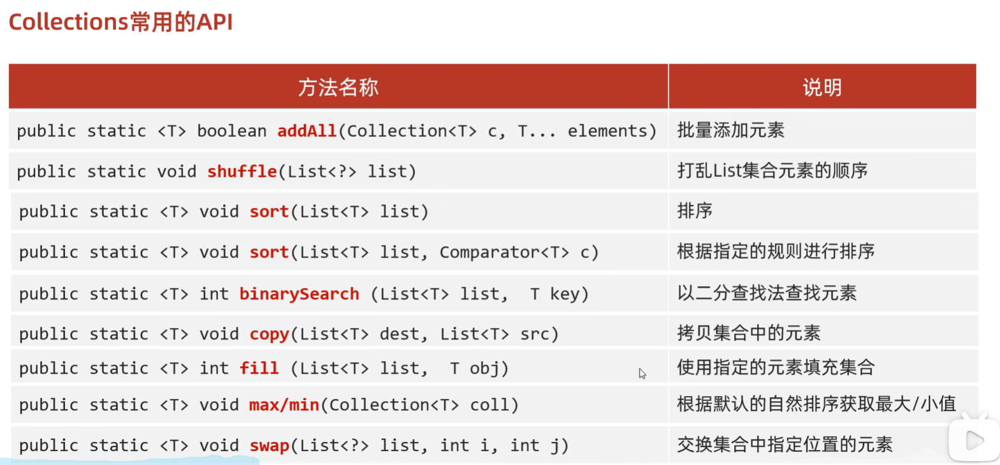

```java
/*
	public static <T> boolean addAll(Collection<T> c, T... elements)        批量添加元素
    public static void shuffle(List<?> list)                                打乱List集合元素的顺序
    public static <T> void sort(List<T> list)                               排序
    public static <T> void sort(List<T> list, Comparator<T> c)              根据指定的规则进行排序
    public static <T> int binarySearch (List<T> list,  T key)               以二分查找法查找元素
    public static <T> void copy(List<T> dest, List<T> src)                  拷贝集合中的元素
    public static <T> int fill (List<T> list,  T obj)                       使用指定的元素填充集合
    public static <T> void max/min(Collection<T> coll)                      根据默认的自然排序获取最大/小值
    public static <T> void swap(List<?> list, int i, int j)                 交换集合中指定位置的元素
*/
//addAll  批量添加元素
//1.创建集合对象
ArrayList<String> list = new ArrayList<>();
//2.批量添加元素
Collections.addAll(list,"abc","bcd","qwer","df","asdf","zxcv","1234","qwer");
//3.打印集合
System.out.println(list);
//shuffle 打乱
Collections.shuffle(list);
System.out.println(list);

System.out.println("-------------sort默认规则--------------------------");
//默认规则，需要重写Comparable接口compareTo方法。Integer已经实现，按照从小打大的顺序排列
//如果是自定义对象，需要自己指定规则
ArrayList<Integer> list1 = new ArrayList<>();
Collections.addAll(list1, 10, 1, 2, 4, 8, 5, 9, 6, 7, 3);
Collections.sort(list1);
System.out.println(list1); // 1,2,3,4,5,6,7,8,9,10

System.out.println("-------------sort自己指定规则规则--------------------------");
Collections.sort(list1, new Comparator<Integer>() {
    @Override
    public int compare(Integer o1, Integer o2) {
        return o2 - o1;
    }
});
System.out.println(list1);  // 10,9,8,7,6,5,4,3,2,1

Collections.sort(list1, (o1, o2) -> o2 - o1);
System.out.println(list1);

System.out.println("-------------binarySearch--------------------------");
//需要元素有序
ArrayList<Integer> list2 = new ArrayList<>();
Collections.addAll(list2, 1, 2, 3, 4, 5, 6, 7, 8, 9, 10);
System.out.println(Collections.binarySearch(list2, 9));
System.out.println(Collections.binarySearch(list2, 1));
System.out.println(Collections.binarySearch(list2, 20));

System.out.println("-------------copy--------------------------");
//把list3中的元素拷贝到list4中
//会覆盖原来的元素
//注意点：如果list3的长度 > list4的长度，方法会报错
ArrayList<Integer> list3 = new ArrayList<>();
ArrayList<Integer> list4 = new ArrayList<>();
Collections.addAll(list3, 1, 2, 3, 4, 5, 6, 7, 8, 9, 10);
Collections.addAll(list4, 0,0,0,0,0,0,0,0,0,0,0,0,0,0,0);
Collections.copy(list4, list3);
System.out.println(list3);
System.out.println(list4);

System.out.println("-------------fill--------------------------");
//把集合中现有的所有数据，都修改为指定数据
ArrayList<Integer> list5 = new ArrayList<>();
Collections.addAll(list5, 1, 2, 3, 4, 5, 6, 7, 8, 9, 10);
Collections.fill(list5, 100);
System.out.println(list5);

System.out.println("-------------max/min--------------------------");
//求最大值或者最小值
ArrayList<Integer> list6 = new ArrayList<>();
Collections.addAll(list6, 1, 2, 3, 4, 5, 6, 7, 8, 9, 10);
System.out.println(Collections.max(list6));
System.out.println(Collections.min(list6));

System.out.println("-------------max/min指定规则--------------------------");
// String中默认是按照字母的abcdefg顺序进行排列的
// 现在我要求最长的字符串
// 默认的规则无法满足，可以自己指定规则
// 求指定规则的最大值或者最小值
ArrayList<String> list7 = new ArrayList<>();
Collections.addAll(list7, "a","aa","aaa","aaaa");
System.out.println(Collections.max(list7, new Comparator<String>() {
    @Override
    public int compare(String o1, String o2) {
        return o1.length() - o2.length();
    }
}));

System.out.println("-------------swap--------------------------");
ArrayList<Integer> list8 = new ArrayList<>();
Collections.addAll(list8, 1, 2, 3);
Collections.swap(list8,0,2);
System.out.println(list8);
```

# 综合练习

[综合练习](https://www.bilibili.com/video/BV1yW4y1Y7Ms/?p=22&spm_id_from=333.880.my_history.page.click&vd_source=6ef187124c74c452a2016ded88292617) 
