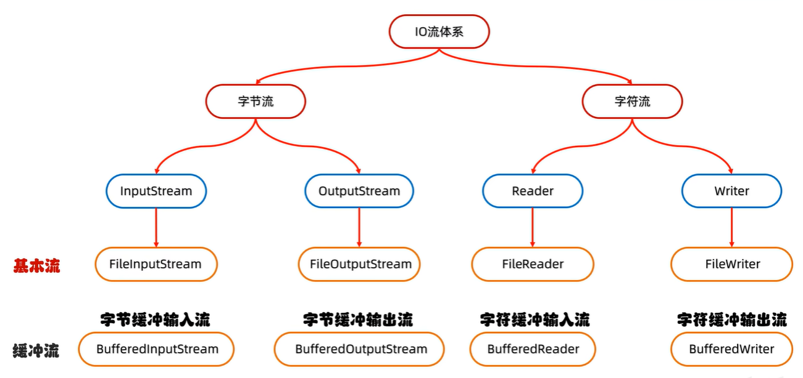

[toc]

# 异常

[异常](https://www.bilibili.com/video/BV1yW4y1Y7Ms?p=52) 


`RuntimeException` 及其子类都统称为**非受检查异常**。

除了`RuntimeException`及其子类以外，其他的`Exception`类及其子类都属于**受检查异常** 。Java 代码在编译过程中，如果受检查异常没有被 `catch`或者`throws` 关键字处理的话，就没办法通过编译。

## 异常的处理方式

### JVM默认的处理方式

1. 把异常的名称，异常原因及异常出现的位置等信息输出在了控制台

2. 程序停止执行，异常下面的代码不会再执行了

### 自己处理（捕获异常）

[自己处理（捕获异常）](https://www.bilibili.com/video/BV1yW4y1Y7Ms?p=56) 

选中可能出现异常的语句，`ctrl+Alt+T` 选择 `try catch` 可以自动创建。`try catch`代码。

可以让程序继续往下执行，不会停止。

```java 
/*
自己处理（捕获异常）
    格式：
    try {
        可能出现异常的代码;
    } catch(异常类名 变量名) {
        异常的处理代码;
    }finally{
    	一定会执行，就算前面的try或catch里有return也会在返回前执行，除非JVM退出;
    }
好处:可以让程序继续往下执行，不会停止
*/
int[] arr = {1, 2, 3, 4, 5, 6};
try{
    //可能出现异常的代码;
    System.out.println(arr[10]); //此处出现了异常，程序就会在这里创建一个ArrayIndexOutOfBoundsException对象
                                 //new ArrayIndexOutOfBoundsException();
                                 //拿着这个对象到catch的小括号中对比，看括号中的变量是否可以接收这个对象
    							 //如果能被接收，就表示该异常就被捕获（抓住），执行catch里面对应的代码
    							 //当catch里面所有的代码执行完毕，继续执行try...catch体系下面的其他代码
}catch(ArrayIndexOutOfBoundsException e){
    //如果出现了ArrayIndexOutOfBoundsException异常，我该如何处理
    System.out.println("索引越界了");
}
System.out.println("看看我执行了吗？"); // 执行了
```

1. 如果try中没有遇到问题，会把try里面所有代码全部执行完毕，不会执行catch里面的代码。

2. 如果try中遇到多个问题，写多个catch与之对应。如果我们捕获多个异常，这些异常存在父子关系的话，那么父类一定要写在下面。（因为多态）。在JDK7之后，我们可以在catch中同时捕获多个异常，中间用`|`进行隔开表示如果出现了A异常或者B异常的话,采取同一种处理方案。

3. 如果try中遇到的问题没有被捕获，会交给JVM进行默认处理。

4. 如果try中遇到了问题，那么try下面的其他代码还会执行吗？下面的代码就不会执行了，直接跳转到对应的catch当中，执行catch里面的语句体。但是如果没有对应catch与之匹配，那么还是会交给虚拟机进行处理。

### 异常中的常见方法

[异常中的常见方法](https://www.bilibili.com/video/BV1yW4y1Y7Ms?p=59) 

```Java
/*
public String getMessage()          返回此 throwable 的详细消息字符串
public String toString()            返回此可抛出的简短描述
public void printStackTrace()       在底层是利用System.err.println进行输出
    								把异常的错误信息以红色字体输出在控制台
    								细节：仅仅是打印信息，不会停止程序运行
*/
```

### 抛出异常

[抛出异常](https://www.bilibili.com/video/BV1yW4y1Y7Ms?p=60) 

`throws`：写在**方法定义**处，表示声明一个异常。告诉调用者，使用本方法可能会有哪些异常。**运行时异常，可以不用写**，但是编译时异常一定要写。
`throw` ：写在**方法内**，结束方法。手动抛出异常对象，交给调用者。方法中下面的代码不再执行了。

 ```Java
 /*
 throws：写在方法定义处，表示声明一个异常。告诉调用者，使用本方法可能会有哪些异常。
 throw ：写在方法内，结束方法。手动抛出异常对象，交给调用者。方法中下面的代码不再执行了。
 需求：
 	定义一个方法求数组的最大值
 */
 
 int[] arr = null;
 int max = 0;
 try {
     max = getMax(arr);
 } catch (NullPointerException e) {
     System.out.println("空指针异常");
 } catch (ArrayIndexOutOfBoundsException e) {
     System.out.println("索引越界异常");
 }
 System.out.println(max);
 }
 
 // 运行时异常 throws NullPointerException,ArrayIndexOutOfBoundsException 可以不用写，但是 编译时异常 一定要写。
 public static int getMax(int[] arr)/* throws NullPointerException,ArrayIndexOutOfBoundsException*/{
     if(arr == null){
         //手动创建一个异常对象，并把这个异常交给方法的调用者处理
         //此时方法就会结束，下面的代码不会再执行了
         throw new NullPointerException();
     }
 
     if(arr.length == 0){
         //手动创建一个异常对象，并把这个异常交给方法的调用者处理
         //此时方法就会结束，下面的代码不会再执行了
         throw new ArrayIndexOutOfBoundsException();
     }
 
     System.out.println("看看我执行了吗？");
     int max = arr[0];
     for (int i = 1; i < arr.length; i++) {
         if(arr[i] > max){
             max = arr[i];
         }
     }
     return max;
 }
 ```

## 异常综合练习

[异常综合练习](https://www.bilibili.com/video/BV1yW4y1Y7Ms?p=61) 

## 自定义异常

定义异常类 ---> 写继承关系 ---> 空参构造 ---> 带参构造

```Java
public class NameFormatException extends RuntimeException{
    //技巧：
    //NameFormat：当前异常的名字，表示姓名格式化问题
    //Exception：表示当前类是一个异常类

    //运行时：RuntimeException 核心 就表示由于参数错误而导致的问题
    //编译时：Exception 核心 提醒程序员检查本地信息

    public NameFormatException() {
    }

    public NameFormatException(String message) {
        super(message);
    }
}
```

# File

File对象就表示一个路径，可以是文件或文件夹的路径。这个路径可以是存在的也可以是不存在的。

## File的三种构造方法

[File的概述和构造方法](https://www.bilibili.com/video/BV1yW4y1Y7Ms?p=63) 

`windows：\           linux：/`

```Java
/*
        public File(String pathname)                根据文件路径创建文件对象
        public File(String parent, String child)    根据父路径名字符串和子路径名字符串创建文件对象
        public File(File  parent, String child)     根据父路径对应文件对象和子路径名字符串创建文件对象

        C:\Users\alienware\Desktop
        \:转移字符
*/
//1.根据字符串表示的路径，变成File对象
String str = "C:\\Users\\alienware\\Desktop\\a.txt";
File f1 = new File(str);
System.out.println(f1);  //C:\Users\alienware\Desktop\a.txt

//2.父级路径：C:\Users\alienware\Desktop
//子级路径：a.txt
String parent = "C:\\Users\\alienware\\Desktop";
String child = "a.txt";
File f2 = new File(parent,child);
System.out.println(f2);  //C:\Users\alienware\Desktop\a.txt

File f3 = new File(parent + "\\" + child);  // 可以直接拼接，一般不用这种方法
System.out.println(f3); //C:\Users\alienware\Desktop\a.txt

//3.把一个File表示的路径和String表示路径进行拼接
File parent2 = new File("C:\\Users\\alienware\\Desktop");
String child2 = "a.txt";
File f4 = new File(parent2,child2);
System.out.println(f4); //C:\Users\alienware\Desktop\a.txt
```

## File的常见成员方法

[File的常见成员方法](https://www.bilibili.com/video/BV1yW4y1Y7Ms?p=64) 

```Java
/*
        ------------------------------判断-----------------------------------------
        public boolean isDirectory()        判断此路径名表示的File是否为文件夹
        public boolean isFile()             判断此路径名表示的File是否为文件
        public boolean exists()             判断此路径名表示的File是否存在
        ------------------------------获取-----------------------------------------
        public long length()                返回文件的大小（字节数量） 
        										只能获取文件的大小，不能获取文件夹的大小
        public String getAbsolutePath()     返回文件的绝对路径
        public String getPath()             返回定义文件时使用的路径
        public String getName()             返回文件的名称，带后缀 
        										文件返回文件名和后缀名；文件夹只返回文件名
        public long lastModified()          返回文件的最后修改时间（时间毫秒值） 
        ----------------------------创建 删除---------------------------------------
        public boolean createNewFile()      创建一个新的空的文件 
        ·										如果文件已存在返回false，否则返回true；
        										如果父级路径是不存在的，那么方法会有异常IOException；
        										createNewFile方法创建的一定是文件，如果路径中不包含后缀名，则创建一个没有后缀的文件
        public boolean mkdir()              创建单级文件夹
        public boolean mkdirs()             创建多级文件夹
        public boolean delete()             删除文件、空文件夹
        										如果删除的是文件，则直接删除，不走回收站。
            									如果删除的是空文件夹，则直接删除，不走回收站
            									如果删除的是有内容的文件夹，则删除失败
        ------------------------------获取-----------------------------------------
        （掌握）public File[] listFiles()    获取当前该路径下所有内容
        										当调用者File表示的路径不存在时，返回null
        										当调用者File表示的路径是文件时，返回null
												当调用者File表示的路径是一个空文件夹时，返回一个长度为0的数组
												当调用者File表示的路径是一个有内容的文件夹时，将里面所有文件和文件夹的路径放在File数组中返回
												当调用者File表示的路径是一个有隐藏文件的文件夹时，将里面所有文件和文件夹的路径放在File数组中返回，包含隐藏文件
												当调用者File表示的路径是需要权限才能访问的文件夹时，返回null
		----------------------------获取并遍历--------------------------------------
 （了解）public static File[] listRoots()                列出可用的文件系统根(系统的所有盘符)
 （了解）public String[] list()                          获取当前该路径下所有内容
 （了解）public String[] list(FilenameFilter filter)     利用文件名过滤器获取当前该路径下所有内容
 （掌握）public File[] listFiles()                       获取当前该路径下所有内容
 （了解）public File[] listFiles(FileFilter filter)      利用文件名过滤器获取当前该路径下所有内容
 （了解）public File[] listFiles(FilenameFilter filter)  利用文件名过滤器获取当前该路径下所有内容
*/
File f = new File("D:\\aaa\\a.txt");
f.isDirectory() 
f.isFile()
f.exists()

f.length()  // 只能获取文件的大小，不能获取文件夹的大小！
f.getAbsolutePath()
f.getPath() 
f.getName() // 文件返回文件名和后缀名；文件夹只返回文件名
f.lastModified()

// 如果文件已存在返回false，否则返回true；
// 如果父级路径是不存在的，那么方法会有异常IOException；
// createNewFile方法创建的一定是文件，如果路径中不包含后缀名，则创建一个没有后缀的文件。
f.createNewFile()
// mkdir   make Directory，文件夹（目录）
// 细节1：windows当中路径是唯一的，如果当前路径已经存在，则创建失败，返回false
// 细节2：mkdir方法只能创建单级文件夹，无法创建多级文件夹。
f.mkdir()
// mkdirs   创建多级文件夹
// 细节：既可以创建单级的，又可以创建多级的文件夹
f.mkdirs()
// 如果删除的是文件，则直接删除，不走回收站。
// 如果删除的是空文件夹，则直接删除，不走回收站
// 如果删除的是有内容的文件夹，则删除失败
f.delete()

// 获取当前该路径下所有内容
f.listFiles()

// 列出可用的文件系统根(系统的所有盘符)
File[] arr = File.listRoots()
// 获取当前该路径下所有内容
String[] arr2 = f1.list()
// 利用文件名过滤器获取当前该路径下所有内容
String[] arr3 = f2.list(new FilenameFilter() {
    @Override
    public boolean accept(File dir, String name) {
        File src = new File(dir,name);
        return src.isFile() && name.endsWith(".txt");
    }
});
// 利用文件名过滤器获取当前该路径下所有内容
File[] arr1 = f.listFiles(new FileFilter() {
    @Override
    public boolean accept(File pathname) {
        return pathname.isFile() && pathname.getName().endsWith(".txt");
    }
});
// 利用文件名过滤器获取当前该路径下所有内容
File[] arr2 = f.listFiles(new FilenameFilter() {
    @Override
    public boolean accept(File dir, String name) {
        File src = new File(dir, name);
        return src.isFile() && name.endsWith(".txt");
    }
});
```

## File的综合练习

[File的综合练习](https://www.bilibili.com/video/BV1yW4y1Y7Ms?p=68) 

# IO流（笔记不全）

[IO流概述](https://www.bilibili.com/video/BV1yW4y1Y7Ms?p=74) 

[JavaGuide: IO基础知识总结](https://javaguide.cn/java/io/io-basis.html) 

IO流：用于读写文件中的数据（可以读写文件，或网络中的数据...）

在`java.io`包中

## IO流的分类

按流向分：

**输出流**：程序 ---> 文件         **输入流**：文件 ---> 程序

按操作文件类型分：

**字节流**：可以操作所有类型文件

**字符流**：只能操作纯文本文件（用windows自带的记事本可以打开且能读懂的文件：txt、md、xml、lrc）

## IO流体系



高级流中，除了缓冲流之外，还有转换流、序列化流、打印流、压缩流、Commons-io（工具包）。

## 基本字节流

### FileOutputStream 

[FileOutputStream ](https://www.bilibili.com/video/BV1yW4y1Y7Ms?p=75) 

#### FileOutputStream基本用法及细节

```Java
/*
  演示：字节输出流FileOutputStream
  实现需求：写出一段文字到本地文件中。（暂时不写中文）
  实现步骤：
        创建对象 
			细节1：参数是字符串表示的路径或者是File对象都是可以的
 			细节2：如果文件不存在会创建一个新的文件，但是要保证父级路径是存在的。
            细节3：如果文件已经存在，则会清空文件
        写出数据
			细节：write方法的参数是整数，但是实际上写到本地文件中的是整数在ASCII上对应的字符
        释放资源
        	每次使用完流之后都要释放资源
* */
//1.创建对象
//写出 输出流 OutputStream
//本地文件    File
FileOutputStream fos = new FileOutputStream("myio\\a.txt");
//2.写出数据
fos.write(97);  // ascll码 97--->'a'
//3.释放资源
fos.close();
```

#### FileOutputStream写入数据三种方式

```Java
/*
           void write(int b)                         一次写一个字节数据
           void write(byte[] b)                      一次写一个字节数组数据
           void write(byte[] b, int off, int len)    一次写一个字节数组的部分数据
           参数一：
                数组
           参数二：
                起始索引  0
           参数三：
                个数     3
*/

// 1.创建对象
FileOutputStream fos = new FileOutputStream("myio\\a.txt");
// 2.写出数据
// 2.1 一次写一个字节数据
fos.write(97); // a
fos.write(98); // b
// 2.2 一次写一个字节数组数据
byte[] bytes = {97, 98, 99, 100, 101};
fos.write(bytes); 
// 2.3 一次写一个字节数组的部分数据
fos.write(bytes,1,2); // b c
// 3.释放资源
fos.close();
```

#### FileOutputStream换行和续写

```java
/*
    换行写：
        再次写出一个换行符就可以了
        windows： \r\n
        Linux:    \n
        Mac:      \r
    细节：
        在windows操作系统当中，java对回车换行进行了优化。
        虽然完整的是\r\n，但是我们写其中一个\r或者\n，
        java也可以实现换行，因为java在底层会补全。
    建议：
        不要省略，还是写全了。
    续写：
        如果想要续写，打开续写开关即可
        开关位置：创建对象的第二个参数
        默认false：表示关闭续写，此时创建对象会清空文件
        手动传递true：表示打开续写，此时创建对象不会清空文件

*/

// 1.创建对象
FileOutputStream fos = new FileOutputStream("myio\\a.txt",true);
// 2.写出数据
String str = "kankelaoyezuishuai";
byte[] bytes1 = str.getBytes();
fos.write(bytes1);

// 再次写出一个换行符就可以了
String wrap = "\r\n";
byte[] bytes2 = wrap.getBytes();
fos.write(bytes2);

String str2 = "666";
byte[] bytes3 = str2.getBytes();
fos.write(bytes3);

// 3.释放资源
fos.close();
```

### FileInputStream 

[FileInputStream ](https://www.bilibili.com/video/BV1yW4y1Y7Ms?p=79) 

#### FileInputStream基本用法及细节

与FileOutputStream的基本用法一样。

FileOutputStream是write()方法，FileInputStream是read()方法。

1. 创建字节输入流对象：如果文件不存在，就直接报错。

2. 写入数据：**一次读一个字节**，读出来的是数据在ASCII上对应的数字；读到文件末尾了，read方法返回-1。

3. 释放资源：每次使用完流之后都要释放资源。

#### FileInputStream循环读取

```java
FileInputStream fis = new FileInputStream("myio\\a.txt");
int b;
while ((b = fis.read()) != -1) {  // read :表示读取数据，而且是读取一个数据就移动一次指针
	System.out.println((char) b);
}
fis.close();
```

## 文件拷贝

[文件拷贝](https://www.bilibili.com/video/BV1yW4y1Y7Ms?p=82) 

用最基本的方法进行小文件拷贝。

```java
long start = System.currentTimeMillis();  // 统计拷贝时间
//1.创建对象
FileInputStream fis = new FileInputStream("D:\\itheima\\movie.mp4");  // 已存在的被拷贝文件
FileOutputStream fos = new FileOutputStream("myio\\copy.mp4");  // 拷贝文件
//2.拷贝
//核心思想：边读边写
int b;
while((b = fis.read()) != -1){
    fos.write(b);
}
//3.释放资源
//规则：先开的最后关闭
fos.close();
fis.close();
long end = System.currentTimeMillis();
System.out.println(end - start);
```

一次读取一个字节，太慢了。

[文件拷贝的弊端和解决方案](https://www.bilibili.com/video/BV1yW4y1Y7Ms?p=83) 

[文件拷贝改写](https://www.bilibili.com/video/BV1yW4y1Y7Ms?p=84) 

换成一次读一个字节数组数据。`public int read(byte[] buffer)` 

```java
long start = System.currentTimeMillis();
//1.创建对象
FileInputStream fis = new FileInputStream("D:\\itheima\\movie.mp4");
FileOutputStream fos = new FileOutputStream("myio\\copy.mp4");
//2.拷贝
int len;
byte[] bytes = new byte[1024 * 1024 * 5];  // 创建一个字符数组，数组长度 1024 * 1024 * 5
while((len = fis.read(bytes)) != -1){  // 一次读取一个字符数组：一次读取多个字节数据，具体读多少，跟数组的长度有关；
    fos.write(bytes,0,len);            // 返回值 len ：本次读取到了多少个字节数据 读到最后时返回-1
}									   // write(bytes,0,len)要加上 0,len;因为读取到最后数据(不足数组长度)时，数组中会有上一次读取的残留数据。不加0,len会把残留数据也写入文件。所以加上0,len，读了多少新数据就写多少。
//3.释放资源
fos.close();
fis.close();
long end = System.currentTimeMillis();
System.out.println(end - start);
```

## IO流中不同JDK版本捕获异常的方式

[IO流中不同JDK版本捕获异常的方式](https://www.bilibili.com/video/BV1yW4y1Y7Ms?p=85) 

## 字符集

[字符集详解](https://www.bilibili.com/video/BV1yW4y1Y7Ms?p=86) 

**ASCLL字符集** ： 128个字符  无中文  **一个英文存一个字节**。不足一个字节的补0凑足一个字节。

**GBK字符集**：包含国家标准GB13000-1中的全部中日韩汉字和BIG5编码中的所有汉字。**一个汉字用两个字节存储**。不用变动。

GBK编码规则中，一个英文字母一个字节(完全兼容ASCLL)，二进制**第一位是0**；一个中文汉字两个字节，二进制高位**第一位是1**。

**Unicode字符集**：国际标准字符集，世界各种语言的每个字符定义一个唯一的编码。**任何字符都占 2 个字节** 

UTF-16编码规则：用2-4个字节保存；UTF-32编码规则：固定用4个字节保存；**UTF-8编码规则**：用1-4个字节保存（开发中最常用）。

UTF-8编码规则中，**英文1个字节保存**，不足补0，所以二进制**第一位是0**，**转成十进制是正数**；**中文3个字节保存**，高位前面补1110，中位前面补10，低位前面补10，所以二进制**第一位是1**，**转成十进制是负数**。

### 为什么会有乱码

1. 读取数据时为读完整个汉字，字节流一次读取一个字节，而汉字一个字保存为3个字节。

2. 编码和解码的方式不统一。

## Java中编码和解码的代码实现

[Java中编码和解码的代码实现](https://www.bilibili.com/video/BV1yW4y1Y7Ms?p=89) 

```Java
/*
       Java中编码的方法
            public byte[] getBytes()                        使用默认方式进行编码
            public byte[] getBytes(String charsetName)      使用指定方式进行编码

        Java中解码的方法
            String(byte[] bytes)                            使用默认方式进行解码
            String(byte[] bytes, String charsetName)        使用指定方式进行解码
*/

//1.编码
String str = "ai你哟";
byte[] bytes1 = str.getBytes();
System.out.println(Arrays.toString(bytes1));

byte[] bytes2 = str.getBytes("GBK");
System.out.println(Arrays.toString(bytes2));

//2.解码
String str2 = new String(bytes1);
System.out.println(str2);

String str3 = new String(bytes1,"GBK");
System.out.println(str3);
```

## 基本字符流

[字符流](https://www.bilibili.com/video/BV1yW4y1Y7Ms?p=90) 

字符流=字节流+字符集    （**避免出现乱码**）  

输入流：一次读一个字节，遇到中文时，一次读多个字节

输出流：底层会把数据按照指定的编码方式进行编码，变成字节再写到文件中

### FileReader

[FileReader](https://www.bilibili.com/video/BV1yW4y1Y7Ms?p=90) 

[字符输入流底层原理详解](https://www.bilibili.com/video/BV1yW4y1Y7Ms?p=93)

#### FileReader基本用法和细节 

基本用法与FileInputStream一样。 无参read() 和有参read(char[] buffer) 两种方式。

```Java
/*
            第一步：创建对象
            public FileReader(File file)        创建字符输入流关联本地文件
            public FileReader(String pathname)  创建字符输入流关联本地文件

            第二步：读取数据
            public int read()                   读取数据，读到末尾返回-1
            public int read(char[] buffer)      读取多个数据，读到末尾返回-1

            第三步：释放资源
            public void close()                 释放资源/关流
*/
//1.创建对象并关联本地文件
FileReader fr = new FileReader("myio\\a.txt");
//2.读取数据 read()
//字符流的底层也是字节流，默认也是一个字节一个字节的读取的。
//如果遇到中文就会一次读取多个，GBK一次读两个字节，UTF-8一次读三个字节

//read（）细节：
//1.read():默认也是一个字节一个字节的读取的,如果遇到中文就会一次读取多个
//2.在读取之后，方法的底层还会进行解码并转成十进制。
//  最终把这个十进制作为返回值
//  这个十进制的数据也表示在字符集上的数字
//  英文：文件里面二进制数据 0110 0001
//          read方法进行读取，解码并转成十进制97
//  中文：文件里面的二进制数据 11100110 10110001 10001001
//          read方法进行读取，解码并转成十进制27721

// 我想看到中文汉字，就是把这些十进制数据，再进行强转就可以了
// 2.1 空参的Reader()方法读取数据
int ch;
while((ch = fr.read()) != -1){
    System.out.print((char)ch);
}
// 2.2 有参的Reader(char[] buffer)方法读取数据
char[] chars = new char[2];
int len;
//read(chars)：读取数据，解码，强转三步合并了，把强转之后的字符放到数组当中
//空参的read + 强转类型转换
while((len = fr.read(chars)) != -1){
    //把数组中的数据变成字符串再进行打印
    System.out.print(new String(chars,0,len));
}

//3.释放资源
fr.close();
```

### FileWriter

#### FileWriter基本用法和细节

[FileWriter](https://www.bilibili.com/video/BV1yW4y1Y7Ms?p=92) 

[字符输出流底层原理详解](https://www.bilibili.com/video/BV1yW4y1Y7Ms?p=94) 

```Java
/*
            第一步：创建对象
                public FileWriter(File file)                            创建字符输出流关联本地文件
                public FileWriter(String pathname)                      创建字符输出流关联本地文件
                public FileWriter(File file,  boolean append)           创建字符输出流关联本地文件，续写
                public FileWriter(String pathname,  boolean append)     创建字符输出流关联本地文件，续写

            第二步：读取数据
                void write(int c)                           写出一个字符
                void write(String str)                      写出一个字符串
                void write(String str, int off, int len)    写出一个字符串的一部分
                void write(char[] cbuf)                     写出一个字符数组
                void write(char[] cbuf, int off, int len)   写出字符数组的一部分

            第三步：释放资源
                public void close()                 释放资源/关流


                '我'    25105
*/

FileWriter fw = new FileWriter("myio\\a.txt",true); // 打开了续写开关
fw.write(25105);
fw.write("你好威啊???");
char[] chars = {'a','b','c','我'};
fw.write(chars);
fw.close();
```

### 字符流原理解析

注意：**只有字符流才有缓冲区，字节流没有**。

字符输入流的原理：

创建字符输入流对象
底层：关联文件，并创建**缓冲区**（长度为8192的字节数组)
读取数据
底层：

1. 判断缓冲区中是否有数据可以读取

2. 缓冲区没有数据：就从文件中获取数据，装到缓冲区中，每次尽可能**装满缓冲区**。
   如果文件中也没有数据了，返回-1

3. 缓冲区有数据：就从缓冲区中读取。
   空参的read方法:一次读取一个字节，遇到中文一次读多个字节，把字节解码并转成十进制返回

   有参的read方法:把读取字节，解码，强转三步合并了，强转之后的字符放到数组中

## 缓冲流

[缓冲流](https://www.bilibili.com/video/BV1yW4y1Y7Ms?p=98) 

### 缓冲流体系


在基本流的基础上进行包装，增加了**缓冲区(实际是一个字节数组 大小 8192 字节)**（基本字符流自带缓冲区），提高效率。

### 字节缓冲流

[字节缓冲流](https://www.bilibili.com/video/BV1yW4y1Y7Ms?p=98)                   [字节缓冲流读写原理](https://www.bilibili.com/video/BV1yW4y1Y7Ms?p=100) 

字节缓冲输入流---BufferedInputStream、字节缓冲输出流---BufferedOutputStream

```Java
/*
            需求：
                利用字节缓冲流拷贝文件
         
            字节缓冲输入流的构造方法：
                    public BufferedInputStream(InputStream is)
         
            字节缓冲输出流的构造方法：
                    public BufferedOutputStream(OutputStream os)
         
*/
//1.创建缓冲流的对象
BufferedInputStream bis = new BufferedInputStream(new FileInputStream("myio\\a.txt"));
BufferedOutputStream bos = new BufferedOutputStream(new FileOutputStream("myio\\a.txt"));
//2.1 一次读写一个字节   循环读取并写到目的地
int b;
while ((b = bis.read()) != -1) {
    bos.write(b);
}
//2.2 一次读写一个字节数组
byte[] bytes = new byte[1024];
int len;
while((len = bis.read(bytes)) != -1){
    bos.write(bytes,0,len);
}
//3.释放资源
bos.close();
bis.close();
```

### 字符缓冲流

[字符缓冲流](https://www.bilibili.com/video/BV1yW4y1Y7Ms?p=101) 

字符流自带了缓冲区，所以字符缓冲流提升的效率不高。但有**两个特有方法**。

字符缓冲输入流---BufferedReader、字符缓冲输出流---BufferedWriter

```Java
/*
           字符缓冲输入流：
              构造方法：
                   public BufferedReader(Reader r)
              特有方法：
                   public String readLine()   读一整行，读到末尾返回null
           字符缓冲输出流：
              构造方法：
                   public BufferedWriter(Writer r)
              特有方法：
                   public void newLine()      跨平台的换行 
         
*/
//1.创建字符缓冲输入流的对象
BufferedReader br = new BufferedReader(new FileReader("myio\\a.txt"));
//2.读取数据
//细节：
//readLine方法在读取的时候，一次读一整行，遇到回车换行结束
//        但是他不会把回车换行读到内存当中
String line;
while ((( line = br.readLine()) != null)){
    System.out.println(line);
}
//3.释放资源
br.close();

//1.创建字符缓冲输出流的对象
BufferedWriter bw = new BufferedWriter(new FileWriter("b.txt",true));
//2.写出数据
bw.write("123");
bw.newLine();
bw.write("456");
bw.newLine();
//3.释放资源
bw.close();
```

## 转换流

[转换流基本用法](https://www.bilibili.com/video/BV1yW4y1Y7Ms?p=105) 

转换流时字符流和字节流之间的桥梁。

转换流作用：指定字符集读写数据（JDK11之后已淘汰）；字节流想要使用字符流中的方法。

### ~~InputStreamReader~~  FileReader

```Java
/*
            利用转换流按照指定字符编码读取(了解)
            因为JDK11：这种方式被淘汰了。
            替代方案(掌握)
*/

/*//1.创建对象并指定字符编码   利用转换流按照指定字符编码读取(了解)  被淘汰了
InputStreamReader isr = new InputStreamReader(new FileInputStream("myio\\gbkfile.txt"),"GBK");
//2.读取数据
int ch;
while ((ch = isr.read()) != -1){
    System.out.print((char)ch);
}
//3.释放资源
isr.close();*/

// JDK11之后，替代方案(掌握)
FileReader fr = new FileReader("myio\\gbkfile.txt", Charset.forName("GBK"));
//2.读取数据
int ch;
while ((ch = fr.read()) != -1){
    System.out.print((char)ch);
}
//3.释放资源
fr.close();
```

### ~~OutputStreamWriter~~ FileWriter

```Java
/*
            利用转换流按照指定字符编码写出
*/

/*//1.创建转换流的对象  被淘汰了
OutputStreamWriter osw = new OutputStreamWriter(new FileOutputStream("myio\\b.txt"),"GBK");
//2.写出数据
osw.write("你好你好");
//3.释放资源
osw.close();*/

//JDK11之后，替代方案(掌握)
FileWriter fw = new FileWriter("myio\\c.txt", Charset.forName("GBK"));
fw.write("你好你好");
fw.close();
```

### 练习

```Java
/*
            将本地文件中的GBK文件，转成UTF-8
*/

/*//1.JDK11以前的方案
InputStreamReader isr = new InputStreamReader(new FileInputStream("myio\\b.txt"),"GBK");
OutputStreamWriter osw = new OutputStreamWriter(new FileOutputStream("myio\\d.txt"),"UTF-8");

int b;
while((b = isr.read()) != -1){
    osw.write(b);
}
osw.close();
isr.close();*/

//2.替代方案
FileReader fr = new FileReader("myio\\b.txt", Charset.forName("GBK"));
FileWriter fw = new FileWriter("myio\\e.txt",Charset.forName("UTF-8"));
int b;
while ((b = fr.read()) != -1){
    fw.write(b);
}
fw.close();
fr.close();
```

[转换流练习](https://www.bilibili.com/video/BV1yW4y1Y7Ms?p=106) 

```Java
/*
            利用字节流读取文件中的数据，每次读一整行，而且不能出现乱码
            1.字节流在读取中文的时候，是会出现乱码的，但是字符流可以搞定
            2.字节流里面是没有读一整行的方法的，只有字符缓冲流才能搞定
*/

/*FileInputStream fis = new FileInputStream("myio\\a.txt");
InputStreamReader isr = new InputStreamReader(fis);
BufferedReader br = new BufferedReader(isr);
String str = br.readLine();
System.out.println(str);
br.close();*/

BufferedReader br = new BufferedReader(new InputStreamReader(new FileInputStream("myio\\a.txt")));
String line;
while ((line = br.readLine()) != null){
    System.out.println(line);
}
br.close();
```

## 序列化流与反序列化流  ✅

[序列化流](https://www.bilibili.com/video/BV1yW4y1Y7Ms?p=107)                    [反序列化流](https://www.bilibili.com/video/BV1yW4y1Y7Ms?p=108)   

- **序列化**：将数据结构或对象转换成二进制字节流的过程

- **反序列化**：将在序列化过程中所生成的二进制字节流转换成数据结构或者对象的过程

  **序列化的主要目的是通过网络传输对象或者说是将对象存储到文件系统、数据库、内存中**

序列化流（对象操作输出流）：可以把java中的对象写到本地文件中。写进去的对象看不懂。有效防止被人修改。

反序列化流（对象操作输入流）：可以把序列化到本地文件的对象，读取到程序中来。

序列化协议属于 TCP/IP 协议 **应用层** 的一部分

```Java
/*
           需求：
                利用序列化流/对象操作输出流，把一个对象写到本地文件中
           构造方法：
                public ObjectOutputStream(OutputStream out)         把基本流变成高级流

           成员方法：
                public final void writeObject(Object obj)           把对象序列化（写出）到文件中去

*/
//1.创建对象
Student stu = new Student("zhangsan",23);  // Student类需要实现 Serializable 接口，接口里面是没有抽象方法，标记型接口；一旦实现了这个接口，那么就表示当前的Student类可以被序列化；相当于一个物品的合格证。
//2.创建序列化流的对象/对象操作输出流
ObjectOutputStream oos = new ObjectOutputStream(new FileOutputStream("myio\\a.txt"));
//3.写出数据
oos.writeObject(stu);
//4.释放资源
oos.close();
```

```Java
/*
           需求：
                利用反序列化流/对象操作输入流，把文件中中的对象读到程序当中
           构造方法：
                public ObjectInputStream(InputStream out)         把基本流变成高级流
           成员方法：
                public Object readObject()                        把序列化到本地文件中的对象，读取到程序中来
*/
//1.创建反序列化流的对象
ObjectInputStream ois = new ObjectInputStream(new FileInputStream("myio\\a.txt"));
//2.读取数据
Student o = (Student) ois.readObject();
//3.打印对象
System.out.println(o);
//4.释放资源
ois.close();
```

序列化流/反序列化流的细节汇总：

1.使用序列化流将对象写到文件时，需要让Javabean类实现**Serializable**接口。否则，会出现NotSerializableException异常

2.序列化流写到文件中的数据是**不能修改**的，一旦修改就无法再次读回来了

3.序列化对象后，修改了Javabean类，再次反序列化，会不会有问题？会出问题，会抛出InvalidclassException异常。解决方案:给Javabean类添加**serialversionuID**(序列号、版本号)。`private static final long serialVersionUID = -6357601841666449654L` 

4.如果一个对象中的某个成员变量的值不想被序列化，又该如何实现呢？解决方案:给该成员变量加*`transient`*关键字修饰，该关键字标记的成员变量不参与序列化过程。

5.序列化多个对象时，可以将多个对象全部放入ArraryList中，然后序列化ArraryList即可。

关于 *`transient`* 还有几点注意：

- `transient` **只能修饰变量**，不能修饰类和方法。

- `transient` 修饰的变量，在反序列化后变量值将会被置成类型的默认值。例如，如果是修饰 `int` 类型，那么反序列后结果就是 `0`。

- `static` 变量因为不属于任何对象(Object)，所以无论有没有 `transient` 关键字修饰，均不会被序列化。`serialVersionUID`例外，做了特殊处理。

  JDK 自带的序列化方式一般不会用 ，因为：
  
  1.**不支持跨语言调用** : 如果调用的是其他语言开发的服务的时候就不支持了。
  
  2.**性能差**：相比于其他序列化框架性能更低，主要原因是序列化之后的字节数组体积较大，导致传输成本加大。
  
  3.**存在安全问题**：序列化和反序列化本身并不存在问题。但当输入的反序列化的数据可被用户控制，那么攻击者即可通过构造恶意输入，让反序列化产生非预期的对象，在此过程中执行构造的任意代码。
  
  比较常用的序列化协议有 **Hessian**、**Kryo**、**Protobuf**、**ProtoStuff**，这些都是基于二进制的序列化协议 像 JSON 和 XML 这种属于文本类序列化方式。虽然可读性比较好，但是性能较差，一般不会选择

## 字节打印流与字符打印流

[字节打印流](https://www.bilibili.com/video/BV1yW4y1Y7Ms?p=111)                               [字符打印流](https://www.bilibili.com/video/BV1yW4y1Y7Ms?p=112)  

只操作文件目的地，不操作数据源。即**只能写不能读**。

特有方法：**将数据原样写出**。

字节打印流 --- PrintStream   

```Java
/*
            字节打印流:
            构造方法
            	public PrintStream( outputStream/File/String)			      关联字节输出流/文件/文件路径
            	public PrintStream(String fileName，Charset charset)	         指定字符编码
            	public PrintStream( outputStreamout， boolean autoFlush)      自动刷新 (字节流底层没有缓冲区，开不开都一样)
            	public PrintStream(outputStream out， boolean autoFlush，string encoding)    指定字符编码且
            成员方法:
            	public void write(int b)              常规方法:规则跟之前一样，将指定的字节写出
            	public void println(Xxx xx)           特有方法:打印任意数据，自动剧新，自动换行
            	public void print(×x× xx)             特有方法:打印任意数据，不换行
            	public void printf(String format，object... args)          特有方法:带有占位符的打印语句，不换行
*/
// 1.创建字节打印流的对象
PrintStream ps = new PrintStream(new FileOutputStream("myiolLa.txt"),true,Charset.forName("GBK"));
//2.写出数据
ps.println(97);  // 97 引出＋自动刷新＋自动换行 
ps.print(true);  // true
ps.println();
ps.printf(%s爱上了%s","阿珍",""阿强");
//3.放资源
ps.close();

```

字符打印流 --- PrintWriter

```Java
/*
        字符打印流:
        构造方法
        	public Printwriter(write/File/string)                 关联字节输出流/文件/文件路径
        	public Printwriter(String fileName,Charset charset)   指定字符编码
        	public Printwriter(write,boolean autoFlush)           自动刷新
        	public Printiwriter(write out,boolean autoF1ush,String encoding)    指定字符编码且自动刷新
        成员方法:
        	public void write(int b)               常规方法:规则跟之前一样，将指定的字节写出
        	public void println(Xxx ×x)            特有方法:打印任意数据，自动刷新，自动换行
        	public void print(Xxx x×)              特有方法:打印任意数据，不换行
        	public void printf(String format，object... args)    特有方法:带有占位符的打印语句，不换行
*/
//1.创建字符打印流的对象
PrintWriter pw = new PrintWriter(new FileWriter("myiolla.txt"),true);
//2.写出数据
pw.println("今天你终于叫我名字了，虽然叫错了，但是没关系，我马上i改");
pw.print("你好你好");
pw.printf("%s爱上了%s","阿珍","阿强");
//3.释放资源
pw.close();

```

系统中的标准输出流：`System.out.println();` 特殊的打印流，是不能关闭的，在系统中是唯一的。在虚拟机启动时，由虚拟机创建，默认指向控制台。

## 解压缩流与压缩流

[解压缩流与压缩流](https://www.bilibili.com/video/BV1yW4y1Y7Ms?p=113) 

解压：

```Java
public class ZipStreamDemo1 {
    public static void main(String[] args) throws IOException {
        //1.创建一个File表示要解压的压缩包
        File src = new File("D:\\aaa.zip");
        //2.创建一个File表示解压的目的地
        File dest = new File("D:\\");
        //调用方法
        unzip(src,dest);

    }
    //定义一个方法用来解压
    public static void unzip(File src,File dest) throws IOException {
        //解压的本质：把压缩包里面的每一个文件或者文件夹读取出来，按照层级拷贝到目的地当中
        //创建一个解压缩流用来读取压缩包中的数据
        ZipInputStream zip = new ZipInputStream(new FileInputStream(src));
        //要先获取到压缩包里面的每一个zipentry对象
        //表示当前在压缩包中获取到的文件或者文件夹
        ZipEntry entry;
        while((entry = zip.getNextEntry()) != null){
            System.out.println(entry);
            if(entry.isDirectory()){
                //文件夹：需要在目的地dest处创建一个同样的文件夹
                File file = new File(dest,entry.toString());
                file.mkdirs();
            }else{
                //文件：需要读取到压缩包中的文件，并把他存放到目的地dest文件夹中（按照层级目录进行存放）
                FileOutputStream fos = new FileOutputStream(new File(dest,entry.toString()));
                int b;
                while((b = zip.read()) != -1){
                    //写到目的地
                    fos.write(b);
                }
                fos.close();
                //表示在压缩包中的一个文件处理完毕了。
                zip.closeEntry();
            }
        }
        zip.close();
    }
}
```

压缩：（压缩单个文件）

```Java
public class ZipStreamDemo2 {
    public static void main(String[] args) throws IOException {
        /*
         *   压缩流
         *      需求：
         *          把D:\\a.txt打包成一个压缩包
         * */
        //1.创建File对象表示要压缩的文件
        File src = new File("D:\\a.txt");
        //2.创建File对象表示压缩包的位置
        File dest = new File("D:\\");
        //3.调用方法用来压缩
        toZip(src,dest);
    }
    /*
    *   作用：压缩
    *   参数一：表示要压缩的文件
    *   参数二：表示压缩包的位置
    * */
    public static void toZip(File src,File dest) throws IOException {
        //1.创建压缩流关联压缩包
        ZipOutputStream zos = new ZipOutputStream(new FileOutputStream(new File(dest,"a.zip")));
        //2.创建ZipEntry对象，表示压缩包里面的每一个文件和文件夹
        //参数：压缩包里面的路径
        ZipEntry entry = new ZipEntry("aaa\\bbb\\a.txt");
        //3.把ZipEntry对象放到压缩包当中
        zos.putNextEntry(entry);
        //4.把src文件中的数据写到压缩包当中
        FileInputStream fis = new FileInputStream(src);
        int b;
        while((b = fis.read()) != -1){
            zos.write(b);
        }
        zos.closeEntry();
        zos.close();
    }
}
```

压缩：（压缩文件夹）

```Java
public class ZipStreamDemo3 {
    public static void main(String[] args) throws IOException {
        /*
         *   压缩流
         *      需求：
         *          把D:\\aaa文件夹压缩成一个压缩包
         * */
        //1.创建File对象表示要压缩的文件夹
        File src = new File("D:\\aaa");
        //2.创建File对象表示压缩包放在哪里（压缩包的父级路径）
        File destParent = src.getParentFile();//D:\\
        //3.创建File对象表示压缩包的路径
        File dest = new File(destParent,src.getName() + ".zip");
        //4.创建压缩流关联压缩包
        ZipOutputStream zos = new ZipOutputStream(new FileOutputStream(dest));
        //5.获取src里面的每一个文件，变成ZipEntry对象，放入到压缩包当中
        toZip(src,zos,src.getName());//aaa
        //6.释放资源
        zos.close();
    }
    /*
    *   作用：获取src里面的每一个文件，变成ZipEntry对象，放入到压缩包当中
    *   参数一：数据源
    *   参数二：压缩流
    *   参数三：压缩包内部的路径
    * */
    public static void toZip(File src,ZipOutputStream zos,String name) throws IOException {
        //1.进入src文件夹
        File[] files = src.listFiles();
        //2.遍历数组
        for (File file : files) {
            if(file.isFile()){
                //3.判断-文件，变成ZipEntry对象，放入到压缩包当中
                ZipEntry entry = new ZipEntry(name + "\\" + file.getName());//aaa\\no1\\a.txt
                zos.putNextEntry(entry);
                //读取文件中的数据，写到压缩包
                FileInputStream fis = new FileInputStream(file);
                int b;
                while((b = fis.read()) != -1){
                    zos.write(b);
                }
                fis.close();
                zos.closeEntry();
            }else{
                //4.判断-文件夹，递归
                toZip(file,zos,name + "\\" + file.getName());
                //     no1            aaa   \\   no1
            }
        }
    }
}
```

## 随机访问流

[JavaGuide: 随机访问流](https://javaguide.cn/java/io/io-basis.html#%E9%9A%8F%E6%9C%BA%E8%AE%BF%E9%97%AE%E6%B5%81) 

支持随意跳转到文件的任意位置进行读写的 `RandomAccessFile` 。

`r` : 只读模式。

`rw`: 读写模式

`rws`: 相对于 `rw`，`rws` 同步更新对“文件的内容”或“元数据”的修改到外部存储设备。

`rwd` : 相对于 `rw`，`rwd` 同步更新对“文件的内容”的修改到外部存储设备。

实现大文件的 **断点续传** 

`RandomAccessFile` 的实现依赖于 `FileDescriptor` (文件描述符) 和 `FileChannel` （内存映射文件）。

## 常用工具包

### Commons-io

[Commons-io](https://www.bilibili.com/video/BV1yW4y1Y7Ms?p=116)  

Commons工具包很丰富，Commons-io只是其中关于IO的一部分。Commons-io 的更多使用方法见文档[commons-io整理的文档.md] 

使用步骤：

1. 在项目中创建文件夹lib

2. 将jar包复制粘贴到lib文件夹

3. 右键点击jar包，选择Add as Library --> 点击OK

4. 在类中导包使用

```Java
/*
          FileUtils类
                static void copyFile(File srcFile, File destFile)                   复制文件
                static void copyDirectory(File srcDir, File destDir)                复制文件夹
                static void copyDirectoryToDirectory(File srcDir, File destDir)     复制文件夹
                static void deleteDirectory(File directory)                         删除文件夹
                static void cleanDirectory(File directory)                          清空文件夹
                static String readFileToString(File file, Charset encoding)         读取文件中的数据变成字符串
                static void write(File file, CharSequence data, String encoding)    写出数据

            IOUtils类
                public static int copy(InputStream input, OutputStream output)      复制文件
                public static int copyLarge(Reader input, Writer output)            复制大文件
                public static String readLines(Reader input)                        读取数据
                public static void write(String data, OutputStream output)          写出数据
*/
File src = new File("myio\\a.txt");
File dest = new File("myio\\copy.txt");
FileUtils.copyFile(src,dest);  // 复制文件

File src = new File("D:\\aaa");
File dest = new File("D:\\bbb"); // 复制文件夹
FileUtils.copyDirectoryToDirectory(src,dest);

File src = new File("D:\\bbb");
FileUtils.cleanDirectory(src);  // 清空文件夹
```

### Hutool

[Hutool](https://www.bilibili.com/video/BV1yW4y1Y7Ms?p=117) 

[Hutool官网](https://hutool.cn/)        [API文档](https://apidoc.gitee.com/dromara/hutool/)         [中文使用文档](https://hutool.cn/docs/#/)  

```Java
    /*
        FileUtil类:
                file：根据参数创建一个file对象
                touch：根据参数创建文件

                writeLines：把集合中的数据写出到文件中，覆盖模式。
                appendLines：把集合中的数据写出到文件中，续写模式。
                readLines：指定字符编码，把文件中的数据，读到集合中。
                readUtf8Lines：按照UTF-8的形式，把文件中的数据，读到集合中

                copy：拷贝文件或者文件夹
    */

File file1 = FileUtil.file("D:\\", "aaa", "bbb", "a.txt");
System.out.println(file1);//D:\aaa\bbb\a.txt

File touch = FileUtil.touch(file1);
System.out.println(touch);

ArrayList<String> list = new ArrayList<>();
list.add("aaa");
list.add("aaa");
list.add("aaa");

File file2 = FileUtil.writeLines(list, "D:\\a.txt", "UTF-8");
System.out.println(file2);

ArrayList<String> list = new ArrayList<>();
list.add("aaa");
list.add("aaa");
list.add("aaa");

File file3 = FileUtil.appendLines(list, "D:\\a.txt", "UTF-8");
System.out.println(file3);

List<String> list = FileUtil.readLines("D:\\a.txt", "UTF-8");
System.out.println(list);
```

# properties集合与io流结合使用 

[拼图游戏：配置文件(properties集合与io流结合使用 )](https://www.bilibili.com/video/BV1yW4y1Y7Ms?p=132)  

# IO流综合练习

[拷贝文件夹](https://www.bilibili.com/video/BV1yW4y1Y7Ms?p=95) 

[加密解密文件](https://www.bilibili.com/video/BV1yW4y1Y7Ms?p=96) 

[修改文件中的数据 ](https://www.bilibili.com/video/BV1yW4y1Y7Ms?p=97) 

[四种拷贝方式效率对比](https://www.bilibili.com/video/BV1yW4y1Y7Ms?p=102) 

[恢复出师表的顺序](https://www.bilibili.com/video/BV1yW4y1Y7Ms?p=103) 

[控制软件运行次数](https://www.bilibili.com/video/BV1yW4y1Y7Ms?p=104) 

[读写多个对象](https://www.bilibili.com/video/BV1yW4y1Y7Ms?p=110) 

[网络爬虫](https://www.bilibili.com/video/BV1yW4y1Y7Ms?p=118) 

[随机点名器-带权重的随机算法](https://www.bilibili.com/video/BV1yW4y1Y7Ms?p=123) 

[拼图游戏：登录注册](https://www.bilibili.com/video/BV1yW4y1Y7Ms?p=125) 

[拼图游戏：存档读档](https://www.bilibili.com/video/BV1yW4y1Y7Ms?p=129) 

[拼图游戏：配置文件](https://www.bilibili.com/video/BV1yW4y1Y7Ms?p=132) 

# 设计模式（笔记不全）

[JavaGuide: 设计者模式 ](https://javaguide.cn/java/io/io-design-patterns.html) 

## 装饰器模式 

**装饰器（Decorator）模式** 可以在不改变原有对象的情况下拓展其功能。

装饰器模式通过组合替代继承来扩展原始类的功能，在一些继承关系比较复杂的场景（IO 这一场景各种类的继承关系就比较复杂）更加实用。

对于字节流来说， `FilterInputStream` （对应输入流）和`FilterOutputStream`（对应输出流）是装饰器模式的核心，分别用于增强 `InputStream` 和`OutputStream`子类对象的功能。

举个例子，我们可以通过 `BufferedInputStream`（字节缓冲输入流）来增强 `FileInputStream` 的功能。

可以对原始类嵌套使用多个装饰器。

装饰器类需要跟原始类继承相同的抽象类或者实现相同的接口

## 适配器模式

**适配器（Adapter Pattern）模式** 主要用于接口互不兼容的类的协调工作，你可以将其联想到我们日常经常使用的电源适配器。

适配器模式中存在被适配的对象或者类称为 **适配者(Adaptee)** ，作用于适配者的对象或者类称为**适配器(Adapter)** 。适配器分为对象适配器和类适配器。类适配器使用继承关系来实现，对象适配器使用组合关系来实现。

IO 流中的字符流和字节流的接口不同，它们之间可以协调工作就是基于适配器模式来做的，更准确点来说是对象适配器。通过适配器，我们可以将字节流对象适配成一个字符流对象，这样我们可以直接通过字节流对象来读取或者写入字符数据。

`InputStreamReader` 和 `OutputStreamWriter` 就是两个适配器(Adapter)， 同时，它们两个也是字节流和字符流之间的桥梁

**装饰器模式** 更侧重于动态地增强原始类的功能，装饰器类需要跟原始类继承相同的抽象类或者实现相同的接口。并且，装饰器模式支持对原始类嵌套使用多个装饰器。

**适配器模式** 更侧重于让接口不兼容而不能交互的类可以一起工作，当我们调用适配器对应的方法时，适配器内部会调用适配者类或者和适配类相关的类的方法，这个过程透明的。适配器和适配者两者不需要继承相同的抽象类或者实现相同的接口。

## 工厂模式

工厂模式用于创建对象，NIO 中大量用到了工厂模式，比如 `Files` 类的 `newInputStream` 方法用于创建 `InputStream` 对象（静态工厂）、 `Paths` 类的 `get` 方法创建 `Path` 对象（静态工厂）、`ZipFileSystem` 类（`sun.nio`包下的类，属于 `java.nio` 相关的一些内部实现）的 `getPath` 的方法创建 `Path` 对象（简单工厂）。

## 观察者模式

NIO 中的文件目录监听服务使用到了观察者模式。

NIO 中的文件目录监听服务基于 `WatchService` 接口和 `Watchable` 接口。`WatchService` 属于观察者，`Watchable` 属于被观察者。

`Watchable` 接口定义了一个用于将对象注册到 `WatchService`（监控服务） 并绑定监听事件的方法 `register` 。

# IO模型（笔记不全）

[JavaGuide:  IO 模型详解 ](https://javaguide.cn/java/io/io-model.html) 

UNIX 系统下， IO 模型一共有 5 种：**同步阻塞 I/O**、**同步非阻塞 I/O**、**I/O 多路复用**、**信号驱动 I/O** 和**异步 I/O**。

## BIO (Blocking I/O)   

**BIO 属于同步阻塞 IO 模型** 。

同步阻塞 IO 模型中，应用程序发起 read 调用后，会一直阻塞，直到内核把数据拷贝到用户空间。

## NIO (Non-blocking/New I/O)   🌟

[JavaGuide： NIO 核心知识总结](https://javaguide.cn/java/io/nio-basis.html) 

Java 中的 NIO 可以看作是 **I/O 多路复用模型**。

**同步非阻塞 IO 模型**中，应用程序会一直发起 read 调用，等待数据从内核空间拷贝到用户空间的这段时间里，线程依然是阻塞的，直到在内核把数据拷贝到用户空间。 相比于同步阻塞 IO 模型，同步非阻塞 IO 模型确实有了很大改进。通过轮询操作，避免了一直阻塞。

**应用程序不断进行 I/O 系统调用轮询数据是否已经准备好的过程是十分消耗 CPU 资源的。**

这个时候，**I/O 多路复用模型** 就上场了。

IO 多路复用模型中，线程首先发起 select 调用，询问内核数据是否准备就绪，等内核把数据准备好了，用户线程再发起 read 调用。read 调用的过程（数据从内核空间 -> 用户空间）还是阻塞的. **IO 多路复用模型，通过减少无效的系统调用，减少了对 CPU 资源的消耗。**

Java 中的 NIO ，有一个非常重要的**选择器 ( Selector )** 的概念，也可以被称为 **多路复用器**。通过它，只需要一个线程便可以管理多个客户端连接。当客户端数据到了之后，才会为其服务。

NIO 主要包括以下**三个核心组件**：

**Buffer（缓冲区）**：NIO 读写数据都是通过缓冲区进行操作的。读操作的时候将 Channel 中的数据填充到 Buffer 中，而写操作时将 Buffer 中的数据写入到 Channel 中。

**Channel（通道）**：Channel 是一个双向的、可读可写的数据传输通道，NIO 通过 Channel 来实现数据的输入输出。通道是一个抽象的概念，它可以代表文件、套接字或者其他数据源之间的连接。

**Selector（选择器）**：允许一个线程处理多个 Channel，基于事件驱动的 I/O 多路复用模型。所有的 Channel 都可以注册到 Selector 上，由 Selector 来分配线程来处理事件。

### Buffer（缓冲区）

NIO 库中，**所有数据都是用缓冲区处理的**，NIO 在读取数据时，它是直接读到缓冲区中的。在写入数据时，写入到缓冲区中。 使用 NIO 在读写数据时，都是通过缓冲区进行操作。可以将 Buffer 理解为一个数组

Buffer 有读模式和写模式这两种模式    Buffer 被创建之后默认是写模式，调用 `flip()` 可以切换到读模式。

### Channel（通道）

Channel 是一个通道，它建立了与数据源（如文件、网络套接字等）之间的连接。我们可以利用它来读取和写入数据，就像打开了一条自来水管，让数据在 Channel 中自由流动。BIO 中的流是单向的，分为各种 `InputStream`（输入流）和 `OutputStream`（输出流），数据只是在一个方向上传输。通道与流的不同之处在于通道是**双向**的，它**可以用于读、写或者同时用于读写**。

### Selector（选择器）

Selector（选择器） 是 NIO 中的一个关键组件，它允许一个线程处理多个 Channel。Selector 是基于事件驱动的 I/O 多路复用模型，主要运作原理是：通过 Selector 注册通道的事件，Selector 会不断地轮询注册在其上的 Channel。当事件发生时，比如：某个 Channel 上面有新的 TCP 连接接入、读和写事件，这个 Channel 就处于就绪状态，会被 Selector 轮询出来。Selector 会将相关的 Channel 加入到就绪集合中。通过 SelectionKey 可以获取就绪 Channel 的集合，然后对这些就绪的 Channel 进行响应的 I/O 操作。

一个多路复用器 Selector 可以同时轮询多个 Channel

### 零拷贝

零拷贝是指计算机执行 IO 操作时，CPU 不需要将数据从一个存储区域复制到另一个存储区域，从而可以减少上下文切换以及 CPU 的拷贝时间。也就是说，零拷贝主主要解决操作系统在处理 I/O 操作时频繁复制数据的问题。


## AIO (Asynchronous I/O)

**异步 IO 模型。**

异步 IO 是基于事件和回调机制实现的，也就是应用操作之后会直接返回，不会堵塞在那里，当后台处理完成，操作系统会通知相应的线程进行后续的操作。

## Java 常见3种IO模型总结

 
